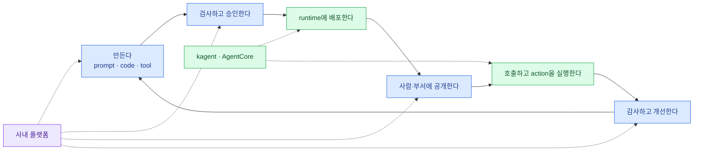

import { Card, CardGrid, LinkCard } from '@astrojs/starlight/components';
import TermIntro from '../../../components/docs/TermIntro.astro';

> Agent를 띄우는 것은 배포의 끝이 아니라 **공유 서비스 lifecycle의 가운데 한 단계**다

<TermIntro
  terms={[
    ['Agent runtime', 'Agent Runtime', 'Agent code를 실행하고 요청·session을 처리하는 환경. kagent와 AgentCore가 주로 맡는 자리다.'],
    ['control plane', 'Control Plane', 'Agent의 등록·version·권한·승인·배포 의도를 저장하고 실제 상태를 맞추는 관리 영역이다.'],
    ['deployment adapter', 'Deployment Adapter', '제품 중립 배포 요청을 특정 runtime API나 Kubernetes resource로 번역하는 경계다.'],
    ['principal', 'Security Principal', '권한을 부여받는 주체. 사용자·부서 group·service workload가 될 수 있다.'],
  ]}
/>

## 전체 중 이 장의 자리

임직원에게 필요한 경험은 "Agent image가 어느 namespace에 떴다"가 아니다. 자신이 만든 Agent의 version을
올리고, 누가 사용할지 고르고, 승인 상태를 확인하고, 다른 임직원은 검색해서 바로 호출해야 한다. 플랫폼은
이 여정을 소유하고 runtime은 승인된 version을 실제로 실행한다.

## Runtime만 설치하면 비는 자리

| 질문 | runtime이 일부 답함 | 사내 플랫폼이 소유해야 함 |
|---|---:|---:|
| container를 어디서 실행하나 | ✓ | target policy |
| 죽으면 누가 다시 띄우나 | ✓ | SLO와 escalation |
| 이 Agent의 회사 내 고유 ID는 무엇인가 |  | ✓ |
| 어느 version이 승인됐나 | version 기능은 제공 가능 | ✓ |
| 재무부서와 특정 개인만 호출 가능한가 | 인증 primitive는 제공 가능 | ✓ |
| 퇴사한 owner의 Agent는 누가 넘겨받나 |  | ✓ |
| 어떤 tool action을 누구 대신 실행했나 | trace 일부 | 정책과 감사 원장 |
| backend를 바꿔도 URL·권한·소유권이 남나 |  | ✓ |

kagent의 `Agent` CR이나 AgentCore Runtime ARN을 회사 Agent의 ID로 삼으면 처음에는 단순하다. 그러나 다른
backend로 옮길 때 bookmark, ACL, 대화, 감사 기록이 전부 provider ID에 묶인다. 회사의 `agentId`를 먼저 만들고
provider ID는 배포 결과로만 저장해야 한다.

## Agent를 두 종류로 나눈다

<CardGrid>
<Card title="구성형 Agent" icon="puzzle">
승인된 model·prompt·knowledge·MCP tool을 조합한다. 실행 code는 플랫폼이 공급한다.

검사 대상은 data classification, prompt, tool scope, model policy다. 빠른 self-service에 적합하다.
</Card>
<Card title="코드형 Agent" icon="seti:docker">
LangGraph·CrewAI·ADK 또는 자체 code를 OCI image로 제출한다.

dependency·egress·filesystem·process 권한까지 위험 범위가 넓다. 별도 CI, image signing, sandbox와 승인이 필요하다.
</Card>
</CardGrid>

두 유형을 같은 "Agent 만들기" 버튼으로 받을 수는 있지만 검증 pipeline은 같아서는 안 된다. 특히 사용자가
올린 Python tool을 포털 process 안에서 실행하면 한 사용자의 확장이 전체 플랫폼 권한을 가진다. code는
항상 격리된 runtime 또는 승인된 외부 MCP server에서 실행한다.

## 세 제품군을 구분한다

| 제품군 | 답하는 질문 | 예 |
|---|---|---|
| Agent builder/framework | Agent가 어떻게 추론하고 tool을 고르는가 | LangGraph, CrewAI, ADK |
| 사내 portal/control plane | 누가 만들고 승인하고 쓰는가 | 이 덱에서 설계할 영역 |
| runtime/provider | 어디서 어떤 격리와 lifecycle로 실행하는가 | kagent, AgentCore |
| model gateway/serving | 어느 모델에 어떤 quota로 연결하는가 | LiteLLM, vLLM, KServe |
| observability/evaluation | 왜 이런 응답이 나왔고 품질이 나아졌는가 | Langfuse, OTel |

제품 하나가 여러 칸을 제공할 수는 있어도 경계가 사라지는 것은 아니다. AgentCore에 Identity와 Registry가 있고
kagent에 UI와 memory가 있어도, 회사의 조직·승인·퇴사·data classification 규칙은 사내 control plane에 남는다.

## 첫 설계 질문

제품 비교 전에 다음을 먼저 결정한다.

1. 누가 Agent를 만들 수 있고 code형 Agent는 누가 승인하는가?
2. 부서 정보의 단일 원본은 Keycloak·Entra·HR 중 무엇인가?
3. 어떤 data 등급까지 AWS에서 처리할 수 있는가?
4. Agent가 호출할 수 있는 tool은 누가 등록하고 scope를 승인하는가?
5. 장애 시 Agent의 공개 ID와 endpoint를 유지한 채 다른 target으로 옮길 수 있는가?

## 이 덱의 범위

이 덱은 portal 화면을 구현하거나 kagent·AgentCore 설치 명령을 나열하지 않는다. 대신 구현 전에 고정해야 할
domain model과 adapter contract를 만든다. 제품 장은 "무슨 기능이 있나"보다 그 계약에 어떻게 매핑되고
어떤 의미는 매핑되지 않는지에 집중한다.

## 0장 요약

- kagent와 AgentCore는 사내 Agent 플랫폼 전체가 아니라 runtime provider다.
- 회사가 소유할 것은 `Agent`·`Version`·`Grant`·`Deployment`의 의미다.
- 구성형과 코드형 Agent는 검증 risk tier를 분리한다.
- 배포 흐름과 호출 흐름은 같은 ID를 쓰지만 권한·실패·감사 경계가 다르다.

<LinkCard
  title="1. 네 plane으로 나누기"
  description="포털부터 모델·도구까지를 experience, control, runtime, foundation 네 층으로 나눈다."
  href="/agent-platform/01-planes/"
/>
