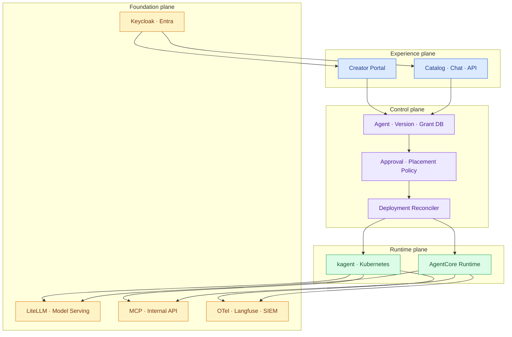
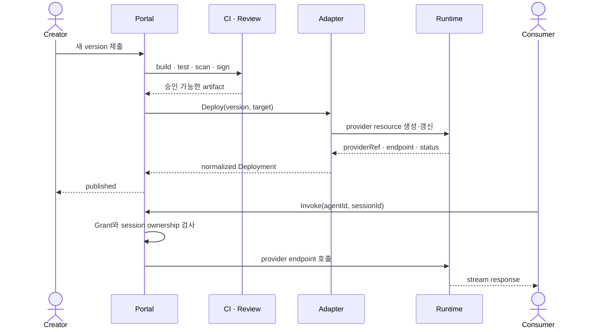

import { LinkCard } from '@astrojs/starlight/components';
import TermIntro from '../../../components/docs/TermIntro.astro';

> 제품은 겹쳐도 책임은 겹치면 안 된다 — 장애와 권한의 주인을 정하려면 **plane을 먼저 나눈다**

<TermIntro
  terms={[
    ['experience plane', 'Experience Plane', 'creator와 consumer가 보는 portal·catalog·chat·API 경험이다.'],
    ['runtime plane', 'Runtime Plane', '승인된 Agent version을 실행하고 session·streaming·scale을 처리하는 층이다.'],
    ['foundation plane', 'Foundation Plane', 'identity·network·model·tool·secret·observability처럼 모든 runtime이 공유하는 기반이다.'],
  ]}
/>

## 네 plane의 전체 지도

## Experience plane — 사람이 보는 약속

creator에게는 Agent 생성·version 제출·승인 상태·공유 설정·사용량이 보여야 한다. consumer에게는 자신이
사용할 수 있는 Agent만 검색되고, 설명·owner·data 등급·지원 기능·상태가 보여야 한다.

여기서 검색 결과를 숨기는 것은 사용성일 뿐 보안이 아니다. 사용자가 endpoint를 직접 알아내도 서버의
invoke authorization이 같은 결론을 내야 한다. portal URL을 유일한 보안 경계로 삼지 않는다.

## Control plane — 의미와 의도를 보관한다

control plane은 다음을 단일 원본으로 둔다.

- Agent의 회사 ID, owner, 설명과 risk tier
- immutable version과 artifact digest
- user·group별 grant
- 승인된 target policy와 현재 deployment
- 공개·중지·폐기 상태
- 누가 언제 무엇을 바꿨는지에 대한 audit event

provider 상태를 주기적으로 읽어 원하는 상태와 비교하는 reconciler도 이 층에 둔다. 배포 API가 timeout됐을 때
무작정 다시 만드는 것이 아니라 idempotency key와 provider reference로 이미 만들어졌는지 확인한다.

## Runtime plane — 실행을 책임진다

runtime은 image나 선언형 spec을 실제 process로 만들고 다음을 담당한다.

- process·filesystem·network 격리
- health와 restart, replica 또는 session lifecycle
- streaming과 protocol endpoint
- runtime identity와 secret 주입
- provider-native log·metric·trace

kagent에서는 Kubernetes와 controller가 이 일을 나눠 맡고, AgentCore에서는 AWS 관리형 runtime이 session별
microVM과 version endpoint를 맡는다. 공통 interface는 같아도 격리 단위와 scale 의미는 다르다.

## Foundation plane — 두 runtime이 공유한다

모델, identity, tool, network와 관측을 runtime마다 별도로 만들면 교체 비용이 커진다. 가능한 것은 공통 기반으로 둔다.

| 기반 | 공통 계약 | backend별 차이 |
|---|---|---|
| identity | 불변 user ID와 group claim | Keycloak private endpoint, AWS JWT/IAM |
| model | 공개 model alias와 data zone | 온프렘 vLLM, Bedrock·외부 provider |
| tool | MCP/OpenAPI schema, auth mode, risk | cluster service, AgentCore Gateway |
| secret | logical secret reference | Kubernetes Secret/Vault, AWS Secrets Manager |
| trace | `agentId`, `versionId`, `deploymentId`, `userId` | OTel collector, CloudWatch |

## 배포 흐름과 요청 흐름

배포 권한이 있는 creator와 invoke 권한이 있는 consumer는 다른 principal이다. 운영자는 provider resource를
만질 수 있지만 업무 data를 볼 권한이 없을 수도 있다. plane 분리는 이 차이를 policy에 반영하게 한다.

## 책임을 문장으로 고정한다

| 상황 | 최초 책임 plane |
|---|---|
| 검색에 Agent가 안 보인다 | experience/control |
| 허용되지 않은 사용자가 endpoint를 호출한다 | control의 authorization boundary |
| 새 version이 배포 중 멈췄다 | control reconciler → runtime adapter |
| Pod 또는 session이 죽는다 | runtime |
| 모델 429가 난다 | foundation의 model gateway |
| tool이 잘못된 고객 record를 수정한다 | foundation action policy + control audit |

## 1장 요약

- experience는 사람이 보는 경험, control은 회사 의미, runtime은 process, foundation은 공통 기반을 맡는다.
- 배포와 호출은 별도 흐름이며 같은 권한으로 처리하지 않는다.
- 공통 trace field와 logical reference를 먼저 정하면 backend별 구현을 바꿔도 연결이 남는다.

<LinkCard
  title="2. 제품 밖의 domain model"
  description="Agent·Version·Grant·DeploymentTarget을 provider ID와 분리해 회사의 단일 원본을 만든다."
  href="/agent-platform/02-domain-model/"
/>
