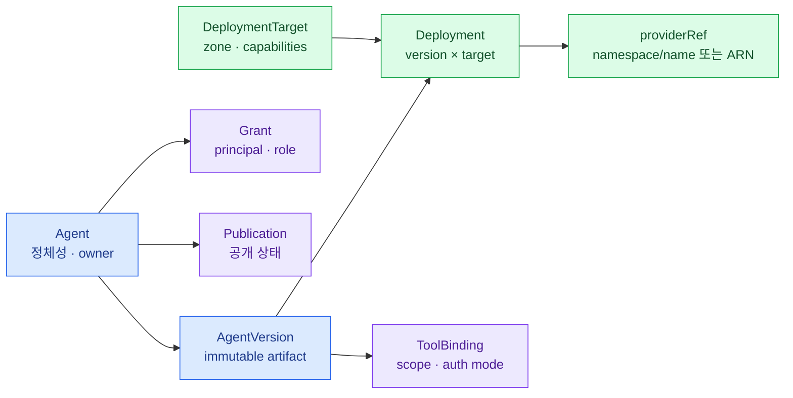

import { LinkCard } from '@astrojs/starlight/components';
import TermIntro from '../../../components/docs/TermIntro.astro';

> `Agent`는 서비스의 정체성이고 `Deployment`는 그 정체성을 실행한 한 복사본이다

<TermIntro
  terms={[
    ['aggregate', 'Domain Aggregate', '함께 일관성을 지켜야 하는 객체 묶음. 여기서는 Agent가 version·grant·publication의 기준점이다.'],
    ['immutable version', 'Immutable Version', '한번 승인·배포되면 내용을 바꾸지 않는 snapshot. 변경은 다음 version으로 만든다.'],
    ['providerRef', 'Provider Reference', 'kagent resource name이나 AgentCore ARN처럼 provider에서만 의미 있는 식별자다.'],
    ['desired state', 'Desired State', 'control plane이 기대하는 배포 상태. adapter가 provider의 실제 상태를 이 값에 맞춘다.'],
  ]}
/>

## 객체 관계



## Agent와 AgentVersion

`Agent`에는 바뀌어도 정체성이 유지되는 값을 둔다.

- 회사 내 고유 `agentId`
- 표시 이름, 설명, owner principal
- 구성형·코드형 risk tier
- 업무 domain과 data classification
- 생성·폐기 상태

실행 결과를 바꿀 수 있는 값은 `AgentVersion`으로 내린다. image digest, prompt bundle, model policy,
tool binding, runtime contract와 resource hint가 여기에 포함된다. `latest` tag나 mutable Git branch를 승인된
version의 근거로 쓰지 않는다.

## Grant와 Publication

`Grant`는 `(agentId, principal, role)`의 관계다. role은 처음에는 세 개면 충분하다.

| role | 허용할 대표 action |
|---|---|
| `INVOKER` | Agent 검색·호출, 자신의 conversation 조회 |
| `EDITOR` | 새 version 작성·제출, metadata 변경 |
| `OWNER` | grant 변경, owner 이전, 폐기 요청 |

`Publication`은 배포와 다르다. runtime에 정상 배포됐어도 보안 승인과 smoke test가 끝나기 전에는 catalog에서
호출 가능 상태가 아니다. 반대로 새 배포가 실패해도 이전 published version은 계속 서비스할 수 있어야 한다.

## DeploymentTarget과 Deployment

`DeploymentTarget`은 단순 provider 이름이 아니라 placement policy가 판단할 capability 묶음이다.

```yaml
id: onprem-restricted-a
provider: kagent
zone: restricted
capabilities:
  protocols: [a2a, mcp]
  architectures: [amd64]
  internetEgress: false
  sessionIsolation: pod
  localModelAccess: true
```

`Deployment`는 특정 version을 특정 target에 실행한 결과다. 여기에서만 provider 정보를 가진다.

```yaml
deploymentId: dep_01J...
agentId: agt_finance_report
versionId: ver_7
targetId: onprem-restricted-a
desiredState: RUNNING
observedState: READY
providerRef:
  namespace: agent-finance
  name: finance-report-v7
endpointRef: ep_01J...
```

같은 version을 AgentCore에 배포하면 `providerRef`가 runtime ARN과 endpoint qualifier로 바뀔 뿐 `agentId`,
`versionId`, `Grant`는 그대로다.

## ToolBinding은 endpoint 목록이 아니다

tool을 URL만으로 연결하면 실행 권한의 의미가 사라진다. binding에는 다음을 함께 둔다.

- 논리적 `toolId`와 승인된 schema version
- read·write·destructive risk
- 필요한 OAuth scope 또는 workload permission
- user delegation, service identity 중 어느 auth mode인지
- 허용 data zone과 egress destination
- human approval이 필요한 action

실제 cluster Service URL이나 AgentCore Gateway target ARN은 environment별 provider mapping에 둔다.

## 식별자와 표시값을 분리한다

이메일과 부서명은 바뀐다. ACL key는 IdP의 불변 `sub`·object ID를 사용하고 화면에 현재 email과 display name을
붙인다. Agent 이름도 rename할 수 있으므로 URL과 audit event에는 `agentId`를 쓴다.

모든 trace와 audit event에는 최소 다음 correlation field가 있어야 한다.

```text
agentId · versionId · deploymentId · targetId · principalId · sessionId · traceId
```

## 지켜야 할 불변조건

1. published version은 수정하지 않는다.
2. 하나의 production publication은 하나의 active version을 가리킨다.
3. provider resource를 삭제해도 Agent와 audit 기록은 삭제하지 않는다.
4. owner가 사라지기 전에 group owner 또는 successor에게 이전한다.
5. deployment `READY`와 publication `AVAILABLE`을 같은 상태로 취급하지 않는다.
6. secret value를 version spec과 audit payload에 넣지 않는다.

## 2장 요약

- Agent는 정체성, Version은 실행 가능한 불변 snapshot, Deployment는 target별 실행 결과다.
- Grant와 Publication을 provider resource 밖에 두어 호출 권한과 공개 상태를 유지한다.
- provider-specific ID·URL·secret은 공통 객체의 중심으로 들어오지 않는다.

<LinkCard
  title="3. 등록부터 폐기까지"
  description="version이 어떤 검사를 거쳐 배포·공개되고, 실패하면 어느 상태로 돌아가는지 잇는다."
  href="/agent-platform/03-lifecycle/"
/>
