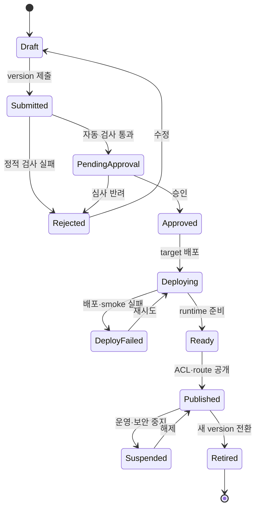

import { LinkCard } from '@astrojs/starlight/components';
import TermIntro from '../../../components/docs/TermIntro.astro';
import Thesis from '../../../components/docs/Thesis.astro';

<Thesis>self-service는 심사를 없애는 것이 아니라 위험에 맞는 검사를 자동 경로로 만드는 것이다</Thesis>

<TermIntro
  terms={[
    ['promotion', 'Promotion', '같은 immutable artifact를 dev에서 staging, production으로 승격하는 과정이다.'],
    ['attestation', 'Attestation', '어떤 build와 검사가 artifact에 수행됐는지 서명된 증거로 남긴 것이다.'],
    ['reconciliation', 'Reconciliation', '원하는 상태와 provider 실제 상태를 반복 비교해 차이를 줄이는 동작이다.'],
  ]}
/>

## Lifecycle 전체

`Ready`와 `Published` 사이에 경계를 둔다. provider health가 초록이어도 ACL, route, audit sink와 synthetic
invoke가 함께 검증되지 않으면 사용자가 호출하게 하지 않는다.

## Creator가 제출하는 것

구성형 Agent는 portal form이나 Git의 선언 파일을 제출한다. 코드형 Agent는 source repository와 build recipe를
제출하고 platform CI가 image를 만든다. production에서 사용자가 임의 registry URL이나 mutable tag를 직접
입력하게 하지 않는다.

사용자가 만든 MCP도 같은 제출·검사·승인 뼈대를 쓰되 AgentVersion에 종속시키지 않는다. MCP source·image 또는
remote endpoint를 독립된 ToolVersion으로 받고, discovery schema와 tool publication을 추가로 검증한다. 구체적인
분기는 [사용자 MCP를 플랫폼에 올리기](/agent-platform/07-user-mcp/)에서 다룬다.

공통 제출물은 다음이다.

- metadata와 owner
- framework와 protocol contract
- model·tool·data classification 선언
- CPU·memory·architecture hint
- test case와 expected behavior
- target 제약: `restricted only`, `AWS allowed` 등

## 자동 검사는 위험별로 나눈다

| 검사 | 구성형 | 코드형 |
|---|---:|---:|
| schema와 필수 metadata | ✓ | ✓ |
| prompt·knowledge data 등급 | ✓ | ✓ |
| tool scope와 human approval | ✓ | ✓ |
| dependency·container 취약점 |  | ✓ |
| SBOM·image signature·digest | runtime image 기준 | ✓ |
| non-root·read-only FS·seccomp | 공통 runtime preset | ✓ |
| egress destination | tool allowlist | image 실행 검증 포함 |
| malicious behavior·resource exhaustion | 제한적 | sandbox dynamic test |

검사를 통과했다는 사실은 안전의 보증이 아니라 배포 조건이다. runtime에서도 resource limit, network policy,
tool policy를 다시 강제해야 한다.

## 승인과 소유권

승인은 한 줄의 관리자 클릭이 아니라 책임 분리다.

- 업무 owner: 이 Agent가 해결할 문제와 사용자 범위를 승인
- data owner: knowledge와 tool이 접근하는 data 등급 승인
- platform/security: code·egress·credential 방식 승인
- creator: 기능과 test case 책임

모든 Agent가 네 번의 수동 승인을 받을 필요는 없다. read-only 구성형 Agent는 policy가 자동 승인하고,
write tool이나 code형 Agent만 필요한 owner에게 보낸다.

## 배포와 공개

adapter는 승인된 digest와 target만 받아 배포한다. 배포 후 다음 synthetic path를 확인한다.

1. endpoint health
2. 인증 없는 호출 거부
3. 허용 principal의 기본 invoke
4. 금지 principal의 invoke 거부
5. 허용·금지 tool action 각각 한 번
6. trace·audit·cost record 도착

새 version은 바로 전체 전환하지 않는다. backend가 traffic split을 지원하면 canary를 사용하고, 아니면 portal
route에서 소수 test principal만 새 deployment로 보낸다. rollback은 image를 다시 build하는 것이 아니라
publication pointer를 직전 ready deployment로 돌리는 동작이어야 한다.

## 변경과 drift

runtime console이나 `kubectl`로 긴급 수정할 수는 있지만 control plane은 drift를 발견해야 한다. 처리 정책은
다음 셋 중 하나를 resource별로 정한다.

- 되돌리기: Git/portal desired state로 자동 복원
- 흡수하기: 승인 workflow를 통해 새 version으로 가져오기
- 격리하기: 보안 관련 drift면 publication을 중지

provider의 일시적 조회 실패를 `DELETED`로 오판하지 않도록 `UNKNOWN` 상태와 grace period를 둔다.

## 중지와 폐기

`Suspended`는 route와 invoke 권한을 즉시 막되 runtime을 조사할 수 있게 남길 수 있다. `Retired`는 새 conversation을
받지 않고 retention 기간 뒤 deployment를 제거한다. DB record와 audit log는 보존 정책에 따라 남긴다.

owner 퇴사, 취약한 dependency, 오래 사용되지 않은 Agent, 만료된 data approval은 자동 review trigger다.

## 4장 요약

- immutable artifact 하나를 검사하고 environment 사이에서 승격한다.
- 구성형과 코드형은 자동 검사와 승인 강도가 다르다.
- runtime 준비, 권한 공개, catalog 공개를 별도 상태로 둔다.
- rollback은 이전 publication pointer로 빠르게 돌아가는 동작이다.

<LinkCard
  title="5. 권한은 세 번 검사한다"
  description="배포 관리, Agent 호출, tool action의 서로 다른 authorization 경계를 설계한다."
  href="/agent-platform/05-authorization/"
/>
