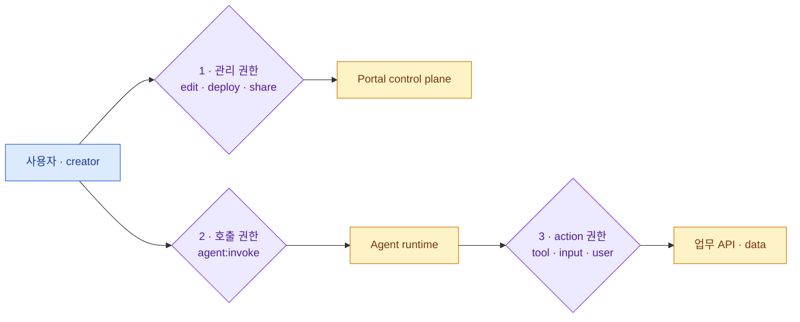

import { LinkCard } from '@astrojs/starlight/components';
import TermIntro from '../../../components/docs/TermIntro.astro';
import Thesis from '../../../components/docs/Thesis.astro';

<Thesis>로그인했다는 사실은 어느 Agent와 어느 업무 action을 허용할지 답하지 않는다</Thesis>

<TermIntro
  terms={[
    ['authentication', 'Authentication', '요청자가 누구인지 검증하는 것. OIDC token의 서명·issuer·audience를 확인한다.'],
    ['authorization', 'Authorization', '검증된 principal이 특정 resource에 action을 해도 되는지 판단하는 것.'],
    ['OBO', 'On-Behalf-Of', 'Agent가 공용 service 계정이 아니라 현재 사용자의 위임 권한으로 downstream을 호출하는 방식이다.'],
    ['PEP', 'Policy Enforcement Point', '정책 결정을 실제 요청에 강제하는 지점. portal API, runtime ingress, tool gateway가 예다.'],
    ['principal key', 'Principal Key', 'issuer와 subject를 정규화해 만든 사내 불변 ID. email이나 bare sub를 ACL key로 쓰지 않는다.'],
  ]}
/>

## 세 개의 문



첫 문은 Agent 정의와 grant를 바꾸는 권한, 둘째는 대화를 시작하는 권한, 셋째는 Agent가 실제 업무를 수행하는
권한이다. `OWNER`라도 고액 환불 action을 실행할 수 있다는 뜻은 아니며, `INVOKER`라도 자기 업무 role에 따라
읽기 tool만 허용될 수 있다.

## Principal과 Grant

IdP에서 사용자와 부서 group을 가져오되 ACL에는 issuer 범위가 포함된 불변 ID를 저장한다.
[OpenID Connect Core](https://openid.net/specs/openid-connect-core-1_0-18.html#ClaimStability)는 `(iss, sub)`만
안정적인 사용자 식별자로 보장한다. bare `sub`만 저장하면 다른 realm·tenant의 동명 subject가 충돌할 수 있다.

```text
principalType:     USER | GROUP | WORKLOAD
principalKey:      사내 정규화 ID
identityProvider:  issuer + subject | tenantId + objectId
display:           kim@example.com | Finance
role:              INVOKER | EDITOR | OWNER
```

group membership은 로그인 때만 복사해 오래 cache하지 않는다. 조직 변경이 빠르게 반영돼야 하는 Agent는 token
수명과 group refresh 정책까지 정한다. 이메일 domain이나 문자열 prefix로 부서를 추측하지 않는다.

## Invocation authorization

권장 경로는 사용자가 provider endpoint를 직접 호출하지 않고 portal gateway를 지나는 방식이다.

1. OIDC token 검증
2. `agentId`와 현재 publication 조회
3. user와 group grant 평가
4. data zone·device posture·시간 같은 조건 평가
5. 사용자에게 속한 opaque session ID 생성
6. backend credential로 runtime 호출하고 verified identity context 전달

provider의 JWT authorizer도 defense in depth로 사용한다. 그러나 수백 개 Agent의 동적 email allowlist를 runtime별
JWT 설정이나 IAM policy로 모두 펼치면 관리가 어려워진다. 세밀한 entitlement는 portal policy store가 맡고,
provider에는 "이 portal 또는 이 group claim만 호출" 같은 거친 경계를 둔다.

## Session은 권한 객체다

session ID를 클라이언트가 자유롭게 정하게 하면 다른 사용자의 context를 재사용할 수 있다. control plane은
`(principalKey, agentId, conversationId, backendSessionId)` 관계를 보관하고 매 요청마다 소유권을 검사한다.

AgentCore도 session별 microVM을 격리하지만 user와 session ID의 관계는 client backend 책임이라고 명시한다.
kagent에서도 memory·conversation store의 조회 key에 verified principal을 포함해야 한다.

## Tool action authorization

Agent invoke를 허용했다고 모든 tool을 허용하지 않는다. tool gateway는 매 action에서 다음을 판단한다.

- verified user 또는 workload identity
- Agent와 version
- tool과 action name
- 입력값: 금액·고객 ID·namespace 등
- user의 업무 role과 data scope
- human approval 여부

읽기는 user delegation, 비대화형 background 작업은 좁은 workload identity를 쓰는 식으로 auth mode를 명시한다.
공용 admin token 하나를 모든 Agent에 주지 않는다.

:::caution[함정]
prompt에 "재무부서만 실행"이라고 쓰는 것은 authorization이 아니다. model은 보안 경계가 아니며 prompt injection이나
오판을 할 수 있다. 허용·거부는 model 밖의 deterministic policy enforcement point에서 결정한다.
:::

## 비밀과 토큰 전달

portal이 받은 end-user token을 무조건 Agent code로 넘기지 않는다. runtime에 token이 필요한 경우 audience를
Agent용으로 제한하고 짧은 수명의 token exchange 또는 OBO를 사용한다. downstream credential은 logical secret
reference로 선언하고 target별 secret store에서 주입한다.

## 감사 event

로그인은 access log 한 줄로 끝나지 않는다. 최소 다음 event를 분리한다.

| event | 핵심 field |
|---|---|
| grant 변경 | actor, subject, role, before/after |
| invoke 결정 | principal, agent/version, allow/deny, policy reason |
| tool 결정 | principal, tool/action, redacted input, allow/deny |
| deployment 변경 | version, target, providerRef, approver |
| session 변경 | owner, create/stop, backend session reference |

민감한 prompt와 tool input은 원문 보존보다 분류·redaction·retention을 먼저 정한다.

## 5장 요약

- 관리·호출·tool action 권한은 서로 다른 문이다.
- email은 표시값이고 ACL key는 OIDC `(iss, sub)` 또는 Entra `(tenantId, objectId)`에서 만든 principal key다.
- session ID 소유권은 portal backend가 강제한다.
- Agent의 판단이 아니라 gateway의 deterministic policy가 업무 action을 허용한다.

<LinkCard
  title="6. Adapter contract"
  description="제품 중립 version과 target을 kagent·AgentCore의 실제 resource로 번역하는 최소 interface를 만든다."
  href="/agent-platform/06-adapter-contract/"
/>
