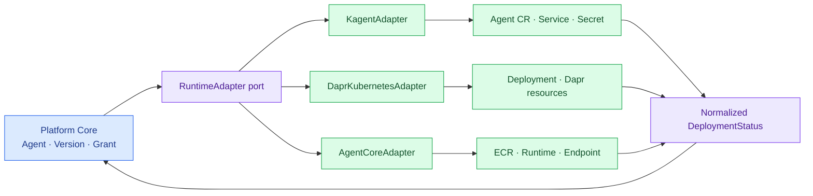

import { LinkCard } from '@astrojs/starlight/components';
import TermIntro from '../../../components/docs/TermIntro.astro';
import Thesis from '../../../components/docs/Thesis.astro';

<Thesis>좋은 adapter는 차이를 지우지 않고 차이가 나타나는 한 곳을 만든다</Thesis>

<TermIntro
  terms={[
    ['port', 'Ports and Adapters', '핵심 domain이 외부 제품을 직접 호출하지 않고 정해진 interface를 통해 연결하는 구조다.'],
    ['capability profile', 'Capability Profile', 'target이 지원하는 protocol·architecture·network·session·storage 특성을 기계가 읽을 수 있게 표현한 값이다.'],
    ['idempotency', 'Idempotency', '같은 배포 요청을 여러 번 보내도 resource가 중복 생성되지 않고 같은 결과에 수렴하는 성질이다.'],
  ]}
/>

## Adapter의 자리



platform core는 Kubernetes client나 AWS SDK를 import하지 않는다. adapter가 provider credential, retry,
eventual consistency와 error message를 소유한다.

## 최소 operation

| operation | 입력 | 출력·약속 |
|---|---|---|
| `validate` | version, target | 지원 여부와 고칠 수 있는 이유. 외부 변경 없음 |
| `plan` | version, target, current | 생성·변경·삭제될 논리 resource. 외부 변경 없음 |
| `deploy` | approved version, target, idempotency key | deployment와 providerRef |
| `getStatus` | deployment | normalized state, health, provider detail link |
| `stop` | deployment, drain policy | 새 invocation 차단과 session 처리 결과 |
| `rollback` | current, previous deployment | route 또는 endpoint pointer 전환 결과 |
| `delete` | deployment, retention policy | runtime resource 제거. domain record는 유지 |

실제 invocation은 별도 `RuntimeInvoker` port로 분리할 수 있다. 배포 credential과 호출 credential의 권한 범위가
다르고, streaming·session 처리는 control API보다 request path에 가깝기 때문이다.

## 공통 spec은 의도만 담는다

```yaml
runtime:
  protocol: a2a
  artifact:
    imageDigest: registry.company/agents/report@sha256:...
    architecture: amd64
  resources:
    cpu: "1"
    memory: 2Gi
  network:
    zone: restricted
    egressProfiles: [model-internal, finance-mcp]
  session:
    mode: stateful
    maxDuration: 30m
  secrets:
    - logicalRef: finance-read-token
```

여기에 Kubernetes `nodeSelector`나 AWS subnet ID를 넣지 않는다. target policy가 zone과 capability를 실제
namespace, subnet, security group, execution role로 번역한다.

## Capability로 차이를 드러낸다

여러 provider의 모든 기능을 공통 boolean으로 만들면 어느 쪽도 제대로 쓰지 못한다. target은 다음처럼 자신을 설명한다.

```yaml
capabilities:
  protocols: [http, mcp, a2a]
  architectures: [arm64]
  isolation: session-microvm
  maxSessionDuration: 8h
  privateIngress: true
  privateEgress: true
  persistentFilesystem: supported
  trafficSplit: endpoint-version
```

placement policy는 version requirement와 capability를 비교한다. 필수 capability가 없으면 `validate` 단계에서
거부한다. 선택 기능이면 warning과 degradation을 명시하고 owner가 승인하게 한다.

## 상태와 오류를 정규화한다

공통 상태는 적게 둔다.

```text
PENDING → PROVISIONING → READY → DRAINING → STOPPED
                     ↘ DEGRADED
                     ↘ FAILED
어느 상태에서든 provider 조회 실패 → UNKNOWN
```

provider 원문 상태와 reason은 버리지 않는다. `FAILED`만 반환하면 운영자가 `ImagePullBackOff`인지 ECR ARM64
불일치인지 알 수 없다. normalized `reasonCode`와 redacted `providerMessage`, provider console/log link를 함께 준다.

## Idempotency와 reconciliation

`deploy` timeout 뒤 같은 요청을 재시도해도 resource가 하나만 생겨야 한다. provider resource에는
`deploymentId` label/tag를 붙이고, create 전에 그 key로 조회한다. adapter 호출은 request transaction 하나로
완료된다고 가정하지 않고 reconciler가 반복한다.

삭제도 같은 원칙을 쓴다. provider resource가 이미 없으면 성공으로 수렴하되, 다른 deployment가 소유한 shared
resource는 지우지 않는다.

## Secret과 identity mapping

logical secret은 adapter가 target별 reference로 바꾼다.

| 공통 의도 | kagent target | Dapr Agents target | AgentCore target |
|---|---|---|---|
| runtime workload identity | Kubernetes ServiceAccount | ServiceAccount + Dapr App ID | AgentCore workload/execution role |
| secret reference | Secret/Vault injection | Dapr secret store·Secret reference | Secrets Manager·AgentCore Identity provider |
| private CA | Secret volume·ModelConfig TLS | sidecar·app trust store | image trust store·private endpoint 설정 |
| egress policy | NetworkPolicy·proxy | NetworkPolicy + App ID access policy | security group·VPC endpoint·route |

secret value를 adapter DB나 provider tag에 복제하지 않는다.

## Contract test

모든 adapter는 같은 test suite를 통과해야 한다.

- 같은 idempotency key 두 번 배포
- 지원하지 않는 architecture와 protocol 거부
- create 성공 뒤 응답 유실을 재현하고 복구
- ready → invoke → stop → invoke 거부
- 이전 version rollback
- provider resource 수동 삭제 뒤 drift 감지
- log와 trace에 공통 correlation field 존재

## 6장 요약

- platform core와 provider SDK 사이에 배포와 호출 port를 둔다.
- 공통 spec에는 의도, target에는 실제 인프라 mapping을 둔다.
- capability negotiation으로 backend 고유 기능을 보존한다.
- adapter는 idempotency, eventual consistency, provider error 번역을 책임진다.

<LinkCard
  title="7. 사용자 MCP를 플랫폼에 올리기"
  description="사용자가 만든 MCP를 독립된 Tool lifecycle로 등록·검증·배포·공개한다."
  href="/agent-platform/07-user-mcp/"
/>
