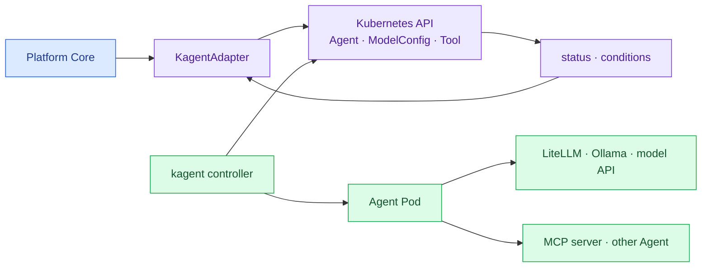

import { LinkCard } from '@astrojs/starlight/components';
import TermIntro from '../../../components/docs/TermIntro.astro';

> kagent는 Kubernetes 안의 Agent lifecycle을 표준화하지만 **회사의 catalog와 entitlement를 소유하지 않는다**

<TermIntro
  terms={[
    ['CRD', 'Custom Resource Definition', 'Kubernetes API에 Agent 같은 새 resource type을 추가하는 확장 방식이다.'],
    ['declarative Agent', 'Declarative Agent', 'model·system prompt·tool을 resource spec으로 선언하고 kagent runtime이 실행하는 Agent다.'],
    ['BYO Agent', 'Bring Your Own Agent', '사용자가 만든 container image를 kagent가 배포하는 방식. Agent는 A2A server 계약을 제공한다.'],
    ['controller', 'Kubernetes Controller', '원하는 Agent 상태와 실제 Deployment 상태를 계속 비교해 맞추는 process다.'],
  ]}
/>

## 전체 중 kagent의 자리

kagent는 `Agent`를 Kubernetes resource로 표현하고 model과 MCP tool 연결을 함께 관리한다. GitOps·namespace·
ServiceAccount·NetworkPolicy 같은 기존 Kubernetes 운영 모델과 가까운 것이 장점이다.

## 두 실행 방식

| 방식 | platform version에서 내려보낼 것 | 적합한 Agent |
|---|---|---|
| 선언형 | model config, prompt, tool binding, deployment hint | 구성형·표준 runtime Agent |
| BYO | signed image digest, env/secret ref, resource·security context | LangGraph·CrewAI·ADK 등 코드형 |

BYO image는 kagent가 기대하는 A2A endpoint를 구현해야 한다. 이미 HTTP API만 있는 Agent를 그대로 올리는
범용 container platform은 아니다. adapter의 `validate`가 protocol contract와 port를 먼저 검사한다.

## 공통 객체 매핑

| 공통 객체 | kagent/Kubernetes 표현 |
|---|---|
| `AgentVersion` | immutable image digest 또는 선언형 `Agent.spec` snapshot |
| `DeploymentTarget` | cluster, namespace, ServiceAccount, node/security preset |
| `Deployment` | namespaced `Agent` resource와 생성된 workload |
| `providerRef` | cluster ID + namespace + Agent name + UID |
| `ToolBinding` | MCP/ToolServer reference와 tool allowlist |
| runtime identity | ServiceAccount와 workload credential |

`Grant`와 `Publication`은 kagent resource에 억지로 넣지 않는다. portal API가 invoke 전 ACL을 검사하고,
외부 route는 승인된 publication만 kagent A2A endpoint로 연결한다.

## 인증과 인가의 빈칸

kagent v0.9은 oauth2-proxy 기반 OIDC 인증을 지원하지만 공식 release note는 **access control이 아직 구현되지
않았다**고 명시한다. 로그인한 사용자의 identity를 안다는 것과 Agent별 실행·수정 권한을 판단하는 것은 다르다.

Kubernetes RBAC도 직접적인 답은 아니다. 이것은 creator나 controller가 Kubernetes API의 `Agent` resource를
만질 권한을 제어한다. 일반 임직원이 chat/API로 Agent를 호출할 entitlement는 portal 또는 gateway가 강제한다.

## 격리와 공급망

namespace 하나를 사용자마다 자동 생성하는 것만으로 격리가 끝나지 않는다. target preset에 다음을 고정한다.

- non-root, seccomp, privilege escalation 금지
- read-only root filesystem과 제한된 volume
- ServiceAccount token 불필요 시 자동 mount 금지
- 기본 deny NetworkPolicy와 승인된 model·MCP egress
- ResourceQuota, LimitRange, PriorityClass
- signed image와 admission policy
- code 실행 Agent는 SandboxAgent 또는 별도 sandbox class 검증

controller가 모든 namespace를 watch하는 기본값보다 허용 namespace 목록을 명시해 blast radius를 줄인다.

## Adapter 동작

1. target capability와 image architecture/A2A contract를 검증한다.
2. `deploymentId` label과 deterministic resource name을 만든다.
3. secret value가 아니라 namespaced reference를 준비한다.
4. `Agent` resource를 server-side apply한다.
5. condition과 실제 Pod·Service health를 함께 읽어 normalized status로 바꾼다.
6. synthetic invoke와 ACL deny test 뒤 portal publication을 연다.
7. rollback은 이전 version의 별도 resource로 route를 돌린다.

CR spec을 제자리에서 덮어써 이전 version의 조사 가능성을 없애지 않는다.

## 잘 맞는 경우와 불리한 경우

**잘 맞는다:** 실행과 data가 온프렘에 남아야 하고, Kubernetes 운영 역량·GitOps·policy 기반이 이미 있으며,
로컬 model·MCP에 낮은 지연으로 접근해야 한다.

**불리하다:** platform team이 controller·Postgres·upgrade·capacity·sandbox를 직접 운영할 여력이 없거나,
session별 강한 격리를 빠르게 제공해야 한다. kagent가 Kubernetes 운영 책임을 없애지는 않는다.

## 참고 자료

- [kagent Agent 개념](https://kagent.dev/docs/kagent/concepts/agents) — 선언형·BYO Agent, tool과 HITL.
- [kagent BYO Agent](https://kagent.dev/docs/kagent/examples/a2a-byo) — image와 A2A runtime 계약.
- [kagent v0.9 release notes](https://kagent.dev/docs/kagent/resources/release-notes) — OIDC 인증과 access control 경계.
- [운영 고려사항](https://kagent.dev/docs/kagent/operations/operational-considerations) — HA, secret, security context.
- [kagent 실습 덱](/kagent-lab/) — 전용 kind cluster에서 설치·Agent·MCP·A2A·debug·cleanup을 직접 확인.

<LinkCard
  title="7. AgentCore adapter"
  description="같은 계약을 AWS 관리형 session runtime과 VPC·PrivateLink·JWT 경계로 번역한다."
  href="/agent-platform/07-agentcore/"
/>
