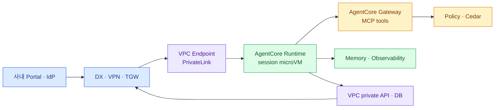

import { LinkCard } from '@astrojs/starlight/components';
import TermIntro from '../../../components/docs/TermIntro.astro';

> AgentCore는 AWS를 사내망의 확장으로 쓸 때 강한 managed runtime이지만 **온프렘에 설치되는 제품은 아니다**

<TermIntro
  terms={[
    ['AgentCore Runtime', 'Amazon Bedrock AgentCore Runtime', 'Agent code를 AWS가 session 단위로 격리·실행·확장하는 관리형 환경이다.'],
    ['PrivateLink', 'AWS PrivateLink', 'VPC의 private IP를 통해 AWS service API를 호출해 public internet traversal을 피하는 방식이다.'],
    ['custom JWT authorizer', 'Custom JWT Authorizer', '사내 IdP token의 issuer·audience·scope·claim을 runtime 앞에서 검증하는 기능이다.'],
    ['Cedar', 'Cedar Policy Language', 'AgentCore Gateway tool action을 결정적으로 허용·거부하는 policy 언어다.'],
  ]}
/>

## 전체 중 AgentCore의 자리

private 경로를 써도 runtime control/data plane과 session compute는 AWS region에 있다. "인터넷을 안 지난다"와
"data가 온프렘을 떠나지 않는다"를 같은 말로 쓰지 않는다.

## Runtime contract와 격리

AgentCore Runtime은 custom code와 LangGraph·CrewAI·ADK 같은 framework를 container로 실행한다. HTTP, MCP,
A2A, AG-UI contract를 지원하며 version과 endpoint를 관리한다. container는 현재 ARM64와 protocol별 port/path
계약을 따라야 하므로 adapter가 build manifest를 검증한다.

각 runtime session은 전용 microVM의 compute·memory·filesystem으로 격리된다. idle timeout이나 최대 lifecycle에
도달하면 compute는 종료되고, 필요한 상태는 Memory나 session storage로 내린다. 단, AWS도 user와 session ID의
연결은 client backend가 관리해야 한다고 명시한다.

## 공통 객체 매핑

| 공통 객체 | AgentCore 표현 |
|---|---|
| `AgentVersion` | ECR image digest + immutable Runtime version/config |
| `DeploymentTarget` | AWS account·region·VPC subnet·SG·execution role preset |
| `Deployment` | Runtime version + endpoint |
| `providerRef` | Runtime ARN, version, endpoint qualifier |
| runtime identity | execution role와 AgentCore workload identity |
| `ToolBinding` | Gateway target, credential provider, Policy association |

adapter는 ECR push 자체보다 승인된 digest가 ARM64인지, target VPC가 필요한 endpoint를 갖는지, execution role이
허용 범위를 넘지 않는지 검증한다. Runtime update가 새 version을 만들면 publication은 새 endpoint 검증 뒤 전환한다.

## 사내망처럼 사용하는 조건

AgentCore Runtime과 built-in tool은 지정 VPC subnet에 ENI를 만들어 private resource에 접근할 수 있다.
AgentCore data/control/Gateway API에는 PrivateLink interface endpoint를 둘 수 있다. VPC와 온프렘이 DX나 VPN으로
연결됐다면 private MCP·API·DB로 이어질 수 있다.

인터넷이 없는 VPC mode에서는 ECR·S3·CloudWatch Logs 등 필요한 VPC endpoint와 private DNS를 준비한다. 사내 CA,
Route 53 Resolver, return route, security group까지 end-to-end로 검증한다.

## Identity와 Agent별 ACL

Runtime은 IAM SigV4 또는 custom JWT inbound auth를 사용한다. JWT authorizer는 audience, client, scope와
`groups contains Finance` 같은 custom claim을 검사할 수 있다. provider 경계의 coarse policy로 유용하다.

그러나 사용자가 매 Agent마다 개인 email과 여러 부서를 바꾸는 entitlement를 전부 IAM/JWT config로 생성하면
policy가 폭증한다. portal ACL이 먼저 세밀한 결정을 내리고, AgentCore에는 portal workload 또는 큰 group boundary만
허용하는 구성을 기본으로 한다.

## Gateway·Policy·Registry를 혼동하지 않는다

| 구성요소 | 맡는 일 | 대신하지 않는 것 |
|---|---|---|
| Identity | inbound token 검증, workload/outbound credential | 임직원 directory·Agent catalog ACL |
| Gateway | API·Lambda·MCP를 Agent tool로 노출 | Agent runtime 자체 |
| Policy | Gateway tool action을 Cedar로 허용·거부 | 누가 catalog의 Agent를 볼지 |
| Registry | Agent·MCP·skill metadata 검색과 승인 | 완성된 사내 marketplace UI |

Agent Registry는 AWS와 온프렘 resource를 함께 catalog할 수 있어 장기적으로 adapter와 잘 맞는다. 다만 현재
Preview이고 search authorization은 registry 단위가 중심이므로, product-neutral catalog의 단일 원본으로 바로
의존하지 않는다. 승인된 record를 mirror하는 provider catalog로 먼저 사용한다.

## 잘 맞는 경우와 불리한 경우

**잘 맞는다:** AWS가 승인된 data boundary이고, platform team이 runtime 격리·scale·session 기반을 직접 운영하지
않으려 하며, VPC·IAM·CloudWatch 운영 역량이 있다.

**불리하다:** 실행·prompt·memory가 물리적 온프렘을 벗어나면 안 되거나, AgentCore 미지원 region·quota가 문제거나,
AWS API·ECR·ARM64 contract 종속성을 받아들이기 어렵다.

## 참고 자료

- [AgentCore Runtime 동작](https://docs.aws.amazon.com/bedrock-agentcore/latest/devguide/runtime-how-it-works.html) — framework, version, protocol.
- [Runtime session 격리](https://docs.aws.amazon.com/bedrock-agentcore/latest/devguide/runtime-sessions.html) — microVM과 client의 session 책임.
- [VPC 연결](https://docs.aws.amazon.com/bedrock-agentcore/latest/devguide/agentcore-vpc.html) — ENI, subnet, endpoint 요구.
- [JWT authorizer](https://docs.aws.amazon.com/bedrock-agentcore/latest/devguide/inbound-jwt-authorizer.html) — scope와 custom claim.
- [Agent Registry](https://docs.aws.amazon.com/bedrock-agentcore/latest/devguide/registry.html) — catalog와 Preview 상태.

<LinkCard
  title="9. 여러 target을 함께 운영하기"
  description="data zone과 capability로 placement를 결정하고 endpoint·identity·관측 계약은 하나로 유지한다."
  href="/agent-platform/09-hybrid/"
/>
