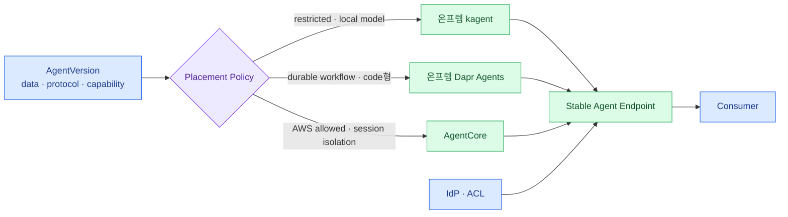

import { LinkCard } from '@astrojs/starlight/components';
import TermIntro from '../../../components/docs/TermIntro.astro';

> 사용자가 provider를 고르는 것이 아니라 **Agent 요구사항과 회사 policy가 target을 고른다**

<TermIntro
  terms={[
    ['placement policy', 'Placement Policy', 'Agent의 data·기능·자원 요구와 target capability를 비교해 실행 위치를 결정하는 규칙이다.'],
    ['data zone', 'Data Zone', 'data가 저장·처리·전송될 수 있는 신뢰 경계를 등급으로 표현한 것이다.'],
    ['stable endpoint', 'Stable Endpoint', 'backend deployment가 바뀌어도 consumer가 계속 사용하는 회사 소유 URL·Agent ID다.'],
  ]}
/>

## Hybrid target 지도



creator는 `AWS allowed`나 `restricted only` 같은 업무 제약을 제출할 수 있지만 subnet이나 cluster를 직접 고르지
않는다. 최종 placement는 data owner 승인과 platform policy가 결정한다.

## 결정 순서

| 질문 | kagent 쪽 | Dapr Agents 쪽 | AgentCore 쪽 |
|---|---|---|---|
| data 경계 | 물리적 온프렘 | 물리적 온프렘 | AWS 처리 허용 |
| 주 실행 형태 | 구성형·BYO Agent | 코드형 durable workflow | 관리형 session runtime |
| 필요한 image architecture | cluster node와 일치 | cluster node와 일치 | ARM64 검증 가능 |
| 격리 요구 | Pod·gVisor sandbox | 일반 Pod·별도 sandbox 설계 | session별 microVM |
| 복구 의미 | workload 재기동 | workflow step부터 재개 | managed session lifecycle |
| 운영 책임 | controller·runtime·DB | Dapr control plane·state store·app | AWS service·quota 중심 |

첫 번째 질문이 hard constraint다. 나머지는 score로 비교할 수 있지만 data boundary를 비용이나 편의로 뒤집지 않는다.

## Stable endpoint와 route

consumer는 provider ARN이나 cluster Service를 알지 않는다.

```text
POST https://agents.company.example/v1/agents/{agentId}/responses
```

portal gateway가 publication의 active deployment를 찾아 backend protocol로 변환한다. cutover는 DNS 교체보다
publication pointer와 route weight로 수행한다. 대화 중 target을 바꾸면 memory와 tool credential 의미가 달라질
수 있으므로 새 session부터 전환하는 것이 기본이다.

## 공통인 것과 portable하지 않은 것

공통으로 유지할 값은 Agent ID, ACL, artifact digest, tool logical ID, trace field다. 다음은 adapter capability로
남기며 억지로 같게 만들지 않는다.

- AgentCore session microVM과 persistent session filesystem
- kagent의 node scheduling, volume, ServiceAccount, cluster-local networking
- Dapr workflow history, activity retry와 App ID 기반 service invocation
- provider-native memory와 conversation representation
- traffic split·scale-to-zero·built-in browser/code interpreter

portable core와 provider extension을 version spec에서 분리하면 특정 기능을 사용한 Agent만 target이 제한된다.

## Network 경계

온프렘에서 AWS로 가는 private path도 외부 dependency다. 다음을 별도 health domain으로 관측한다.

- DX/VPN/TGW와 양방향 route
- PrivateLink endpoint와 private DNS
- IdP discovery·JWKS 접근
- internal MCP/API의 TLS와 사내 CA
- ECR·S3·CloudWatch endpoint
- timeout과 retry가 WAN 단절을 증폭하지 않는지

AWS 장애 때 restricted Agent까지 같이 실패하지 않도록 portal과 ACL store는 온프렘 독립 운영을 고려한다.

## Catalog는 하나로 유지한다

Agent Registry나 Kubernetes API에서 resource를 수집할 수 있지만 사용자가 보는 catalog의 원본은 platform DB다.
provider catalog는 discovery와 drift 확인에 사용한다. 한 Agent가 두 target에 있어도 catalog card는 하나이고,
deployment badge만 여러 개다.

## Failover를 자동이라고 가정하지 않는다

온프렘 Agent를 AgentCore로 넘기는 것은 compute failover보다 큰 의미 변화다. data 반출, image architecture,
model endpoint, secret, memory, tool network가 모두 compatible해야 한다. 사전 승인된 `failoverTarget`과 검증된
artifact가 있는 Agent만 자동 전환한다. 나머지는 빠르게 실패하고 owner에게 알려야 한다.

## 11장 요약

- placement는 creator 취향이 아니라 data zone과 capability policy가 결정한다.
- stable company endpoint 뒤에서 publication이 deployment를 선택한다.
- provider 고유 기능은 extension으로 남기고 사용한 Agent만 portability가 제한된다.
- hybrid failover는 사전 승인·검증된 Agent에만 허용한다.

<LinkCard
  title="15. 운영과 실패 경계"
  description="공통 SLO·trace·감사·drift와 provider별 장애를 한 운영 모델로 묶는다."
  href="/agent-platform/15-operations/"
/>
