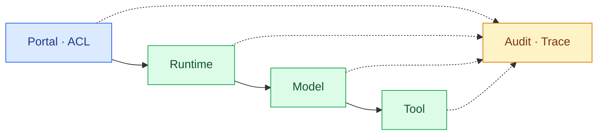

import { LinkCard } from '@astrojs/starlight/components';
import TermIntro from '../../../components/docs/TermIntro.astro';
import Thesis from '../../../components/docs/Thesis.astro';

<Thesis>Agent가 답했다는 것보다 어느 version이 누구의 권한으로 무슨 action을 했는지 남는지가 중요하다</Thesis>

<TermIntro
  terms={[
    ['deployment SLO', 'Deployment Service Level Objective', '승인된 version이 정해진 시간 안에 ready·published 되는 비율 목표다.'],
    ['invocation SLO', 'Invocation Service Level Objective', '사용자 요청의 성공률·지연·stream 시작 시간을 다루는 목표다.'],
    ['drift', 'Configuration Drift', 'control plane의 desired state와 provider 실제 resource가 달라진 상태다.'],
  ]}
/>

## 세 운영 경로

| 경로 | 대표 지표 | 실패의 첫 소유자 |
|---|---|---|
| 배포·공개 | approval-to-ready, deploy failure, deployment repair와 publication rollback time | control plane·adapter·publication router |
| 호출 | auth deny, time to first token, completion rate | gateway·runtime·model |
| action | tool allow/deny, latency, side-effect failure | tool gateway·업무 system |

LLM 응답 200만 재면 tool이 실패한 Agent도 정상으로 보인다. 세 경로를 같은 `traceId`로 연결하되 각각 별도 SLO를 둔다.

## 공통 correlation contract

portal gateway가 다음 field를 만들고 runtime·model gateway·tool gateway에 전파한다.

```text
agentId · versionId · deploymentId · targetId · triggerId
principalKey · sessionId · traceId · effectiveConfigHash
```

tool event에는 `toolVersionId`·`capabilityName`·`policyDecisionId`, retrieval event에는
`knowledgeVersionId`·`knowledgeDeploymentId`를 추가한다. OIDC token의 bare `sub`나 email을 correlation key로
쓰지 않고 portal이 정규화한 issuer-scoped `principalKey`를 전파한다.

prompt·response 원문은 기본 correlation field가 아니다. data classification에 따라 저장 여부, redaction, 암호화,
retention과 열람 role을 정한다. [Langfuse 덱](/langfuse/)의 trace 설계와 연결하되 SIEM audit 원장을 대체하지 않는다.

## Health를 층별로 나눈다



synthetic test는 허용 사용자·금지 사용자·read tool·거부될 write tool을 각각 호출한다. runtime health endpoint만
성공해도 publication을 정상으로 판정하지 않는다.

## 장애 진단표

| 증상 | 첫 확인 | 흔한 잘못된 대응 |
|---|---|---|
| catalog에는 있는데 403 | Grant, group claim, publication | provider를 재시작 |
| deploy가 `UNKNOWN` | provider API·credential·network | 새 resource를 중복 생성 |
| kagent Agent ready, invoke 실패 | route·A2A endpoint·gateway auth | Pod 수만 증가 |
| AgentCore cold start 지연 | session ID 재사용·lifecycle·image init | 모든 timeout을 크게 증가 |
| tool 403 | user delegation·Cedar/OPA decision | Agent에 admin token 지급 |
| 응답은 성공, audit 유실 | OTel/SIEM pipeline·backpressure | 정상 처리로 종결 |
| AWS 단절 시 일부 Agent 전체 실패 | placement와 dependency graph | 모든 Agent를 자동 온프렘 전환 |

## Capacity와 quota

kagent target은 cluster CPU·memory·Pod·DB와 local model capacity를 계산한다. AgentCore target은 service quota,
concurrent session, cold start, VPC ENI와 사용량 비용을 본다. 공통 dashboard에는 Agent별 invocation과 cost를
정규화하되 provider bill의 단위를 억지로 하나로 만들지 않는다.

폭주한 Agent가 다른 Agent를 굶기지 않도록 creator·Agent·department별 concurrency와 budget을 gateway에서
제한하고 runtime에도 resource ceiling을 둔다.

## Upgrade와 drift

adapter release, kagent CRD/controller, AgentCore API contract를 Agent version과 분리해
관리한다. provider upgrade는 대표 canary Agent set으로 다음을 회귀 검증한다.

- streaming과 long session
- MCP/A2A contract
- private CA·IdP·secret rotation
- deny policy와 OBO tool
- trace correlation과 redaction
- 새 Deployment 전환·publication rollback과 기존 session 처리

수동 변경은 주기적 inventory와 desired-state diff로 찾는다. 보안 경계 drift는 자동 suspend가 가능해야 한다.

## Backup과 복구

가장 먼저 복구할 것은 provider resource가 아니라 platform DB의 Agent·Version·KnowledgeVersion·Grant·Publication과
audit key다. artifact registry, source snapshot과 index build artifact가 있으면 deployment는 adapter로 재생성할 수 있다.

복구 순서는 `IdP/ACL → catalog DB → source·artifact·index/secret reference → adapter → runtime → route → synthetic test`다.
memory와 conversation은 data 등급·RPO에 따라 별도 복구한다.

## 15장 요약

- 배포·호출·action 경로의 SLO와 실패 소유자를 분리한다.
- 공통 correlation field로 provider trace를 연결하고 audit 원장을 별도로 둔다.
- product resource는 재생성 가능하게 만들고 domain DB와 artifact를 먼저 복구한다.
- provider별 quota와 비용 단위는 보존하되 Agent별 budget은 공통 gateway에서 제한한다.

<LinkCard
  title="16. 두 Agent로 시작하기"
  description="기본 target 하나와 검증 Agent 두 개로 adapter·ACL·publication 전환의 가장 위험한 가정을 시험한다."
  href="/agent-platform/16-adoption/"
/>
