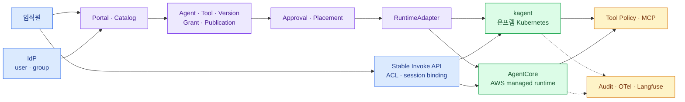

import { LinkCard } from '@astrojs/starlight/components';
import Thesis from '../../../components/docs/Thesis.astro';

<Thesis>제품은 바뀌어도 Agent와 Tool의 ID·version·권한·감사 기록은 회사에 남아야 한다</Thesis>

## 전체 지도

## 설계 결정 열네 가지

1. kagent·AgentCore는 platform 전체가 아니라 runtime/provider의 일부다.
2. 회사 `agentId`를 provider CR name이나 ARN보다 먼저 만든다.
3. `AgentVersion`은 immutable artifact와 실행 계약의 snapshot이다.
4. 사용자 MCP는 Agent 설정의 URL이 아니라 독립된 Tool lifecycle로 관리한다.
5. `Grant`·`Publication`·audit는 provider 밖 control plane이 소유한다.
6. 구성형과 코드형 Agent의 검증·승인 risk tier를 나눈다.
7. 관리·invoke·tool action 권한을 세 경계에서 각각 검사한다.
8. email이 아니라 IdP의 불변 principal ID에 권한을 건다.
9. session ID와 user 관계를 portal backend가 강제한다.
10. adapter는 idempotency·reconciliation·provider error 번역을 맡는다.
11. capability profile로 provider 차이를 드러내고 최소 공통분모로 깎지 않는다.
12. durable execution 층은 보류한 결정(결정 B)이다. 엔진 없이도 tool side effect에는 idempotency를 강제한다.
13. data zone이 placement의 첫 hard constraint다.
14. stable company endpoint 뒤에서 publication만 target deployment를 바꾼다.

## Runtime 선택 카드

| 선택 | 우선하는 조건 | 남는 일 |
|---|---|---|
| 맨 Kubernetes 기본 (기준선) | 코드형 위주, kagent가 기준선 대비 가치를 증명하지 못함 | 구성형 runner·A2A 표면·격리 설계를 직접 소유 |
| kagent 기본 | 물리적 온프렘 경계, 구성형 self-service 비중, 강한 Kubernetes 운영 기반 | runtime·DB·upgrade·sandbox·capacity 운영 |
| AgentCore 기본 | AWS 승인 경계, managed session 격리·scale, VPC/IAM 역량 | portal ACL, private network, AWS quota·cost·lock-in 관리 |
| hybrid | data 등급과 기능에 따라 여러 조건이 실제 공존 | adapter와 dependency graph, 제한된 failover 검증 |

여러 target을 쓰는 것이 목표가 아니다. 회사 요구를 만족하는 default 하나를 정하고 secondary target의 존재 이유를
hard constraint로 설명할 수 있어야 한다. 장기 workflow·승인 대기·step 복구 수요는 이 표의 선택지가 아니라
[12장 보류한 결정](/agent-platform/12-durable-execution/)의 재개 조건이다.

## Production 준비 체크리스트

### Domain과 lifecycle

- [ ] Agent·Tool·Version·Grant·DeploymentTarget·Deployment·Publication이 provider ID와 분리됐다.
- [ ] 승인된 version은 immutable digest를 가리킨다.
- [ ] `READY`, `PUBLISHED`, `SUSPENDED`, `RETIRED`의 의미가 분리됐다.
- [ ] owner 퇴사·부서 이동·오래된 Agent review 절차가 있다.
- [ ] provider resource 삭제 후 domain record와 audit가 남는다.

### Identity와 권한

- [ ] IdP 불변 ID와 group이 ACL 단일 원본이다.
- [ ] 관리·invoke·tool action PEP가 각각 있다.
- [ ] direct backend 호출이 portal ACL을 우회하지 않는다.
- [ ] session ownership을 매 요청에서 검사한다.
- [ ] user delegation과 workload identity가 구분되고 공용 admin token이 없다.
- [ ] deny decision과 grant 변경이 SIEM audit에 남는다.

### 공급망과 격리

- [ ] code형 Agent는 CI build, SBOM, scan, signature, digest 고정을 거친다.
- [ ] 사용자 MCP는 독립된 ToolVersion·ToolDeployment·ToolPublication lifecycle을 거친다.
- [ ] discovery schema drift가 새 승인 없이 Agent binding에 노출되지 않는다.
- [ ] runtime은 non-root, resource limit, filesystem·network 최소 권한을 강제한다.
- [ ] tool server와 code는 portal process 밖의 격리 환경에서 실행한다.
- [ ] egress destination과 private CA가 target별로 검증됐다.
- [ ] destructive tool에는 deterministic policy와 필요한 human approval이 있다.
- [ ] retry·재실행으로 반복될 수 있는 tool side effect는 idempotency key와 중복 방지를 검증했다.

### Adapter와 hybrid

- [ ] `validate·plan·deploy·status·stop·rollback·delete` contract가 있다.
- [ ] 같은 idempotency key 재시도와 응답 유실을 시험했다.
- [ ] unsupported protocol·architecture·capability가 배포 전에 거부된다.
- [ ] stable endpoint와 이전 deployment rollback을 시험했다.
- [ ] data zone별 placement와 failover 가능 여부가 문서화됐다.
- [ ] Preview provider 기능을 제거한 fallback path가 있다.

### 운영과 복구

- [ ] 배포·호출·tool action SLO가 분리됐다.
- [ ] 공통 correlation field가 runtime·model·tool trace를 잇는다.
- [ ] provider quota·cost와 Agent별 budget을 함께 본다.
- [ ] drift, credential 만료, IdP group 변경을 감지한다.
- [ ] catalog DB·artifact·secret reference에서 runtime을 재생성하는 복구 훈련을 했다.
- [ ] 금지 사용자·금지 action을 포함한 synthetic test가 계속 돈다.

## 장애 대응 카드

| 증상 | 먼저 볼 경계 |
|---|---|
| Agent가 목록에 없다 | Publication과 Grant |
| 목록에는 있지만 403 | principal/group, invoke policy |
| 배포가 멈췄다 | adapter operation, provider API, idempotency record |
| 답이 느리다 | gateway → runtime/session → model → tool 순서 |
| 잘못된 업무 action | tool policy decision, OBO identity, input condition |
| backend 교체 뒤 대화 이상 | session·memory portability와 version route |
| 온프렘/AWS 단절 | placement dependency graph와 승인된 failover |

## 다시 볼 장

- [1. 네 plane으로 나누기](/agent-platform/01-planes/) — 제품 책임과 장애 소유자가 섞일 때
- [2. Agent 종류는 여섯 축으로 나눈다](/agent-platform/02-agent-types/) — 카탈로그 등록 양식과 분류 schema를 정할 때
- [3. 제품 밖의 domain model](/agent-platform/03-domain-model/) — DB·API schema를 설계할 때
- [5. 권한은 세 번 검사한다](/agent-platform/05-authorization/) — Agent별 ACL과 tool 권한을 붙일 때
- [6. Adapter contract](/agent-platform/06-adapter-contract/) — 새 runtime provider를 추가할 때
- [7. 사용자 MCP를 플랫폼에 올리기](/agent-platform/07-user-mcp/) — 사용자가 만든 MCP의 등록·검증·공개 lifecycle을 설계할 때
- [8~11. kagent](/agent-platform/08-kagent-architecture/) — 온프렘 Kubernetes를 Agent runtime으로 쓸 때
- [10. 사내 frontend·backend와 연결하기](/agent-platform/10-kagent-integration/) — 자체 포털의 통합 지점과 데이터 소유를 정할 때
- [12. 보류한 결정 — durable execution](/agent-platform/12-durable-execution/) — step 복구 수요가 나타나 재개를 검토할 때
- [13. AgentCore adapter](/agent-platform/13-agentcore/) — 두 번째 target 구현을 비교할 때
- [16. 두 Agent로 시작하기](/agent-platform/16-adoption/) — PoC acceptance test를 만들 때

<LinkCard
  title="Agent 배포 플랫폼 개요로 돌아가기"
  description="덱의 전체 지도와 각 장의 질문을 다시 본다."
  href="/agent-platform/"
/>
