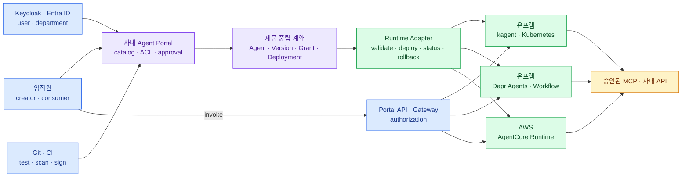

import { LinkCard, LinkButton } from '@astrojs/starlight/components';
import DeckMap from '../../../components/docs/DeckMap.astro';

> Agent 플랫폼의 중심은 runtime이 아니라 **Agent의 정체성·권한·lifecycle을 소유하는 사내 control plane**이다

임직원이 Agent를 만들어 공유하려면 컨테이너를 띄우는 것보다 더 긴 일이 필요하다. 이름과 소유자를 기록하고,
부서와 개인별 권한을 판단하고, code와 tool을 검사하고, 승인된 version만 배포하며, 호출과 action을 감사해야 한다.
kagent, Dapr Agents, Amazon Bedrock AgentCore는 이 중 **실행 상태를 만드는 부분**을 나눠 맡지만 전체 포털은 아니다.

이 덱은 먼저 제품 밖에 `Agent`·`AgentVersion`·`Trigger`·`Grant`·`DeploymentTarget` 계약을 만든다. 그다음 같은 계약을
온프렘 Kubernetes의 kagent·Dapr Agents와 AWS 관리형 AgentCore에 각각 번역한다. 목표는 세 target의 모든 기능을 똑같이 만드는
것이 아니라, **Agent의 정체성과 권한을 유지한 채 실행 위치를 바꿀 수 있게 하는 것**이다.

## 전체 지도

위쪽의 배포 흐름은 `Git → Portal → Adapter → Runtime`이다. 아래쪽의 요청 흐름은
`사용자 → Gateway → Runtime → Tool`이다. 둘은 같은 Agent ID를 쓰지만 권한과 실패 방식이 다르다.

<LinkButton href="/agent-platform/00-position/" icon="right-arrow">첫 장부터 읽기</LinkButton>

## 구성

<DeckMap
  steps={[
    { label: '0~1장', href: '/agent-platform/00-position/', title: '큰 그림과 plane', tone: 'key',
      desc: '왜 runtime만으로 플랫폼이 되지 않는가 · 사용자 경험·control·runtime·foundation plane',
      note: '제품을 고르기 전에 어떤 경계를 고정해야 하는가' },
    { label: '2~4장', href: '/agent-platform/02-domain-model/', title: '제품 밖의 계약', tone: 'zone',
      desc: '분류 축 · Agent·Version·Trigger·Grant·Deployment · 등록부터 폐기까지 · invoke와 tool action 권한',
      note: '무엇을 회사가 소유해야 provider를 바꿔도 의미가 남는가' },
    { label: '5장', href: '/agent-platform/05-adapter-contract/', title: 'Adapter contract', tone: 'ok',
      desc: 'validate·plan·deploy·status·rollback과 capability profile',
      note: '여러 backend의 차이를 숨기지 않으면서 호출부를 어떻게 안정시키는가' },
    { label: '6~8장', href: '/agent-platform/06-kagent/', title: '세 실행 adapter', tone: 'warn',
      desc: 'Kubernetes-native control plane · durable workflow substrate · AWS managed session runtime',
      note: '각 제품이 공통 계약의 어디까지 맡고 무엇을 남기는가' },
    { label: '9~10장', href: '/agent-platform/09-hybrid/', title: '하이브리드 운영', tone: 'bad',
      desc: 'data zone별 target 선택 · network · 감사 · SLO · 장애 격리와 복구',
      note: '온프렘과 AWS를 한 control plane에서 어떻게 운영하는가' },
    { label: '11~12장', href: '/agent-platform/11-adoption/', title: '도입과 마무리', tone: 'mute',
      desc: '두 Agent로 검증하는 PoC · 선택 기준 · production checklist' },
  ]}
/>

## 먼저 내릴 결론

- 온프렘 실행이 보안 경계라면 kagent는 **runtime adapter 후보**다. 포털·ACL·승인 workflow는 별도로 만든다.
- 장기 실행·승인 대기·event-driven code형 Agent가 핵심이면 Dapr Agents를 durable runtime adapter로 검증한다.
- AWS VPC를 사내망의 신뢰 가능한 확장으로 인정하면 AgentCore는 운영 부담과 session 격리를 크게 줄인다.
- 세 target을 처음부터 같은 수준으로 구현하지 않는다. 하나를 기본 target으로 정하고 나머지는 규제·기능상
  필요한 Agent부터 추가한다.
- 사용자의 Agent 접근권한과 Agent가 tool로 행사하는 업무권한을 분리한다.
- provider 교체는 `Agent`가 아니라 `Deployment`의 변화다.
- 구성형·코드형, request·schedule·event, resident·suspendable·ephemeral을 서로 다른 분류 축으로 관리한다.

## 기준 시점

**2026년 8월 19일 기준**이다. kagent v0.9의 인증·인가 경계, Dapr Agents v1.0과 AWS Agent Registry의 Preview 상태처럼
변화가 빠른 항목은 실제 도입 시 선택한 release와 region 문서를 다시 확인한다.

<LinkCard
  title="0. Runtime보다 먼저 볼 것"
  description="임직원이 Agent를 만들고 쓰는 전체 여정에서 runtime adapter가 맡는 자리를 고정한다."
  href="/agent-platform/00-position/"
/>
