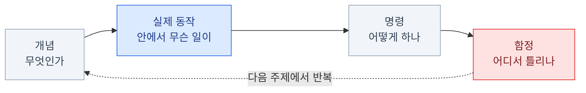
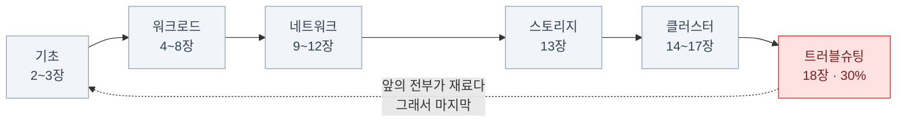
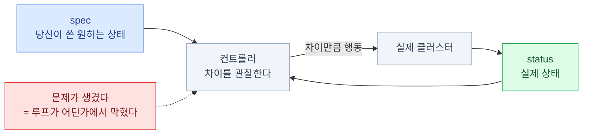
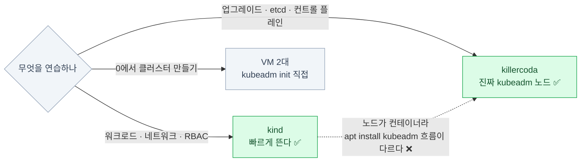

import { Steps, Card, CardGrid, Tabs, TabItem, LinkCard } from '@astrojs/starlight/components';

> 이 덱을 어떻게 읽을 것인가

## 이 덱이 하려는 것

"이 명령을 외운다"가 아니라
**"이 명령을 쳤을 때 클러스터 안에서 무슨 일이 벌어지는가"**를 남긴다.

- CKA(Certified Kubernetes Administrator)는 **실기 시험**이다. 객관식이 아니라 진짜 클러스터를 고친다
- 그래서 암기는 오래 못 간다 — **동작 모델**이 있어야 처음 보는 문제도 푼다
- 반대로 동작 모델만 있고 손이 느리면 **시간에 진다**. 둘 다 필요하다

## 대상 독자

<CardGrid>
<Card title="이 정도는 안다" icon="approve-check">
`kubectl get pod`은 쳐봤고,
Deployment가 뭔지는 안다.
</Card>
<Card title="그런데 여기서 막힌다" icon="question">
**"Pod이 Pending인데 왜 그런지"** 를
30초 안에 못 짚는다.
</Card>
<Card title="이건 불안하다" icon="warning">
etcd 백업·복구, kubeadm(클러스터 설치·업그레이드 도구) 업그레이드처럼
**평소에 안 하는 작업**.
</Card>
<Card title="이게 가장 큰 문제" icon="error">
실무는 EKS/GKE 같은 관리형이라
**컨트롤 플레인을 만져본 적이 없다.**
</Card>
</CardGrid>

전부 해당된다면 정확히 이 덱의 대상이다.
특히 마지막 항목 — **CKA 배점의 25%가 관리형에서 못 만지는 영역**이다.

## 덱의 구성 — 커리큘럼 도메인에 맞춰 정렬했다

| 장 | 주제 | CKA 도메인 |
|---|---|---|
| 1 | 시험 자체 | — |
| 2~3 | 아키텍처 · kubectl | 기초 |
| 4~8 | Pod · 워크로드 · 설정 · 스케줄링 · 오토스케일링 | Workloads and Scheduling (15%) |
| 9~12 | Service · DNS · Ingress/Gateway · NetworkPolicy | Servicing and Networking (20%) |
| 13 | 스토리지 | Storage (10%) |
| 14~17 | RBAC · 클러스터 라이프사이클 · Helm/Kustomize · 확장 | Cluster Architecture (25%) |
| 18 | 트러블슈팅 | Troubleshooting (30%) |
| 19~20 | 시험 전략 · 마무리 | — |

**배점 순서와 학습 순서는 다르다.**

트러블슈팅이 30%지만 마지막에 있는 이유는, 앞의 전부를 알아야 진단이 되기 때문이다.

## 이 덱 전체를 관통하는 한 문장

Kubernetes의 모든 것은
**"선언된 상태"와 "실제 상태"의 차이를 줄이는 루프**다.

트러블슈팅 30%가 결국 이 한 문장이다. **"어느 루프가 어디서 멈췄나"**를 찾는 것.

## 표기 약속

:::tip[시험]
이 형태로 출제된다, 또는 시간을 아끼는 방법
:::

:::caution[함정]
실제로 자주 틀리는 지점
:::

**명령 표기**

- `k` = `kubectl` (시험 환경에 alias가 걸려 있다)
- `-n <ns>` 는 대부분 생략해서 적었다. **실제 시험에서는 거의 항상 필요하다**
- 노드에서 실행하는 명령은 `sudo` 를 붙여 표기

YAML은 시험에서 그대로 쓸 수 있게 **축약 없이** 적었다.

## 실습 환경은 따로 준비하자

이 덱은 **읽는 자료**다. 손은 클러스터에서 움직여야 한다.

| 용도 | 도구 | 비고 |
|---|---|---|
| 로컬 멀티노드 | **kind** (+ Docker/colima) | 가장 빠르게 뜬다. 컨트롤 플레인이 컨테이너 |
| 업그레이드·etcd 연습 | **killercoda** | 무료. 진짜 kubeadm 노드를 준다 |
| 0→1 클러스터 구축 | **VM 2대** (Multipass/UTM 등) | `kubeadm init` 을 한 번은 직접 해봐야 한다 |
| 시험 직전 모의고사 | **killer.sh** | 시험 등록 시 2세션 포함. 실제보다 어렵다 |

:::caution[함정]
kind는 `kubeadm upgrade` 연습에 부적합하다.
노드가 컨테이너라 `apt install kubeadm` 흐름이 실제와 다르다. 업그레이드는 killercoda에서.
:::

## 이 덱의 정보 기준 시점

- **CKA 커리큘럼 v1.35** (cncf/curriculum) 기준으로 도메인·비중을 정렬했다
- **시험 환경 Kubernetes v1.35** 기준으로 API 버전과 명령을 적었다
- 커리큘럼은 대략 분기마다, 시험 환경 버전은 **k8s 릴리스 후 4~8주 안에** 따라 올라간다

:::tip[시험]
시험 접수 직전에 아래 두 곳을 반드시 다시 확인할 것.\
`github.com/cncf/curriculum` · Linux Foundation의 CKA program changes 페이지
:::

버전이 올라가도 **이 덱의 개념 부분은 거의 그대로**다.
바뀌는 건 주로 API 버전 표기와 새로 GA(General Availability — 정식 승격)된 기능 몇 개다.

## 0장 요약

- CKA는 **실기**다 — 개념 모델과 손 속도가 **둘 다** 필요하다
- 덱은 커리큘럼 5개 도메인 순서로 배치했고, 트러블슈팅(30%)이 마지막인 건 **앞의 전부가 재료**라서다
- 모든 장을 관통하는 축: **"선언된 상태 ↔ 실제 상태를 좁히는 루프"**
- 읽기만 하면 안 된다. **kind + killercoda**를 옆에 띄워두고 볼 것

<LinkCard
  title="1. CKA 시험 해부"
  description="무엇이 나오는지 모르면 무엇을 공부할지도 못 정한다. 시험 자체를 먼저 해부한다."
  href="/cka/01-exam/"
/>
