import { Steps, Card, CardGrid, Tabs, TabItem, FileTree } from '@astrojs/starlight/components';

> 무엇이 어디서 돌고 있는가

## 클러스터는 두 층으로 되어 있다

<CardGrid>
<Card title="컨트롤 플레인 (Control Plane)" icon="setting">
클러스터의 **뇌**. "무엇이 있어야 하는가"를 결정한다.

`kube-apiserver` · `etcd` · `kube-scheduler` ·
`kube-controller-manager` · `cloud-controller-manager`(클라우드일 때)
</Card>
<Card title="노드 (Node) / 데이터 플레인" icon="laptop">
실제로 **컨테이너를 돌리는 곳**.

`kubelet` · `kube-proxy` · 컨테이너 런타임(containerd 등)
</Card>
</CardGrid>

컨트롤 플레인 노드에도 **kubelet과 kube-proxy는 있다.**
컨트롤 플레인 컴포넌트 자체가 Pod으로 돌기 때문이다 — 뒤에서 다룬다.

### 전체 그림

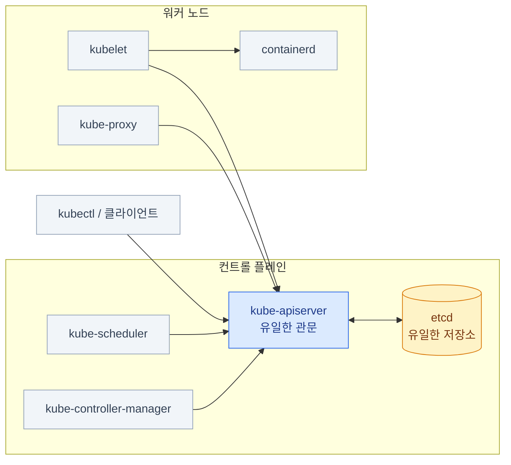

**화살표 방향이 핵심이다.** 모든 컴포넌트가 **API 서버를 향한다.**
API 서버가 다른 컴포넌트를 호출하지 않는다.

## 컨트롤 플레인 컴포넌트

### kube-apiserver — 유일한 관문

- 클러스터의 **모든 읽기·쓰기가 여기를 통과**한다. 예외 없다
- 상태를 직접 갖지 않는다 — **stateless**. etcd에만 쓴다
- 그래서 **수평 확장이 가능**하다 (HA 컨트롤 플레인의 근거)
- REST API를 제공한다. `kubectl`은 그 위의 얇은 클라이언트일 뿐

:::caution[함정]
**API 서버가 죽으면 `kubectl`이 전부 죽는다.**
그런데 **이미 떠 있는 Pod은 계속 돈다.** kubelet이 자기 로컬 상태로 컨테이너를 유지하기 때문.
"클러스터가 죽었다"와 "서비스가 죽었다"는 다른 얘기다.
:::

:::tip[시험]
트러블슈팅 문제에서 `kubectl`이 아예 응답을 안 하면
API 서버부터 본다. `crictl ps` 로 컨테이너 단에서 확인 (18장).
:::

### etcd — 유일한 저장소

- **분산 key-value 저장소.** 클러스터의 모든 오브젝트가 여기 있다
- Raft 합의 알고리즘 → **홀수 노드(3, 5)로 구성**한다. 과반이 살아야 쓰기가 된다
- `etcd`만 백업하면 **클러스터 전체를 복구**할 수 있다 (PV 안의 데이터는 제외)
- API 서버 외에는 **아무도 etcd에 직접 접근하지 않는다**

```bash
# etcd 안의 키 구조 — 오브젝트 경로가 그대로 키다
/registry/pods/default/nginx
/registry/deployments/kube-system/coredns
/registry/secrets/default/my-secret
```

:::tip[시험]
etcd 백업/복구는 **거의 확실히 나온다.**
15장에서 명령 전체를 다룬다. 지금은 "여기에 전부 들어 있다"만 기억하면 된다.
:::

### kube-scheduler — 자리를 정할 뿐이다

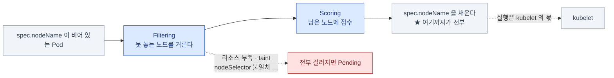

- `spec.nodeName`이 **비어 있는 Pod**을 찾는다
- 조건에 맞는 노드를 골라 **`spec.nodeName`을 채운다.** 그게 전부다
- **컨테이너를 직접 실행하지 않는다.** 실행은 kubelet의 몫

**두 단계로 고른다**

1. **Filtering** — 못 놓는 노드를 거른다 (리소스 부족, taint, nodeSelector 불일치…)
2. **Scoring** — 남은 노드에 점수를 매겨 최고점을 고른다

:::caution[함정]
스케줄러가 죽으면 **새 Pod이 영원히 Pending**이다.
그런데 `spec.nodeName`을 직접 쓴 Pod은 스케줄러 없이도 뜬다.
"스케줄러 고장" 문제의 확인 방법이 이것이다. (7장)
:::

### kube-controller-manager — 루프들의 모음

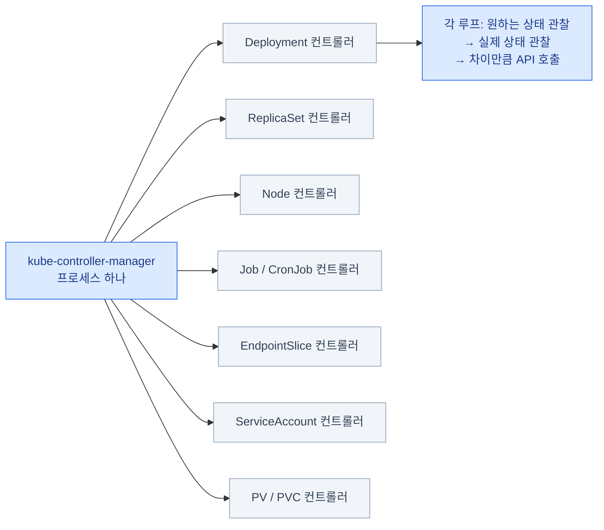

| 컨트롤러 | 하는 일 |
|---|---|
| Deployment | ReplicaSet을 만들고 롤아웃을 조율 |
| ReplicaSet | Pod 개수를 맞춘다 |
| Node | 노드가 응답 없으면 `NotReady` 표시, 이후 Pod 축출 |
| Job / CronJob | Pod을 만들고 완료를 추적 |
| Endpoint(Slice) | Service 셀렉터에 맞는 Pod IP 목록을 유지 |
| ServiceAccount | 네임스페이스마다 `default` SA를 만든다 |
| PV / PVC | 바인딩과 회수(reclaim)를 처리 |

**"컨트롤러가 죽었다"의 증상은 각기 다르다.** Deployment를 만들어도 Pod이 안 생기면
컨트롤러 매니저, Pod은 생겼는데 Pending이면 스케줄러다.

## 노드 컴포넌트

### kubelet — 노드의 대리인

- 노드마다 **하나씩** 돈다. **Pod이 아니라 systemd 서비스**다
- API 서버에서 **"내 노드에 배정된 Pod"** 목록을 받아온다
- 컨테이너 런타임(CRI)에게 컨테이너 생성·삭제를 지시한다
- 컨테이너 상태·노드 상태를 **API 서버에 보고**한다 (이게 끊기면 노드가 `NotReady`)
- **probe(liveness/readiness/startup)를 실행하는 주체**도 kubelet이다

:::caution[함정]
kubelet은 클러스터 안의 Pod이 **아니다.**
그래서 `kubectl`로 재시작할 수 없다. 노드에 `ssh`로 들어가
`systemctl restart kubelet` 해야 한다. 트러블슈팅에서 매우 자주 쓴다.
:::

### kube-proxy — Service를 노드의 규칙으로 번역한다

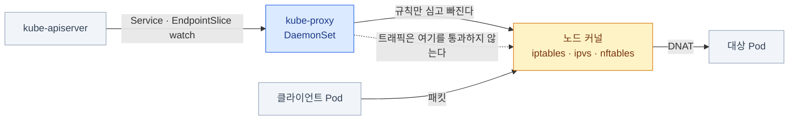

- 노드마다 하나씩. 보통 **DaemonSet**으로 돈다
- Service와 EndpointSlice를 지켜보다가 **노드의 패킷 규칙**을 갱신한다
- 모드: `iptables`(기본) / `ipvs` / `nftables`
- **트래픽이 kube-proxy를 통과하지 않는다.** 규칙만 심고 빠진다 — 커널이 처리한다

:::caution[함정]
kube-proxy가 죽어도 **기존 연결은 유지**되고
**Pod-to-Pod 직접 통신도 멀쩡**하다. 깨지는 건 **Service(ClusterIP) 경유**뿐이다.
"IP로는 되는데 서비스 이름으로는 안 된다"의 후보 중 하나. (9장)
:::

### 컨테이너 런타임 (CRI)

- kubelet은 **CRI(Container Runtime Interface)** 라는 gRPC 규약으로 런타임과 대화한다
- 현재 표준은 **containerd**. (CRI-O도 쓰인다)
- **Docker는 v1.24에서 제거되었다** — dockershim이 빠졌다
- 그래서 노드에서 컨테이너를 직접 볼 때는 **`crictl`** 을 쓴다

```bash
# 노드 안에서 (kubectl이 안 될 때의 생명줄)
sudo crictl ps                    # 실행 중 컨테이너
sudo crictl ps -a                 # 죽은 것 포함
sudo crictl logs <container-id>
sudo crictl pods                  # Pod 샌드박스 목록
```

:::tip[시험]
API 서버가 안 뜨는 문제에서 `crictl ps -a | grep apiserver` 로
컨테이너가 계속 재시작 중인지 보고, `crictl logs` 로 이유를 읽는 게 정석 루트다.
:::

## 컨트롤 플레인은 어떻게 떠 있나 — 스태틱 Pod

kubeadm으로 만든 클러스터에서, 컨트롤 플레인 컴포넌트는 **Pod이다.** 그런데 특별한 Pod이다.

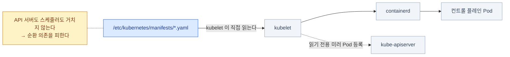

- **kubelet이 디렉터리를 직접 읽어서** 띄운다. API 서버도 스케줄러도 거치지 않는다
- 경로: **`/etc/kubernetes/manifests/`**
- 그래야 "API 서버를 띄우기 위해 API 서버가 필요한" 순환을 피할 수 있다

```bash
ls /etc/kubernetes/manifests/
# etcd.yaml  kube-apiserver.yaml  kube-controller-manager.yaml  kube-scheduler.yaml
```

:::tip[시험]
**이 디렉터리의 YAML을 고치면 kubelet이 즉시 Pod을 다시 만든다.**
컨트롤 플레인 옵션을 바꾸는 문제는 전부 여기를 편집하는 것이다.
파일을 밖으로 옮기면 해당 컴포넌트가 **멈춘다** (디버깅에 유용).
:::

### 스태틱 Pod의 특징

- 이름 뒤에 **노드 이름이 자동으로 붙는다** — `kube-apiserver-controlplane`
- API 서버에는 **읽기 전용 미러 Pod**으로 보인다
- **`kubectl delete pod` 해도 되살아난다.** kubelet이 파일을 다시 읽기 때문
- kubelet 설정의 `staticPodPath` 로 경로가 정해진다

```bash
# kubelet이 어느 디렉터리를 보는지 확인
sudo grep staticPodPath /var/lib/kubelet/config.yaml
# staticPodPath: /etc/kubernetes/manifests
```

**스태틱 Pod은 스케줄러를 거치지 않으므로** taint·affinity의 영향을 받지 않는다.
컨트롤 플레인 노드가 `NoSchedule` taint를 가져도 컨트롤 플레인 컴포넌트가 뜨는 이유다.

## 요청 하나가 지나가는 길

`kubectl apply -f pod.yaml` 을 쳤을 때 API 서버 안에서 벌어지는 일.

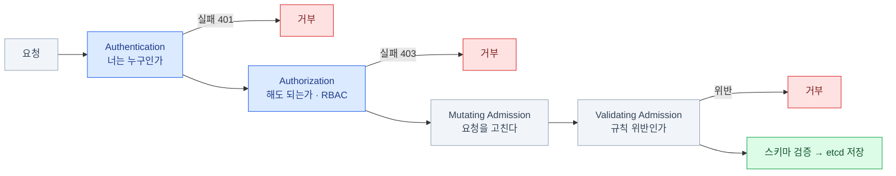

**이 순서를 알면 에러 코드로 원인을 짚을 수 있다.**
`401` = 인증, `403` = RBAC, 그 외 거부 = admission (14장에서 자세히).

### 저장된 다음 — 컨트롤러들의 릴레이

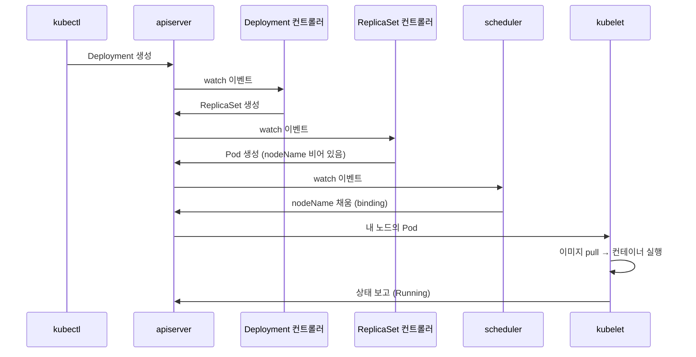

**아무도 서로를 직접 호출하지 않는다.** 전부 API 서버를 통한 **watch**다.
느슨하게 결합되어 있어서 컴포넌트 하나가 죽어도 나머지는 계속 돈다.

## 오브젝트의 공통 구조

모든 Kubernetes 오브젝트는 같은 뼈대를 가진다.

```yaml
apiVersion: apps/v1        # 어느 API 그룹의 어느 버전인가
kind: Deployment           # 무엇인가
metadata:                  # 이름·네임스페이스·라벨·애노테이션
  name: web
  namespace: default
  labels:
    app: web
spec:                      # 내가 원하는 상태  ← 사람이 쓴다
  replicas: 3
status:                    # 실제 상태        ← 컨트롤러가 쓴다
  readyReplicas: 3
```

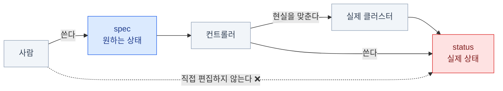

- **`spec`은 사람이, `status`는 시스템이 쓴다.** `status`를 직접 편집하지 않는다
- `apiVersion`이 `v1`이면 **core 그룹**(그룹 이름이 없다), `apps/v1`이면 `apps` 그룹
- 이 구조가 같으니 **처음 보는 리소스도 읽는 법은 똑같다**

### API 그룹과 리소스 탐색

```bash
kubectl api-resources                    # 전체 리소스 목록 (약칭·그룹·네임스페이스 여부)
kubectl api-resources --namespaced=false # 클러스터 스코프만 (Node, PV, ClusterRole …)
kubectl api-versions                     # 사용 가능한 group/version
```

```bash
kubectl explain pod.spec.containers.resources        # 필드 설명
kubectl explain deployment.spec.strategy --recursive # 하위 전부 펼치기
```

:::tip[시험]
`kubectl explain`은 **문서 대신 쓸 수 있는 오프라인 레퍼런스**다.
"이 필드 이름이 뭐였지"에 브라우저를 여는 것보다 훨씬 빠르다.
`--recursive`와 함께 쓰면 구조 전체가 보인다.
:::

## 네임스페이스

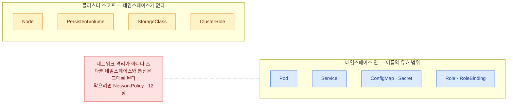

```bash
kubectl get ns
kubectl create ns dev
kubectl get pods -A                     # 전체 네임스페이스
kubectl config set-context --current --namespace=dev   # 기본 네임스페이스 변경
```

:::caution[함정]
기본 네임스페이스는 `default`다.
문제가 `-n project-x`를 요구했는데 `default`에 만들면 **0점**이다.
**매 명령에 `-n`을 붙이는 습관**이 안전하다.
:::

## 라벨과 셀렉터 — 연결의 접착제

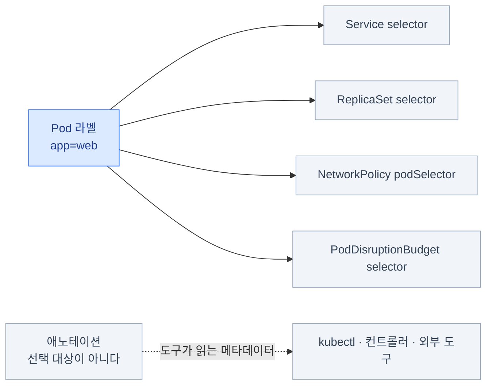

- **라벨(label)**: 선택하기 위한 key-value. Service·ReplicaSet·NetworkPolicy가 전부 이걸로 대상을 찾는다
- **애노테이션(annotation)**: 선택 대상이 아닌 부가 정보. 도구가 읽는 메타데이터

```bash
kubectl label pod nginx tier=frontend
kubectl label pod nginx tier=backend --overwrite
kubectl label pod nginx tier-                  # 삭제 (뒤에 하이픈)

kubectl get pods -l tier=frontend
kubectl get pods -l 'tier in (frontend,backend)'
kubectl get pods -l '!tier'                    # 라벨이 없는 것
kubectl get pods --show-labels
```

:::tip[시험]
"라벨이 `env=prod`인 Pod 개수를 파일에 쓰시오" 같은 문제가 나온다.
`kubectl get pods -l env=prod --no-headers | wc -l` 로 끝난다.
:::

### 필드 셀렉터와 소유 관계

```bash
kubectl get pods --field-selector status.phase=Running
kubectl get pods --field-selector spec.nodeName=node01
kubectl get events --field-selector type=Warning
```

**ownerReferences** — 오브젝트가 누구에게서 만들어졌는지 기록한다.

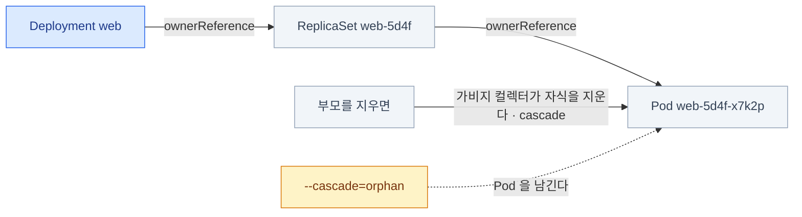

```bash
kubectl get pod web-abc-123 -o jsonpath='{.metadata.ownerReferences[0].kind}'
# ReplicaSet
```

- Deployment → ReplicaSet → Pod 으로 이어지는 소유 사슬이 여기 기록된다
- 부모를 지우면 **가비지 컬렉터가 자식을 지운다** (cascade)
- `kubectl delete deploy web --cascade=orphan` 을 쓰면 Pod을 남길 수 있다

## 노드 살펴보기

```bash
kubectl get nodes -o wide
kubectl describe node node01
kubectl get node node01 -o yaml
```

`describe node` 에서 반드시 볼 곳:

| 항목 | 의미 |
|---|---|
| **Conditions** | `Ready`, `MemoryPressure`, `DiskPressure`, `PIDPressure` |
| **Taints** | 이 노드가 밀어내는 조건 (7장) |
| **Capacity / Allocatable** | 전체 자원 / 실제 배정 가능한 자원 |
| **Allocated resources** | 현재 요청(request) 합계 — **사용량이 아니다** |
| **Non-terminated Pods** | 이 노드의 Pod 목록 |

:::caution[함정]
`Allocated resources`는 **request의 합**이지 실제 사용량이 아니다.
"CPU 100% 할당됨"인데 실제 CPU는 놀고 있을 수 있다. 실제 사용량은 `kubectl top`. (8장·18장)
:::

## 파일이 어디 있는지 — 트러블슈팅의 지도

<FileTree>

- etc/
  - kubernetes/
    - **manifests/** 컨트롤 플레인 스태틱 Pod YAML
    - **pki/** 인증서·키 (CA, apiserver, etcd …)
    - admin.conf 관리자 kubeconfig
    - kubelet.conf kubelet의 kubeconfig
  - cni/
    - net.d/ CNI 설정
- var/
  - lib/
    - kubelet/
      - **config.yaml** kubelet 설정 (staticPodPath, cgroupDriver …)
    - etcd/ etcd 데이터 디렉터리
  - log/
    - pods/ 컨테이너 로그 실체
    - containers/ 위로 향하는 심볼릭 링크

</FileTree>

:::tip[시험]
이 트리는 **외워야 한다.**
컨트롤 플레인이 고장나면 `kubectl`이 안 되고, 문서도 이 경로를 딱 집어주지 않는다.
:::

## 2장 요약

- **컨트롤 플레인(결정) + 노드(실행)**. 모든 화살표는 **API 서버를 향한다**
- **etcd에 전부 들어 있다** — 백업 하나로 클러스터를 되살린다
- **스케줄러는 `nodeName`만 채운다.** 실행은 kubelet
- **kubelet은 Pod이 아니라 systemd 서비스** — `kubectl`로 못 고친다
- 컨트롤 플레인은 **`/etc/kubernetes/manifests/`의 스태틱 Pod** — 파일을 고치면 즉시 반영
- 요청은 **인증 → 인가 → admission → etcd** 순서로 지나간다
- **`kubectl explain`과 `kubectl api-resources`** 는 오프라인 문서다
