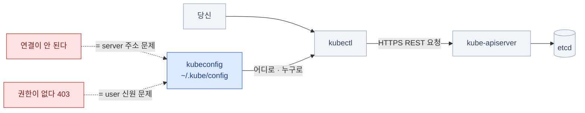
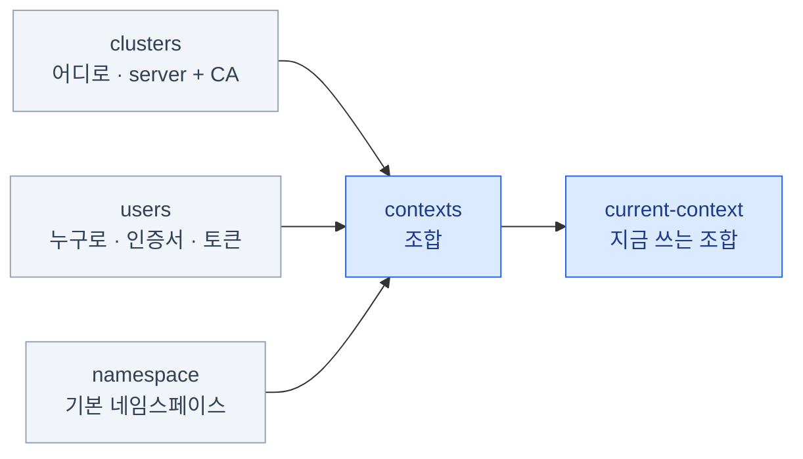
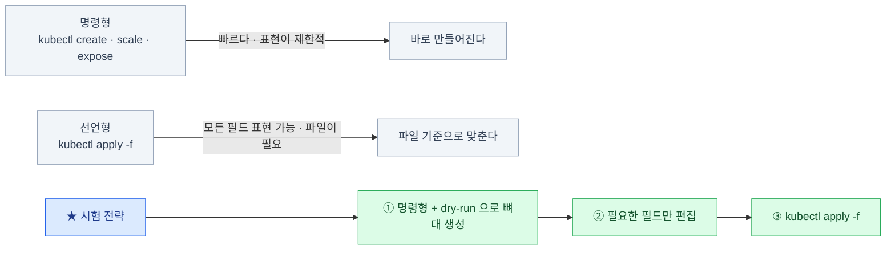
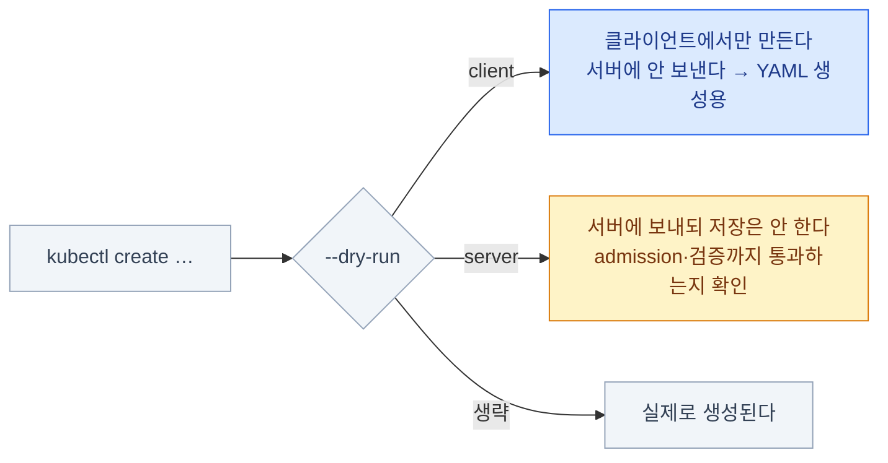
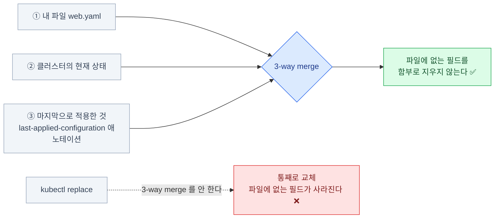
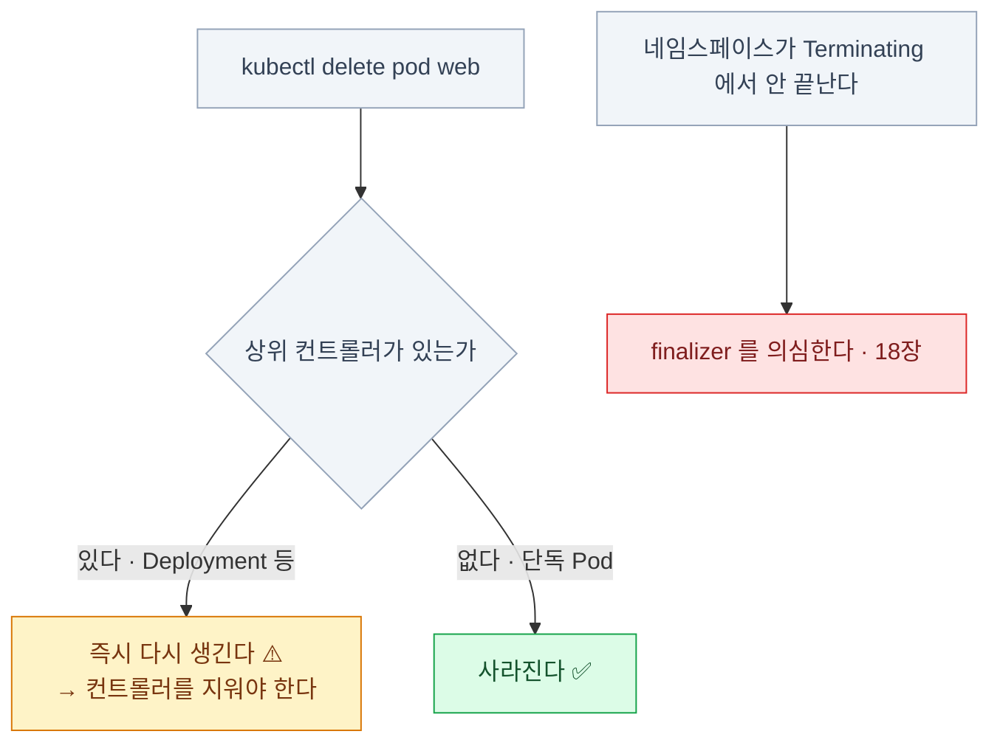
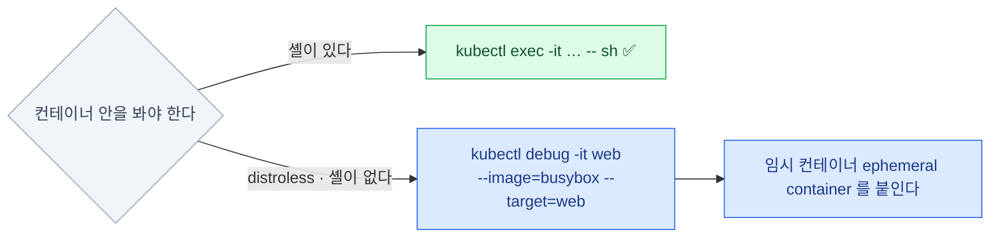

import { Steps, Card, CardGrid, Tabs, TabItem } from '@astrojs/starlight/components';

> 같은 결과를 30초 만에 만드는 법

## kubectl은 무엇인가

2장의 그림에서 모든 화살표는 API 서버를 향했다 — kubectl은 그중 **사람이 쏘는 화살표**다.
시험의 모든 조작이 이 클라이언트를 거치니, 이 장은 곧 손 속도를 버는 장이다.



- API 서버에 **HTTP 요청을 보내는 클라이언트**. 그 이상도 이하도 아니다
- 어디로, 누구로 보낼지는 **kubeconfig**가 정한다
- 기본 경로: **`~/.kube/config`**. `KUBECONFIG` 환경변수나 `--kubeconfig`로 바꾼다

```bash
kubectl get pods -v=6      # 실제로 어떤 URL을 호출하는지 보인다
# GET https://10.0.0.1:6443/api/v1/namespaces/default/pods?limit=500 200 OK
```

이걸 알면 "**권한이 없다**"거나 "**연결이 안 된다**"는 에러를
"어느 주소로 어떤 신원으로 갔는가"로 환원해서 볼 수 있다.

## kubeconfig와 컨텍스트

API 서버는 아무 요청이나 받지 않는다 — 2장에서 본 첫 관문(인증)을 통과해야 한다.
그렇다고 매 명령마다 서버 주소와 인증서를 플래그로 줄 수는 없으니,
"어디로 · 누구로"를 파일 하나에 묶어 둔다. 그게 kubeconfig다.

### kubeconfig 구조 — 세 덩어리 + 조합

```yaml
apiVersion: v1
kind: Config
clusters:                    # 어디로: 주소 + CA
  - name: prod
    cluster:
      server: https://10.0.0.1:6443
      certificate-authority: /etc/kubernetes/pki/ca.crt
users:                       # 누구로: 인증 정보
  - name: admin
    user:
      client-certificate: /etc/kubernetes/pki/admin.crt
      client-key: /etc/kubernetes/pki/admin.key
contexts:                    # 조합: cluster + user + namespace
  - name: prod-admin
    context:
      cluster: prod
      user: admin
      namespace: default
current-context: prod-admin  # 지금 쓰는 조합
```



**context = cluster + user + namespace.** 셋을 묶은 것이 컨텍스트다.

`certificate-authority`는 CA(Certificate Authority · 인증 기관) 인증서다 —
"이 API 서버가 진짜인가"를 클라이언트 쪽에서 검증하는 뿌리이고,
반대로 `client-certificate`는 서버에게 "나는 admin이다"를 증명한다. 인증서 체계 자체는 14장.

### 컨텍스트 다루기

```bash
kubectl config get-contexts                    # 목록 (*가 현재)
kubectl config current-context                 # 현재 이름만
kubectl config use-context prod-admin          # 전환
kubectl config set-context --current --namespace=dev   # 현재 컨텍스트의 ns 변경
kubectl config view                            # 전체 보기 (민감정보 마스킹)
kubectl config view --raw                      # 마스킹 없이
```

여러 kubeconfig를 합쳐 쓸 수도 있다.

```bash
KUBECONFIG=~/.kube/config:~/other.conf kubectl config view --flatten > merged.conf
```

합치는 문법까지 외울 필요는 없다 — "이런 것도 된다" 정도만 알아두면 된다.
시험에서는 kubeconfig가 이미 세팅된 채로 시작한다.

:::tip[시험]
문제마다 컨텍스트 전환 명령이 지문에 주어진다.
**무조건 복사해서 먼저 실행**하고, 불안하면 `kubectl config current-context`로 확인.
"몇 개의 컨텍스트가 있는가"를 파일에 쓰라는 문제도 실제로 나온다.
:::

## 조회와 출력

트러블슈팅은 **실제 상태(status)를 읽는 것**에서 시작한다 (커리큘럼의 30%가 여기다).
같은 `get`이라도 출력 형식을 바꾸면 보이는 정보가 달라지므로, 조회는
"**무엇을 보고 싶은가**"에 맞춰 형식을 고르는 일이다.

### 출력을 다루는 법

```bash
kubectl get pods                          # 기본
kubectl get pods -o wide                  # + IP, 노드, NOMINATED NODE
kubectl get pods -o yaml                  # 전체 오브젝트
kubectl get pods -o json
kubectl get pods --show-labels
kubectl get pods -A                       # 모든 네임스페이스
kubectl get pod,svc,deploy                # 여러 종류 한 번에
kubectl get all                           # 주요 워크로드 리소스 (전부는 아니다)
```

:::caution[함정]
`kubectl get all`은 이름과 달리 **전부가 아니다.**
ConfigMap, Secret, PV, PVC, Ingress, RBAC은 안 나온다. "다 지웠는데 남아 있다"의 원인.
:::

### 정렬과 필드 추출

시험은 "**보시오**"가 아니라 "**파일에 쓰시오**"로 묻는다 — 이름만, 이미지만, 정렬해서.
사람 눈으로 골라 옮겨 적으면 오타로 점수를 잃으니, 처음부터 필요한 값만 뽑는 형식을 쓴다.

```bash
kubectl get pods --sort-by=.metadata.creationTimestamp
kubectl get nodes --sort-by=.metadata.name
kubectl get events --sort-by=.lastTimestamp
```

<Tabs>
<TabItem label="jsonpath — 값만 뽑는다">

```bash
kubectl get pods -o jsonpath='{.items[*].metadata.name}'
kubectl get pods -o jsonpath='{range .items[*]}{.metadata.name}{"\t"}{.status.podIP}{"\n"}{end}'
kubectl get node node01 -o jsonpath='{.status.capacity.cpu}'
```

JSONPath는 `-o json`으로 받은 응답 안에서 **경로로 값을 지목하는 문법**이다.
`.items[*]`는 목록 전체, `{range}…{end}`는 그 목록을 한 줄씩 돌며 찍으라는 뜻이고,
`{"\t"}` · `{"\n"}` 같은 리터럴로 구분자를 직접 넣는다.

값 하나를 정확히 꺼낼 때. 다른 명령에 넘겨 쓰기 좋다.
`range`나 필터 문법이 기억나지 않으면 시험 중에는 공식 [JSONPath 문서](https://kubernetes.io/docs/reference/kubectl/jsonpath/)의 예시를 복사해 경로만 바꾸는 게 가장 빠르다.

</TabItem>
<TabItem label="custom-columns — 표로 뽑는다">

```bash
kubectl get pods -o custom-columns='NAME:.metadata.name,NODE:.spec.nodeName,IMAGE:.spec.containers[0].image'
kubectl get pods -o custom-columns='NAME:.metadata.name,IMAGE:.spec.containers[0].image' --no-headers
```

여러 열을 표로 뽑을 때. jsonpath보다 읽기 쉽다.

</TabItem>
</Tabs>

:::tip[시험]
"이미지 목록을 파일에 저장하시오" 류는 **custom-columns가 정답**이다.
헤더가 싫으면 `--no-headers`를 붙인다.
:::

### describe vs get -o yaml

<CardGrid>
<Card title="kubectl describe" icon="magnifier">
사람이 읽으라고 만든 **요약**.
**끝에 Events가 붙는다** ← 진단의 핵심.
관련 오브젝트 정보를 합쳐서 보여준다.
</Card>
<Card title="kubectl get -o yaml" icon="document">
API가 저장한 **원본 그대로**.
`status` 안의 정확한 값·조건을 본다.
**복사해서 새 오브젝트를 만들 때** 쓴다.
</Card>
</CardGrid>

```bash
kubectl describe pod web              # 왜 안 뜨는가 → Events를 읽는다
kubectl get pod web -o yaml           # 정확히 어떤 값이 들어갔는가
```

:::tip[시험]
고장난 것을 볼 때는 **거의 항상 `describe`가 먼저**다.
Events 한 줄에 답이 있는 경우가 대부분이다. (18장)
:::

## 리소스 만들기

만드는 것은 결국 **spec을 API 서버에 밀어 넣는 일**이다 (2장). 방법은 두 갈래인데,
시험에서 갈리는 것은 "무엇을 만드느냐"가 아니라 **몇 초 만에 만드느냐**다 —
그래서 두 방식의 장단을 알고 섞어 쓰는 것이 이 절의 목적이다.

### 명령형 vs 선언형 — 시험에서는 섞어 쓴다



:::tip[시험 전략]
**명령형으로 뼈대를 만들고, 필요한 것만 YAML로 뽑아 고친다.**
처음부터 빈 파일에 YAML을 치는 것은 **가장 느리고 가장 틀리기 쉬운** 방법이다.
:::

### 생성기(generator) — 시험의 핵심 무기

생성기는 `create`·`run`·`expose`가 **플래그 몇 개로 오브젝트 뼈대를 대신 써 주는 기능**이다.
손으로 YAML을 치면 20줄인 것이 한 줄이 된다. 지금의 `kubectl run`은 **Pod만** 만든다 —
Deployment가 필요하면 `kubectl create deploy`를 쓴다.

```bash
# Pod
kubectl run nginx --image=nginx
kubectl run nginx --image=nginx --port=80 --labels=app=web
kubectl run tmp --image=busybox --rm -it --restart=Never -- sh   # 일회용 디버그 셸

# Deployment
kubectl create deploy web --image=nginx --replicas=3

# Service
kubectl expose deploy web --port=80 --target-port=8080 --name=web-svc
kubectl create svc clusterip web-svc --tcp=80:8080

# 그 외
kubectl create ns dev
kubectl create cm app-config --from-literal=KEY=value --from-file=./conf/
kubectl create secret generic db --from-literal=password=s3cr3t
kubectl create sa deploy-bot
kubectl create job hello --image=busybox -- echo hi
kubectl create cronjob hello --image=busybox --schedule="*/1 * * * *" -- echo hi
kubectl create ingress web --rule="example.com/*=web-svc:80"
```

**이 목록을 손에 붙이는 것이 곧 시험 시간이다.** 19장에 전체 치트시트가 있다.
막히면 시험 중에도 열 수 있는 공식 [kubectl Quick Reference](https://kubernetes.io/docs/reference/kubectl/quick-reference/)에 같은 목록이 정리되어 있다.

### dry-run — 명령형으로 YAML을 뽑는다

생성기만으로는 표현할 수 없는 필드(볼륨, 프로브, tolerations…)가 많다.
그렇다고 빈 파일에서 시작할 필요는 없다 — **만들지 말고 YAML만 내놓으라**고 하면
생성기가 뼈대를 써 주고, 거기에 필요한 필드만 얹으면 된다. 그게 `--dry-run=client -o yaml`이다.

```bash
kubectl create deploy web --image=nginx --dry-run=client -o yaml > web.yaml
kubectl run nginx --image=nginx --dry-run=client -o yaml > pod.yaml
kubectl expose deploy web --port=80 --dry-run=client -o yaml > svc.yaml
```



:::tip[시험]
시작하자마자 이 두 줄을 만들자.

```bash
export do='--dry-run=client -o yaml'
export now='--force --grace-period=0'
kubectl run nginx --image=nginx $do > pod.yaml
```
:::

## 수정과 삭제

만드는 문제만큼 자주 나오는 것이 "**이미 있는 것을 고치시오**"다.
고치는 길이 넷이나 되는 이유는 각각 대가가 다르기 때문이다 —
빠르지만 표현이 제한적인 것부터, 느리지만 무엇이든 되는 것까지 순서대로 본다.

### 수정하는 네 가지 방법

<Steps>

1. **전용 서브커맨드** — 가장 빠르다

   ```bash
   kubectl scale deploy web --replicas=5
   kubectl set image deploy/web nginx=nginx:1.27
   kubectl set env deploy/web LOG_LEVEL=debug
   kubectl set resources deploy/web --limits=cpu=500m,memory=256Mi
   kubectl set serviceaccount deploy/web deploy-bot
   ```

2. **edit** — 에디터로 연다

   ```bash
   kubectl edit deploy web
   ```

3. **patch** — 한 필드만 정확히

   ```bash
   kubectl patch deploy web -p '{"spec":{"replicas":5}}'
   kubectl patch pod web --type=json -p='[{"op":"replace","path":"/spec/containers/0/image","value":"nginx:1.27"}]'
   ```

4. **apply / replace** — 파일 기준

   ```bash
   kubectl apply -f web.yaml
   kubectl replace -f web.yaml --force      # 지우고 다시 만든다
   ```

</Steps>

`patch`의 기본 형식은 **strategic merge**다 — 준 필드만 병합하고 나머지는 그대로 둔다.
`--type=json`은 `op`(연산)와 `path`(위치)로 지목하는 방식이라, 위 예처럼
**배열 원소 하나**(`/spec/containers/0/image`)를 정확히 바꿀 때 쓴다.
세 번째 형식인 `--type=merge`도 있지만 깊게 팔 필요는 없다 — 이름만 알아두자.

:::caution[함정]
Pod의 **대부분 필드는 수정할 수 없다.**
`image`, `tolerations`(추가), `activeDeadlineSeconds` 정도만 가능하고,
리소스(cpu·메모리)는 v1.35부터 **`--subresource=resize`로 제자리 수정**할 수 있다 (4장).
그 외를 고치려면 `--force`로 지우고 다시 만들어야 한다.
:::

### apply가 하는 일 — 3-way merge

같은 오브젝트를 파일과 명령형 조작이 번갈아 건드린다. 파일을 그대로 덮어쓰면
파일에 안 적힌 것(다른 도구가 넣은 필드)이 통째로 날아간다.
`apply`가 단순 덮어쓰기가 아닌 이유가 이것이다.



- `apply`는 **파일 / 클러스터의 현재 / 마지막으로 적용한 것** 셋을 비교한다
- 그래서 파일에 없는 필드를 **함부로 지우지 않는다** (다른 도구가 넣은 것을 보존)
- 마지막으로 적용한 내용은 애노테이션 `kubectl.kubernetes.io/last-applied-configuration` 에 저장

```bash
kubectl diff -f web.yaml        # 적용하면 무엇이 바뀌는지 미리 본다
```

병합을 클라이언트가 아니라 서버가 하는 `--server-side` 방식도 있다.
시험에서는 기본(클라이언트 쪽 3-way merge)으로 충분하다 — 이름만 알아두자.

:::caution[함정]
`create`로 만든 리소스에 `apply`를 하면
마지막 적용 기록이 없어서 경고가 뜬다. 시험에서는 무해하지만,
**`replace`는 3-way merge를 안 한다**는 것은 알아둘 것 — 파일에 없는 필드가 사라진다.
:::

### 삭제

```bash
kubectl delete pod web
kubectl delete -f web.yaml
kubectl delete pod -l app=web              # 라벨로
kubectl delete pods --all -n dev
kubectl delete pod web --force --grace-period=0   # 즉시 (graceful 생략)
kubectl delete deploy web --cascade=orphan        # 자식(Pod)을 남긴다
```



- 기본 삭제는 **graceful**이다 — `terminationGracePeriodSeconds`(기본 30초)를 기다린다
- 시험에서 Pod을 지우고 다시 만들 일이 많으니 `--force --grace-period=0`이 유용하다

:::caution[함정]
Deployment가 관리하는 Pod을 지우면 **즉시 다시 생긴다.**
"Pod을 지웠는데 계속 있다"면 상위 컨트롤러를 지워야 한다.
반대로 **네임스페이스가 `Terminating`에서 안 끝나면** finalizer(삭제 전 정리가 끝날 때까지 삭제를 막는 표식 — 18장)를 의심한다.
:::

## 진단 도구

여기부터는 **루프가 어디서 멈췄는지**를 알아내는 도구다 (0장의 축, 커리큘럼의 30%).
순서가 있다 — 이벤트는 "스케줄링·이미지·볼륨" 같은 **Pod이 뜨기까지의 실패**를,
로그는 "떴는데 앱이 죽는" **뜬 다음의 실패**를 보여준다. `exec`·`debug`는 그래도 모를 때 안으로 들어가는 것이다.

### 로그 — 커리큘럼의 "컨테이너 출력 스트림"

```bash
kubectl logs web
kubectl logs web -c sidecar                # 멀티 컨테이너면 -c 필수
kubectl logs web --previous                # 죽기 직전 컨테이너의 로그  ★
kubectl logs web -f                        # 따라가기
kubectl logs web --tail=50
kubectl logs web --since=10m
kubectl logs web --timestamps
kubectl logs -l app=web --all-containers --prefix     # 라벨로 여러 Pod 한 번에
kubectl logs deploy/web                    # 컨트롤러를 지정해도 된다
```

:::tip[시험]
**`--previous`가 CrashLoopBackOff 진단의 핵심**이다.
지금 컨테이너는 아직 시작 중이라 로그가 비어 있고, 죽은 이전 컨테이너에 이유가 있다.
:::

로그의 실체는 노드의 `/var/log/pods/<ns>_<pod>_<uid>/<container>/*.log` 다.
API 서버가 죽어 `kubectl logs`가 안 될 때 직접 읽는다.

### exec · cp · port-forward

셋 다 **컨테이너 안쪽에 손을 넣는** 명령이다 — 역할이 다르다.
`exec`는 이미 도는 컨테이너에서 명령을 실행하고, `cp`는 파일을 넣거나 꺼내고,
`port-forward`는 클러스터 안의 포트를 내 로컬 포트로 끌어온다.
`port-forward`는 Service를 만들지 않고도 앱에 붙어 볼 때 쓰지만, 시험에서는
클러스터 **안에서** 임시 Pod으로 확인하는 쪽이 더 흔하다 — 쓰임을 알아 두는 정도면 된다.

```bash
kubectl exec web -- ls /app
kubectl exec -it web -- sh                 # 대화형
kubectl exec -it web -c sidecar -- sh

kubectl cp ./local.txt web:/tmp/local.txt
kubectl cp web:/var/log/app.log ./app.log

kubectl port-forward pod/web 8080:80       # 로컬 8080 → Pod 80
kubectl port-forward svc/web-svc 8080:80
```

**임시 디버그 Pod** — 클러스터 안에서 네트워크를 확인할 때.

```bash
kubectl run tmp --image=busybox:1.36 --rm -it --restart=Never -- sh
# 안에서: wget -qO- http://web-svc.default.svc.cluster.local
#         nslookup web-svc
```



:::caution[함정]
배포용 이미지에는 `sh`조차 없는 경우가 많다(distroless).
그럴 땐 `kubectl debug -it web --image=busybox --target=web` 로
**임시 컨테이너**(ephemeral container)를 붙인다.
:::

임시 컨테이너는 **Pod을 다시 만들지 않고 나중에 끼워 넣는 컨테이너**다.
`--target=web`을 주면 대상 컨테이너와 프로세스 네임스페이스를 공유해 그쪽 프로세스까지 보인다.
한 번 붙인 것은 뗄 수 없고, Pod을 지우면 같이 사라진다.

### 이벤트 — 시간순으로 보는 클러스터의 일기

```bash
kubectl get events --sort-by=.lastTimestamp
kubectl get events -A --sort-by=.lastTimestamp | tail -30
kubectl get events --field-selector type=Warning
kubectl get events --field-selector involvedObject.name=web
kubectl events --for pod/web              # 새 전용 명령
```

이벤트도 **etcd에 저장되는 오브젝트다** — 스케줄러·kubelet·컨트롤러가 "무엇을 했는지,
왜 못 했는지"를 남긴 기록이다. 로그와 달리 컴포넌트를 가리지 않고 한 줄로 모이기 때문에
"Pod이 안 뜬다"류에서 가장 먼저 볼 곳이 된다.

- 이벤트는 **기본 1시간 후 사라진다.** 오래된 문제는 이벤트로 못 잡는다
  (무한정 쌓으면 etcd가 감당하지 못하니 수명을 짧게 둔다)
- `describe`의 아래쪽 Events 섹션이 사실 이것이다

:::tip[시험]
"왜 안 뜨는가" 문제는
**`describe` → Events** 또는 **`get events --sort-by`** 로 90%가 풀린다.
로그보다 이벤트가 먼저인 경우가 많다 (스케줄링·이미지·볼륨 문제는 로그에 안 나온다).
:::

## 3장 요약

- kubectl은 **kubeconfig로 결정된 주소·신원**으로 API를 호출하는 클라이언트다
- **context = cluster + user + namespace.** 시험은 컨텍스트 전환에서 갈린다
- **명령형으로 만들고 `--dry-run=client -o yaml`로 뽑아 고친다** — 이게 가장 빠르다
- 조회는 `-o wide` → `describe`(Events) → `-o yaml` 순으로 좁혀 간다
- **`--sort-by`, `custom-columns`, `jsonpath`** 는 "파일에 저장하시오" 문제 전용 무기
- **`logs --previous`** 와 **`get events --sort-by`** 는 진단의 두 기둥
- Pod은 대부분 필드를 못 고친다 → `--force`로 다시 만든다 (리소스만 `--subresource=resize` 예외)

:::note[손 연습]
이 장 범위의 KodeKloud 실습 풀이 — [CKA 실습 1장 · 기본 조작](/cka-udemy/01-basics/) (명령형 커맨드·JSONPath 포함)
:::
