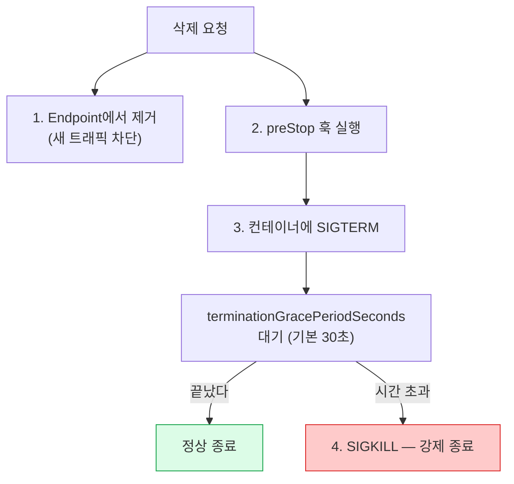

> 컨테이너가 아니라 Pod이 단위인 이유

## Pod이란 무엇인가

**같은 노드에서, 같은 네트워크와 볼륨을 공유하며,\

함께 뜨고 함께 죽는 컨테이너 묶음.**

- Kubernetes는 컨테이너를 직접 스케줄링하지 **않는다.** Pod을 스케줄링한다
- Pod 하나에 컨테이너 하나가 **대부분의 경우** 맞다
- 여러 개를 넣는 건 **"떼어놓을 수 없을 때"** 뿐이다

**Pod은 일회용이다.** 재시작되면 이름도 IP도 바뀐다.
그래서 Pod을 직접 만들지 않고 Deployment 같은 컨트롤러에 맡긴다 (5장).

## Pod 안에서 공유되는 것

**공유한다**

- **네트워크 네임스페이스** — 같은 IP, 같은 포트 공간
  → 서로를 `localhost`로 부른다
- **볼륨** — `spec.volumes`를 각 컨테이너가 마운트
- **IPC 네임스페이스** (기본)
- 수명 — 함께 스케줄되고 함께 정리된다

**공유하지 않는다**

- **파일시스템** — 컨테이너마다 별개
  (볼륨으로 명시적으로 공유해야 한다)
- **PID 네임스페이스** (기본은 분리, `shareProcessNamespace`로 켤 수 있다)
- 리소스 request/limit — 컨테이너별로 정한다

네트워크를 공유하니 **같은 Pod 안에서 포트가 겹치면 안 된다.**
두 컨테이너가 모두 8080을 열 수 없다.

## pause 컨테이너 — 보이지 않는 세 번째 컨테이너

- 모든 Pod에는 **`pause`(sandbox) 컨테이너**가 하나 더 있다
- 이것이 **네트워크 네임스페이스를 소유**하고, 다른 컨테이너들이 거기에 합류한다
- 그래서 앱 컨테이너가 재시작해도 **Pod IP가 유지**된다
- `kubectl get pods`에는 안 보이고, 노드에서 `crictl ps`로 보면 보인다

```bash
sudo crictl pods                 # Pod 샌드박스 = pause 컨테이너
```

이걸 알면 **"컨테이너는 죽었는데 Pod IP는 그대로"**가 자연스러워진다.
Pod IP가 바뀌는 것은 **Pod 자체가 새로 만들어질 때**다.

## Pod 매니페스트

```yaml
apiVersion: v1
kind: Pod
metadata:
  name: web
  labels:
    app: web
spec:
  containers:
    - name: nginx
      image: nginx:1.27
      ports:
        - containerPort: 80
      env:
        - name: LOG_LEVEL
          value: debug
      resources:
        requests: { cpu: 100m, memory: 128Mi }
        limits:   { cpu: 500m, memory: 256Mi }
      volumeMounts:
        - name: data
          mountPath: /usr/share/nginx/html
  volumes:
    - name: data
      emptyDir: {}
  restartPolicy: Always
```

## command와 args — Dockerfile과의 대응

```yaml
containers:
  - name: app
    image: busybox
    command: ["sh", "-c"]        # Dockerfile의 ENTRYPOINT 를 덮어쓴다
    args: ["echo hello; sleep 3600"]   # Dockerfile의 CMD 를 덮어쓴다
```

| Kubernetes | Dockerfile | 생략하면 |
|---|---|---|
| `command` | `ENTRYPOINT` | 이미지의 ENTRYPOINT 사용 |
| `args` | `CMD` | 이미지의 CMD 사용 |

:::caution[함정]
`command`만 덮어쓰면 이미지의 `CMD`가 인자로 그대로 붙는다.
의도치 않은 동작의 흔한 원인이다. 둘 다 덮어쓰거나, `command`에 전부 넣자.
:::

```bash
# 명령형으로 만들 때는 -- 뒤에 쓴다 (args로 들어간다)
kubectl run busy --image=busybox --restart=Never -- sleep 3600
kubectl run busy --image=busybox --restart=Never --command -- sleep 3600   # command로
```

## 멀티 컨테이너 패턴

| 패턴 | 하는 일 | 예 |
|---|---|---|
| **사이드카(sidecar)** | 주 컨테이너를 **보조**한다 | 로그 수집기, 서비스 메시 프록시 |
| **앰배서더(ambassador)** | 바깥과의 통신을 **대신**한다 | DB 프록시, 커넥션 풀 |
| **어댑터(adapter)** | 출력 형식을 **변환**한다 | 앱 로그를 Prometheus 형식으로 |

**함께 넣는 기준**

- 같은 노드에 있어야만 하는가?
- 같은 볼륨 / `localhost`를 써야 하는가?
- 수명이 같아야 하는가?

셋 다 "예"가 아니면 **별도 Pod으로 나누고 Service로 연결**하는 게 낫다.
같은 Pod에 넣으면 함께 스케일되고 함께 죽는다.

## initContainers — 앱보다 먼저 끝나야 하는 일

```yaml
spec:
  initContainers:
    - name: wait-for-db
      image: busybox:1.36
      command: ['sh', '-c', 'until nslookup db; do sleep 2; done']
  containers:
    - name: app
      image: myapp:1.0
```

- **순서대로 하나씩** 실행되고, **각각 성공(exit 0)해야** 다음으로 넘어간다
- 전부 끝나야 `containers`가 시작한다
- 실패하면 `restartPolicy`에 따라 **재시도**한다 (`Never`면 Pod이 실패)
- 상태 표시가 **`Init:0/2`**, **`Init:CrashLoopBackOff`** 처럼 나온다

:::tip[시험]
Pod이 `Init:` 로 시작하는 상태에 멈춰 있으면
**`kubectl logs <pod> -c <init컨테이너이름>`** 으로 봐야 한다.
`-c` 없이는 안 보인다.
:::

## 네이티브 사이드카 (Kubernetes v1.33 GA)

`initContainers`에 **`restartPolicy: Always`** 를 주면 사이드카가 된다.

```yaml
spec:
  initContainers:
    - name: log-shipper
      image: fluent-bit:3.0
      restartPolicy: Always       # ← 이 한 줄이 사이드카로 만든다
      volumeMounts:
        - name: logs
          mountPath: /var/log/app
  containers:
    - name: app
      image: myapp:1.0
```

- 일반 init 컨테이너와 달리 **끝나지 않고 계속 돈다**
- **앱 컨테이너보다 먼저 시작**하고 **나중에 종료**된다 — 순서가 보장된다
- **Job에서 특히 중요하다** — 예전에는 사이드카가 안 끝나서 Job이 완료되지 않았다

예전 방식(그냥 `containers`에 두 개)도 여전히 동작한다. 다만 순서 보장이 없다.

## Pod의 phase

```bash
kubectl get pod web -o jsonpath='{.status.phase}'
```

| phase | 의미 |
|---|---|
| **Pending** | 아직 스케줄되지 않았거나, 이미지를 받는 중 |
| **Running** | 노드에 배정되었고 컨테이너가 최소 하나 이상 살아 있다 |
| **Succeeded** | 모든 컨테이너가 성공 종료. 재시작하지 않는다 |
| **Failed** | 모든 컨테이너가 종료되었고 하나 이상이 실패 |
| **Unknown** | 노드와 통신이 안 되어 상태를 모른다 |

:::caution[함정]
`kubectl get pods`의 STATUS 열은 **phase가 아니다.**
`CrashLoopBackOff`, `ImagePullBackOff`, `Init:0/1`, `Terminating`은
컨테이너 상태나 reason을 합쳐 만든 **표시용 문자열**이다. phase로는 전부 `Pending`/`Running`이다.
:::

## 컨테이너 상태 — 진짜 정보는 여기 있다

```bash
kubectl get pod web -o jsonpath='{.status.containerStatuses[0].state}'
kubectl describe pod web        # 사람이 읽기엔 이쪽
```

컨테이너는 셋 중 하나다: **Waiting / Running / Terminated**. 각각 `reason`이 붙는다.

| reason | 뜻 | 볼 곳 |
|---|---|---|
| `ContainerCreating` | 볼륨 마운트·네트워크 설정 중 | Events |
| `ImagePullBackOff` / `ErrImagePull` | 이미지를 못 받는다 | Events (이름·태그·인증) |
| `CrashLoopBackOff` | 시작했다가 계속 죽는다 | **`logs --previous`** |
| `CreateContainerConfigError` | ConfigMap/Secret이 없다 | Events |
| `OOMKilled` | 메모리 limit 초과로 커널이 죽였다 | `describe` 의 Last State |
| `Error` | 0이 아닌 코드로 종료 | `logs` |

## restartPolicy

```yaml
spec:
  restartPolicy: Always     # Always(기본) | OnFailure | Never
```

| 값 | 재시작 조건 | 쓰는 곳 |
|---|---|---|
| `Always` | 종료 코드와 무관하게 항상 | Deployment/StatefulSet/DaemonSet의 Pod |
| `OnFailure` | 0이 아닌 코드로 끝났을 때만 | Job |
| `Never` | 재시작하지 않음 | 일회성 작업, 디버그 Pod |

- **Pod 단위 설정이다.** 컨테이너별로 다르게 줄 수 없다 (사이드카 예외 제외)
- **재시작은 같은 노드에서 컨테이너만 다시 만드는 것**이다. Pod이 옮겨가지 않는다
- Deployment의 Pod 템플릿에는 `Always`만 쓸 수 있다

:::tip[시험]
`kubectl run`의 기본은 `Always`다.
일회성 Pod을 만들 때 **`--restart=Never`** 를 빠뜨리면
Deployment처럼 계속 되살아나 헷갈린다.
:::

## CrashLoopBackOff의 정체

- **에러 이름이 아니다.** "재시작을 지연시키고 있다"는 **상태**다
- 컨테이너가 죽으면 kubelet이 다시 띄우는데, 계속 죽으면 **간격을 지수적으로 늘린다**
- 10초 → 20초 → 40초 → … → **최대 5분**
- 10분간 정상이면 카운터가 초기화된다

**진단 순서**

```bash
kubectl describe pod web              # Last State / Exit Code / Reason 확인
kubectl logs web --previous           # ★ 죽기 직전 로그
kubectl get pod web -o yaml           # 정확한 exitCode
```

| Exit Code | 대개의 원인 |
|---|---|
| `0` | 정상 종료인데 `restartPolicy: Always` — 명령이 바로 끝난다 |
| `1` / `2` | 애플리케이션 에러. 로그를 보라 |
| `137` | SIGKILL — **OOMKilled** 이거나 강제 종료 |
| `143` | SIGTERM — 정상적인 종료 신호를 받았다 |

## 프로브(probe) — kubelet이 던지는 질문

**livenessProbe**

"살아 있나?"

실패 → **컨테이너 재시작**

행(hang)에 걸린 앱을 구제한다

**readinessProbe**

"요청을 받을 준비가 됐나?"

실패 → **Service 엔드포인트에서 제외**

재시작하지 않는다

**startupProbe**

"기동이 끝났나?"

성공할 때까지 **다른 두 프로브를 멈춘다**

느리게 뜨는 앱용

**가장 중요한 구분:** liveness는 **죽이고**, readiness는 **트래픽만 끊는다.**

:::caution[함정]
기동이 느린 앱에 liveness만 걸면
**영원히 재시작 루프**에 빠진다. 뜨기 전에 죽이기 때문이다.
해결은 `startupProbe` 또는 `initialDelaySeconds`.
:::

## 프로브의 네 가지 방식

```yaml
livenessProbe:
  httpGet:                       # 2xx~3xx면 성공
    path: /healthz
    port: 8080
    httpHeaders:
      - name: Custom-Header
        value: check
  initialDelaySeconds: 10
  periodSeconds: 10
  timeoutSeconds: 1
  failureThreshold: 3
  successThreshold: 1

readinessProbe:
  exec:                          # 종료 코드 0이면 성공
    command: ["cat", "/tmp/ready"]

startupProbe:
  tcpSocket:                     # 연결이 되면 성공
    port: 8080
  failureThreshold: 30
  periodSeconds: 10              # 최대 300초까지 기다린다
```

`grpc:` 방식도 있다 (`port` + `service`). gRPC 헬스체크 규약을 쓰는 앱용.

## 프로브 파라미터 읽는 법

| 필드 | 기본값 | 의미 |
|---|---|---|
| `initialDelaySeconds` | 0 | 컨테이너 시작 후 첫 검사까지 대기 |
| `periodSeconds` | 10 | 검사 주기 |
| `timeoutSeconds` | 1 | 응답 대기 시간 |
| `failureThreshold` | 3 | 몇 번 연속 실패해야 실패로 볼 것인가 |
| `successThreshold` | 1 | 몇 번 연속 성공해야 복귀할 것인가 (liveness는 1 고정) |

**실제 반응 시간 = `initialDelaySeconds` + `periodSeconds` × `failureThreshold`**

기본값이면 컨테이너가 죽고 나서 **최대 30초 뒤에** 재시작이 걸린다.

:::tip[시험]
"Pod이 준비되지 않는다" 문제에서
**`describe`의 Events에 `Readiness probe failed:`** 가 찍혀 있다.
경로·포트 오타가 대부분이고, 정답은 `kubectl edit`으로 고치는 것이다.
:::

## 종료 흐름 — Pod이 죽을 때 벌어지는 일



**1번과 2번은 동시에 시작한다.** 그래서 엔드포인트 제거가 전파되기 전에
SIGTERM이 도착할 수 있다 — `preStop`에 `sleep 5` 를 넣는 관행이 여기서 나온다.

## lifecycle 훅

```yaml
containers:
  - name: app
    image: myapp:1.0
    lifecycle:
      postStart:
        exec:
          command: ["sh", "-c", "echo started > /tmp/status"]
      preStop:
        exec:
          command: ["sh", "-c", "sleep 5; nginx -s quit"]
spec:
  terminationGracePeriodSeconds: 60
```

- `postStart` — 컨테이너 시작과 **동시에** 실행된다 (ENTRYPOINT보다 먼저라는 보장은 없다)
- `preStop` — SIGTERM **전에** 실행된다. 여기서 시간을 쓰면 grace period에서 차감된다
- 훅이 실패하면 컨테이너가 죽는다

:::caution[함정]
`preStop`이 grace period보다 오래 걸리면
**훅이 끝나기 전에 SIGKILL**이 온다. 둘의 합을 계산해서 설정해야 한다.
:::

## 환경변수 — 값을 넣는 여러 경로

```yaml
env:
  - name: LOG_LEVEL                      # 직접
    value: "debug"

  - name: MY_NODE                        # Downward API — Pod 자신의 정보
    valueFrom:
      fieldRef:
        fieldPath: spec.nodeName         # status.podIP, metadata.name 등도 가능

  - name: CPU_LIMIT                      # 자기 리소스 값
    valueFrom:
      resourceFieldRef:
        containerName: app
        resource: limits.cpu

  - name: DB_PASSWORD                    # Secret에서 (6장)
    valueFrom:
      secretKeyRef:
        name: db-secret
        key: password
```

`envFrom:` 을 쓰면 ConfigMap/Secret의 **모든 키를 한 번에** 환경변수로 넣을 수 있다 (6장).

## securityContext

```yaml
spec:
  securityContext:              # Pod 수준 — 모든 컨테이너에 적용
    runAsUser: 1000
    runAsGroup: 3000
    fsGroup: 2000               # 볼륨의 그룹 소유권
  containers:
    - name: app
      image: myapp:1.0
      securityContext:          # 컨테이너 수준 — Pod 설정을 덮어쓴다
        runAsNonRoot: true
        allowPrivilegeEscalation: false
        readOnlyRootFilesystem: true
        capabilities:
          add: ["NET_ADMIN"]
          drop: ["ALL"]
```

- **컨테이너 수준이 Pod 수준을 이긴다**
- `capabilities`는 **컨테이너 수준에만** 있다
- `fsGroup`은 **Pod 수준에만** 있다

:::tip[시험]
"UID 1000으로 실행되게 하시오", "NET_ADMIN을 주시오" 정도가 나온다.
어느 수준에 쓰는지만 헷갈리지 않으면 된다.
:::

## 스태틱 Pod 만들기 — 시험 단골

```bash
# 1) 어느 디렉터리를 보는지 확인
sudo grep staticPodPath /var/lib/kubelet/config.yaml

# 2) 그 디렉터리에 YAML을 놓는다 — 그게 전부다
sudo kubectl run web --image=nginx --dry-run=client -o yaml \
  | sudo tee /etc/kubernetes/manifests/web.yaml

# 3) 잠시 후 확인 — 이름 뒤에 노드 이름이 붙는다
kubectl get pods
# web-node01   1/1   Running
```

- **삭제하려면 파일을 지운다.** `kubectl delete pod`는 소용없다
- kubelet이 디렉터리를 계속 지켜보므로 **재시작도 필요 없다**
- 다른 노드에 만들라고 하면 **그 노드에 `ssh`로 들어가서** 만들어야 한다

:::caution[함정]
파일에 `namespace`를 안 쓰면 `default`에 만들어진다.
문제가 특정 네임스페이스를 요구하면 **YAML 안에 `metadata.namespace`를 직접** 써야 한다.
:::

## 리소스 in-place 변경 (Kubernetes v1.35 GA)

이제 Pod을 다시 만들지 않고 CPU·메모리를 바꿀 수 있다.

```yaml
containers:
  - name: app
    resizePolicy:
      - resourceName: cpu
        restartPolicy: NotRequired        # 재시작 없이 적용 (기본)
      - resourceName: memory
        restartPolicy: RestartContainer   # 컨테이너를 다시 시작해서 적용
```

```bash
kubectl patch pod web --subresource=resize \
  -p '{"spec":{"containers":[{"name":"app","resources":{"requests":{"cpu":"200m"}}}]}}'
```

- **CPU와 메모리만** 가능하다. init/ephemeral 컨테이너는 안 된다
- **QoS 클래스는 바뀔 수 없다** (6장)
- `status.containerStatuses[*].resources` 에 **실제 적용된 값**이 보인다

## 4장 요약

- Pod = **네트워크·볼륨·수명을 공유하는 컨테이너 묶음**. 스케줄링 단위다
- `pause` 컨테이너가 네트워크 네임스페이스를 쥐고 있어 **컨테이너가 죽어도 IP가 유지**된다
- initContainers는 **순서대로, 성공해야** 다음. `restartPolicy: Always`를 주면 **사이드카**(v1.33 GA)
- STATUS 열은 phase가 아니다 — **컨테이너 상태 + reason**이 진짜 정보
- **liveness는 죽이고, readiness는 트래픽만 끊는다.** 느린 앱엔 startupProbe
- 종료는 **엔드포인트 제거 + preStop → SIGTERM → grace → SIGKILL**
- `CrashLoopBackOff`는 에러가 아니라 **지연 중**이라는 뜻 → `logs --previous`
- 스태틱 Pod은 **파일을 놓으면 생기고, 지우면 사라진다**
