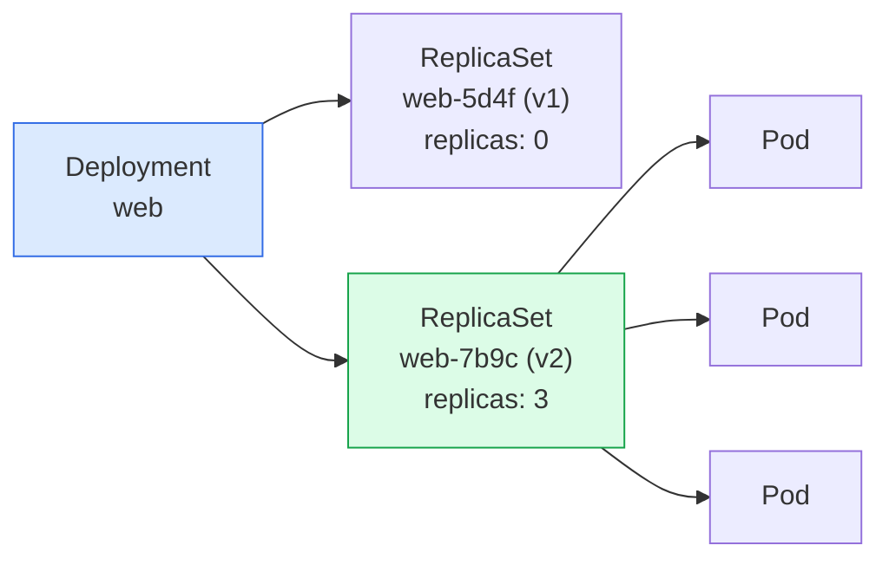

> Pod을 직접 만들지 않는 이유

## 컨트롤러가 필요한 이유

Pod을 직접 만들면 —

- 노드가 죽으면 **그걸로 끝이다.** 아무도 다시 만들어주지 않는다
- 개수를 늘리려면 이름을 바꿔가며 **손으로 복사**해야 한다
- 이미지를 바꾸려면 **전부 지우고 다시** 만들어야 한다

컨트롤러는 **"몇 개가 어떤 모습으로 있어야 하는가"**를 선언받고,
그 상태를 **계속 유지**한다. 이것이 자가치유(self-healing)의 실체다.

:::tip[시험]
커리큘럼의 "자가치유 배포의 기본 요소(primitives)"가 이 장 전체다.
Deployment / DaemonSet / StatefulSet / Job 을 **언제 쓰는지**가 핵심.
:::

## 어떤 컨트롤러를 쓸 것인가

| 필요한 것 | 컨트롤러 |
|---|---|
| 상태 없는 앱을 N개 | **Deployment** |
| 모든(또는 일부) 노드에 하나씩 | **DaemonSet** |
| 고유한 이름·저장소·순서가 필요한 앱 | **StatefulSet** |
| 한 번 실행하고 끝나는 작업 | **Job** |
| 일정에 따라 반복되는 작업 | **CronJob** |
| Pod 개수만 유지 (직접 쓸 일은 거의 없다) | ReplicaSet |

**기본은 Deployment다.** 나머지는 "왜 Deployment로는 안 되는가"에 답이 있을 때 쓴다.

:::caution[함정]
"DB니까 StatefulSet"이 항상 맞지는 않다.
기준은 **"각 인스턴스가 고유한 신원과 저장소를 가져야 하는가"**다.
단일 인스턴스 DB라면 Deployment + PVC로도 충분하다.
:::

## ReplicaSet — 개수를 맞추는 루프

```yaml
apiVersion: apps/v1
kind: ReplicaSet
metadata:
  name: web-rs
spec:
  replicas: 3
  selector:                       # 어떤 Pod을 내 것으로 볼 것인가
    matchLabels:
      app: web
  template:                       # 부족하면 이 틀로 만든다
    metadata:
      labels:
        app: web                  # selector와 반드시 일치해야 한다
    spec:
      containers:
        - name: nginx
          image: nginx:1.27
```

- 루프: **셀렉터에 맞는 Pod 개수를 센다 → 부족하면 만들고, 많으면 지운다**
- **셀렉터와 템플릿 라벨이 다르면 생성 시 거부**된다 (무한 생성 방지)

## ReplicaSet의 무서운 성질

- ReplicaSet은 **셀렉터에 맞는 Pod을 자기 것으로 "입양"한다**
- 이미 있던 Pod에 라벨이 맞으면 **개수에 포함**시킨다 — 새로 안 만든다
- 반대로 관리 중인 Pod의 **라벨을 바꿔버리면** 관리에서 벗어나고, ReplicaSet은 **새 Pod을 만든다**

```bash
# 관리에서 떼어내 디버깅하는 기법
kubectl label pod web-abc-123 app=web-debug --overwrite
# → ReplicaSet은 부족분을 새로 채우고, 이 Pod은 그대로 남아 조사할 수 있다
```

:::tip[시험]
"ReplicaSet이 Pod을 안 만든다" 문제의 단골 원인은
**`selector.matchLabels`와 `template.metadata.labels` 불일치**다.
`describe`보다 `get rs -o yaml`로 두 값을 눈으로 비교하는 게 빠르다.
:::

## Deployment — ReplicaSet 위의 롤아웃 관리자



- 템플릿을 바꾸면 **새 ReplicaSet을 만들고**, 옛 것을 0으로 줄이며 새 것을 올린다
- **옛 ReplicaSet은 지워지지 않는다** (0개로 남는다) — 이것이 롤백의 재료다
- ReplicaSet 이름의 해시는 **Pod 템플릿의 해시**다. 템플릿이 같으면 새로 안 만든다

## Deployment 만들기

```bash
kubectl create deploy web --image=nginx:1.27 --replicas=3 --dry-run=client -o yaml > web.yaml
```

```yaml
apiVersion: apps/v1
kind: Deployment
metadata:
  name: web
spec:
  replicas: 3
  revisionHistoryLimit: 10        # 보관할 옛 ReplicaSet 개수 (기본 10)
  selector:
    matchLabels:
      app: web
  strategy:
    type: RollingUpdate           # RollingUpdate(기본) | Recreate
    rollingUpdate:
      maxSurge: 25%               # 목표보다 몇 개 더 만들 수 있나
      maxUnavailable: 25%         # 몇 개까지 없어도 되나
  template:
    metadata:
      labels:
        app: web
    spec:
      containers:
        - name: nginx
          image: nginx:1.27
```

## 롤링 업데이트의 두 손잡이

**`maxSurge`**

목표 개수보다 **더 만들 수 있는 수**

- 크면 빠르지만 자원을 더 쓴다
- `0`이면 절대 초과하지 않는다

**`maxUnavailable`**

**없어도 되는 수**

- `0`이면 용량이 절대 줄지 않는다
- 크면 빠르지만 순간 용량이 준다

`replicas: 4`, `maxSurge: 1`, `maxUnavailable: 1` 이면 → 살아 있는 Pod은 **3~5개** 사이를 오간다.

:::caution[함정]
**둘 다 0으로 두면 롤아웃이 시작조차 안 된다.**
새로 만들 수도(surge 0), 지울 수도(unavailable 0) 없기 때문이다. API가 이를 거부한다.
:::

**`Recreate`** — 전부 죽이고 전부 새로 만든다. 다운타임이 있지만
**RWO 볼륨을 공유하거나 버전 공존이 불가능할 때** 필요하다.

## 롤아웃 다루기

```bash
kubectl set image deploy/web nginx=nginx:1.28
kubectl rollout status deploy/web            # 완료될 때까지 지켜본다
kubectl rollout history deploy/web
kubectl rollout history deploy/web --revision=2
kubectl rollout undo deploy/web              # 직전으로
kubectl rollout undo deploy/web --to-revision=2
kubectl rollout restart deploy/web           # 템플릿 변경 없이 전부 재생성
kubectl rollout pause deploy/web
kubectl rollout resume deploy/web
```

- **`rollout restart`** 는 템플릿에 타임스탬프 애노테이션을 넣어 롤아웃을 유발한다
  → ConfigMap을 바꾼 뒤 반영하는 표준 방법이다
- **`pause`** 는 여러 변경을 모아서 한 번에 롤아웃할 때 쓴다

:::tip[시험]
"이미지를 바꾸고 롤아웃이 끝난 것을 확인하시오"는
`set image` → `rollout status` 두 줄이다. 검산도 겸한다.
:::

## 리비전과 change-cause

```bash
kubectl rollout history deploy/web
# REVISION  CHANGE-CAUSE
# 1         <none>
# 2         nginx 1.28로 업그레이드
```

`CHANGE-CAUSE`는 애노테이션 `kubernetes.io/change-cause` 를 읽은 것이다.

```bash
kubectl annotate deploy/web kubernetes.io/change-cause="nginx 1.28로 업그레이드"
```

:::caution[함정]
`undo`는 **리비전 번호를 새로 부여**한다.
리비전 3에서 2로 롤백하면 그 내용이 **리비전 4**가 된다. 2로 "돌아가는" 게 아니다.
:::

`revisionHistoryLimit`을 0으로 두면 **롤백이 불가능**해진다. 기본 10을 그대로 두자.

## 스케일링

```bash
kubectl scale deploy web --replicas=5
kubectl scale deploy web --replicas=5 --current-replicas=3   # 조건부
kubectl scale --replicas=5 -f web.yaml
kubectl scale statefulset db --replicas=3
```

- `replicas: 0` 도 유효하다 — **삭제하지 않고 멈추는** 방법
- HPA가 붙어 있으면 **수동 스케일은 곧 되돌려진다** (8장)

```bash
# 롤아웃/스케일이 끝날 때까지 기다리기 — 검산에 유용
kubectl wait --for=condition=available deploy/web --timeout=60s
kubectl wait --for=condition=ready pod -l app=web --timeout=60s
```

:::tip[시험]
`kubectl wait`는 "다 떴는지" 확인에 좋다.
그냥 `get pods`를 반복해서 치는 것보다 확실하고 빠르다.
:::

## DaemonSet — 노드마다 하나씩

```yaml
apiVersion: apps/v1
kind: DaemonSet
metadata:
  name: log-agent
spec:
  selector:
    matchLabels:
      app: log-agent
  template:
    metadata:
      labels:
        app: log-agent
    spec:
      tolerations:                      # 컨트롤 플레인에도 놓으려면 필요
        - key: node-role.kubernetes.io/control-plane
          operator: Exists
          effect: NoSchedule
      containers:
        - name: agent
          image: fluent-bit:3.0
```

- **`replicas`가 없다.** 개수는 노드 수가 정한다
- 노드가 추가되면 **자동으로 하나 더** 생긴다
- 쓰임: 로그 수집기, 모니터링 에이전트, **kube-proxy**, **CNI 플러그인**

## DaemonSet의 배치 제어

```bash
kubectl get ds -A                       # kube-proxy, CNI가 보인다
kubectl rollout status ds/log-agent
```

- 특정 노드에만 놓으려면 **`nodeSelector`** 나 **`affinity`** 를 쓴다
- **taint가 걸린 노드에는 안 뜬다** — `tolerations`가 필요하다 (7장)
- 업데이트 전략은 `RollingUpdate`(기본) / `OnDelete`

:::caution[함정]
DaemonSet Pod이 **일부 노드에만 없다**면
십중팔구 **그 노드의 taint**다. `kubectl describe node`로 Taints를 확인하고
DaemonSet에 toleration을 추가한다. 컨트롤 플레인 노드가 특히 그렇다.
:::

DaemonSet Pod은 기본 스케줄러가 배치하지만,
노드 리소스 부족 등의 이유로 `Pending`이 될 수 있다.

## StatefulSet — 신원이 있는 Pod

```yaml
apiVersion: apps/v1
kind: StatefulSet
metadata: { name: db }
spec:
  serviceName: db-headless          # 반드시 headless Service를 가리킨다
  replicas: 3
  selector: { matchLabels: { app: db } }
  template:
    metadata:
      labels: { app: db }
    spec:
      containers:
        - name: postgres
          image: postgres:17
          volumeMounts:
            - name: data
              mountPath: /var/lib/postgresql/data
  volumeClaimTemplates:             # Pod마다 PVC를 하나씩 만든다
    - metadata: { name: data }
      spec:
        accessModes: ["ReadWriteOnce"]
        storageClassName: standard
        resources: { requests: { storage: 10Gi } }
```

## StatefulSet이 주는 세 가지 보장

**1. 안정적인 이름** — `db-0`, `db-1`, `db-2`. 재시작해도 **이름이 그대로**다

**2. 안정적인 저장소** — `data-db-0`, `data-db-1` … PVC가 Pod 이름에 묶인다.
`db-0`이 죽었다 살아나면 **같은 PVC를 다시 붙인다**

**3. 순서 보장** — 생성은 `0 → 1 → 2`, 삭제는 `2 → 1 → 0`.
앞 Pod이 Ready가 되어야 다음이 시작한다

```bash
kubectl get pvc
# data-db-0   Bound   pvc-xxx   10Gi   RWO
# data-db-1   Bound   pvc-yyy   10Gi   RWO
```

:::caution[함정]
**StatefulSet을 지워도 PVC는 남는다.** 의도된 동작이다(데이터 보호).
같은 이름으로 다시 만들면 옛 데이터를 그대로 붙인다. 지우려면 PVC를 직접 삭제해야 한다.
:::

## headless Service와 안정적인 DNS

```yaml
apiVersion: v1
kind: Service
metadata:
  name: db-headless
spec:
  clusterIP: None            # ← headless
  selector:
    app: db
  ports:
    - port: 5432
```

`clusterIP: None`이면 Service IP를 만들지 않고 **DNS가 Pod IP들을 직접 반환**한다.

```
db-0.db-headless.default.svc.cluster.local  → 10.244.1.5
db-1.db-headless.default.svc.cluster.local  → 10.244.2.7
```

그래서 **"1번 레플리카에만 연결"** 같은 것이 가능하다.
DB 복제에서 primary/replica를 구분해 붙일 때 이 이름을 쓴다.

:::caution[함정]
`serviceName`에 적은 Service가 **실제로 없어도 StatefulSet은 뜬다.**
다만 **Pod별 DNS 이름이 안 생긴다.** 조용히 실패하는 유형이라 주의.
:::

## StatefulSet 업데이트와 스케일

```yaml
spec:
  updateStrategy:
    type: RollingUpdate
    rollingUpdate:
      partition: 2         # 인덱스 2 이상만 업데이트 (카나리)
  podManagementPolicy: OrderedReady   # OrderedReady(기본) | Parallel
```

- 업데이트는 **큰 번호부터 역순**으로 진행된다 (`2 → 1 → 0`)
- `partition: N` 이면 **N 이상 인덱스만** 바뀐다 — 단계적 배포에 쓴다
- `podManagementPolicy: Parallel` 이면 **순서 없이 동시에** 생성/삭제 (기동이 빠르다)

```bash
kubectl scale sts db --replicas=5      # 3 → 5: db-3, db-4가 순서대로 추가
kubectl scale sts db --replicas=2      # 5 → 2: db-4, db-3, db-2가 역순으로 삭제
```

축소해도 **PVC는 남는다.** 다시 늘리면 옛 데이터로 복귀한다.

## Job — 끝나는 작업

```yaml
apiVersion: batch/v1
kind: Job
metadata:
  name: import
spec:
  completions: 5              # 총 몇 번 성공해야 하는가
  parallelism: 2              # 동시에 몇 개까지
  backoffLimit: 4             # 실패 재시도 횟수 (기본 6)
  activeDeadlineSeconds: 300  # 전체 제한 시간 — 넘으면 중단
  ttlSecondsAfterFinished: 100  # 끝나고 100초 뒤 Job과 Pod을 자동 삭제
  template:
    spec:
      restartPolicy: OnFailure   # Never 또는 OnFailure만 가능
      containers:
        - name: worker
          image: busybox:1.36
          command: ["sh", "-c", "echo processing; sleep 5"]
```

```bash
kubectl create job import --image=busybox -- echo hi
kubectl create job manual --from=cronjob/nightly     # CronJob을 즉시 한 번 실행
```

## Job 파라미터가 실제로 뜻하는 것

| 조합 | 결과 |
|---|---|
| `completions` 없음 | Pod 하나가 성공하면 끝 |
| `completions: 5`, `parallelism: 1` | 순차로 5번 |
| `completions: 5`, `parallelism: 5` | 5개 동시에 |
| `parallelism` 만 설정 | 워커 큐 방식 — 하나가 성공하면 전체 완료 |

**`completionMode: Indexed`** 를 쓰면 각 Pod에 **인덱스(0, 1, 2 …)** 가 붙는다.
`JOB_COMPLETION_INDEX` 환경변수와 Pod 이름 접미사로 들어온다 — 데이터를 나눠 처리할 때 쓴다.

:::caution[함정]
Job의 Pod 템플릿에 `restartPolicy: Always`는 **쓸 수 없다.**
안 쓰면 기본값이 `Always`라 **생성 자체가 거부**된다.
`--dry-run`으로 뽑은 YAML을 고칠 때 자주 걸린다.
:::

## CronJob — 일정에 따라 Job을 만든다

```yaml
apiVersion: batch/v1
kind: CronJob
metadata:
  name: nightly
spec:
  schedule: "0 3 * * *"              # 분 시 일 월 요일
  timeZone: "Asia/Seoul"             # 없으면 컨트롤러의 시간대(보통 UTC)
  concurrencyPolicy: Forbid          # Allow(기본) | Forbid | Replace
  startingDeadlineSeconds: 120       # 이 시간 안에 못 시작하면 건너뛴다
  successfulJobsHistoryLimit: 3
  failedJobsHistoryLimit: 1
  suspend: false                     # true면 새 Job을 만들지 않는다
  jobTemplate:
    spec:
      template:
        spec:
          restartPolicy: OnFailure
          containers:
            - name: backup
              image: busybox:1.36
              command: ["sh", "-c", "echo backup"]
```

```bash
kubectl create cronjob nightly --image=busybox --schedule="0 3 * * *" -- echo backup
kubectl patch cronjob nightly -p '{"spec":{"suspend":true}}'
```

## CronJob에서 헷갈리는 것들

- **시간대 기본은 UTC**다 (컨트롤러 매니저 기준). `timeZone` 필드로 명시하는 게 안전하다
- `concurrencyPolicy`
  - `Allow` — 겹쳐도 그냥 실행 (기본)
  - `Forbid` — 이전 Job이 안 끝났으면 **건너뛴다**
  - `Replace` — 이전 것을 **죽이고** 새로 시작
- CronJob → Job → Pod 의 **3단 소유 사슬**이다. Pod을 찾으려면 두 단계를 내려가야 한다

```bash
kubectl get cronjob nightly
kubectl get jobs --selector=job-name        # CronJob이 만든 Job들
kubectl logs job/nightly-28901234
```

:::tip[시험]
cron 표현식은 **분 시 일 월 요일** 순서다.
`*/5 * * * *` = 5분마다, `0 3 * * *` = 매일 새벽 3시.
헷갈리면 `kubernetes.io/docs`의 CronJob 페이지에 표가 있다.
:::

## PodDisruptionBudget — 자발적 중단으로부터 보호

```yaml
apiVersion: policy/v1
kind: PodDisruptionBudget
metadata:
  name: web-pdb
spec:
  minAvailable: 2          # 또는 maxUnavailable: 1
  selector:
    matchLabels:
      app: web
```

- **`kubectl drain`이나 노드 업그레이드 같은 "자발적 중단"에서** 최소 가용 수를 지킨다
- 노드 장애 같은 **비자발적 중단은 막지 못한다**
- PDB가 막으면 `drain`이 **멈춰서 기다린다**

:::caution[함정]
`replicas: 1` 인데 `minAvailable: 1` 이면
**`drain`이 영원히 진행되지 않는다.** 실무·시험 모두에서 걸리는 교착 상태다.
`kubectl get pdb`의 `ALLOWED DISRUPTIONS`가 0이면 이 상황이다. (15장)
:::

## 자가치유는 어디까지 되나

| 상황 | 결과 |
|---|---|
| 컨테이너가 죽었다 | kubelet이 **같은 노드에서** 재시작 |
| Pod이 삭제됐다 | ReplicaSet이 **새 Pod을 만든다** (이름·IP가 바뀐다) |
| 노드가 `NotReady`가 됐다 | 약 5분 후 Pod을 축출하고 **다른 노드에** 새로 만든다 |
| 노드가 영구히 죽었다 | 위와 같다. 단 **StatefulSet은 자동으로 안 옮긴다** |
| 앱이 살아 있는데 응답을 안 한다 | **livenessProbe가 없으면 아무 일도 안 일어난다** |

마지막 줄이 중요하다. **Kubernetes는 "프로세스가 살아 있는가"만 본다.**
"제대로 동작하는가"는 프로브를 통해 **당신이 알려줘야** 한다.

## 5장 요약

- **Deployment → ReplicaSet → Pod.** 옛 ReplicaSet이 남아 있는 것이 롤백의 재료다
- 롤링 업데이트는 **`maxSurge` / `maxUnavailable`** 두 손잡이. 둘 다 0이면 멈춘다
- `rollout undo`는 되돌아가는 게 아니라 **새 리비전을 만든다**
- **DaemonSet은 노드마다 하나.** 안 뜨면 십중팔구 **taint**
- **StatefulSet은 이름·저장소·순서**를 보장한다. **삭제해도 PVC는 남는다**
- **Job의 restartPolicy는 `Never`/`OnFailure`만** — 기본값 그대로 두면 거부된다
- CronJob은 **UTC 기본**, `concurrencyPolicy`로 겹침을 제어
- **PDB는 자발적 중단만 막는다.** `replicas: 1` + `minAvailable: 1` = drain 교착
