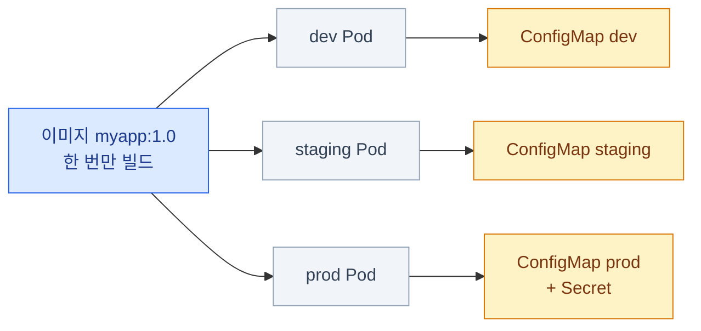
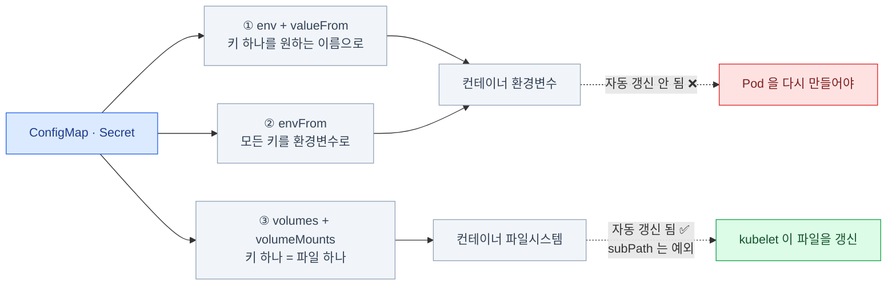
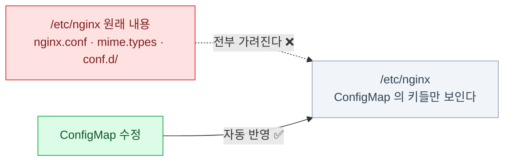
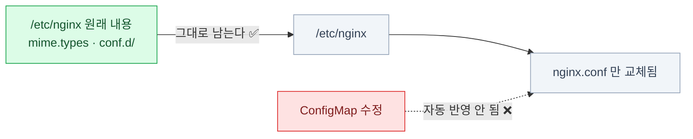
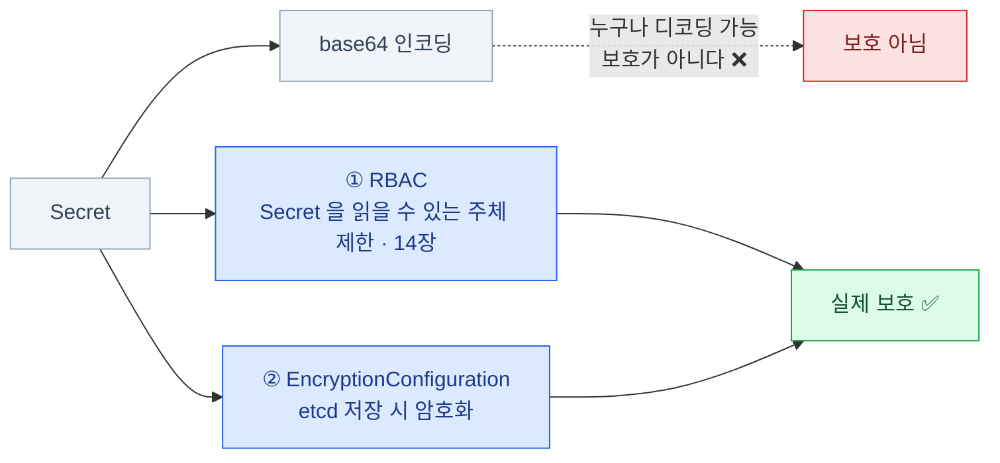
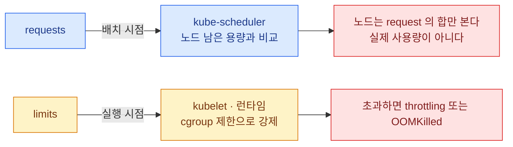
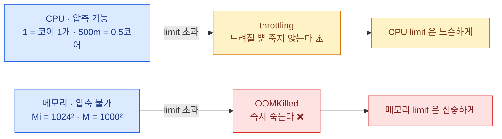
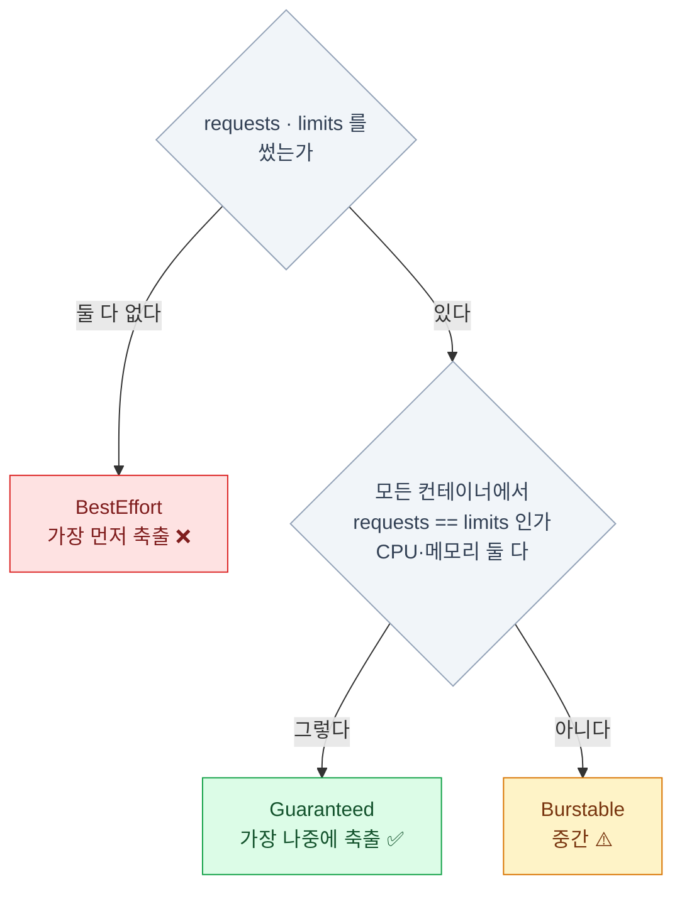
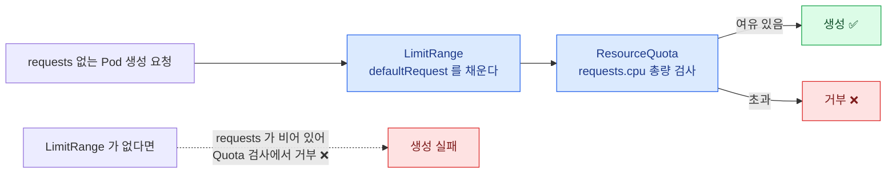

import { Steps, Card, CardGrid, Tabs, TabItem } from '@astrojs/starlight/components';

> ConfigMap · Secret · requests/limits

## 설정을 이미지에서 분리하는 이유

- 같은 이미지를 **dev / staging / prod에 그대로** 쓸 수 있다
- 설정만 바꿔서 재배포할 수 있다 — 이미지를 다시 빌드하지 않는다
- 비밀 값이 **이미지 레이어에 박히지 않는다**



Kubernetes가 주는 두 가지 그릇 —
**ConfigMap**(평범한 설정)과 **Secret**(민감한 값).
**구조는 거의 같고, 취급만 다르다.**

:::tip[시험]
커리큘럼의 "ConfigMap과 Secret으로 애플리케이션 설정" 항목.
**만들기 + 세 가지 주입 방식**만 확실하면 된다.
:::

## ConfigMap

### ConfigMap 만들기

```bash
# 1) 값을 직접
kubectl create cm app-config \
  --from-literal=LOG_LEVEL=debug \
  --from-literal=MAX_CONN=100

# 2) 파일 하나 — 파일 이름이 키가 된다
kubectl create cm nginx-conf --from-file=./nginx.conf

# 3) 키 이름을 지정
kubectl create cm nginx-conf --from-file=custom.conf=./nginx.conf

# 4) 디렉터리 전체 — 각 파일이 키가 된다
kubectl create cm configs --from-file=./conf/

# 5) env 형식 파일 — 각 줄이 키=값
kubectl create cm app-env --from-env-file=./app.env
```

```bash
kubectl get cm app-config -o yaml
kubectl describe cm app-config
```

### ConfigMap 매니페스트

```yaml
apiVersion: v1
kind: ConfigMap
metadata:
  name: app-config
data:
  LOG_LEVEL: "debug"           # 짧은 값
  MAX_CONN: "100"
  nginx.conf: |                # 파일 전체를 담을 수도 있다
    server {
      listen 80;
      root /usr/share/nginx/html;
    }
immutable: false               # true면 수정 불가 (성능 이점 + 실수 방지)
```

- **값은 전부 문자열**이다. `100`이라고 쓰면 YAML 파서가 숫자로 읽어 **거부**한다 → `"100"`
- `binaryData:` 로 바이너리도 담을 수 있다 (base64)
- **크기 제한 1MiB** — etcd의 제약이다. 큰 파일은 볼륨을 쓰자

## 주입 방식 세 가지 — 전체 지도



### 주입 방식 1 — 개별 환경변수

```yaml
containers:
  - name: app
    image: myapp:1.0
    env:
      - name: LOG_LEVEL
        valueFrom:
          configMapKeyRef:
            name: app-config
            key: LOG_LEVEL
            optional: true       # 없어도 Pod이 뜬다 (기본 false)
```

- 키 하나하나를 **원하는 이름으로** 매핑할 수 있다
- `optional: false`(기본)인데 ConfigMap이나 키가 없으면
  → Pod이 **`CreateContainerConfigError`** 로 멈춘다

:::tip[시험]
Pod이 `CreateContainerConfigError`면
**ConfigMap/Secret 이름 오타나 키 오타**다. `describe`의 Events에 정확히 어떤 이름을 못 찾았는지 나온다.
:::

### 주입 방식 2 — 전부 환경변수로

```yaml
containers:
  - name: app
    image: myapp:1.0
    envFrom:
      - configMapRef:
          name: app-config
      - secretRef:
          name: db-secret
      - configMapRef:
          name: extra-config
        prefix: EXTRA_          # 키 앞에 접두사를 붙인다
```

- ConfigMap의 **모든 키가 그대로 환경변수 이름**이 된다
- 그래서 키 이름이 **환경변수로 유효해야** 한다 (하이픈이 들어가면 조용히 건너뛴다)
- `env`와 `envFrom`을 같이 쓰면 **`env`가 이긴다**

```bash
kubectl set env deploy/web --from=configmap/app-config
kubectl set env deploy/web --from=secret/db-secret
kubectl set env deploy/web LOG_LEVEL=info        # 직접
kubectl set env deploy/web LOG_LEVEL-            # 제거
```

### 주입 방식 3 — 볼륨으로 마운트

```yaml
spec:
  containers:
    - name: app
      image: myapp:1.0
      volumeMounts:
        - name: config
          mountPath: /etc/app
          readOnly: true
  volumes:
    - name: config
      configMap:
        name: app-config
        defaultMode: 0644
        items:                    # 일부 키만 고르고 이름도 바꾼다
          - key: nginx.conf
            path: nginx.conf
```

- **키 하나 = 파일 하나.** `/etc/app/nginx.conf` 로 보인다
- `items`를 쓰면 **명시한 키만** 마운트된다

:::caution[함정]
`mountPath`에 원래 있던 파일들은 **가려진다.**
`/etc/nginx` 에 통째로 마운트하면 기존 설정이 전부 사라진다.
:::

### subPath — 파일 하나만 얹기

<Tabs>
<TabItem label="디렉터리 마운트 (기본)">

```yaml
volumeMounts:
  - name: config
    mountPath: /etc/nginx
```



**자동 갱신은 되지만** 원래 있던 파일이 전부 가려진다.

</TabItem>
<TabItem label="subPath — 파일 하나만">

```yaml
volumeMounts:
  - name: config
    mountPath: /etc/nginx/nginx.conf
    subPath: nginx.conf
```



디렉터리를 덮지 않고 **파일 하나만** 교체한다.
**대신 자동 갱신이 안 된다** — 여기가 핵심 트레이드오프다.

</TabItem>
</Tabs>

**자동 갱신 정리**

| 방식 | ConfigMap을 바꾸면 |
|---|---|
| 환경변수 (`env`, `envFrom`) | **반영 안 됨.** Pod을 다시 만들어야 한다 |
| 볼륨 마운트 | **반영됨** (kubelet 동기화 주기, 대략 1분 이내) |
| 볼륨 + `subPath` | **반영 안 됨** |

반영되더라도 **앱이 파일을 다시 읽어야** 의미가 있다. 그래서 실무 표준은 —

```bash
kubectl rollout restart deploy/web
```

## Secret

### Secret — ConfigMap과 무엇이 다른가

```yaml
apiVersion: v1
kind: Secret
metadata:
  name: db-secret
type: Opaque
data:                          # base64로 인코딩된 값
  password: czNjcjN0
stringData:                    # 평문으로 쓰면 API 서버가 인코딩해준다
  username: admin
```

```bash
kubectl create secret generic db-secret \
  --from-literal=username=admin \
  --from-literal=password=s3cr3t

kubectl create secret docker-registry regcred \
  --docker-server=registry.example.com --docker-username=user --docker-password=pass

kubectl create secret tls web-tls --cert=./tls.crt --key=./tls.key
```

| type | 쓰임 |
|---|---|
| `Opaque` | 임의의 값 (기본) |
| `kubernetes.io/dockerconfigjson` | 프라이빗 레지스트리 인증 |
| `kubernetes.io/tls` | TLS 인증서 (Ingress에서 쓴다) |
| `kubernetes.io/service-account-token` | SA 토큰 (14장) |

### base64는 암호화가 아니다

```bash
kubectl get secret db-secret -o jsonpath='{.data.password}' | base64 -d
# s3cr3t
```

**실제 보호는 base64가 아니라 다른 두 축에서 온다.**



- **누구나 디코딩할 수 있다.** 인코딩은 바이너리를 담기 위한 것이지 보호가 아니다
- 기본 설정에서 **etcd에 평문으로 저장**된다

```yaml
# /etc/kubernetes/enc/enc.yaml  → apiserver의 --encryption-provider-config 로 지정
apiVersion: apiserver.config.k8s.io/v1
kind: EncryptionConfiguration
resources:
  - resources: ["secrets"]
    providers:
      - aescbc:
          keys:
            - name: key1
              secret: <base64로 인코딩한 32바이트 키>
      - identity: {}
```

설정 후 기존 Secret을 다시 암호화하려면
`kubectl get secrets -A -o json | kubectl replace -f -` 를 한 번 돌린다.

### imagePullSecrets

```yaml
spec:
  imagePullSecrets:
    - name: regcred
  containers:
    - name: app
      image: registry.example.com/myapp:1.0
```

ServiceAccount에 붙여두면 **그 SA를 쓰는 모든 Pod**에 자동 적용된다.

```bash
kubectl patch sa default -p '{"imagePullSecrets":[{"name":"regcred"}]}'
```

:::caution[함정]
`ImagePullBackOff`의 원인은 셋 중 하나다.\
① 이미지 이름·태그 오타 ② 프라이빗인데 `imagePullSecrets` 없음 ③ 네트워크/레지스트리 접근 불가.\
`describe`의 Events에 **어느 쪽인지 문장으로 나온다.**
:::

## 리소스 관리

### requests와 limits

```yaml
resources:
  requests:            # 스케줄링의 기준. "최소 이만큼은 보장해달라"
    cpu: 100m
    memory: 128Mi
  limits:              # 런타임의 상한. "이 이상은 못 쓴다"
    cpu: 500m
    memory: 256Mi
```

**둘은 서로 다른 컴포넌트가 서로 다른 시점에 본다.**



- **`requests`는 스케줄러가 본다.** 노드의 남은 용량과 비교해 배치 가능 여부를 판단
- **`limits`는 kubelet/런타임이 강제한다.** 실제 cgroup 제한이 된다
- **노드는 request의 합만 본다.** 실제 사용량이 아니다

:::caution[함정]
그래서 **"노드에 자원이 남았는데 Pending"** 이 일어난다.
request 합이 이미 Allocatable에 닿았기 때문이다.
`kubectl describe node`의 `Allocated resources`를 봐야 한다.
:::

### CPU와 메모리의 단위

**이 비대칭이 실무 감각의 핵심이다.**



`128Mi` ≠ `128M` 이라는 점도 기억할 것.

:::tip[시험]
`Exit Code 137` + `Reason: OOMKilled` 를 보면
메모리 limit을 올리는 것이 정답이다. `describe pod`의 **Last State** 섹션에 나온다.
:::

### QoS 클래스 — 누가 먼저 쫓겨나는가

노드에 자원이 부족하면 kubelet이 Pod을 축출(evict)한다. 순서는 QoS가 정한다.

**QoS는 지정하는 것이 아니라 계산된다.**



| 클래스 | 조건 | 축출 순서 |
|---|---|---|
| **Guaranteed** | 모든 컨테이너에 requests == limits (CPU·메모리 둘 다) | 가장 나중 |
| **Burstable** | requests가 있지만 limits와 다르다 | 중간 |
| **BestEffort** | requests도 limits도 없다 | **가장 먼저** |

```bash
kubectl get pod web -o jsonpath='{.status.qosClass}'
```

중요한 워크로드를 Guaranteed로 만들려면 requests와 limits를 똑같이 쓰면 된다.

## 네임스페이스 단위 제약

### LimitRange — 네임스페이스의 기본값과 상한

```yaml
apiVersion: v1
kind: LimitRange
metadata:
  name: defaults
  namespace: dev
spec:
  limits:
    - type: Container
      default:                 # limits를 안 쓰면 이 값이 들어간다
        cpu: 500m
        memory: 256Mi
      defaultRequest:          # requests를 안 쓰면 이 값
        cpu: 100m
        memory: 128Mi
      max:                     # 이보다 크면 생성 거부
        cpu: "2"
        memory: 1Gi
      min:
        cpu: 50m
        memory: 64Mi
```

- **admission 단계에서 동작**한다 — Pod 생성 시 값을 채우거나 거부한다
- 이미 떠 있는 Pod에는 **소급 적용되지 않는다**
- `type`은 `Container` / `Pod` / `PersistentVolumeClaim`

### ResourceQuota — 네임스페이스 총량 제한

```yaml
apiVersion: v1
kind: ResourceQuota
metadata:
  name: dev-quota
  namespace: dev
spec:
  hard:
    requests.cpu: "4"
    requests.memory: 8Gi
    limits.cpu: "8"
    limits.memory: 16Gi
    pods: "20"
    persistentvolumeclaims: "5"
    services.loadbalancers: "2"
    count/deployments.apps: "10"
```

```bash
kubectl get resourcequota -n dev
kubectl describe resourcequota dev-quota -n dev     # Used / Hard 를 보여준다
```

**둘은 짝으로 쓴다.** 왜 그런지는 순서대로 보면 명확하다.



:::caution[함정]
**ResourceQuota에 `requests.cpu`가 걸려 있으면,
requests가 없는 Pod은 생성이 거부된다.**
그래서 Quota와 LimitRange는 **짝으로** 쓴다 — LimitRange가 기본값을 채워주기 때문이다.
:::

## 6장 요약

- ConfigMap/Secret 주입은 셋: **개별 env / envFrom / 볼륨**
- **자동 갱신은 볼륨 마운트만.** `subPath`는 안 된다. 실무 표준은 `rollout restart`
- **Secret의 base64는 보호가 아니다.** 보호는 **RBAC + etcd 암호화**
- `CreateContainerConfigError` = **ConfigMap/Secret 이름·키 오타**
- **requests는 스케줄링, limits는 런타임 강제.** 노드는 request 합만 본다
- CPU 초과 = **throttling**, 메모리 초과 = **OOMKilled(137)**
- **QoS는 지정하는 게 아니라 계산된다.** BestEffort가 가장 먼저 쫓겨난다
- **ResourceQuota + LimitRange는 짝으로** — 그래야 requests 없는 Pod이 안 막힌다
