import { Steps, Card, CardGrid, Tabs, TabItem } from '@astrojs/starlight/components';

> Pod을 어느 노드에 놓을 것인가

## 스케줄러가 하는 일 — 다시

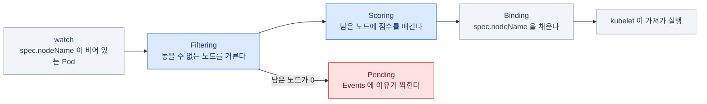

<Steps>

1. `spec.nodeName`이 **비어 있는 Pod**을 발견한다

2. **Filtering** — 놓을 수 없는 노드를 전부 거른다

3. **Scoring** — 남은 노드에 점수를 매긴다

4. 최고점 노드로 **binding** — `spec.nodeName`을 채운다

</Steps>

**Filtering에서 걸러지는 이유들**

- 노드에 남은 **request 여유가 부족**하다
- **taint**가 있는데 Pod에 **toleration**이 없다
- **nodeSelector / nodeAffinity**가 안 맞는다
- **포트 충돌**(hostPort), 볼륨의 노드 제약(topology)
- 노드가 **unschedulable**(cordon 됨)이다

**Pending의 원인은 대부분 이 목록 안에 있다.**
그리고 `describe pod`의 Events가 **어느 항목에서 걸렸는지 문장으로 알려준다.**

## 배치를 제어하는 도구들

**방향이 반대인 두 축**이 핵심이다.

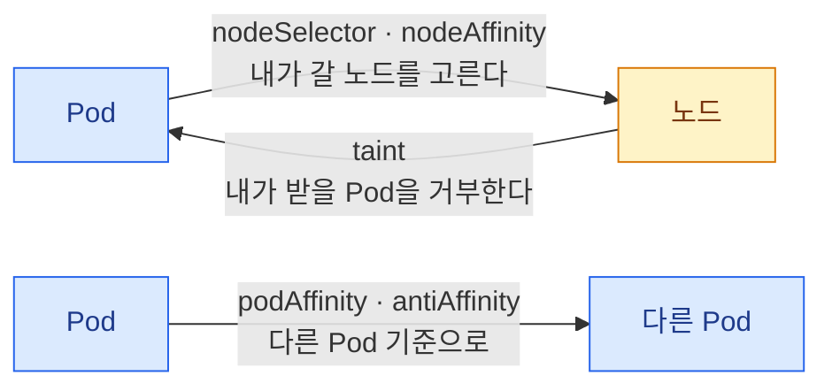

| 도구 | 관점 | 성격 |
|---|---|---|
| `nodeName` | Pod → 특정 노드 | 스케줄러를 건너뛴다 |
| `nodeSelector` | Pod → 노드 라벨 | 단순, 강제 |
| **nodeAffinity** | Pod → 노드 라벨 | 표현력 있음, 강제/선호 선택 가능 |
| **podAffinity / podAntiAffinity** | Pod → 다른 Pod | 함께 / 떨어뜨려 놓기 |
| **taints / tolerations** | 노드 → Pod | 노드가 **밀어낸다** |
| topologySpreadConstraints | Pod → 분산 | 균등 분포 |

affinity는 **Pod이 노드를 고르는 것**, taint는 **노드가 Pod을 거부하는 것**.
둘은 함께 쓰여야 완성된다.

### nodeName — 스케줄러 건너뛰기

```yaml
spec:
  nodeName: node01
```

- 스케줄러가 개입하지 않는다. kubelet이 바로 가져간다
- **taint도, 리소스 검사도 무시**한다 — 자리가 없으면 그냥 실패한다
- 실무에서는 거의 안 쓴다. **디버깅과 스태틱 Pod**의 영역

:::tip[시험]
**"스케줄러가 고장났다"** 유형에서 이걸 쓴다.
스케줄러가 죽었을 때 `nodeName`을 직접 넣어 Pod을 띄우라는 문제가 실제로 나온다.
또한 이 사실 자체가 **"Pending의 원인이 스케줄러인지"를 판별하는 방법**이다.
:::

### nodeSelector — 가장 단순한 방법

```bash
kubectl label node node01 disktype=ssd
kubectl get nodes --show-labels
kubectl label node node01 disktype-        # 삭제
```

```yaml
spec:
  nodeSelector:
    disktype: ssd
```

- **모든 조건이 AND**로 결합된다
- **정확히 일치**만 가능하다. "이거 아니면 저거"를 표현할 수 없다
- 맞는 노드가 없으면 **Pending**

모든 노드에 자동으로 붙는 라벨도 있다 —
`kubernetes.io/hostname`, `kubernetes.io/os`,
`topology.kubernetes.io/zone`, `node-role.kubernetes.io/control-plane`.

### nodeAffinity — 표현력 있는 버전

<Tabs>
<TabItem label="required — 못 맞추면 Pending">

```yaml
spec:
  affinity:
    nodeAffinity:
      requiredDuringSchedulingIgnoredDuringExecution:
        nodeSelectorTerms:
          - matchExpressions:
              - key: disktype
                operator: In
                values: ["ssd", "nvme"]
```

Filtering 단계에서 작동한다. 조건에 맞는 노드가 하나도 없으면 **Pod은 Pending**이다.

</TabItem>
<TabItem label="preferred — 못 맞춰도 뜬다">

```yaml
spec:
  affinity:
    nodeAffinity:
      preferredDuringSchedulingIgnoredDuringExecution:
        - weight: 50
          preference:
            matchExpressions:
              - key: topology.kubernetes.io/zone
                operator: In
                values: ["ap-northeast-2a"]
```

Scoring 단계에서 작동한다. `weight`(1~100)로 **점수만 준다.**
조건에 맞는 노드가 없어도 다른 노드에 배치된다.

</TabItem>
</Tabs>

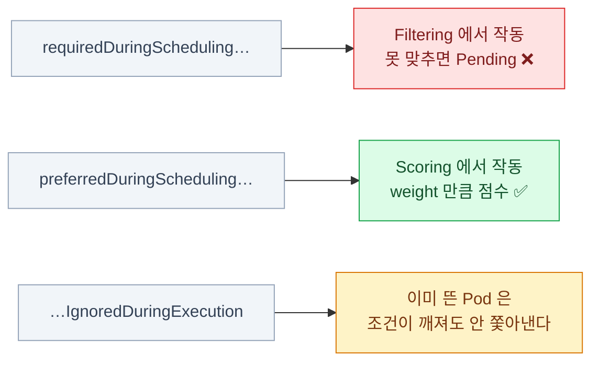

### 긴 이름 읽는 법과 연산자

`requiredDuringScheduling` + `IgnoredDuringExecution`\
= **"배치할 때는 반드시, 실행 중에는 무시"**

| 연산자 | 의미 |
|---|---|
| `In` | 값이 목록 안에 있다 |
| `NotIn` | 목록에 없다 (= 안티 어피니티) |
| `Exists` | 키가 있기만 하면 된다 (`values` 없음) |
| `DoesNotExist` | 키가 없어야 한다 |
| `Gt` / `Lt` | 숫자 비교 (nodeAffinity 전용) |

**AND / OR 구조**

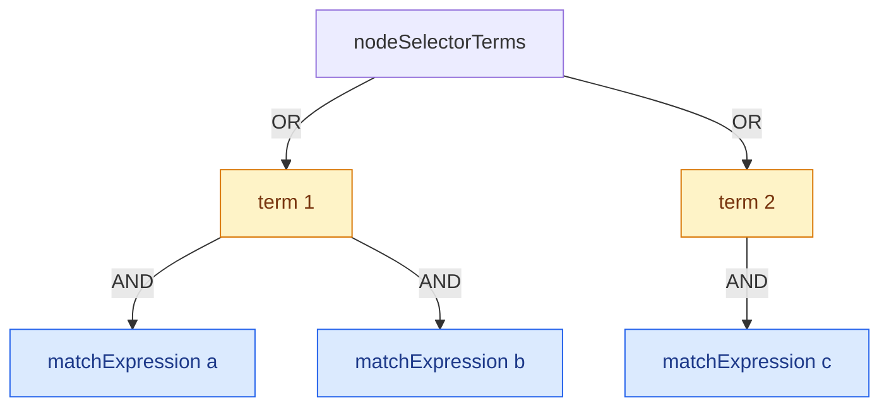

- `nodeSelectorTerms` 의 항목들끼리는 **OR**
- 한 term 안의 `matchExpressions` 끼리는 **AND**

:::tip[시험]
이 YAML은 **손으로 치면 거의 틀린다.**
공식 문서 `assign pod node` 페이지에서 **복사해서 값만 바꾸는 게** 정답이다.
:::

### podAffinity / podAntiAffinity

```yaml
spec:
  affinity:
    podAntiAffinity:
      requiredDuringSchedulingIgnoredDuringExecution:
        - labelSelector:
            matchLabels:
              app: web
          topologyKey: kubernetes.io/hostname     # ← 무엇을 "같은 곳"으로 볼 것인가
```

**`topologyKey`가 무엇을 "같은 곳"으로 볼지 정한다.** 이게 핵심이다.

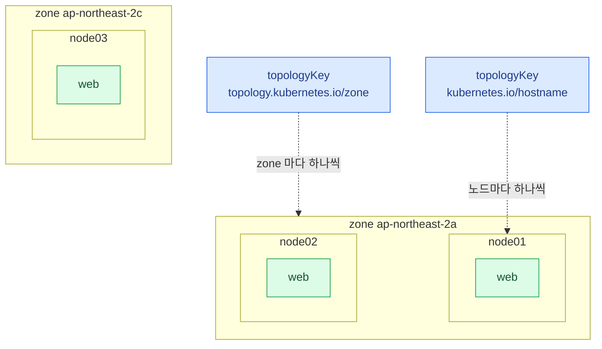

- `kubernetes.io/hostname` → **노드 단위**로 (한 노드에 하나씩)
- `topology.kubernetes.io/zone` → **가용영역 단위**로
- `podAffinity` = 조건에 맞는 Pod **곁에**, `podAntiAffinity` = **떨어뜨려**

:::caution[함정]
`required` podAntiAffinity + `hostname` 조합에서
**노드 수보다 replicas가 많으면 나머지는 영원히 Pending**이다.
실무에서는 `preferred`를 쓰거나 topologySpreadConstraints로 대체한다.
:::

podAffinity는 **계산 비용이 크다.** 대규모 클러스터에서 스케줄링이 느려지는 원인이 되기도 한다.

## taint — 노드가 Pod을 밀어낸다

```bash
kubectl taint node node01 key=value:NoSchedule
kubectl taint node node01 key=value:NoSchedule-      # 제거 (끝에 하이픈)
kubectl taint node node01 gpu=true:NoSchedule
kubectl describe node node01 | grep -A3 Taints
```

**effect 셋의 차이는 "새 Pod"과 "이미 있는 Pod"을 각각 어떻게 하느냐다.**

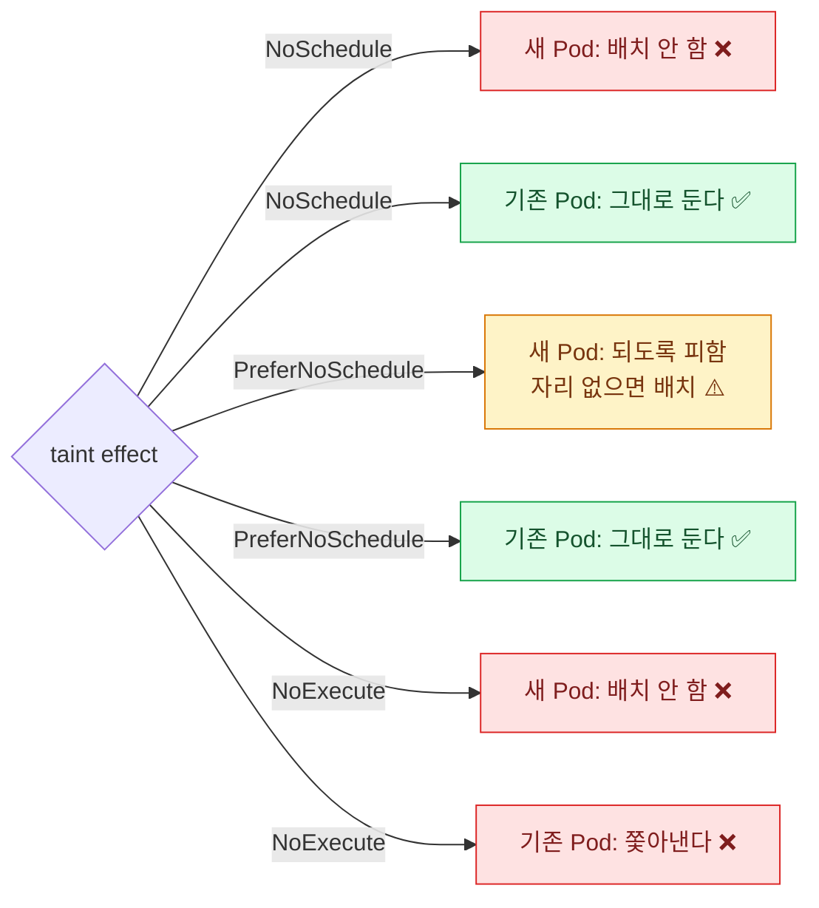

| effect | 의미 |
|---|---|
| **`NoSchedule`** | 새 Pod을 배치하지 않는다. **이미 있는 것은 그대로** |
| **`PreferNoSchedule`** | 되도록 피한다. 자리가 없으면 배치한다 |
| **`NoExecute`** | 배치도 안 하고, **이미 있는 Pod도 쫓아낸다** |

**taint는 "노드에 붙이는 조건"**이고,
**toleration은 "Pod이 그 조건을 견딜 수 있다는 선언"**이다.
toleration이 있다고 그 노드에 **가는 것은 아니다** — 갈 수 **있게** 될 뿐이다.

## toleration

```yaml
spec:
  tolerations:
    - key: "gpu"
      operator: "Equal"        # Equal | Exists
      value: "true"
      effect: "NoSchedule"

    - key: "node.kubernetes.io/not-ready"
      operator: "Exists"
      effect: "NoExecute"
      tolerationSeconds: 300   # 300초까지는 버틴다

    - operator: "Exists"       # key 생략 = 모든 taint를 견딘다
```

- `operator: Exists` 면 `value`를 쓰지 않는다
- `effect`를 생략하면 **모든 effect**에 대해 적용된다
- `key`까지 생략하고 `Exists`만 두면 **전부 무시** — DaemonSet에서 쓰는 패턴

### taint × toleration 조합표

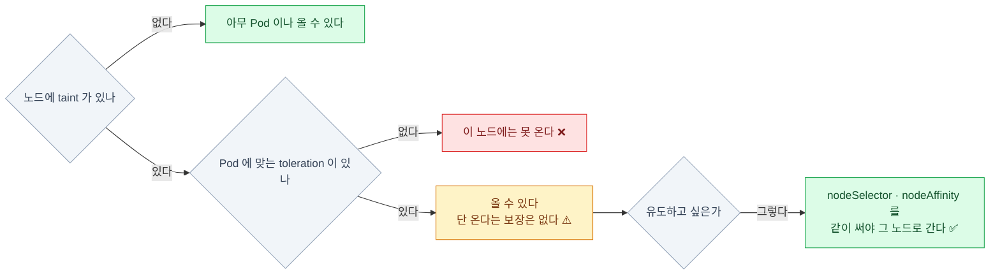

:::tip[시험]
"taint를 걸고, 그 노드에만 뜨게 하시오"는
**taint + toleration + nodeSelector(또는 affinity)를 함께** 써야 완성된다.
toleration만으로는 "그 노드로 간다"가 보장되지 않는다.
:::

## 노드 장애와 유지보수

### 시스템이 자동으로 붙이는 taint

| taint | 언제 |
|---|---|
| `node.kubernetes.io/not-ready` | 노드가 Ready가 아닐 때 (`NoExecute`) |
| `node.kubernetes.io/unreachable` | 노드와 통신이 안 될 때 (`NoExecute`) |
| `node.kubernetes.io/memory-pressure` | 메모리 부족 |
| `node.kubernetes.io/disk-pressure` | 디스크 부족 |
| `node.kubernetes.io/unschedulable` | `cordon` 했을 때 |
| `node-role.kubernetes.io/control-plane` | 컨트롤 플레인 노드 (`NoSchedule`) |

**노드가 죽어도 Pod이 5분 동안 안 옮겨가는 이유**가 여기 있다.

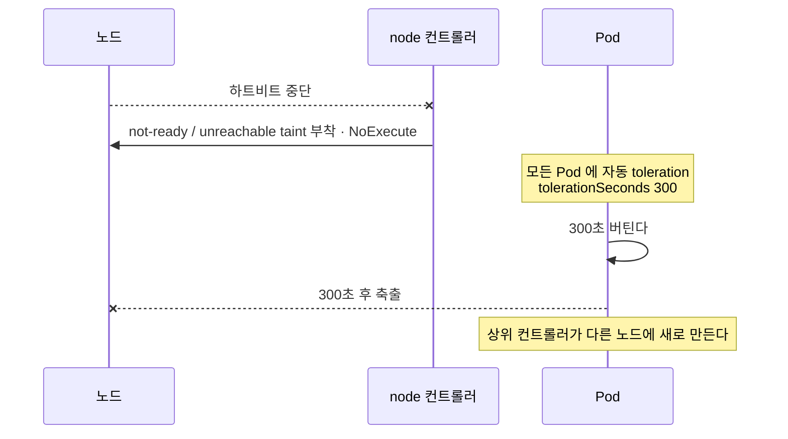

- 모든 Pod에는 `not-ready` / `unreachable`에 대한 **5분(300초) toleration이 자동으로 붙는다**
- 그래서 **노드가 죽어도 5분 동안은 Pod이 안 옮겨간다.** 이게 그 유명한 지연의 정체다

:::caution[함정]
싱글 노드 클러스터(kind 등)에서 Pod이 안 뜨면
**컨트롤 플레인 taint**를 의심한다. 실습에서는 이렇게 푼다.

```bash
kubectl taint node controlplane node-role.kubernetes.io/control-plane:NoSchedule-
```
:::

### cordon · drain · uncordon

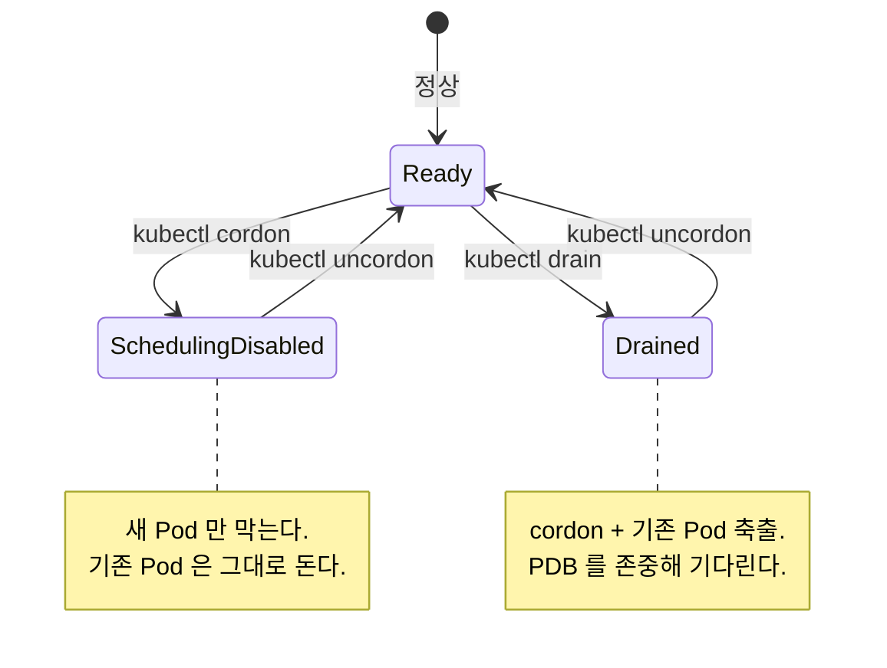

```bash
kubectl cordon node01            # 새 Pod 배치 금지 (기존은 유지)
kubectl uncordon node01          # 해제

kubectl drain node01 \
  --ignore-daemonsets \          # DaemonSet Pod은 어차피 못 옮기니 무시
  --delete-emptydir-data \       # emptyDir을 쓰는 Pod도 지운다
  --force                        # 컨트롤러 없는 Pod(단독 Pod)도 지운다
```

- **`cordon`** = 노드에 `unschedulable` 표시 (taint가 붙는다)
- **`drain`** = cordon + 기존 Pod을 전부 **축출(evict)**
- 축출은 **PDB를 존중**한다 — 위반하면 기다린다 (5장)

:::tip[시험]
노드 업그레이드 문제의 정해진 순서다.
**`drain` → 작업 → `uncordon`.**
`--ignore-daemonsets`를 빼면 **거의 항상 에러가 난다.** 습관으로 붙일 것. (15장)
:::

## 그 밖의 배치 제어

### topologySpreadConstraints — 균등 분산

```yaml
spec:
  topologySpreadConstraints:
    - maxSkew: 1
      topologyKey: topology.kubernetes.io/zone
      whenUnsatisfiable: DoNotSchedule     # 또는 ScheduleAnyway
      labelSelector:
        matchLabels:
          app: web
```

**`maxSkew`는 도메인 간 개수 차이의 허용치다.**

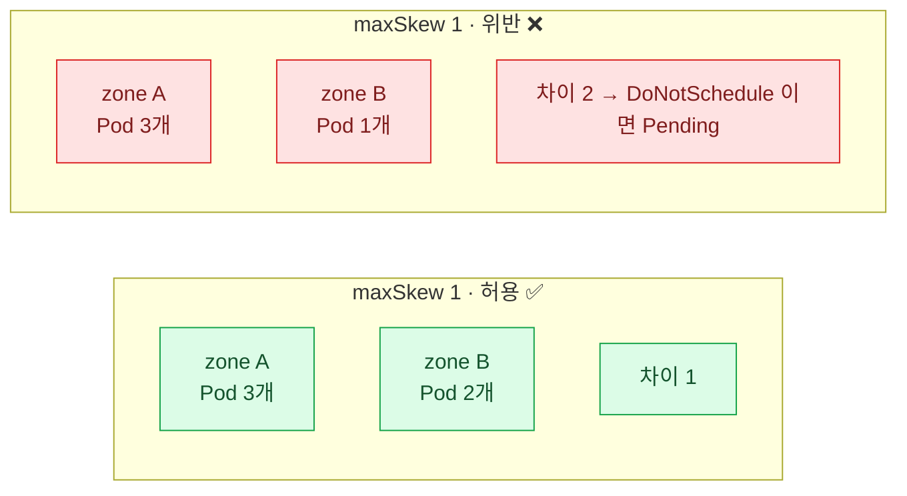

- `maxSkew: 1` 이면 zone A에 3개일 때 zone B는 최소 2개여야 한다
- `whenUnsatisfiable: DoNotSchedule` = 강제, `ScheduleAnyway` = 선호

podAntiAffinity보다 **표현이 정확하고 계산이 싸다.**
"노드/존에 고르게 퍼뜨려라"가 목적이라면 이쪽이 정답이다.

### PriorityClass와 선점(preemption)

우선순위가 없으면 클러스터가 꽉 찼을 때 **중요한 Pod도 자리가 날 때까지 똑같이 Pending**으로 기다린다.
PriorityClass는 "누가 먼저인가"를 선언해 두는 것이고,
자리가 없으면 스케줄러가 덜 중요한 Pod을 쫓아내 자리를 만든다 — 이것이 선점이다.

```yaml
apiVersion: scheduling.k8s.io/v1
kind: PriorityClass
metadata:
  name: high-priority
value: 1000000
globalDefault: false
preemptionPolicy: PreemptLowerPriority   # 또는 Never
description: "중요한 워크로드용"
```

```yaml
spec:
  priorityClassName: high-priority
```

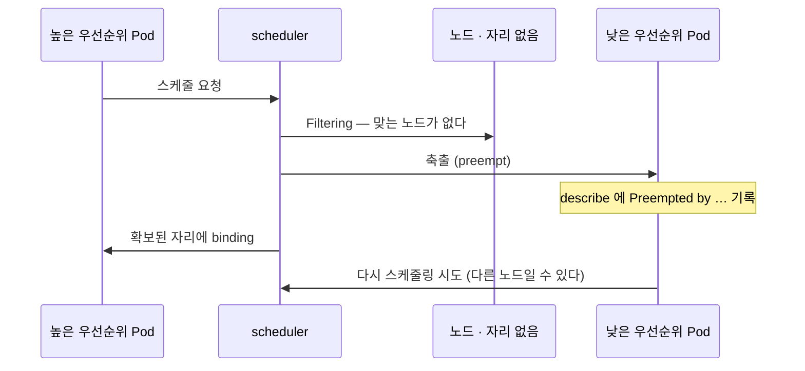

- 자리가 없으면 스케줄러가 **낮은 우선순위 Pod을 쫓아내고** 자리를 만든다
- 쫓겨난 Pod은 **다시 스케줄링을 시도**한다 (다른 노드로 갈 수도 있다)
- `preemptionPolicy: Never` — 우선순위는 높지만 남을 쫓아내지는 않는다
- 내장 클래스: `system-cluster-critical`, `system-node-critical`

축출된 Pod은 `describe`에 `Preempted by ...` 로 기록된다.

### 여러 스케줄러 쓰기

```yaml
spec:
  schedulerName: my-scheduler
```

- 기본값은 `default-scheduler`
- 커스텀 스케줄러를 Pod으로 띄우고 이름을 지정하면 **그 스케줄러가 담당**한다
- 지정한 이름의 스케줄러가 **없으면 Pod은 영원히 Pending** (아무도 안 집어간다)

```bash
kubectl get pods -n kube-system -l component=kube-scheduler
kubectl get events | grep -i schedul
```

:::caution[함정]
`schedulerName` 오타로 인한 Pending은
**Events에 아무 메시지도 안 남는다.** 아무 스케줄러도 이 Pod을 보지 않기 때문이다.
"Events가 텅 비어 있고 계속 Pending"이면 이걸 의심한다.
:::

## Pod admission — Pod Security Admission

막는 장치가 없으면 `privileged: true`나 `hostNetwork` 같은 위험한 스펙도 **아무 검사 없이 통과**한다.
이걸 막던 PodSecurityPolicy(PSP)는 v1.25에서 제거되었고 — 옛 자료에 나오면 무시할 것 —
그 빈자리를 메운 것이 Pod Security Admission이다 (커리큘럼의 "Pod admission" 항목).
**네임스페이스 라벨로 켠다.**

```bash
kubectl label ns dev \
  pod-security.kubernetes.io/enforce=baseline \
  pod-security.kubernetes.io/enforce-version=latest \
  pod-security.kubernetes.io/warn=restricted
```

**레벨(얼마나 조이나) × 모드(어기면 어떻게 하나)의 조합**이다.

<CardGrid>
<Card title="privileged" icon="open-book">
제한 없음.
</Card>
<Card title="baseline" icon="warning">
알려진 권한 상승을 막는다.
`hostNetwork`, `privileged` 등 금지.
</Card>
<Card title="restricted" icon="padlock">
강하게 제한.
`runAsNonRoot`, capabilities `drop ALL` 등 요구.
</Card>
</CardGrid>

| 모드 | 동작 |
|---|---|
| `enforce` | **거부**한다 |
| `audit` | 감사 로그에 남긴다 |
| `warn` | 사용자에게 경고를 보여준다 |

## 스케줄링 실패 진단 순서

```bash
kubectl get pods -o wide                    # Pending인 것 확인
kubectl describe pod web                    # ★ Events 를 읽는다
kubectl get events --sort-by=.lastTimestamp
kubectl describe node node01                # Taints / Allocated resources
kubectl get nodes                           # SchedulingDisabled 표시 확인
```

Events 메시지로 원인이 거의 확정된다.

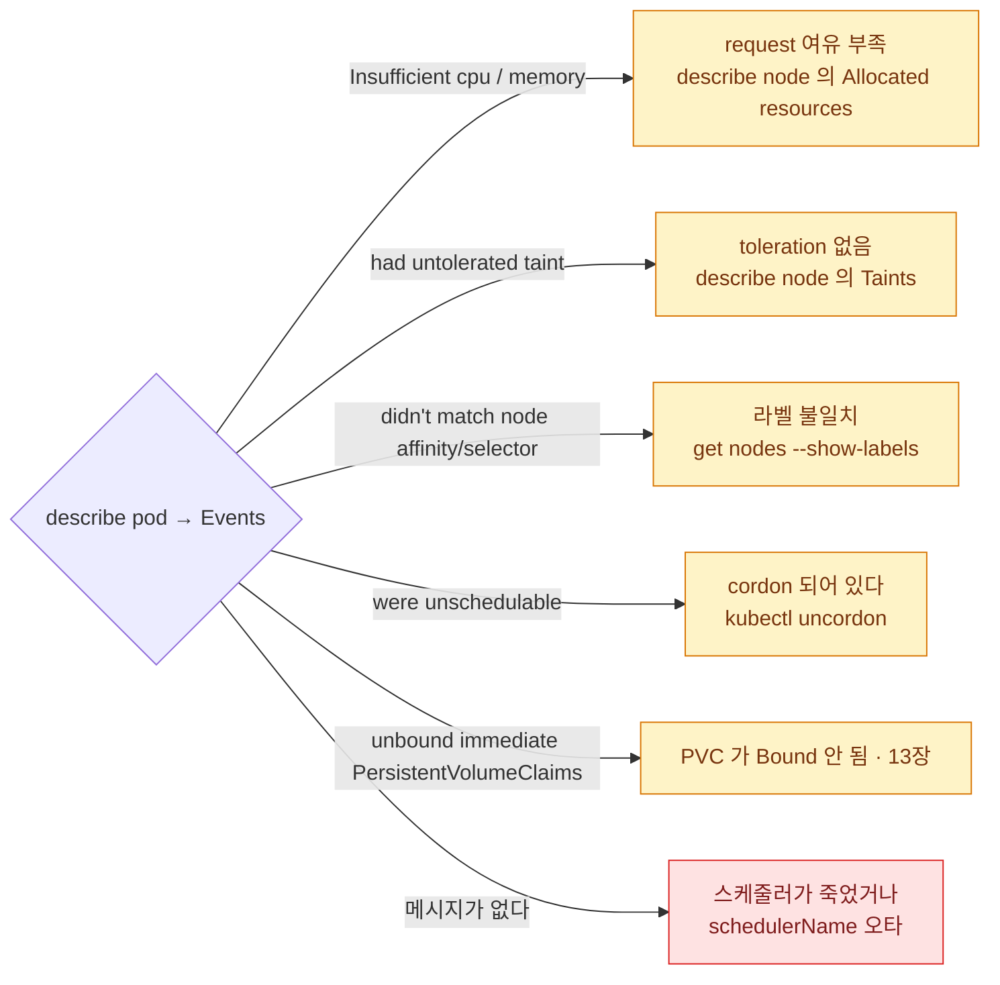

| 메시지 | 원인 |
|---|---|
| `Insufficient cpu` / `Insufficient memory` | request 여유 부족 |
| `node(s) had untolerated taint {...}` | toleration 없음 |
| `node(s) didn't match Pod's node affinity/selector` | 라벨 불일치 |
| `node(s) were unschedulable` | cordon 되어 있다 |
| `pod has unbound immediate PersistentVolumeClaims` | PVC가 Bound 안 됨 (13장) |
| **(메시지 없음)** | 스케줄러가 죽었거나 `schedulerName` 오타 |

## 7장 요약

- 스케줄러는 **Filtering → Scoring → binding(`nodeName` 채우기)**
- **affinity는 Pod이 노드를 고르고, taint는 노드가 Pod을 밀어낸다.** 방향이 반대다
- `required…IgnoredDuringExecution` = **"배치할 때만 강제, 실행 중엔 무시"**
- **toleration은 "갈 수 있게" 할 뿐 "가게" 하지 않는다** — 유도하려면 affinity를 같이
- 노드 장애 시 Pod 이동이 5분 걸리는 이유는 **자동 toleration 300초**
- `drain`은 **`--ignore-daemonsets` 필수**, PDB를 존중해 기다린다
- **분산이 목적이면 topologySpreadConstraints** (antiAffinity보다 정확·저렴)
- Pending 진단은 **`describe pod`의 Events 한 줄**로 끝나는 경우가 대부분

:::note[손 연습]
이 장 범위의 KodeKloud 실습 풀이 — [CKA 실습 4장 · 스케줄링](/cka-udemy/04-scheduling/)
:::
