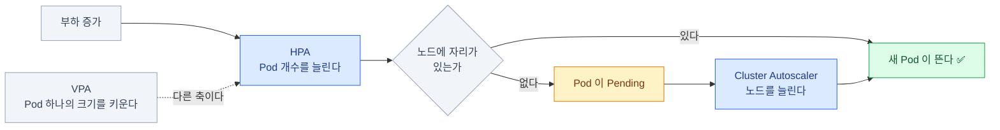
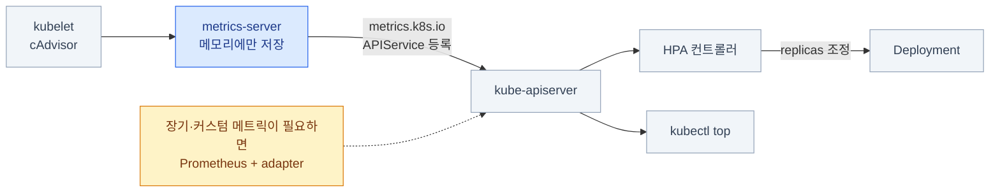
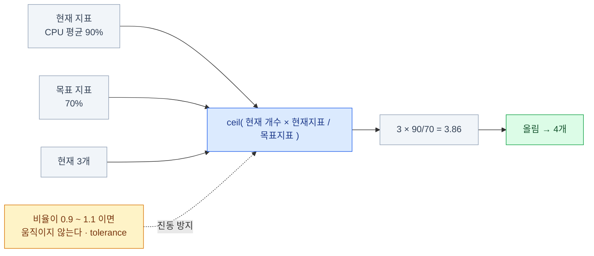
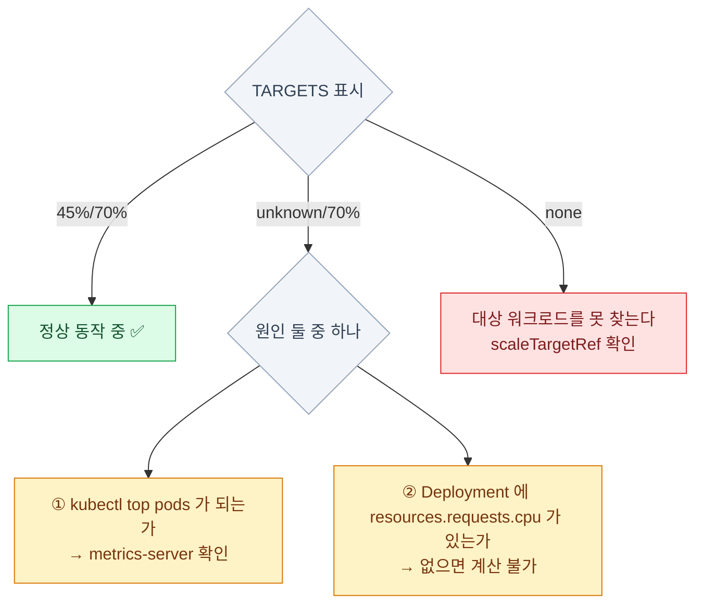
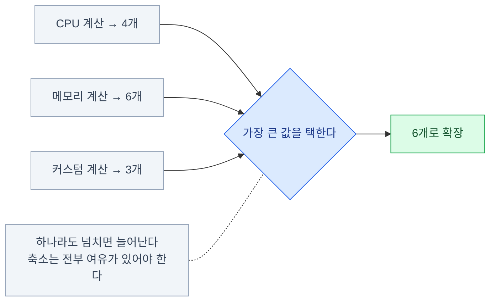
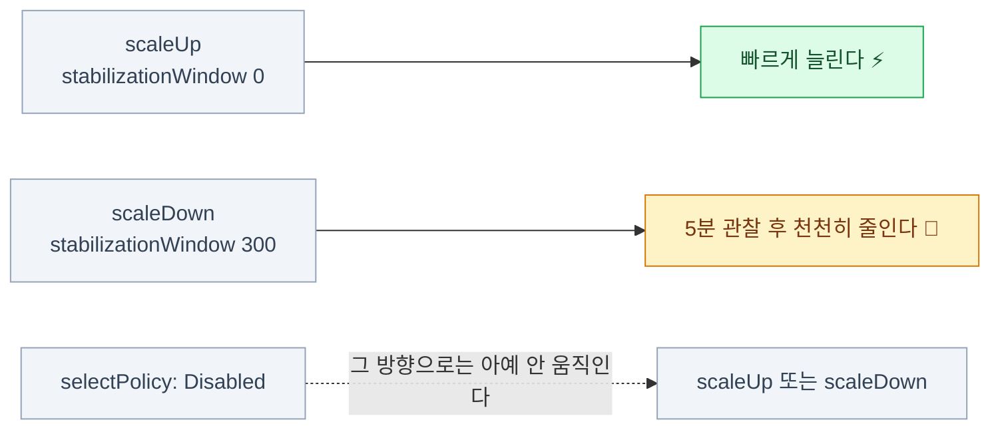
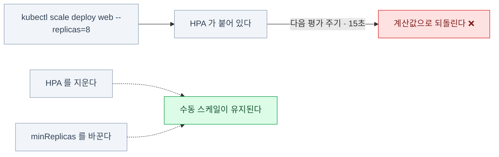

import { Steps, Card, CardGrid, Tabs, TabItem } from '@astrojs/starlight/components';

> 부하에 따라 개수를 바꾼다

## 세 가지 오토스케일링

<CardGrid>
<Card title="HPA — Pod 개수" icon="random">
Horizontal Pod Autoscaler.
**기본 내장.** 커리큘럼이 말하는 건 사실상 이것.
</Card>
<Card title="VPA — Pod 크기" icon="setting">
Vertical Pod Autoscaler.
requests/limits를 조정. **별도 설치** — CRD(CustomResourceDefinition — 새 리소스 종류를 추가하는 확장, 17장)로 깔린다.
</Card>
<Card title="Cluster Autoscaler — 노드 개수" icon="server">
Pending Pod이 있으면 노드를 늘린다.
**클라우드 제공자별 설치.**
</Card>
</CardGrid>

셋은 계층이 다르다. **차례로 물려 있다.**



| 이름 | 무엇을 늘리나 | 어디에 있나 |
|---|---|---|
| **HPA** (Horizontal Pod Autoscaler) | **Pod 개수** | 기본 내장 |
| **VPA** (Vertical Pod Autoscaler) | Pod의 requests/limits | 별도 설치 |
| **Cluster Autoscaler** | **노드 개수** | 클라우드 제공자별 설치 |

:::tip[시험]
커리큘럼의 "워크로드 오토스케일링 구성"은 사실상 **HPA**다.
VPA·CA는 개념만 알면 된다. **metrics-server 설치**가 함께 나올 수 있다.
:::

## 메트릭 파이프라인

### metrics-server가 먼저다

HPA는 메트릭이 없으면 **아무것도 하지 않는다.**

```bash
kubectl top nodes
kubectl top pods
kubectl top pods --containers
kubectl top pod web --sort-by=memory
```

```
error: Metrics API not available
```

이 에러가 나오면 metrics-server가 없거나 죽어 있는 것이다.

```bash
kubectl apply -f https://github.com/kubernetes-sigs/metrics-server/releases/latest/download/components.yaml
kubectl get deploy metrics-server -n kube-system
kubectl get apiservice v1beta1.metrics.k8s.io
```

:::caution[함정]
실습 클러스터(kind 등)에서는 metrics-server가
**인증서 검증에 실패해서 안 뜬다.** Deployment에 `--kubelet-insecure-tls` 를 추가해야 한다.

```bash
kubectl patch deploy metrics-server -n kube-system --type=json \
  -p='[{"op":"add","path":"/spec/template/spec/containers/0/args/-","value":"--kubelet-insecure-tls"}]'
```
:::

### 메트릭은 어디서 오는가



- metrics-server는 **APIService로 등록**된다 (`metrics.k8s.io`) — 그래서 `kubectl top`이 동작한다
- **메모리에만 저장**한다. 과거 데이터가 없다 — 모니터링 도구가 아니다
- 장기 메트릭이나 커스텀 메트릭이 필요하면 **Prometheus + adapter**를 쓴다

## HPA

### HPA 만들기

```bash
kubectl autoscale deploy web --min=2 --max=10 --cpu-percent=70
kubectl get hpa
kubectl describe hpa web
```

명령 한 줄이면 대부분 끝나지만, `autoscaling/v2` YAML을 직접 써야 하는 문제라면 공식
[HorizontalPodAutoscaler Walkthrough](https://kubernetes.io/docs/tasks/run-application/horizontal-pod-autoscale-walkthrough/)에서
매니페스트를 복사해 오는 게 정석이다.

```yaml
apiVersion: autoscaling/v2
kind: HorizontalPodAutoscaler
metadata:
  name: web
spec:
  scaleTargetRef:
    apiVersion: apps/v1
    kind: Deployment
    name: web
  minReplicas: 2
  maxReplicas: 10
  metrics:
    - type: Resource
      resource:
        name: cpu
        target:
          type: Utilization
          averageUtilization: 70
```

### HPA가 개수를 정하는 방식



**목표 개수 = ceil( 현재 개수 × (현재 지표 / 목표 지표) )**

예: 현재 3개, CPU 평균 사용률 90%, 목표 70% → 3 × (90 / 70) = 3.86 → 올림 → **4개**

- 비율이 **0.9~1.1 사이면 움직이지 않는다** (tolerance) — 진동 방지
- 기본 15초마다 평가한다 (컨트롤러 매니저의 `--horizontal-pod-autoscaler-sync-period`)

:::caution[함정]
`averageUtilization`은
**`requests.cpu`에 대한 비율**이다. limits가 아니다.
**requests가 없으면 HPA는 `<unknown>` 을 표시하고 아무것도 못 한다.**
:::

### HPA 상태 읽기

```bash
kubectl get hpa
# NAME  REFERENCE        TARGETS         MINPODS  MAXPODS  REPLICAS  AGE
# web   Deployment/web   cpu: 45%/70%    2        10       3         5m
```



| TARGETS 표시 | 뜻 |
|---|---|
| `45%/70%` | 정상 동작 중 |
| `<unknown>/70%` | **메트릭을 못 읽는다** — metrics-server 또는 requests 누락 |
| `<none>` | 대상 워크로드를 못 찾는다 |

```bash
kubectl describe hpa web        # Conditions 와 Events 를 본다
# Conditions:
#   AbleToScale     True    ReadyForNewScale
#   ScalingActive   True    ValidMetricFound
#   ScalingLimited  False   DesiredWithinRange
```

:::tip[시험]
HPA 문제에서 `<unknown>`이 보이면 순서대로 확인한다.\
① `kubectl top pods` 가 되는가 → ② Deployment에 `resources.requests.cpu`가 있는가
:::

### 여러 메트릭 쓰기

```yaml
metrics:
  - type: Resource
    resource:
      name: cpu
      target:
        type: Utilization
        averageUtilization: 70
  - type: Resource
    resource:
      name: memory
      target:
        type: AverageValue          # 절대값으로도 가능
        averageValue: 500Mi
  - type: Pods                      # 커스텀 메트릭 (adapter 필요)
    pods:
      metric:
        name: http_requests_per_second
      target:
        type: AverageValue
        averageValue: "1000"
```



- 여러 메트릭이 있으면 **각각 계산해서 가장 큰 값을 택한다**
- 즉 **하나라도 넘치면 늘어난다.** 축소는 전부 여유가 있어야 한다

### behavior — 확장·축소 속도 제어

```yaml
spec:
  behavior:
    scaleUp:
      stabilizationWindowSeconds: 0       # 즉시 늘린다
      policies:
        - type: Percent
          value: 100                      # 한 번에 최대 2배
          periodSeconds: 15
        - type: Pods
          value: 4                        # 또는 한 번에 최대 4개
          periodSeconds: 15
      selectPolicy: Max
    scaleDown:
      stabilizationWindowSeconds: 300     # 5분간 관찰 후 축소 (기본값)
      policies:
        - type: Percent
          value: 10
          periodSeconds: 60
```



- **기본은 "빠르게 늘리고 천천히 줄인다"** — 축소 안정화 창이 300초다
- `selectPolicy: Disabled` 로 두면 **그 방향으로는 아예 안 움직인다**

## VPA와 Cluster Autoscaler

<Tabs>
<TabItem label="VPA — Pod 크기">

- Pod의 **requests/limits를 자동 조정**
- 별도 설치(CRD). 기본 내장이 아니다
- 모드: `Off`(추천만) / `Initial` / `Auto`
- 예전에는 적용에 Pod 재생성이 필요했다
  → **in-place resize(v1.35 GA)** 로 개선되는 중 (4장)

</TabItem>
<TabItem label="Cluster Autoscaler — 노드 개수">

- **Pending Pod이 있으면 노드를 늘린다**
- 노드가 오래 비어 있으면 줄인다
- 클라우드 제공자 API가 필요하다
  (EKS: 노드그룹, 또는 **Karpenter**)
- 온프레미스에서는 대개 못 쓴다

</TabItem>
</Tabs>

:::caution[함정]
**HPA와 VPA를 같은 워크로드에 함께 쓰면 충돌한다**
(둘 다 CPU를 보고 서로 반대로 움직인다). 함께 쓰려면 VPA는 메모리만, HPA는 CPU만 맡긴다.
:::

## HPA에서 자주 걸리는 것들



:::caution[함정 1]
**HPA가 있는데 `kubectl scale`을 쓰면**
다음 평가 주기에 되돌려진다. HPA를 지우거나 `minReplicas`를 바꿔야 한다.
:::

:::caution[함정 2]
**HPA와 Deployment의 `replicas`를 GitOps로 함께 관리하면**
서로 덮어쓰며 진동한다. HPA를 쓰면 매니페스트에서 `replicas`를 빼는 게 정석이다.
:::

:::caution[함정 3]
`minReplicas: 1` 인데 Pod이 하나뿐이면
그 Pod의 CPU가 곧 평균이다. **기동 중 CPU 스파이크로 불필요하게 확장**될 수 있다.
:::

HPA는 `scale` 서브리소스가 있는 리소스면 무엇이든 대상이 된다
— Deployment, ReplicaSet, StatefulSet. **DaemonSet은 안 된다**(개수를 노드가 정하므로).

## 8장 요약

- **HPA = Pod 개수, VPA = Pod 크기, Cluster Autoscaler = 노드 개수**
- **metrics-server가 없으면 `kubectl top`도 HPA도 죽는다.** 이것부터 확인
- 계산식: **`ceil(현재 × 현재지표/목표지표)`**, 0.9~1.1은 무시(tolerance)
- **`averageUtilization`은 requests 기준.** requests가 없으면 `<unknown>`
- 여러 메트릭이면 **가장 큰 결과**를 택한다
- 기본 동작은 **빠른 확장 / 5분 안정화 후 축소**
- **HPA가 있으면 `kubectl scale`은 무의미**하다

:::note[손 연습]
이 장 범위의 KodeKloud 실습 풀이 — [CKA 실습 10장 · 모니터링과 트러블슈팅](/cka-udemy/10-troubleshooting/) (metrics-server 설치와 kubectl top)
:::
