import { Steps, Card, CardGrid, Tabs, TabItem } from '@astrojs/starlight/components';

> 변하는 Pod 앞의 고정된 주소

## Service가 필요한 이유

- **Pod IP는 변한다.** 재시작·재배치될 때마다 새 IP를 받는다
- Pod은 여러 개다. 어디로 보낼지 **누군가 정해야** 한다
- 그렇다고 클라이언트가 Pod 목록을 직접 관리할 수는 없다

Service는 **고정된 이름과 IP**를 주고,
**라벨 셀렉터에 맞는 Pod들에게 부하를 나눠** 보낸다.

그런데 **Service는 프로세스가 아니다.** 어디서도 돌고 있지 않다.
이 점이 처음에 가장 헷갈린다 — 바로 아래에서 정체를 본다.

## Service의 정체 — 가상 IP와 커널 규칙

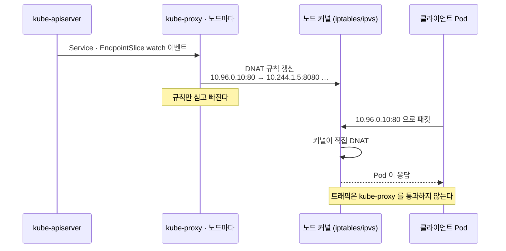

- ClusterIP는 **아무 인터페이스에도 붙어 있지 않은 가상 IP**다. ping이 안 된다
- kube-proxy가 **모든 노드의 커널에 규칙**을 심는다:
  "목적지가 `10.96.0.10:80`이면 → `10.244.1.5:8080` 또는 `10.244.2.7:8080` 으로
  DNAT(Destination NAT — 목적지 주소를 바꿔치기)"
- 그래서 **트래픽이 어떤 프록시도 거치지 않는다.** 커널이 직접 바꾼다

```bash
# 노드에서 직접 확인 (iptables 모드)
sudo iptables -t nat -L KUBE-SERVICES -n | head
sudo ipvsadm -Ln                      # ipvs 모드일 때
```

:::caution[함정]
**ClusterIP에 ping이 안 되는 것은 정상이다.**
규칙은 TCP/UDP 포트에 대해서만 있다. 확인은 `curl`이나 `wget`으로 해야 한다.
:::

## Service 타입 네 가지

<CardGrid>
<Card title="ClusterIP (기본)" icon="laptop">
클러스터 **내부만**.
가상 IP 하나를 준다.
</Card>
<Card title="NodePort" icon="window">
클러스터 **외부**에서.
모든 노드의 특정 포트를 연다.
</Card>
<Card title="LoadBalancer" icon="cloud-download">
클러스터 **외부**에서.
클라우드 LB를 프로비저닝한다.
</Card>
<Card title="ExternalName" icon="external">
프록시하지 않는다.
**DNS CNAME만** 반환한다.
</Card>
</CardGrid>

**포함 관계다.** NodePort는 ClusterIP를 포함하고, LoadBalancer는 NodePort를 포함한다.
LoadBalancer를 만들면 ClusterIP도, NodePort도 함께 생긴다.

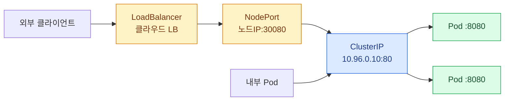

## ClusterIP

```yaml
apiVersion: v1
kind: Service
metadata:
  name: web-svc
spec:
  type: ClusterIP
  selector:
    app: web              # 이 라벨을 가진 Pod들에게 보낸다
  ports:
    - name: http
      protocol: TCP
      port: 80            # Service가 여는 포트
      targetPort: 8080    # Pod의 포트
```

```bash
kubectl expose deploy web --port=80 --target-port=8080 --name=web-svc
kubectl create svc clusterip web-svc --tcp=80:8080
```

시험 중 YAML을 직접 써야 하면 공식 [Service 문서](https://kubernetes.io/docs/concepts/services-networking/service/)의
예시를 복사해 이름·셀렉터·포트만 바꾸는 게 가장 빠르다.

### 세 포트를 구분하자

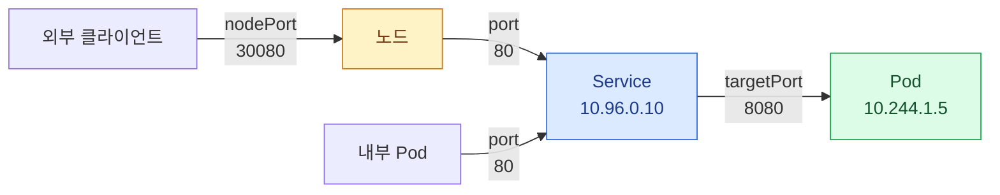

`port` = Service의 포트 · `targetPort` = Pod의 포트 · `nodePort` = 노드의 포트

### targetPort는 이름으로도 쓸 수 있다

```yaml
# Pod
containers:
  - name: app
    ports:
      - name: http-api        # 이름을 붙인다
        containerPort: 8080
```

```yaml
# Service
ports:
  - port: 80
    targetPort: http-api      # 숫자 대신 이름
```

- Pod마다 포트가 달라도 **같은 Service로 묶을 수 있다**
- 포트를 바꿔도 Service를 안 고쳐도 된다

:::caution[함정]
`targetPort`를 생략하면 **`port`와 같은 값**이 된다.
`--port=80` 만 주고 Pod이 8080을 열고 있으면 **연결이 안 된다.**
"Service는 만들어졌는데 응답이 없다"의 흔한 원인.
:::

## 셀렉터와 엔드포인트 — 실제 연결의 실체

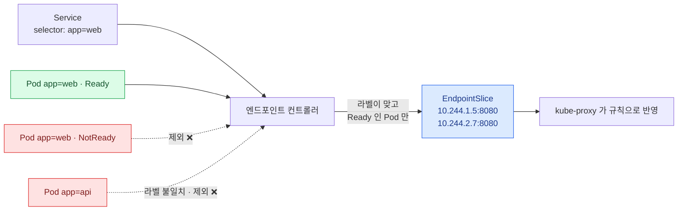

```bash
kubectl get endpoints web-svc
# NAME      ENDPOINTS                          AGE
# web-svc   10.244.1.5:8080,10.244.2.7:8080    5m

kubectl get endpointslices -l kubernetes.io/service-name=web-svc
kubectl describe svc web-svc        # Endpoints 줄을 본다
```

- 엔드포인트 컨트롤러가 **셀렉터에 맞고 Ready인 Pod의 IP**를 여기에 채운다
- **`ENDPOINTS`가 비어 있으면 Service는 아무 데도 못 보낸다**

:::tip[시험]
**"Service가 동작하지 않는다"의 1번 확인은 엔드포인트다.**

```bash
kubectl get endpoints web-svc
```
비어 있다면 원인은 셋: ① 셀렉터 라벨 불일치 ② Pod이 Ready가 아님 ③ Pod이 아예 없음
:::

### EndpointSlice — Endpoints의 후계자

- 옛 `Endpoints`는 **오브젝트 하나에 모든 IP**를 담았다 → Pod이 수천 개면 갱신 비용이 폭발
- `EndpointSlice`는 **100개씩 쪼개서** 담는다. 지금은 이쪽이 실제 데이터 소스다
- `kubectl get endpoints`는 여전히 동작한다 (호환용으로 유지)

```bash
kubectl get endpointslices
# NAME            ADDRESSTYPE   PORTS   ENDPOINTS               AGE
# web-svc-x7k2p   IPv4          8080    10.244.1.5,10.244.2.7   5m

kubectl get endpointslice web-svc-x7k2p -o yaml
# endpoints:
#   - addresses: ["10.244.1.5"]
#     conditions: { ready: true, serving: true, terminating: false }
#     nodeName: node01
```

**`conditions.ready`가 readinessProbe의 결과다.** 이 한 줄이 트래픽을 켜고 끈다.

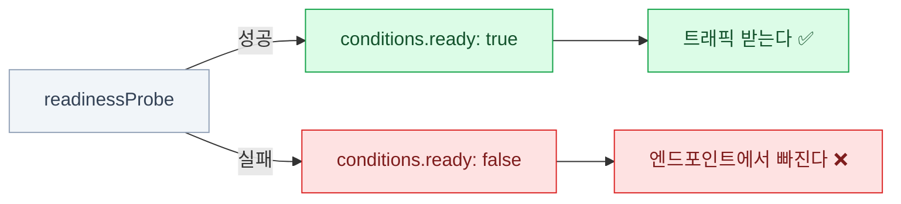

## 그 밖의 타입과 변형

### NodePort

```yaml
spec:
  type: NodePort
  selector:
    app: web
  ports:
    - port: 80
      targetPort: 8080
      nodePort: 30080       # 생략하면 30000-32767 중에서 자동 할당
```

**모든 노드가 그 포트를 연다.** Pod이 없는 노드로 가도 전달된다.

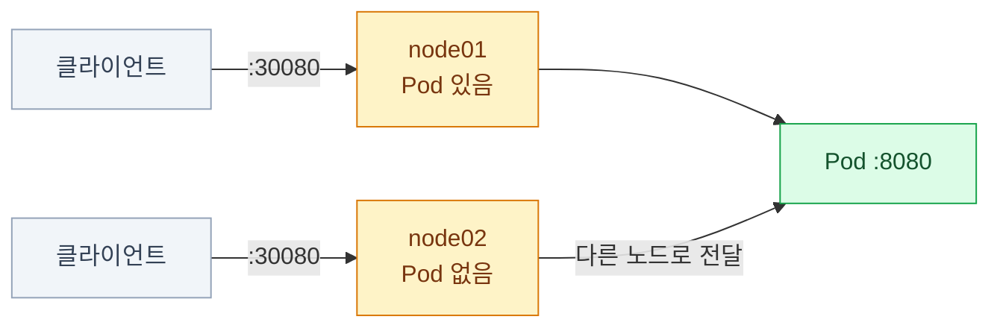

- 범위는 기본 **30000-32767** (apiserver의 `--service-node-port-range`로 변경)

```bash
kubectl create svc nodeport web-svc --tcp=80:8080 --node-port=30080
curl http://<노드IP>:30080
```

:::caution[함정]
범위 밖의 `nodePort`를 쓰면 **생성이 거부**된다.
그리고 **포트가 이미 쓰이고 있어도** 거부된다.
시험에서 특정 포트를 지정하라고 하면 범위 안인지 먼저 확인하자.
:::

### LoadBalancer와 ExternalName

```yaml
# LoadBalancer
spec:
  type: LoadBalancer
  selector:
    app: web
  ports:
    - port: 80
      targetPort: 8080
```

- 클라우드 컨트롤러가 **실제 LB를 프로비저닝**하고 `status.loadBalancer.ingress`에 주소를 채운다
- **온프레미스에는 그 컨트롤러가 없다** → `EXTERNAL-IP`가 영원히 `<pending>`
  (MetalLB 같은 것을 설치해야 한다)

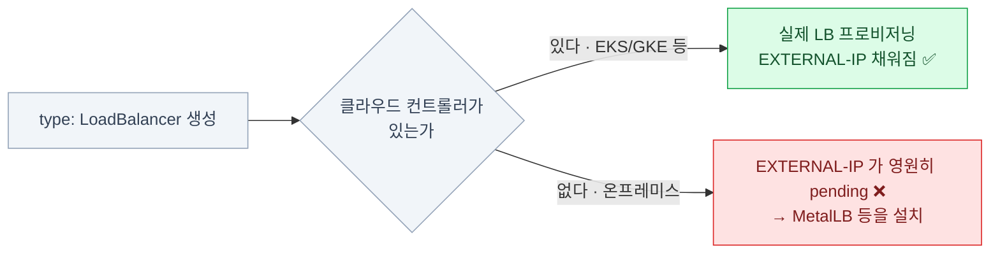

```yaml
# ExternalName — 프록시하지 않는다. DNS CNAME만 준다
spec:
  type: ExternalName
  externalName: db.example.com
```

클러스터 안에서 `my-db.default.svc.cluster.local` 을 조회하면
`db.example.com` 으로 CNAME이 돌아온다. **셀렉터도 엔드포인트도 없다.**

### 셀렉터 없는 Service — 외부를 클러스터 이름으로

```yaml
apiVersion: v1
kind: Service
metadata:
  name: external-db
spec:
  ports:
    - port: 5432
      targetPort: 5432
# selector 없음 → 엔드포인트를 직접 만든다
---
apiVersion: discovery.k8s.io/v1
kind: EndpointSlice
metadata:
  name: external-db-1
  labels:
    kubernetes.io/service-name: external-db     # ← 이 라벨로 연결된다
addressType: IPv4
ports:
  - port: 5432
endpoints:
  - addresses: ["192.168.10.50"]
```

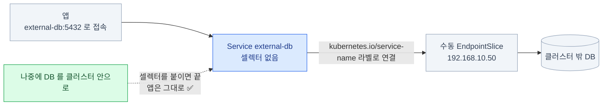

- 클러스터 밖의 DB를 **`external-db`라는 이름으로** 부를 수 있다
- 나중에 DB를 클러스터 안으로 옮겨도 **앱은 그대로**다 — 마이그레이션 기법

### headless Service

<Tabs>
<TabItem label="일반 ClusterIP">

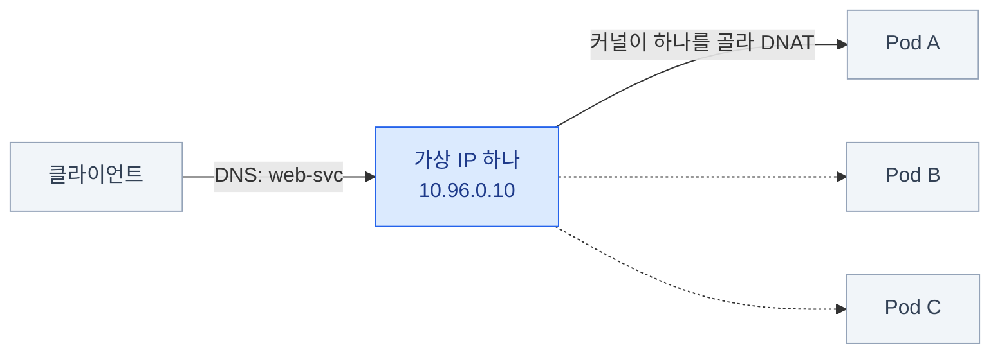

DNS가 **ClusterIP 하나**를 준다. 어느 Pod으로 갈지는 커널이 정한다.

</TabItem>
<TabItem label="headless (clusterIP: None)">

```yaml
spec:
  clusterIP: None
  selector:
    app: db
  ports:
    - port: 5432
```

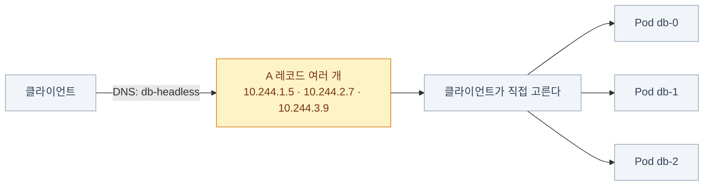

- **가상 IP를 만들지 않는다.** kube-proxy 규칙도 없다
- DNS 조회 시 **Pod IP 목록을 그대로** 반환한다 (A 레코드 여러 개)
- 클라이언트가 **직접 어느 Pod에 붙을지 고른다**

</TabItem>
</Tabs>

**쓰는 곳**

- StatefulSet의 Pod별 안정적 DNS (5장)
- 클라이언트 측 로드밸런싱 (gRPC 등)
- 각 인스턴스를 구분해야 하는 클러스터형 소프트웨어 (Kafka, Cassandra…)

headless에 **셀렉터까지 없는** 조합이면 — 앞 절의 수동 EndpointSlice와 합쳐진 경우 —
DNS는 수동으로 등록한 IP 목록을 그대로 반환한다.

## 동작 방식과 옵션

### kube-proxy 모드

| 모드 | 방식 | 특징 |
|---|---|---|
| **iptables** | NAT 규칙 체인 | 기본값. 서비스가 많으면 규칙이 선형적으로 늘어난다 |
| **ipvs** | 커널 L4 로드밸런서 | 대규모에 유리. 여러 알고리즘(rr, lc, sh…) |
| **nftables** | iptables의 후속 | 신규 클러스터용. 성능 개선 |

```bash
kubectl get ds kube-proxy -n kube-system
kubectl get cm kube-proxy -n kube-system -o yaml | grep -i mode
kubectl logs -n kube-system -l k8s-app=kube-proxy --tail=20
```

**어느 모드든 동작은 같다.** 트래픽 경로가 아니라
**규칙을 심는 방식**이 다를 뿐이다.

### sessionAffinity와 externalTrafficPolicy

**`sessionAffinity`** — 기본값은 매 요청을 아무 Pod에나 분배하는 것이라,
로그인 세션처럼 **Pod 안에 상태가 남는 앱**은 요청이 다른 Pod으로 가면 깨진다.
같은 클라이언트를 같은 Pod에 고정하고 싶을 때 `ClientIP`를 준다.

```yaml
spec:
  sessionAffinity: ClientIP           # None(기본) | ClientIP
  sessionAffinityConfig:
    clientIP:
      timeoutSeconds: 10800

  externalTrafficPolicy: Local        # Cluster(기본) | Local
```

**`externalTrafficPolicy`** (NodePort/LoadBalancer에만 해당)

<Tabs>
<TabItem label="Cluster (기본)">

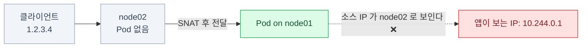

어느 노드로 와도 **다른 노드의 Pod으로도** 보낸다.
부하는 고르지만 **소스 IP가 SNAT(Source NAT — 출발지 주소를 바꿔치기)로 가려진다.**

</TabItem>
<TabItem label="Local">

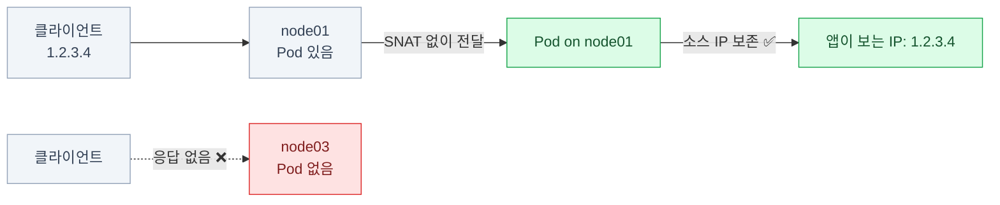

**그 노드의 Pod에만** 보낸다. **소스 IP가 보존**되지만
Pod 없는 노드는 응답하지 않는다.

</TabItem>
</Tabs>

:::tip[시험]
"클라이언트 실제 IP를 봐야 한다"면 `Local`이 정답이다.
대신 각 노드에 Pod이 있어야 하니 **DaemonSet과 함께** 쓰는 것이 정석.
:::

### 여러 포트를 가진 Service

```yaml
spec:
  selector:
    app: web
  ports:
    - name: http          # 포트가 2개 이상이면 name이 필수다
      port: 80
      targetPort: 8080
    - name: https
      port: 443
      targetPort: 8443
    - name: metrics
      port: 9090
      targetPort: 9090
      protocol: TCP
```

- **포트가 둘 이상이면 `name`을 반드시 줘야 한다** (하나면 생략 가능)
- 이 이름은 DNS SRV 레코드와 Ingress의 `port.name`에서 참조된다

```bash
kubectl create svc clusterip web-svc --tcp=80:8080 --tcp=443:8443
```

## 진단

### Service 진단 절차

<Steps>

1. **Service가 존재하고 셀렉터가 맞는가**

   ```bash
   kubectl get svc web-svc
   kubectl describe svc web-svc            # Selector / Endpoints 확인
   ```

2. **엔드포인트가 채워졌는가** — ★ 여기서 대부분 갈린다

   ```bash
   kubectl get endpoints web-svc
   ```

3. **Pod 라벨이 셀렉터와 일치하는가**

   ```bash
   kubectl get pods -l app=web --show-labels
   ```

4. **Pod이 Ready인가** — readinessProbe 실패면 엔드포인트에서 빠진다

   ```bash
   kubectl get pods -l app=web
   ```

5. **Pod에 직접 붙어보기** — Service를 건너뛴다

   ```bash
   kubectl run tmp --image=busybox:1.36 --rm -it --restart=Never -- \
     wget -qO- http://10.244.1.5:8080
   ```

6. **Service를 통해 붙어보기**

   ```bash
   kubectl run tmp --image=busybox:1.36 --rm -it --restart=Never -- \
     wget -qO- http://web-svc.default.svc.cluster.local
   ```

</Steps>

### 어디서 끊겼는지 판별하기

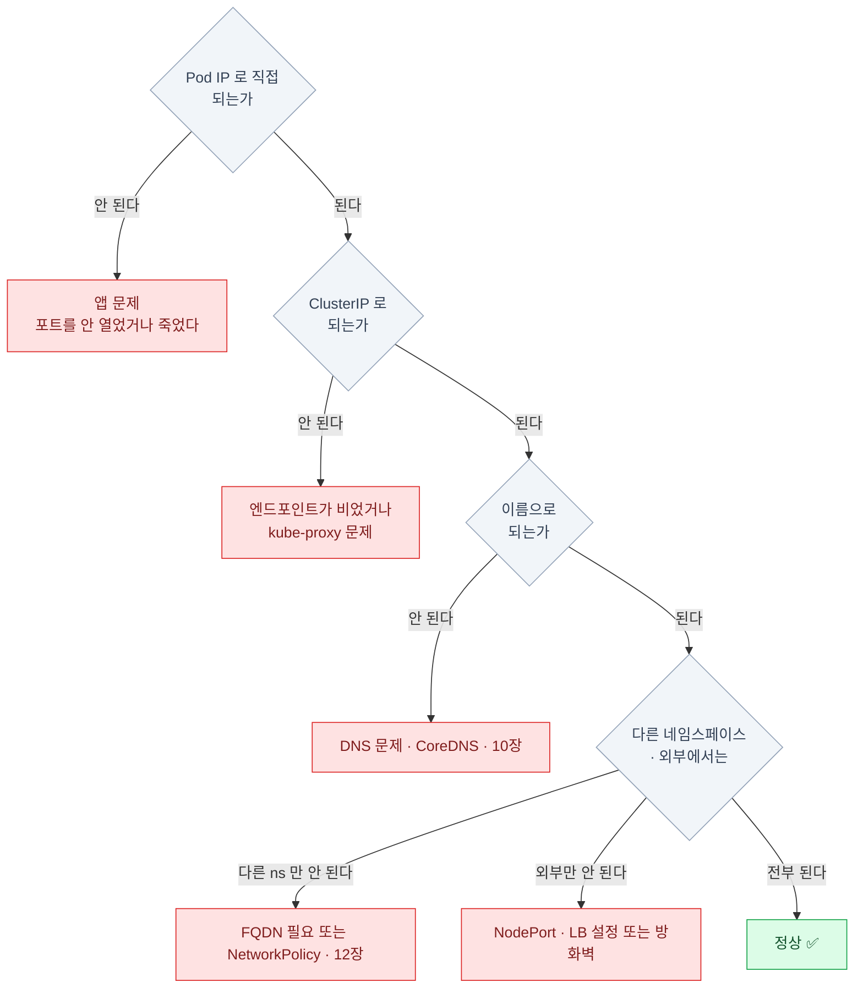

| 결과 | 원인 |
|---|---|
| Pod IP 직접도 안 된다 | **앱 문제** — 포트를 안 열었거나 죽었다 |
| Pod IP는 되는데 ClusterIP가 안 된다 | **엔드포인트 비어 있음** 또는 **kube-proxy 문제** |
| ClusterIP는 되는데 이름이 안 된다 | **DNS 문제** — CoreDNS를 본다 (10장) |
| 다른 네임스페이스에서만 안 된다 | **FQDN(Fully Qualified Domain Name — 네임스페이스까지 붙인 완전한 이름, 10장) 필요** 또는 **NetworkPolicy** (12장) |
| 외부에서만 안 된다 | **NodePort/LB 설정** 또는 방화벽 |

:::tip[시험]
이 표가 사실상 **네트워킹 트러블슈팅 문제의 답안지**다.
안쪽에서 바깥으로 한 겹씩 벗기며 **어디서 끊기는지**만 찾으면 된다.
:::

## 9장 요약

- Service는 프로세스가 아니라 **커널에 심긴 규칙**이다. **ping은 안 된다**
- 타입은 **포함 관계**: LoadBalancer ⊃ NodePort ⊃ ClusterIP
- **`port` / `targetPort` / `nodePort` 세 포트를 구분**하라. targetPort 누락이 단골 실수
- **`kubectl get endpoints`가 진단의 1번**이다. 비었으면 라벨 또는 Ready 문제
- 지금의 실제 데이터는 **EndpointSlice**. `conditions.ready`가 readinessProbe 결과다
- **headless(`clusterIP: None`)** 는 Pod IP를 직접 준다 — StatefulSet의 짝
- **셀렉터 없는 Service + 수동 EndpointSlice**로 외부 자원을 클러스터 이름으로 감쌀 수 있다
- 소스 IP가 필요하면 **`externalTrafficPolicy: Local`**

:::note[손 연습]
이 장 범위의 KodeKloud 실습 풀이 — [CKA 실습 5장 · Service와 DNS](/cka-udemy/05-services-dns/)
:::
