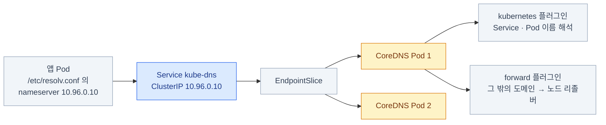
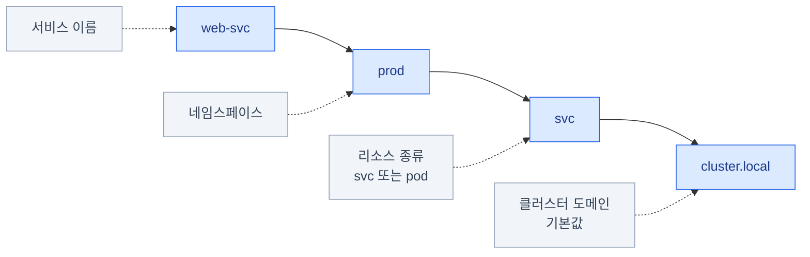
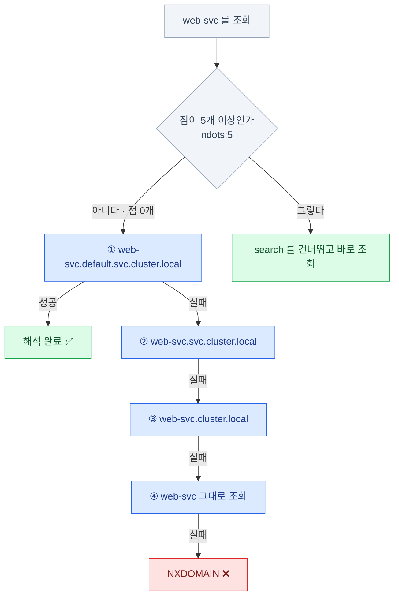
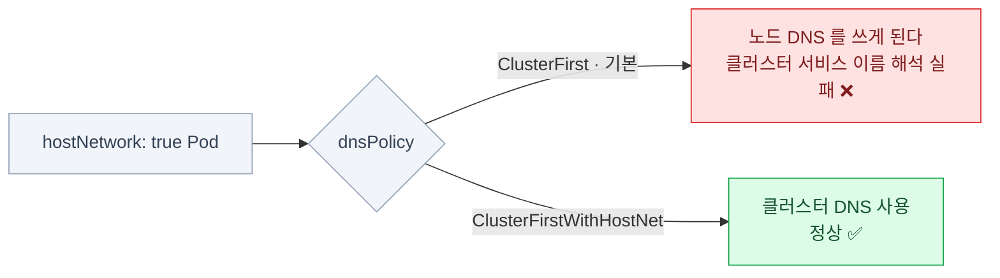
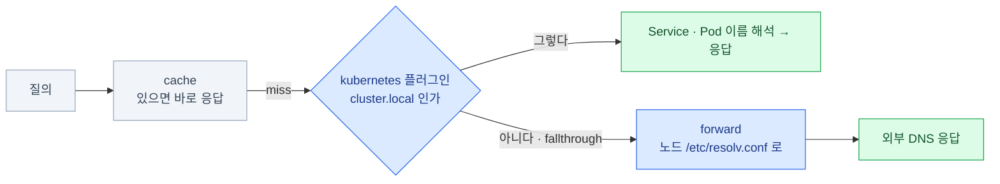
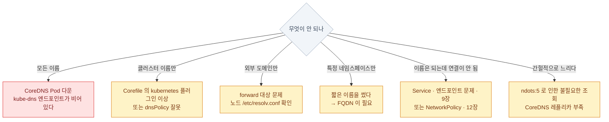

import { Steps, Card, CardGrid, Tabs, TabItem, Badge } from '@astrojs/starlight/components';

> 이름이 IP가 되는 과정

Pod은 서로를 IP가 아니라 `web-svc` 같은 **이름**으로 부른다 (9장).
그 이름을 IP로 바꿔 주는 것이 없으면 클러스터 안의 모든 이름 호출이 실패한다 —
그 일을 하는 것이 **CoreDNS**다.

## CoreDNS는 어디에 있나

```bash
kubectl get deploy coredns -n kube-system
kubectl get pods -n kube-system -l k8s-app=kube-dns
kubectl get svc kube-dns -n kube-system
# NAME       TYPE        CLUSTER-IP   PORT(S)
# kube-dns   ClusterIP   10.96.0.10   53/UDP,53/TCP,9153/TCP
```

**특별한 시스템이 아니라 그냥 Deployment + Service다.** 그래서 똑같이 고장 나고 똑같이 고친다.



- CoreDNS는 **평범한 Deployment**다. 보통 2개의 레플리카로 돈다
- 앞에 **`kube-dns`라는 Service**가 있다 (이름이 옛날 그대로다)
- 그 ClusterIP가 **모든 Pod의 네임서버**로 들어간다
- 레코드는 어디서 얻나 — CoreDNS도 다른 컴포넌트처럼 **kube-apiserver를 watch한다**
  (0장의 루프). Service가 생기면 DNS 레코드가 따라 생기고, 별도의 등록 절차가 없는 이유다

:::caution[함정]
**CoreDNS Pod이 죽으면 클러스터 전체의 이름 해석이 죽는다.**
"갑자기 모든 게 안 된다"의 유력 후보. 그런데 **IP로는 전부 정상**이라 헷갈린다.
:::

## 이름 규칙

이름이 겹치면 어디로 보낼지 알 수 없다 — 네임스페이스가 다른 두 `web-svc`가
같은 이름일 수는 없다. 그래서 클러스터의 모든 Service에는 **겹치지 않는 정식 이름**이
계층으로 붙는다. 이것이 FQDN(Fully Qualified Domain Name — 상위 도메인까지 다 붙인
완전한 이름)이고, 이렇게 생겼다.



| 어디서 부르나 | 쓸 수 있는 이름 |
|---|---|
| 같은 네임스페이스 | `web-svc` |
| 다른 네임스페이스 | `web-svc.prod` |
| 어디서나 (완전한 이름) | `web-svc.prod.svc.cluster.local` |

**headless Service의 Pod별 이름**

`파드이름.서비스이름.네임스페이스.svc.cluster.local`\
예: `db-0.db-headless.default.svc.cluster.local`

headless Service(9장)에서만 나오는 이름이다. Pod 이름이 `db-0`, `db-1`처럼
고정되는 StatefulSet(5장)과 짝을 이뤄, **특정 인스턴스를 이름으로 지목**할 때 쓴다.
일반 ClusterIP Service에는 이런 Pod별 이름이 생기지 않는다.

:::tip[시험]
"다른 네임스페이스의 서비스에 연결하시오" 문제는
**이름에 네임스페이스를 붙이는 것**이 답인 경우가 많다.
:::

## Pod 안의 resolv.conf

Pod이 어느 네임서버에 물어볼지는 컨테이너 이미지가 아니라
**Pod을 만들 때 kubelet이 써 넣는 resolv.conf가** 정한다 (2장의 노드 컴포넌트).
아래 `dnsPolicy`에 따라 내용이 달라지므로 Pod마다 다를 수 있다 —
DNS가 이상하면 이 파일부터 열어보는 이유다.

```bash
kubectl exec -it web -- cat /etc/resolv.conf
```

```
nameserver 10.96.0.10
search default.svc.cluster.local svc.cluster.local cluster.local
options ndots:5
```

- **`nameserver`** — `kube-dns` Service의 ClusterIP
- **`search`** — 짧은 이름을 순서대로 붙여본다
- **`ndots:5`** — 점이 5개 미만인 이름은 **search 도메인을 먼저 시도**한다

### 짧은 이름이 해석되는 순서



:::caution[함정]
`ndots:5` 때문에 `api.example.com`(점 2개)을 조회하면
**search 도메인 3개를 먼저 다 실패한 뒤에야** 진짜 조회를 한다.
외부 도메인 응답이 느린 흔한 원인이다. 끝에 점을 찍으면(`api.example.com.`) 바로 조회한다.
:::

### dnsPolicy와 dnsConfig

위 resolv.conf는 kubelet이 자동으로 써 주지만, 그 기본값이 안 맞는 Pod이 있다 —
노드의 네트워크를 그대로 쓰는 Pod, 사내 DNS를 먼저 봐야 하는 Pod처럼.
**어떤 규칙으로 써 넣을지를 고르는 스위치**가 `dnsPolicy`, 그 결과를 항목 단위로
덧쓰는 것이 `dnsConfig`다.

```yaml
spec:
  dnsPolicy: ClusterFirst        # 기본
  dnsConfig:
    nameservers: ["8.8.8.8"]
    searches: ["custom.local"]
    options:
      - name: ndots
        value: "2"
```

`dnsConfig` 필드 구조는 외우기보다 시험 중 공식
[DNS for Services and Pods 문서](https://kubernetes.io/docs/concepts/services-networking/dns-pod-service/)의
예시 YAML을 복사해 값만 바꾸는 편이 빠르다.

<CardGrid>
<Card title="ClusterFirst" icon="approve-check">
클러스터 DNS를 먼저. **기본값**이다.
</Card>
<Card title="ClusterFirstWithHostNet" icon="warning">
`hostNetwork: true`인 Pod도
클러스터 DNS를 쓰게 한다.
</Card>
<Card title="Default" icon="error">
**노드의 `/etc/resolv.conf`를 그대로** 쓴다.
이름과 달리 기본값이 **아니다.**
</Card>
<Card title="None" icon="setting">
전부 `dnsConfig`로 직접 지정한다.
</Card>
</CardGrid>

넷 중 시험 단골은 아래의 `ClusterFirstWithHostNet` 함정이다.
`Default`와 `None`은 깊게 팔 필요 없이 이름과 역할만 구분해 두면 된다 —
특히 `Default`가 기본값이 **아니라는** 점만 조심한다.



:::caution[함정]
`hostNetwork: true` Pod은
`dnsPolicy`를 `ClusterFirstWithHostNet`으로 바꾸지 않으면
**클러스터 서비스 이름을 못 찾는다.** 노드의 DNS를 쓰게 되기 때문이다.
:::

## Corefile — CoreDNS 설정

CoreDNS의 동작을 바꾸고 싶을 때 — 사내 DNS로 존을 넘기거나, 특정 이름을 고정하거나 —
코드를 고치는 게 아니라 설정을 고친다. **평범한 Deployment이니 설정도 평범한 ConfigMap이다.**
`kube-system`의 `coredns` ConfigMap에 든 설정 파일이 Corefile이고,
질의를 어떻게 처리할지가 전부 여기 적혀 있다.

```bash
kubectl get cm coredns -n kube-system -o yaml
kubectl edit cm coredns -n kube-system
```

```
.:53 {
    errors
    health { lameduck 5s }
    ready
    kubernetes cluster.local in-addr.arpa ip6.arpa {
        pods insecure
        fallthrough in-addr.arpa ip6.arpa
        ttl 30
    }
    prometheus :9153
    forward . /etc/resolv.conf { max_concurrent 1000 }   # 외부 질의는 노드 DNS로
    cache 30
    loop
    reload
    loadbalance
}
```

**질의 하나가 이 플러그인 체인을 순서대로 통과한다.**



- **`kubernetes` 플러그인**이 Service/Pod 이름을 담당한다
- **`forward`** 가 그 밖의 도메인을 노드의 리졸버로 넘긴다
- `reload` 덕분에 ConfigMap을 고치면 **재시작 없이 반영**된다 (몇십 초)
- 그 밖의 플러그인(errors·health·ready·prometheus·loop·loadbalance)은
  로깅·헬스체크·메트릭 노출 같은 운영 보조다 — 이름만 알아두면 된다.
  시험 관점의 중심은 `kubernetes`와 `forward` 둘이다
- `kubernetes` 안의 `pods insecure`는 `10-244-1-5.default.pod.cluster.local` 같은
  **Pod IP 기반 이름**을 켜는 옵션이다 — 실무에서 거의 안 쓴다. 이런 옵션이 있다는 것만 알아두자

### 특정 도메인을 다른 곳으로 보내기<Badge text="시험 비중 낮음" variant="note" />

기본 Corefile은 클러스터 밖 도메인을 전부 노드의 리졸버로 넘긴다. 그런데 사내 존
하나만 별도의 DNS 서버가 알고 있다면 그 넘김이 실패한다 — **존별로 목적지를 갈라주는**
스탠자(존 하나에 대한 설정 블록)를 추가하는 것이 해법이다.

```
# Corefile에 스탠자를 추가한다
example.internal:53 {
    errors
    cache 30
    forward . 192.168.10.53
}
```

- 사내 DNS로 특정 존만 보낼 때 쓰는 표준 패턴이다
- `hosts` 플러그인으로 정적 매핑도 가능하다 — 리눅스의 `/etc/hosts`를 클러스터 DNS에
  넣은 것이라고 보면 된다. `fallthrough`는 여기서 못 찾은 이름은 다음 플러그인으로
  넘기라는 뜻이다 (빼면 못 찾은 이름이 그대로 실패한다)

```
hosts {
    192.168.10.50 legacy.internal
    fallthrough
}
```

수정 후에는 CoreDNS 로그로 문법 오류가 없는지 확인한다.
`kubectl logs -n kube-system -l k8s-app=kube-dns`

## DNS 진단

"연결이 안 된다"는 증상만으로는 이름이 안 풀린 것인지, 이름은 풀렸는데 Service가
잘못된 것인지 구분되지 않는다 (9장의 진단 표와 같은 문제다). 그래서
**항상 되는 이름 하나를 기준점으로 잡고** 거기서부터 층을 벗긴다.

<Steps>

1. **디버그 Pod에서 조회** — 기준점 테스트부터

   ```bash
   kubectl run tmp --image=busybox:1.36 --rm -it --restart=Never -- sh
     nslookup kubernetes.default          # ★ 이게 되면 DNS 는 정상
     nslookup web-svc
     nslookup web-svc.default.svc.cluster.local
     cat /etc/resolv.conf
   ```

2. **CoreDNS 자체 상태**

   ```bash
   kubectl get pods -n kube-system -l k8s-app=kube-dns
   kubectl logs -n kube-system -l k8s-app=kube-dns --tail=50
   kubectl get svc kube-dns -n kube-system
   kubectl get endpoints kube-dns -n kube-system     # ★ 비어 있으면 CoreDNS Pod이 없다
   ```

3. **설정 확인**

   ```bash
   kubectl get cm coredns -n kube-system -o yaml
   ```

</Steps>

:::tip[시험]
`nslookup kubernetes.default` 가 성공하면 DNS는 정상이다.
이 이름은 **어느 클러스터에나 항상 존재**하므로 기준점으로 쓰기 좋다.
:::

### DNS 증상별 원인



| 증상 | 원인 후보 |
|---|---|
| **모든** 이름이 안 된다 | CoreDNS Pod 다운, `kube-dns` 엔드포인트 비어 있음 |
| 클러스터 이름만 안 된다 | Corefile의 `kubernetes` 플러그인 이상, `dnsPolicy` 잘못 |
| 외부 도메인만 안 된다 | `forward` 대상(노드 resolv.conf) 문제 |
| 특정 네임스페이스만 안 된다 | 짧은 이름을 썼다 → **FQDN 필요** |
| DNS는 되는데 연결이 안 된다 | Service/엔드포인트 문제 (9장) 또는 **NetworkPolicy** (12장) |
| 간헐적으로 느리다 | `ndots:5`로 인한 불필요한 조회, CoreDNS 레플리카 부족 |

:::caution[함정]
**NetworkPolicy로 egress를 막으면 DNS도 막힌다.**
UDP 53번을 명시적으로 허용하지 않으면 이름 해석부터 실패한다. 12장에서 다룬다.
:::

## 10장 요약

- CoreDNS는 **평범한 Deployment**, 앞의 Service 이름은 여전히 **`kube-dns`**
- 이름 규칙: **`서비스.네임스페이스.svc.cluster.local`**
- Pod의 `/etc/resolv.conf`에 **네임서버 + search 도메인 + `ndots:5`** 가 들어간다
- **`ndots:5`가 외부 도메인 조회를 느리게** 만든다 — 끝에 점을 찍으면 우회
- **`hostNetwork` Pod은 `ClusterFirstWithHostNet`** 이 필요하다
- 설정은 `kube-system`의 **`coredns` ConfigMap(Corefile)**. `reload`로 자동 반영
- 기준점 테스트: **`nslookup kubernetes.default`**
- **egress NetworkPolicy는 DNS(UDP 53)를 반드시 허용**해야 한다

:::note[손 연습]
이 장 범위의 KodeKloud 실습 풀이 — [CKA 실습 5장 · Service와 DNS](/cka-udemy/05-services-dns/)
:::
