import { Steps, Card, CardGrid, Tabs, TabItem } from '@astrojs/starlight/components';

> HTTP 트래픽을 클러스터 안으로

## Service만으로는 부족한 이유

Service는 **L4**(전송 계층 — IP와 포트만 본다)에서 동작한다.
호스트 이름이나 URL 경로로 트래픽을 나누려면
**L7**(애플리케이션 계층 — HTTP 호스트·경로·헤더까지 본다)이 필요하다.

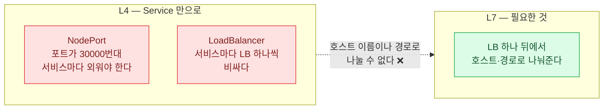

**LB 하나 뒤에서 호스트/경로로 여러 서비스에 나눠주는 L7 계층**이 필요하다.
그것이 Ingress이고, 그 후속이 Gateway API다.

:::tip[시험]
커리큘럼에 **둘 다** 있다.
"Ingress 컨트롤러와 Ingress 리소스" + **"Gateway API로 Ingress 트래픽 관리"**.
Gateway API가 최근 추가된 항목이니 특히 챙길 것.
:::

## Ingress = 리소스 + 컨트롤러

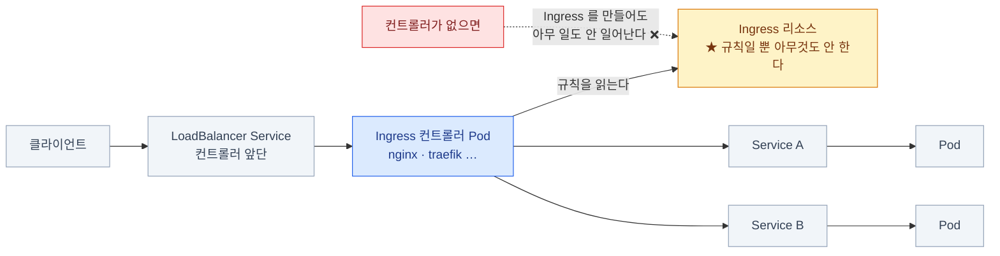

- **Ingress 리소스는 규칙일 뿐이다.** 아무것도 하지 않는다
- 실제 라우팅은 **Ingress 컨트롤러 Pod**(nginx 등)이 한다
- **컨트롤러가 없으면 Ingress를 만들어도 아무 일도 안 일어난다**

### Ingress 리소스

```yaml
apiVersion: networking.k8s.io/v1
kind: Ingress
metadata:
  name: web
spec:
  ingressClassName: nginx
  rules:
    - host: shop.example.com
      http:
        paths:
          - path: /api
            pathType: Prefix
            backend:
              service:
                name: api-svc
                port: { number: 8080 }
          - path: /
            pathType: Prefix
            backend:
              service:
                name: web-svc
                port: { number: 80 }
```

```bash
kubectl create ingress web --class=nginx \
  --rule="shop.example.com/api*=api-svc:8080" --rule="shop.example.com/*=web-svc:80"
```

시험 중에는 공식 [Ingress 문서](https://kubernetes.io/docs/concepts/services-networking/ingress/)의
예시 YAML을 복사해 이름·경로·서비스·포트만 바꾸는 게 가장 빠르다.

### pathType — 세 가지

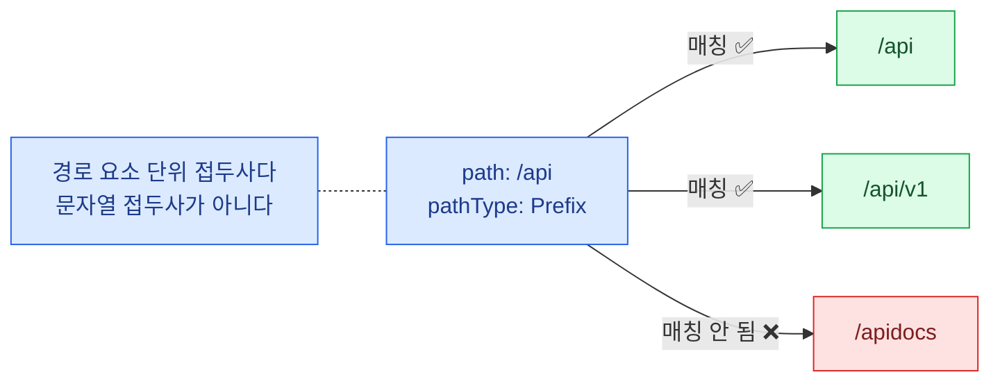

| pathType | 매칭 |
|---|---|
| **`Prefix`** | 경로 요소 단위 접두사. `/api` 는 `/api`, `/api/v1` 에 매칭. `/apidocs` 는 **안 된다** |
| **`Exact`** | 완전히 일치해야 한다 |
| **`ImplementationSpecific`** | 컨트롤러가 알아서 (nginx는 정규식을 허용) |

- **`pathType`은 필수 필드다.** 빠뜨리면 생성이 거부된다
- 여러 규칙이 매칭되면 **가장 긴 경로**가 이긴다

:::caution[함정]
`Prefix`는 **문자열 접두사가 아니라 경로 요소 단위**다.
`/api` 규칙이 `/apidocs` 를 잡을 거라 기대하면 틀린다.
:::

```bash
kubectl get ingress
kubectl describe ingress web       # Rules와 Events, 백엔드 상태를 본다
```

### IngressClass — 어느 컨트롤러가 처리하나

```yaml
apiVersion: networking.k8s.io/v1
kind: IngressClass
metadata:
  name: nginx
  annotations:
    ingressclass.kubernetes.io/is-default-class: "true"
spec:
  controller: k8s.io/ingress-nginx
```

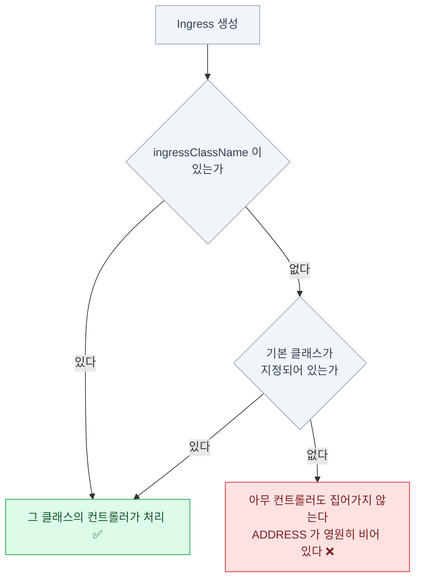

```bash
kubectl get ingressclass
```

- Ingress에 `spec.ingressClassName`으로 지정한다
- 기본 클래스가 지정되어 있으면 생략 가능하다
- **옛날 방식**인 `kubernetes.io/ingress.class` 애노테이션은 **deprecated**다

:::caution[함정]
**`ingressClassName`을 안 쓰고 기본 클래스도 없으면**
아무 컨트롤러도 이 Ingress를 집어가지 않는다. `ADDRESS`가 영원히 비어 있다.
"Ingress를 만들었는데 아무 일도 안 일어난다"의 1번 원인.
:::

### Ingress TLS

```bash
kubectl create secret tls web-tls --cert=./tls.crt --key=./tls.key
```

```yaml
spec:
  ingressClassName: nginx
  tls:
    - hosts:
        - shop.example.com
      secretName: web-tls
  rules:
    - host: shop.example.com
      http:
        paths:
          - path: /
            pathType: Prefix
            backend:
              service:
                name: web-svc
                port:
                  number: 80
```

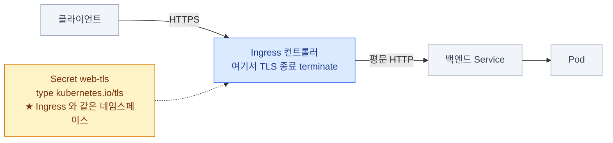

- Secret은 **`kubernetes.io/tls` 타입**이어야 하고 **Ingress와 같은 네임스페이스**에 있어야 한다
- TLS는 컨트롤러에서 종료(terminate)되고, 백엔드로는 평문으로 간다

### 기본 백엔드와 애노테이션

```yaml
spec:
  defaultBackend:            # 어느 규칙에도 안 맞으면 여기로
    service:
      name: fallback-svc
      port:
        number: 80
```

**애노테이션은 컨트롤러마다 다르다** — 표준이 아니다.

```yaml
metadata:
  annotations:
    nginx.ingress.kubernetes.io/rewrite-target: /$2
    nginx.ingress.kubernetes.io/ssl-redirect: "true"
    nginx.ingress.kubernetes.io/proxy-body-size: 50m
```

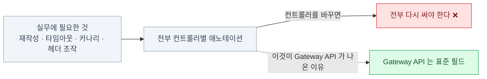

**바로 이것이 Ingress의 한계다.** 재작성·타임아웃·카나리·헤더 조작 —
실무에 필요한 거의 모든 것이 **표준 밖의 애노테이션**이라
컨트롤러를 바꾸면 전부 다시 써야 한다.

## Gateway API — Ingress의 후속

Ingress의 문제를 세 방향에서 푼다.

<CardGrid>
<Card title="1 · 역할 분리" icon="puzzle">
인프라 담당자와 앱 개발자가
**다른 리소스**를 만진다.
</Card>
<Card title="2 · 표현력" icon="setting">
헤더 매칭·가중치 분배·재작성이
**표준 필드**다. 애노테이션이 아니다.
</Card>
<Card title="3 · 프로토콜 확장" icon="random">
HTTP뿐 아니라 gRPC·TCP·TLS를
같은 모델로.
</Card>
</CardGrid>

**Gateway API는 CRD(CustomResourceDefinition — 쿠버네티스에 새 리소스 종류를 추가하는 확장, 17장)로 제공된다.**
클러스터에 기본 탑재가 아니다 —
직접 설치해야 한다. 이 점이 Ingress와 가장 큰 실무적 차이다.

```bash
# Standard 채널 CRD 설치
kubectl apply -f https://github.com/kubernetes-sigs/gateway-api/releases/download/v1.4.0/standard-install.yaml
kubectl get crd | grep gateway
kubectl api-resources | grep gateway.networking
```

### 세 개의 리소스와 세 개의 역할

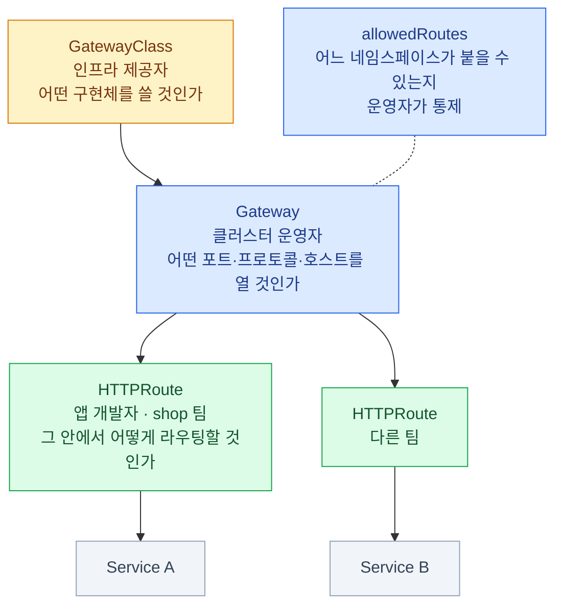

| 리소스 | 누가 만드나 | 무엇을 정하나 |
|---|---|---|
| **GatewayClass** | 인프라 제공자 | 어떤 구현체를 쓸 것인가 (IngressClass에 대응) |
| **Gateway** | 클러스터 운영자 | 어떤 포트·프로토콜·호스트를 열 것인가 |
| **HTTPRoute** | 앱 개발자 | 그 안에서 어떻게 라우팅할 것인가 |

### Gateway

```yaml
apiVersion: gateway.networking.k8s.io/v1
kind: Gateway
metadata: { name: prod-gateway, namespace: infra }
spec:
  gatewayClassName: nginx
  listeners:
    - name: http
      protocol: HTTP
      port: 80
      allowedRoutes:
        namespaces: { from: All }      # All | Same | Selector
    - name: https
      protocol: HTTPS
      port: 443
      hostname: "*.example.com"
      tls:
        mode: Terminate
        certificateRefs: [{ name: web-tls }]
      allowedRoutes:
        namespaces:
          from: Selector
          selector: { matchLabels: { team: shop } }
```

**`allowedRoutes`가 핵심이다.** 운영자가 "어느 네임스페이스가 이 Gateway에 붙을 수 있는지"를 통제한다.

### HTTPRoute

```yaml
apiVersion: gateway.networking.k8s.io/v1
kind: HTTPRoute
metadata:
  name: shop
  namespace: shop
spec:
  parentRefs:
    - name: prod-gateway
      namespace: infra        # 다른 네임스페이스의 Gateway에 붙는다
  hostnames:
    - "shop.example.com"
  rules:
    - matches:
        - path: { type: PathPrefix, value: /api }
          headers:
            - name: x-version
              value: "v2"
      backendRefs:
        - name: api-v2
          port: 8080
    - matches:
        - path: { type: PathPrefix, value: / }
      backendRefs:
        - name: web-svc
          port: 80
```

### 가중치 분배와 필터 — 애노테이션 없이

```yaml
rules:
  - backendRefs:
      - name: web-v1
        port: 80
        weight: 90            # 카나리 배포가 표준 필드다
      - name: web-v2
        port: 80
        weight: 10

  - matches:
      - path: { type: PathPrefix, value: /old }
    filters:
      - type: RequestRedirect
        requestRedirect:
          statusCode: 301
          path: { type: ReplacePrefixMatch, replacePrefixMatch: /new }
      - type: RequestHeaderModifier
        requestHeaderModifier:
          add: [{ name: x-source, value: gateway }]
    backendRefs:
      - name: web-svc
        port: 80
```

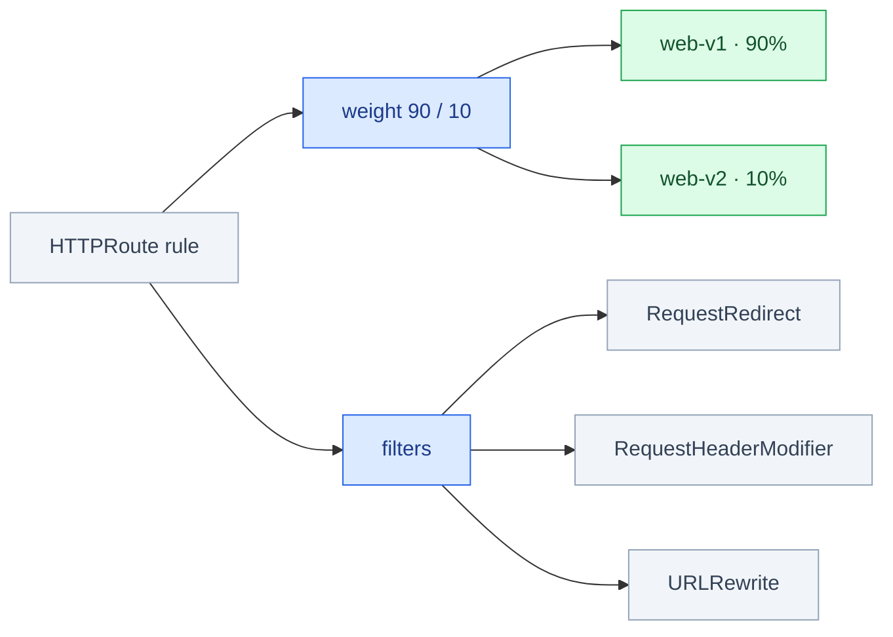

Ingress에서 컨트롤러별 애노테이션이었던 것들이 **전부 스펙 안에 있다.**

### 네임스페이스를 넘을 때 — ReferenceGrant

HTTPRoute가 **다른 네임스페이스의 Service**를 백엔드로 쓰려면 그쪽의 허가가 필요하다.

```yaml
apiVersion: gateway.networking.k8s.io/v1beta1
kind: ReferenceGrant
metadata:
  name: allow-shop-routes
  namespace: backend          # 참조 "당하는" 쪽에 만든다
spec:
  from:
    - group: gateway.networking.k8s.io
      kind: HTTPRoute
      namespace: shop
  to:
    - group: ""
      kind: Service
```

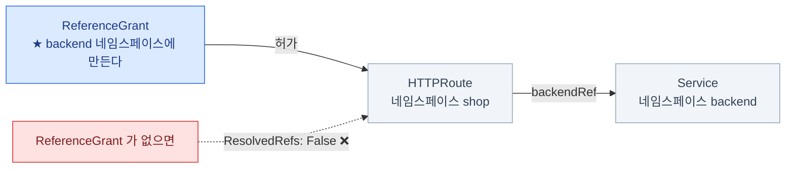

- **참조당하는 쪽이 허가한다** — 몰래 트래픽을 뺏어가지 못하게 하는 설계
- TLS 인증서 Secret을 다른 네임스페이스에서 참조할 때도 필요하다

### Route 종류들

| 리소스 | 프로토콜 | 상태 |
|---|---|---|
| **HTTPRoute** | HTTP/HTTPS | Standard 채널, `v1` |
| **GRPCRoute** | gRPC | Standard 채널 (v1.4에서 승격) |
| **TCPRoute** / **UDPRoute** | 원시 TCP/UDP | v1.6에서 GA로 승격 |
| **TLSRoute** | TLS 패스스루 | Experimental 채널 |

- 설치 매니페스트가 **Standard / Experimental 두 채널**로 나뉜다
- 실습·시험에서는 **Standard**를 쓰면 된다

:::tip[시험]
Gateway API 문서(`gateway-api.sigs.k8s.io`)는
**시험 중 열 수 있는 사이트**다. HTTPRoute YAML은 거기서 복사해 오는 것이 정답이다.
kubernetes.io 쪽에도 공식 [Gateway API 문서](https://kubernetes.io/docs/concepts/services-networking/gateway/)가 있어
Gateway·HTTPRoute 기본 예시는 여기서도 복사할 수 있다.
:::

## Ingress에서 Gateway API로

<Tabs>
<TabItem label="대응표">

| | Ingress | Gateway API |
|---|---|---|
| 클래스 지정 | `IngressClass` | `GatewayClass` |
| 진입점 | Ingress 리소스에 섞임 | **`Gateway`로 분리** |
| 라우팅 규칙 | `rules` | **`HTTPRoute`** |
| 재작성·헤더 조작 | 컨트롤러 애노테이션 | **표준 필드(`filters`)** |
| 트래픽 분할 | 애노테이션 | **`weight`** |
| 네임스페이스 교차 | 불가 | **`ReferenceGrant`** |
| 설치 | 컨트롤러만 | **CRD + 컨트롤러** |

</TabItem>
<TabItem label="구조 비교">

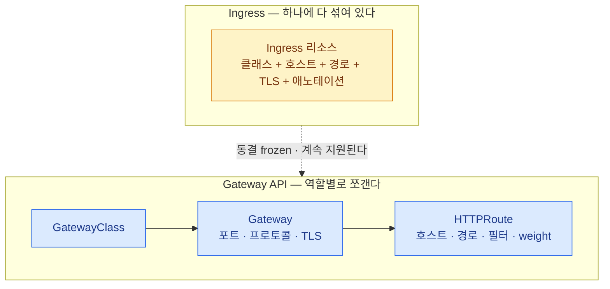

</TabItem>
</Tabs>

Ingress는 **없어지지 않는다.** 동결(frozen)된 상태로 계속 지원된다.
시험에서도 **둘 다** 나올 수 있으니 양쪽 문법을 알아야 한다.

## 진단

```bash
# Ingress
kubectl get ingress
kubectl describe ingress web                   # Rules / Events / ADDRESS
kubectl get ingressclass
kubectl get pods -n ingress-nginx              # 컨트롤러가 살아 있는가
kubectl logs -n ingress-nginx -l app.kubernetes.io/name=ingress-nginx

# Gateway API
kubectl get gatewayclass
kubectl get gateway -A
kubectl describe gateway prod-gateway -n infra   # ★ status.conditions
kubectl get httproute -A
kubectl describe httproute shop -n shop          # ★ parents[].conditions
```

**Gateway API는 `status.conditions`에 답이 다 있다.**

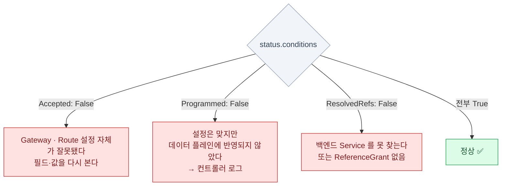

| Condition | 뜻 |
|---|---|
| `Accepted: False` | Gateway/Route 설정 자체가 잘못됐다 |
| `Programmed: False` | 설정은 맞지만 데이터 플레인에 반영되지 않았다 |
| `ResolvedRefs: False` | **백엔드 Service를 못 찾는다** 또는 ReferenceGrant 없음 |

## 11장 요약

- **Ingress 리소스는 규칙일 뿐**, 일은 **Ingress 컨트롤러 Pod**이 한다
- `pathType`은 **필수**이고 `Prefix`는 **경로 요소 단위**다
- **`ingressClassName`이 없고 기본 클래스도 없으면 아무 일도 안 일어난다**
- Ingress의 고급 기능은 전부 **컨트롤러별 애노테이션** — 이식성이 없다
- **Gateway API = GatewayClass(제공자) + Gateway(운영자) + HTTPRoute(개발자)**
- **CRD라서 직접 설치**해야 한다. Standard 채널을 쓴다
- 재작성·헤더·가중치가 **표준 필드**, 네임스페이스 교차는 **ReferenceGrant**
- 진단은 **`status.conditions`** — `Accepted` / `Programmed` / `ResolvedRefs`

:::note[손 연습]
이 장 범위의 KodeKloud 실습 풀이 — [CKA 실습 6장 · Ingress와 NetworkPolicy](/cka-udemy/06-ingress-netpol/)
:::
