import { Steps, Card, CardGrid, Tabs, TabItem } from '@astrojs/starlight/components';

> Pod 사이의 통신을 막는 법

## 기본값은 "전부 허용"이다

Kubernetes 네트워크 모델의 전제 —

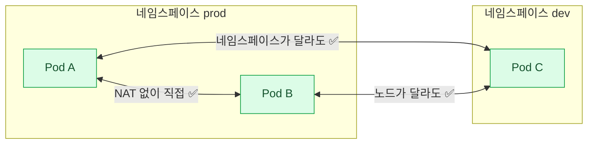

- **모든 Pod은 모든 Pod과 NAT(Network Address Translation — 주소 변환) 없이 통신할 수 있다**
- 네임스페이스가 달라도 마찬가지다. **네임스페이스는 네트워크 경계가 아니다**
- 노드가 달라도 마찬가지다

즉 **아무것도 안 하면 클러스터 안은 완전히 평평하다.**\
NetworkPolicy는 이 기본값을 **선택적으로 좁히는** 도구다.

:::caution[함정]
**NetworkPolicy를 강제하는 것은 CNI 플러그인이다.**
지원하지 않는 CNI(예: 기본 설정의 Flannel)에서는 정책을 만들어도
**오브젝트만 생기고 아무것도 막히지 않는다.** 조용히 실패한다.
:::

## CNI — 누가 네트워크를 만드는가

CNI(Container Network Interface — kubelet이 Pod 네트워크를 만들 때 호출하는 표준 인터페이스)가
위의 "평평한 네트워크"를 실제로 만드는 주체다.

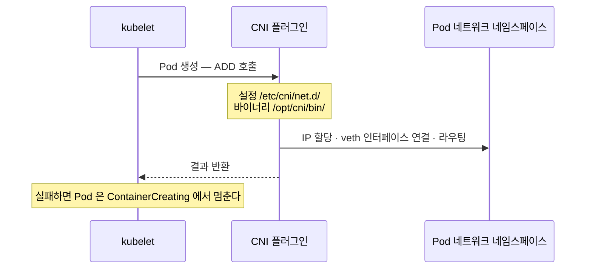

- kubelet은 Pod을 만들 때 **CNI 플러그인을 호출**해 IP를 할당하고 인터페이스를 붙인다
- 설정은 **`/etc/cni/net.d/`** 에 있고, 바이너리는 `/opt/cni/bin/` 에 있다
- CNI가 없거나 고장나면 Pod은 **`ContainerCreating`** 에서 멈춘다

| CNI | 특징 | NetworkPolicy |
|---|---|---|
| **Calico** | 널리 쓰인다. BGP(라우터 간 경로 교환 프로토콜) 또는 오버레이 | 지원 (확장 정책도) |
| **Cilium** | eBPF(커널 내장 프로그래밍 기술) 기반. L7 정책까지 | 지원 (강력) |
| **Flannel** | 가장 단순한 오버레이 | **미지원** |
| **Weave** | 오버레이 | 지원 |

```bash
kubectl get pods -n kube-system | grep -Ei 'calico|cilium|flannel|weave'
ls /etc/cni/net.d/
```

:::tip[시험]
노드가 `NotReady`이고 이유가
`cni plugin not initialized` 면 CNI가 설치되지 않았거나 Pod이 죽은 것이다.
:::

## 정책의 기본

### NetworkPolicy 구조

```yaml
apiVersion: networking.k8s.io/v1
kind: NetworkPolicy
metadata:
  name: api-policy
  namespace: prod              # ← 정책은 네임스페이스 안에서만 적용된다
spec:
  podSelector:                 # 누구에게 적용할 것인가
    matchLabels: { app: api }
  policyTypes:                 # 어느 방향을 통제할 것인가
    - Ingress
    - Egress
  ingress:
    - from:
        - podSelector:
            matchLabels: { app: web }
      ports:
        - protocol: TCP
          port: 8080
  egress:
    - to:
        - podSelector:
            matchLabels: { app: db }
      ports:
        - protocol: TCP
          port: 5432
```

**네 부분이 각각 다른 질문에 답한다.**

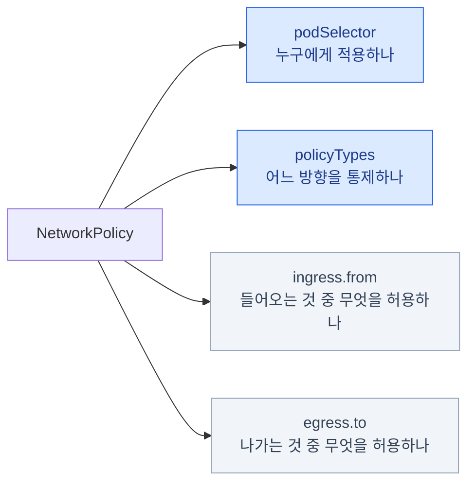

### 세 가지 규칙을 먼저 외우자

<CardGrid>
<Card title="1 · 걸리는 순간 기본 거부" icon="padlock">
정책이 하나라도 붙으면 그 Pod은 **기본 거부**가 된다.
명시적으로 허용한 것 외에는 전부 막힌다.
</Card>
<Card title="2 · 정책은 더해진다" icon="add-plus">
여러 정책이 같은 Pod에 걸리면 **허용의 합집합**이다.
순서도, 우선순위도, `deny` 규칙도 **없다.**
</Card>
<Card title="3 · 없는 방향은 통제되지 않는다" icon="right-arrow">
`policyTypes: [Ingress]`만 쓰면
**egress는 전혀 제한되지 않는다.**
</Card>
</CardGrid>

첫 번째 규칙이 가장 중요하다 — **정책 하나가 스위치를 뒤집는다.**

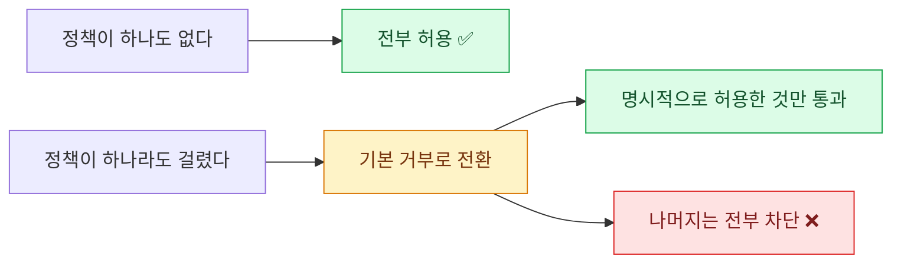

이 셋을 알면 대부분의 혼란이 정리된다.
특히 **"막는 정책"을 쓰려 하지 말 것** — 막는 방법은 **허용하지 않는 것**뿐이다.

### 전부 차단하기

```yaml
apiVersion: networking.k8s.io/v1
kind: NetworkPolicy
metadata:
  name: default-deny-all
  namespace: prod
spec:
  podSelector: {}              # 빈 셀렉터 = 이 네임스페이스의 모든 Pod
  policyTypes:
    - Ingress
    - Egress
# ingress / egress 규칙이 없다 = 아무것도 허용하지 않는다
```

| `podSelector` | 뜻 |
|---|---|
| `{}` (빈 값) | 네임스페이스의 **모든** Pod |
| `matchLabels: {app: api}` | 라벨이 맞는 Pod만 |

**표준 패턴 — 화이트리스트**

<Steps>

1. **`default-deny-all`을 먼저 깐다**

   네임스페이스 전체가 기본 거부로 바뀐다.

2. **필요한 통신만 정책을 추가해 뚫는다**

   정책은 더해지므로, 허용 규칙을 하나씩 얹으면 된다.

3. **egress를 켰다면 DNS를 잊지 않는다**

   UDP/TCP 53을 안 열면 이름 해석부터 죽는다. 아래 절에서 다룬다.

</Steps>

## 규칙 작성

### 출발지를 지정하는 세 가지

```yaml
ingress:
  - from:
      - podSelector:                     # ① 같은 네임스페이스의 Pod
          matchLabels:
            app: web

      - namespaceSelector:               # ② 다른 네임스페이스의 모든 Pod
          matchLabels:
            kubernetes.io/metadata.name: frontend

      - ipBlock:                         # ③ IP 대역 (클러스터 밖 포함)
          cidr: 10.0.0.0/16
          except:
            - 10.0.5.0/24
```

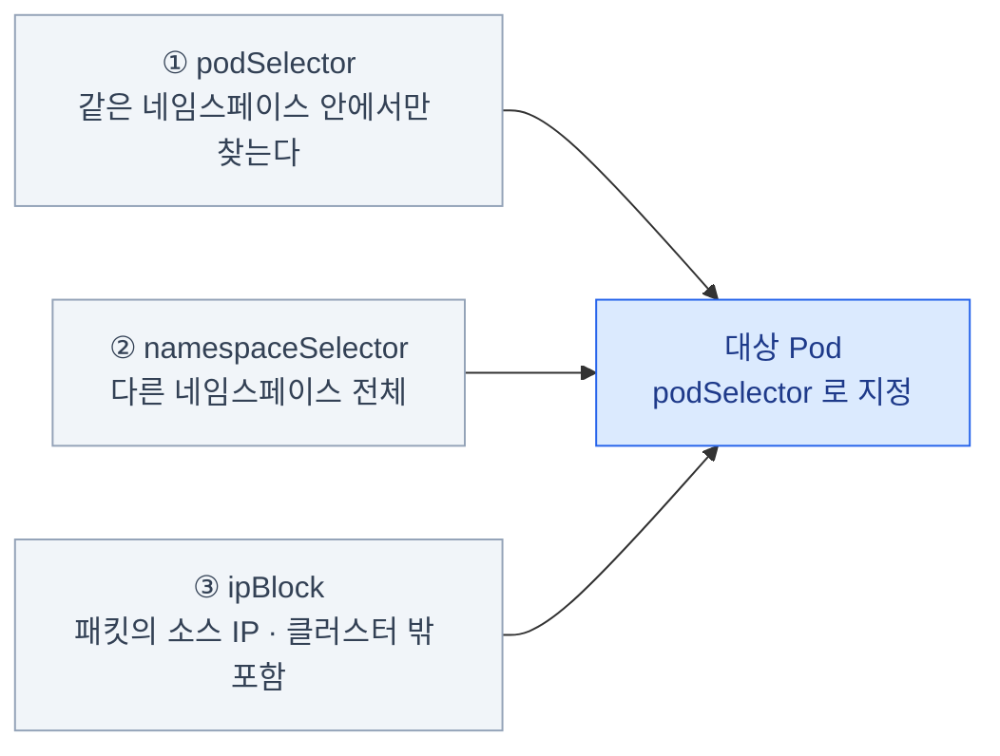

- `podSelector` 만 쓰면 **정책이 있는 네임스페이스 안**에서만 찾는다
- 모든 네임스페이스에는 **`kubernetes.io/metadata.name`** 라벨이 자동으로 붙어 있다 — 이걸로 지정하면 편하다
- `ipBlock`은 **Pod IP가 아니라 패킷의 소스 IP** 기준이다

### 가장 많이 틀리는 것 — AND와 OR

<Tabs>
<TabItem label="OR — 하이픈이 둘">

```yaml
from:
  - namespaceSelector:
      matchLabels:
        team: frontend
  - podSelector:
      matchLabels:
        app: web
```

"frontend 네임스페이스의 **모든** Pod"
**또는**
"같은 네임스페이스의 `app=web` Pod"

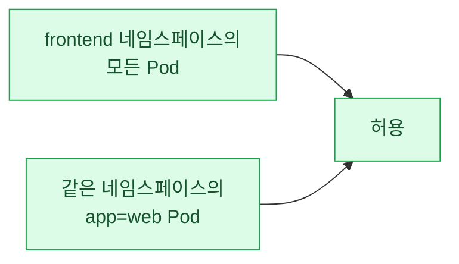

</TabItem>
<TabItem label="AND — 하이픈이 하나">

```yaml
from:
  - namespaceSelector:
      matchLabels:
        team: frontend
    podSelector:
      matchLabels:
        app: web
```

"frontend 네임스페이스**이면서** `app=web`인 Pod"

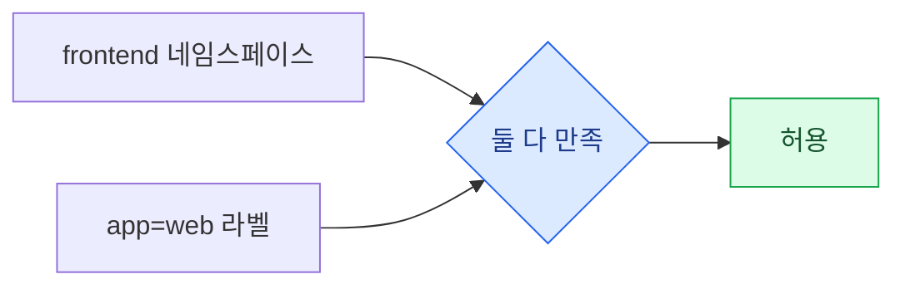

</TabItem>
</Tabs>

:::caution[함정]
**하이픈(`-`)의 위치가 전부다.**
두 YAML은 두 칸 차이인데 의미가 완전히 다르다.
시험에서 실수하기 가장 쉬운 지점이니 **작성 후 반드시 눈으로 확인**할 것.
:::

### egress와 DNS

```yaml
spec:
  podSelector:
    matchLabels: { app: api }
  policyTypes: [Egress]
  egress:
    - to:
        - podSelector:
            matchLabels: { app: db }
      ports:
        - protocol: TCP
          port: 5432

    - to:                                # ★ DNS를 반드시 열어야 한다
        - namespaceSelector:             # ← 이 둘은 같은 항목 = AND
            matchLabels: { kubernetes.io/metadata.name: kube-system }
          podSelector:
            matchLabels: { k8s-app: kube-dns }
      ports:
        - { protocol: UDP, port: 53 }
        - { protocol: TCP, port: 53 }
```

**DNS를 안 열면 증상이 엉뚱한 곳에서 나타난다.**

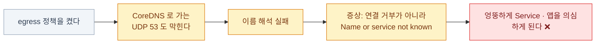

:::caution[함정]
**egress 정책을 켜면 DNS부터 막힌다.**
증상은 "연결 거부"가 아니라 **이름 해석 실패**라서 원인을 엉뚱한 데서 찾게 된다.
egress 정책을 쓸 때는 **DNS 허용을 세트로** 기억할 것.
:::

### 포트 지정과 주의점

```yaml
ports:
  - protocol: TCP
    port: 8080
  - protocol: TCP
    port: http          # Pod의 이름 있는 포트도 가능
  - protocol: TCP
    port: 8000
    endPort: 9000       # 범위
```

- `ports`를 **생략하면 모든 포트**가 허용된다
- **`port`는 Pod의 포트(targetPort)** 다. Service의 `port`가 아니다

**NetworkPolicy는 Service를 모른다.**

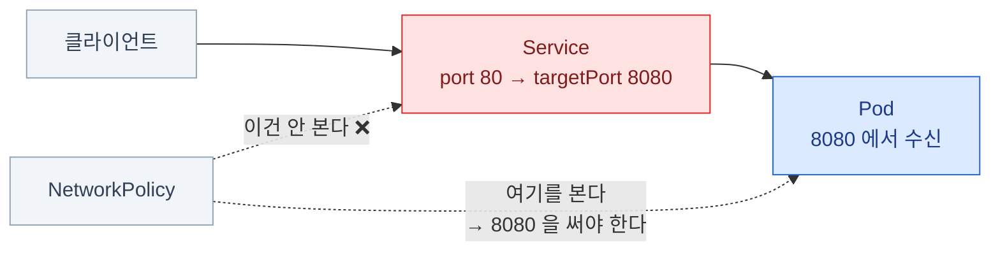

:::caution[함정]
Service가 `80 → 8080` 으로 매핑한다면
NetworkPolicy에는 **`8080`** 을 써야 한다.
NetworkPolicy는 Service를 모른다. **Pod과 Pod 사이만** 본다.
:::

같은 이유로 **NetworkPolicy로 Service를 막을 수는 없다.**
막히는 것은 최종적으로 도달하는 **Pod**이다.

## 실전 예제 — 3계층 앱

```yaml
# db는 api에서 오는 5432만 받는다
apiVersion: networking.k8s.io/v1
kind: NetworkPolicy
metadata:
  name: db-allow-api
  namespace: prod
spec:
  podSelector:
    matchLabels:
      tier: db
  policyTypes: [Ingress]
  ingress:
    - from:
        - podSelector:
            matchLabels:
              tier: api
      ports:
        - protocol: TCP
          port: 5432
```

**정책 하나가 어디까지 바꾸는지** 보면 감이 온다.

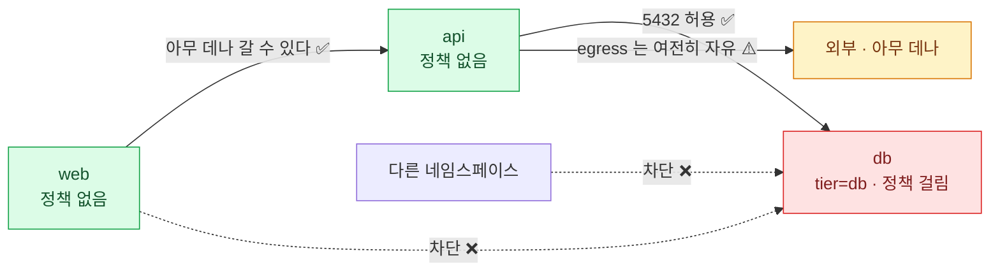

- 이 정책 하나로 **db Pod의 다른 모든 인바운드가 막힌다**
- api Pod에는 아무 정책도 안 걸렸으므로 **api는 여전히 아무 데나 갈 수 있다**
- 진짜 잠그려면 각 계층마다 정책이 필요하다

## 진단

```bash
kubectl get netpol -A
kubectl describe netpol db-allow-api -n prod        # 해석된 규칙을 보여준다

# 실제로 되는지 확인 — 이게 가장 확실하다
kubectl run tmp --image=busybox:1.36 --rm -it --restart=Never -n prod -- sh
  wget -qO- --timeout=3 http://api-svc:8080
  nc -zv 10.244.2.7 5432

# 라벨이 정말 맞는지
kubectl get pods -n prod --show-labels
kubectl get ns --show-labels
```

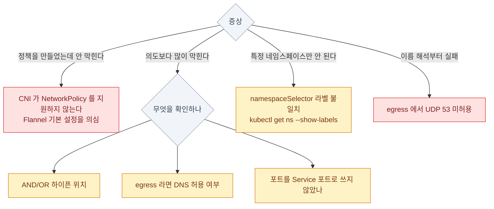

| 증상 | 원인 후보 |
|---|---|
| 정책을 만들었는데 안 막힌다 | **CNI가 NetworkPolicy를 지원하지 않는다** |
| 의도보다 많이 막힌다 | AND/OR 실수, DNS 미허용, 포트를 Service 포트로 씀 |
| 특정 네임스페이스만 안 된다 | `namespaceSelector` 라벨 불일치 |
| 이름 해석부터 실패 | **egress에서 UDP 53 미허용** |

## 12장 요약

- 기본은 **전부 허용**. NetworkPolicy는 좁히는 도구다
- **정책을 강제하는 것은 CNI**다. 미지원 CNI에서는 조용히 무시된다
- **정책이 하나라도 걸리면 그 Pod은 기본 거부**로 바뀐다
- 정책은 **더해질 뿐**이다. `deny` 규칙도, 우선순위도 없다
- **`policyTypes`에 없는 방향은 통제되지 않는다**
- `podSelector: {}` = 네임스페이스 전체 → **default-deny-all** 패턴
- **하이픈 위치가 AND와 OR를 가른다** — 가장 흔한 실수
- **egress를 켜면 DNS(UDP/TCP 53)를 반드시 열어야** 한다
- 포트는 **Pod의 포트**다. Service 포트가 아니다
