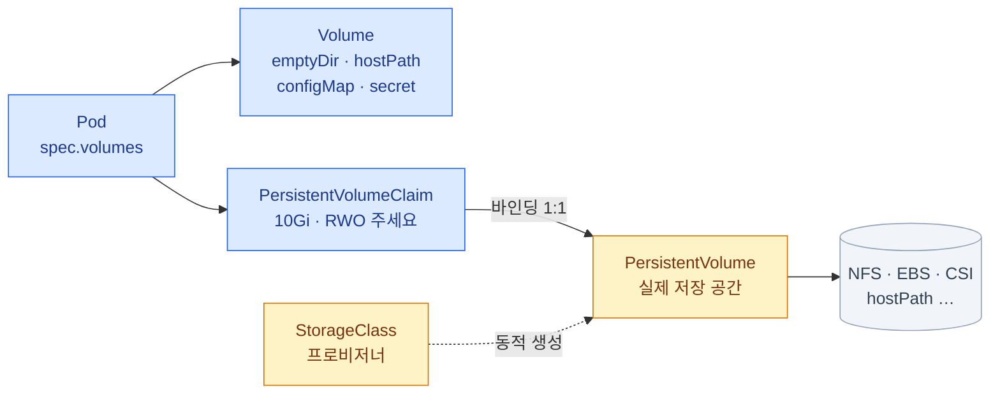
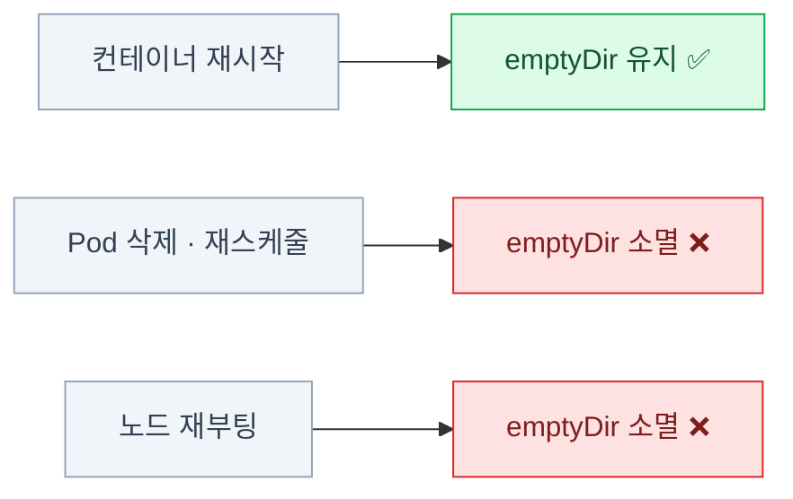
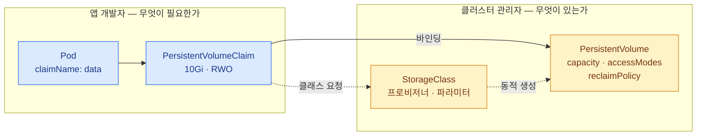
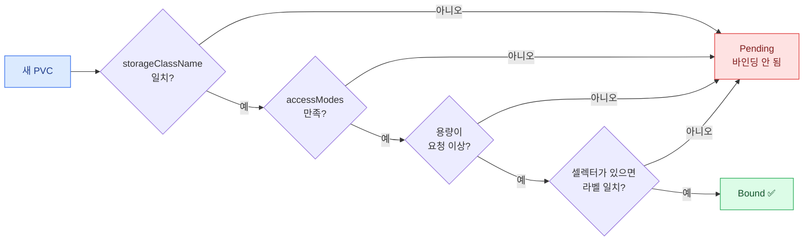
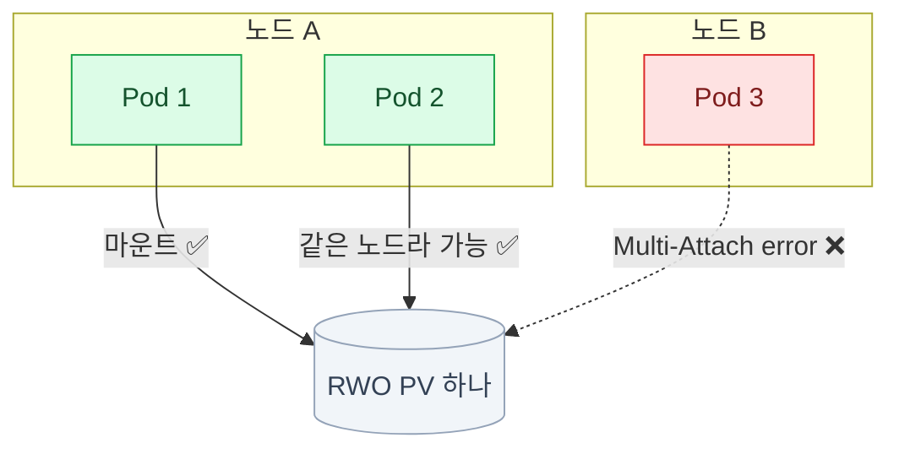
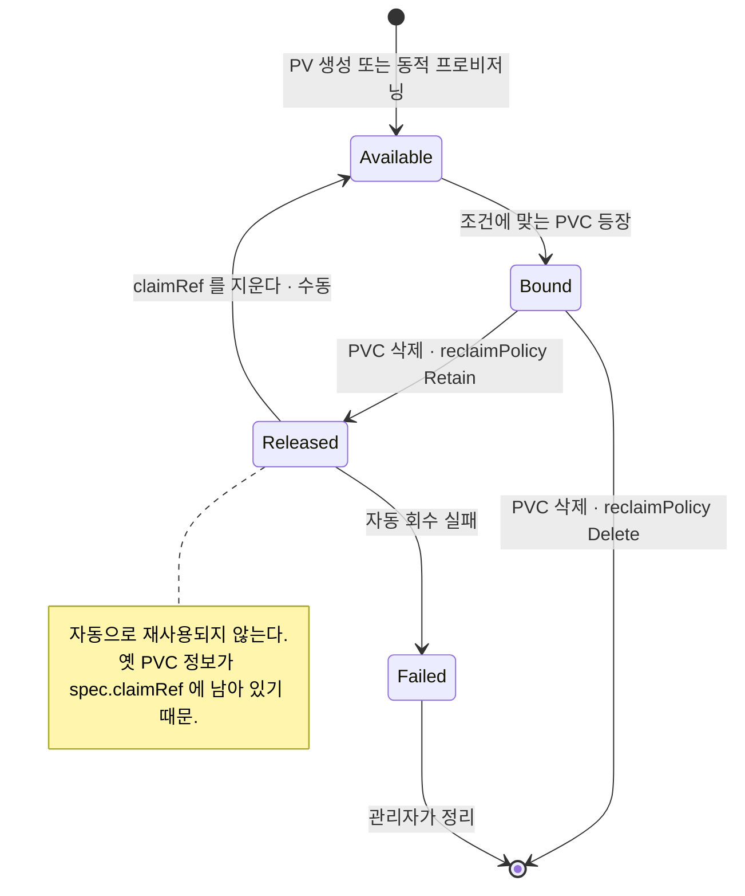
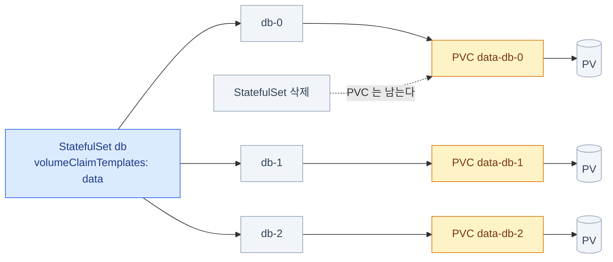
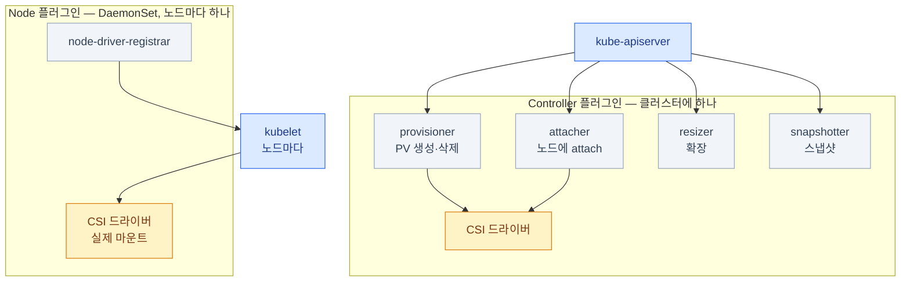
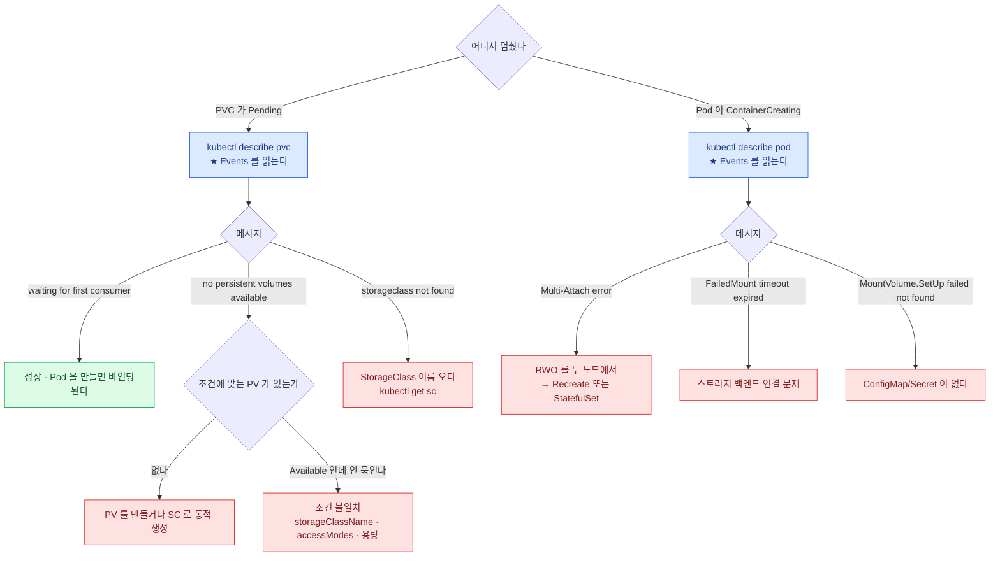
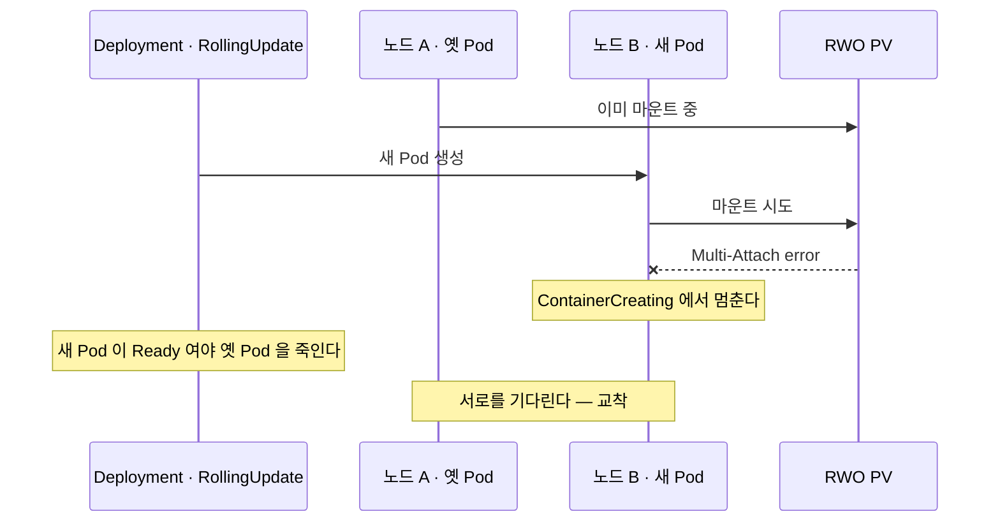

import { Steps, Card, CardGrid, Tabs, TabItem } from '@astrojs/starlight/components';

> 컨테이너가 죽어도 남는 데이터

## 볼륨이 필요한 이유

- 컨테이너의 파일시스템은 **컨테이너와 함께 사라진다.** 재시작만 해도 초기화된다
- 같은 Pod 안의 컨테이너끼리 **파일을 주고받을 방법**이 필요하다
- Pod이 다른 노드로 옮겨가도 **데이터는 따라가야** 한다

Kubernetes는 이걸 **세 층**으로 푼다.

<CardGrid>
<Card title="Volume" icon="document">
Pod 스펙 **안**의 마운트.
Pod과 수명을 같이한다.
</Card>
<Card title="PersistentVolume (PV)" icon="database">
Pod과 **독립**된 저장 공간.
클러스터 스코프 리소스다.
</Card>
<Card title="PersistentVolumeClaim (PVC)" icon="approve-check">
"이만큼의 저장소를 달라"는 **요청**.
네임스페이스에 속한다.
</Card>
</CardGrid>

세 층이 어떻게 이어지는가 —



**파란 것은 네임스페이스 안**(Pod·PVC), **노란 것은 클러스터 스코프**(PV·StorageClass)다.
이 경계가 곧 뒤에 나올 **개발자와 관리자의 경계**이기도 하다.

## emptyDir — Pod과 함께 사는 임시 공간

```yaml
spec:
  containers:
    - name: writer
      image: busybox:1.36
      volumeMounts:
        - name: shared
          mountPath: /data
    - name: reader
      image: busybox:1.36
      volumeMounts:
        - name: shared
          mountPath: /input
  volumes:
    - name: shared
      emptyDir: {}
    - name: cache
      emptyDir:
        medium: Memory        # tmpfs — 메모리에 만든다
        sizeLimit: 128Mi
```

- **Pod이 노드에 배정될 때 생기고, Pod이 사라지면 함께 사라진다**
- **컨테이너 재시작으로는 안 없어진다** — 사이드카 패턴의 기반
- `medium: Memory`는 빠르지만 **Pod의 메모리 limit에 포함**된다

수명의 경계가 어디인지가 전부다.



## hostPath — 노드의 디렉터리

```yaml
volumes:
  - name: docker-sock
    hostPath:
      path: /var/run/containerd/containerd.sock
      type: Socket            # DirectoryOrCreate | Directory | FileOrCreate | File | Socket
```

- **노드의 파일시스템을 그대로** 마운트한다
- Pod이 다른 노드로 가면 **거기엔 그 파일이 없다**
- 보안상 위험하다 — 노드 전체를 노출할 수 있다

**정당한 쓰임**

- 로그 수집 DaemonSet이 `/var/log`를 읽을 때
- 모니터링 에이전트가 노드 메트릭을 읽을 때
- **단일 노드 실습 클러스터**에서 PV를 만들 때

:::caution[함정]
일반 워크로드에 `hostPath`를 쓰면
**노드에 고정된 Pod**이 된다. 재스케줄되면 데이터를 잃는다. PV/PVC를 쓸 것.
:::

## PV와 PVC — 왜 나눴나



- **앱 개발자는 저장소가 NFS인지 EBS인지 몰라도 된다.** "10Gi, RWO"만 요청한다
- **관리자는 실제 저장소를 준비한다.** 또는 StorageClass로 자동 생성되게 한다
- 이 분리 덕분에 **같은 매니페스트가 온프렘과 클라우드에서 모두 동작**한다

## PersistentVolume

```yaml
apiVersion: v1
kind: PersistentVolume
metadata:
  name: pv-data
spec:
  capacity:
    storage: 10Gi
  accessModes:
    - ReadWriteOnce
  persistentVolumeReclaimPolicy: Retain      # Retain | Delete
  storageClassName: manual
  volumeMode: Filesystem                     # Filesystem(기본) | Block
  hostPath:                                  # 실습용. 실제로는 nfs, csi 등
    path: /mnt/data
```

- **클러스터 스코프**다 — 네임스페이스에 속하지 않는다
- `storageClassName`이 PVC와 **일치해야** 바인딩된다

```bash
kubectl get pv
# NAME      CAPACITY  ACCESS MODES  RECLAIM POLICY  STATUS     CLAIM          STORAGECLASS
# pv-data   10Gi      RWO           Retain          Bound      default/data   manual
```

## PersistentVolumeClaim

```yaml
apiVersion: v1
kind: PersistentVolumeClaim
metadata:
  name: data
  namespace: default
spec:
  accessModes: ["ReadWriteOnce"]
  storageClassName: manual
  resources:
    requests:
      storage: 5Gi
  # selector:            # 특정 PV를 라벨로 고를 수도 있다
  #   matchLabels: { tier: fast }
```

```yaml
# Pod에서 쓰기
spec:
  containers:
    - name: app
      volumeMounts:
        - name: data
          mountPath: /var/lib/data
  volumes:
    - name: data
      persistentVolumeClaim:
        claimName: data
```

## 바인딩 규칙

PVC가 만들어지면 컨트롤러가 조건에 맞는 PV를 찾는다. **네 관문을 전부 통과해야** 묶인다.



**1:1 관계다.** 바인딩된 PV는 다른 PVC가 쓸 수 없다.
그리고 **5Gi를 요청했는데 10Gi PV에 묶이면 10Gi 전부를 쓴다** — 남는 5Gi는 낭비된다.

:::caution[함정]
**PVC에 `storageClassName`을 아예 안 쓰면**
기본 StorageClass가 적용된다. 정적 PV(`storageClassName: manual`)와 맞추려면
**`storageClassName: ""`** 처럼 빈 문자열을 명시해야 할 때도 있다.
"PV는 Available인데 PVC가 Pending"의 단골 원인이다.
:::

## accessModes

| 모드 | 약칭 | 의미 |
|---|---|---|
| `ReadWriteOnce` | **RWO** | **한 노드**에서 읽기·쓰기 |
| `ReadOnlyMany` | ROX | 여러 노드에서 읽기만 |
| `ReadWriteMany` | **RWX** | **여러 노드**에서 읽기·쓰기 |
| `ReadWriteOncePod` | RWOP | **Pod 하나**만 읽기·쓰기 |

**RWO의 경계는 노드다.** 그림으로 보면 헷갈릴 일이 없다.



:::caution[함정]
**RWO는 "Pod 하나"가 아니라 "노드 하나"다.**
같은 노드에 있는 여러 Pod은 동시에 마운트할 수 있다.
정말 하나만 허용하려면 `ReadWriteOncePod`를 쓴다.
:::

**RWX는 아무 스토리지나 되는 게 아니다.**
블록 스토리지(EBS, GCE PD)는 RWO만 가능하다. RWX는 **NFS·CephFS·EFS 같은 파일 스토리지**가 필요하다.

accessMode는 **스토리지의 실제 능력을 강제하지 않는다.** 바인딩 조건으로만 쓰인다.

## PV의 생애 — 상태가 어떻게 움직이는가



| 상태 | 의미 |
|---|---|
| `Available` | 비어 있고 바인딩 가능 |
| `Bound` | PVC에 묶여 있다 |
| `Released` | PVC가 삭제됐지만 아직 회수되지 않았다 |
| `Failed` | 자동 회수에 실패했다 |

## reclaimPolicy — PVC를 지우면 데이터는?

| 정책 | PVC 삭제 시 |
|---|---|
| **`Retain`** | PV는 남고 상태가 **`Released`** 가 된다. **데이터 보존**. 재사용하려면 수동 조치 |
| **`Delete`** | PV와 **실제 스토리지까지 삭제**한다. 동적 프로비저닝의 기본값 |
| `Recycle` | 삭제되었다 (deprecated) |

```bash
kubectl patch pv pv-data -p '{"spec":{"persistentVolumeReclaimPolicy":"Retain"}}'
```

:::caution[함정]
`Released` 상태의 PV는 **자동으로 재사용되지 않는다.**
옛 PVC 정보(`spec.claimRef`)가 남아 있기 때문이다. 다시 쓰려면 —

```bash
kubectl patch pv pv-data -p '{"spec":{"claimRef":null}}'
# → 상태가 Available로 돌아간다
```
:::

```bash
kubectl get pv
kubectl get pvc
kubectl describe pvc data          # ★ Events에 왜 Pending인지 나온다
```

:::tip[시험]
PVC가 `Pending`이면 `describe pvc`를 먼저 본다.\
`no persistent volumes available for this claim` → 조건에 맞는 PV가 없다\
`waiting for first consumer` → **정상이다.** Pod이 만들어지길 기다리는 중
:::

## StorageClass — 동적 프로비저닝

```yaml
apiVersion: storage.k8s.io/v1
kind: StorageClass
metadata:
  name: fast
  annotations:
    storageclass.kubernetes.io/is-default-class: "true"
provisioner: kubernetes.io/no-provisioner     # 또는 ebs.csi.aws.com 등
parameters:
  type: gp3
  fsType: ext4
reclaimPolicy: Delete
allowVolumeExpansion: true
volumeBindingMode: WaitForFirstConsumer
```

- PVC가 이 클래스를 요청하면 **프로비저너가 PV를 자동으로 만든다**
- 관리자가 PV를 미리 만들어둘 필요가 없다
- `provisioner: kubernetes.io/no-provisioner` 는 **동적 생성을 하지 않는다** (로컬 볼륨용)

```bash
kubectl get sc
# NAME              PROVISIONER            RECLAIMPOLICY  VOLUMEBINDINGMODE
# standard (default) rancher.io/local-path Delete         WaitForFirstConsumer
```

## volumeBindingMode — 언제 묶을 것인가

<Tabs>
<TabItem label="Immediate">

PVC가 생기는 **즉시** PV를 만들고 묶는다. 스케줄러는 그다음에 움직인다.


**문제** — 볼륨이 zone A에 생겼는데 Pod은 zone B에 스케줄될 수 있다. 그러면 마운트가 실패한다.

</TabItem>
<TabItem label="WaitForFirstConsumer">

**Pod이 스케줄될 때까지 기다렸다가** 그 노드에 맞는 볼륨을 만든다.


토폴로지 제약이 있는 환경(멀티 AZ, 로컬 디스크)에서 **사실상 필수**다.

</TabItem>
</Tabs>

:::tip[시험]
PVC가 `Pending`이고 메시지가
**`waiting for first consumer to be created before binding`** 이면
**고장이 아니다.** Pod을 만들면 바인딩된다. 이걸 문제로 착각하지 말 것.
:::

## 볼륨 확장

```bash
# StorageClass에 allowVolumeExpansion: true 가 있어야 한다
kubectl patch pvc data -p '{"spec":{"resources":{"requests":{"storage":"20Gi"}}}}'
kubectl get pvc data -w
```

- **늘리는 것만 가능하다.** 줄일 수 없다
- 대부분의 CSI 드라이버는 **온라인 확장**을 지원한다 (Pod 재시작 불필요)
- 파일시스템 확장이 필요하면 PVC 상태에 `FileSystemResizePending` 이 뜬다

:::caution[함정]
`allowVolumeExpansion`이 `false`(기본)면
patch 자체가 **거부**된다. StorageClass를 먼저 고쳐야 하는데,
**이미 만들어진 PVC에는 소급 적용되지 않는** 경우도 있다.
:::

## StatefulSet과 volumeClaimTemplates

```yaml
spec:
  volumeClaimTemplates:
    - metadata:
        name: data
      spec:
        accessModes: ["ReadWriteOnce"]
        storageClassName: fast
        resources:
          requests:
            storage: 10Gi
```

**Pod마다 PVC가 하나씩** 생긴다. 이름이 고정이라 Pod이 죽었다 살아나도 같은 볼륨으로 돌아온다.



- **Pod마다 PVC가 하나씩** 생긴다: `data-db-0`, `data-db-1`, …
- Pod이 죽었다 살아나도 **같은 PVC를 다시 붙인다** (이름이 고정이므로)
- **StatefulSet을 지워도 PVC는 남는다.** 데이터 보호가 기본 동작이다

```bash
kubectl get pvc -l app=db
kubectl delete pvc data-db-0        # 정말 지우려면 명시적으로
```

:::caution[함정]
`volumeClaimTemplates`는 **수정할 수 없다.**
크기를 바꾸려면 각 PVC를 개별로 patch하고 StatefulSet은
`--cascade=orphan`으로 다시 만들어야 한다.
:::

## CSI — 스토리지 확장 인터페이스

- 예전에는 스토리지 드라이버가 **Kubernetes 코드 안에** 있었다 (in-tree)
- 지금은 전부 **CSI 드라이버**로 분리되었다. 벤더가 독립적으로 배포한다
- in-tree 플러그인은 대부분 **제거**되었고 CSI로 마이그레이션되었다



```bash
kubectl get csidrivers
kubectl get csinodes
kubectl get pods -n kube-system | grep csi
```

| 컴포넌트 | 역할 |
|---|---|
| **Controller 플러그인** | 볼륨 생성·삭제·attach (Deployment/StatefulSet) |
| **Node 플러그인** | 노드에서 마운트 (DaemonSet) |
| **sidecar 컨테이너들** | `provisioner`, `attacher`, `resizer`, `snapshotter` |

CSI는 커리큘럼의 "확장 인터페이스(CNI, CSI, CRI) 이해" 항목이다. 17장에서 함께 정리한다.

## 설정을 담는 볼륨들

```yaml
volumes:
  - name: config
    configMap: { name: app-config }

  - name: creds
    secret:
      secretName: db-secret
      defaultMode: 0400

  - name: info
    downwardAPI:                    # Pod 자신의 정보를 파일로
      items:
        - { path: labels, fieldRef: { fieldPath: metadata.labels } }

  - name: all-in-one
    projected:                      # 여러 소스를 한 디렉터리에 합친다
      sources:
        - configMap: { name: app-config }
        - secret: { name: db-secret }
        - serviceAccountToken:
            path: token
            expirationSeconds: 3600
            audience: vault
```

`projected`의 `serviceAccountToken`이 **현재 SA 토큰의 표준 주입 방식**이다 (14장).

## 진단 절차

증상은 둘 중 하나다. **어느 쪽인지부터 가른다.**



```bash
# PVC가 Pending
kubectl describe pvc data                 # ★ Events
kubectl get pv                            # 조건에 맞는 PV가 있는가
kubectl get sc                            # StorageClass 이름이 맞는가

# Pod이 ContainerCreating에서 멈춤
kubectl describe pod web                  # ★ Events에 마운트 에러
kubectl get events --field-selector involvedObject.name=web

# 노드에서 확인
kubectl get volumeattachments
sudo journalctl -u kubelet | grep -i mount
```

| Events 메시지 | 원인 |
|---|---|
| `no persistent volumes available for this claim` | PV 없음 / 조건 불일치 |
| `waiting for first consumer` | **정상.** Pod을 만들면 된다 |
| `Multi-Attach error for volume` | **RWO 볼륨을 두 노드에서** 쓰려 한다 |
| `FailedMount: timeout expired waiting` | 스토리지 백엔드 연결 문제 |
| `MountVolume.SetUp failed ... not found` | ConfigMap/Secret이 없다 |

## RWO 볼륨 + Deployment의 함정

`Deployment` + `RWO PVC` + `RollingUpdate` 조합은 **거의 항상 막힌다.**
왜 교착이 되는지는 시간순으로 보면 명확하다.



1. 새 Pod이 다른 노드에 스케줄된다
2. 옛 Pod이 아직 볼륨을 잡고 있다
3. 새 Pod: **`Multi-Attach error`** → `ContainerCreating`에서 멈춘다
4. 옛 Pod은 새 Pod이 Ready가 될 때까지 안 죽는다 → **교착**

**해결 — 넷 중 하나**

<CardGrid>
<Card title="strategy: Recreate" icon="random">
옛 Pod을 **먼저 죽이고** 새 Pod을 만든다.
가장 간단하다. 짧은 다운타임을 받아들이는 셈.
</Card>
<Card title="maxSurge: 0" icon="setting">
`replicas: 1`을 유지하고 새 Pod을 **덧붙이지 않게** 한다.
</Card>
<Card title="StatefulSet" icon="database">
**Pod마다 PVC가 따로** 생기므로 애초에 충돌하지 않는다.
</Card>
<Card title="RWX 스토리지" icon="server">
NFS·CephFS·EFS로 바꾸면 **여러 노드에서 동시 마운트**가 된다.
</Card>
</CardGrid>

:::tip[시험]
`Multi-Attach error` 를 보면
**"RWO인데 두 노드에서 쓰려 한다"**로 바로 판정하면 된다.
:::

## 정적 프로비저닝 실습 흐름

<Steps>

1. **PV 생성** — 관리자의 몫

   ```bash
   cat <<'EOF' | kubectl apply -f -
   apiVersion: v1
   kind: PersistentVolume
   metadata:
     name: pv-manual
   spec:
     capacity: { storage: 1Gi }
     accessModes: ["ReadWriteOnce"]
     persistentVolumeReclaimPolicy: Retain
     storageClassName: manual
     hostPath: { path: /mnt/data }
   EOF
   ```

2. **PVC 생성** — 개발자의 몫. `Bound`가 되는지 확인한다

   ```bash
   kubectl create -f pvc.yaml
   kubectl get pvc                # Bound 확인
   ```

3. **Pod에서 사용**

   ```bash
   kubectl get pod web -o jsonpath='{.spec.volumes}'
   ```

4. **정리 후 확인** — `Retain`이면 PV가 `Released`로 남는다

   ```bash
   kubectl delete pvc data
   kubectl get pv                 # Retain이면 Released 로 남는다
   ```

</Steps>

## 13장 요약

- **emptyDir**은 Pod과 함께 죽고, **컨테이너 재시작에는 살아남는다**
- **PV(관리자) / PVC(개발자)** 분리 덕분에 매니페스트가 환경에 독립적이다
- 바인딩 조건: **storageClassName · accessModes · 용량**. 1:1이고 남는 용량은 낭비된다
- **RWO는 "노드 하나"**다. Pod 하나로 제한하려면 `ReadWriteOncePod`
- `Retain`이면 PVC 삭제 후 **`Released`** — `claimRef`를 지워야 재사용된다
- **`WaitForFirstConsumer`에서의 Pending은 정상**이다
- 확장은 **`allowVolumeExpansion: true`** 필요, **늘리기만** 가능
- **StatefulSet의 PVC는 남는다.** `volumeClaimTemplates`는 수정 불가
- **`Multi-Attach error` = RWO를 두 노드에서** → `Recreate` 또는 StatefulSet
