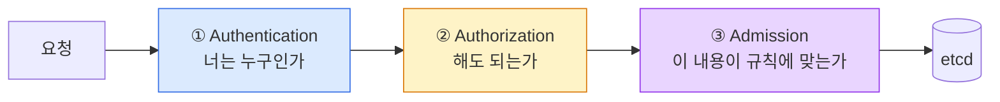

> 누가 무엇을 할 수 있는가

## 요청이 통과해야 하는 세 관문



| 단계 | 실패 시 | 뜻 |
|---|---|---|
| 인증 | **401 Unauthorized** | 신원을 확인할 수 없다 |
| 인가 | **403 Forbidden** | 신원은 확인됐지만 권한이 없다 |
| admission | 다양한 에러 | 정책·검증에 걸렸다 |

:::tip[시험]
**403 메시지는 원인을 그대로 알려준다.**\
`User "dev" cannot list resource "pods" in API group "" in the namespace "prod"`\
→ 필요한 **주체 / 동사 / 리소스 / 네임스페이스**가 전부 문장 안에 있다.
:::

## 인증 방식들

| 방식 | 대상 | 비고 |
|---|---|---|
| **클라이언트 인증서** | 사람(관리자) | kubeadm의 `admin.conf`가 이것 |
| **ServiceAccount 토큰** | Pod 안의 워크로드 | JWT |
| **OIDC** | 사람 (조직 SSO) | 실무 표준 |
| **Webhook** | 외부 시스템 위임 | EKS의 IAM 연동 등 |
| Bootstrap 토큰 | 노드 조인 | `kubeadm join` 때 |

**중요:** **Kubernetes에는 "User" 오브젝트가 없다.**

- `kubectl get users` 같은 것은 존재하지 않는다
- 사용자는 **인증서의 CN 필드**나 **OIDC 토큰의 클레임**에서 문자열로 나온다
- 그룹은 인증서의 **O(Organization)** 필드에서 나온다

그래서 **"사용자를 만든다"는 곧 "인증서를 발급한다"**는 뜻이다.

## 사용자 인증서 만들기 (CSR API)

```bash
# 1) 키와 CSR 생성
openssl genrsa -out dev.key 2048
openssl req -new -key dev.key -out dev.csr -subj "/CN=dev/O=developers"
#                                                  ^사용자    ^그룹

# 2) Kubernetes CSR 오브젝트로 제출
cat <<EOF | kubectl apply -f -
apiVersion: certificates.k8s.io/v1
kind: CertificateSigningRequest
metadata:
  name: dev
spec:
  request: $(cat dev.csr | base64 | tr -d '\n')
  signerName: kubernetes.io/kube-apiserver-client
  expirationSeconds: 86400
  usages: ["client auth"]
EOF

# 3) 승인
kubectl get csr
kubectl certificate approve dev
kubectl certificate deny dev            # 거부할 때

# 4) 서명된 인증서 꺼내기
kubectl get csr dev -o jsonpath='{.status.certificate}' | base64 -d > dev.crt
```

## kubeconfig에 등록하기

```bash
kubectl config set-credentials dev \
  --client-certificate=dev.crt \
  --client-key=dev.key \
  --embed-certs=true

kubectl config set-context dev-ctx \
  --cluster=kubernetes \
  --user=dev \
  --namespace=dev

kubectl config use-context dev-ctx
kubectl auth whoami            # 내가 누구로 인식되는지
```

:::tip[시험]
CSR 생성·승인은 **출제 빈도가 높다.**
`kubectl get csr` → `kubectl certificate approve` 흐름과
**CN이 사용자 이름, O가 그룹**이라는 것만 확실히 하면 된다.
:::

:::caution[함정]
인증서를 발급받아도 **권한은 하나도 없다.**
인증(누구인가)과 인가(무엇을 할 수 있는가)는 별개다. RoleBinding을 따로 만들어야 한다.
:::

## ServiceAccount — Pod의 신원

```bash
kubectl create sa deploy-bot
kubectl get sa
kubectl describe sa deploy-bot
```

```yaml
spec:
  serviceAccountName: deploy-bot
  automountServiceAccountToken: false     # 토큰을 안 넣는다
```

- **모든 네임스페이스에 `default` SA가 자동으로** 만들어진다
- Pod에 SA를 지정하지 않으면 `default`가 붙는다
- 토큰은 `/var/run/secrets/kubernetes.io/serviceaccount/` 에 마운트된다

```bash
kubectl exec -it web -- ls /var/run/secrets/kubernetes.io/serviceaccount/
# ca.crt  namespace  token
```

API를 호출하지 않는 앱이라면 `automountServiceAccountToken: false`가 안전하다.

## SA 토큰의 현재 방식

- **예전**: SA를 만들면 만료 없는 토큰 Secret이 자동으로 생겼다
- **지금**: **TokenRequest API**로 **수명이 있는 토큰**이 projected 볼륨으로 주입된다
- kubelet이 만료 전에 **자동으로 갱신**한다

```bash
# 수동으로 토큰 발급 (기본 1시간)
kubectl create token deploy-bot
kubectl create token deploy-bot --duration=24h
```

만료 없는 토큰이 꼭 필요하면 Secret을 직접 만든다.

```yaml
apiVersion: v1
kind: Secret
metadata:
  name: deploy-bot-token
  annotations:
    kubernetes.io/service-account.name: deploy-bot
type: kubernetes.io/service-account-token
```

CI/CD 등 클러스터 밖에서 쓸 토큰이 이 경우다. 다만 **수명 없는 자격증명**이라 관리가 필요하다.

## RBAC의 네 리소스

**권한을 정의한다**

- **`Role`** — 네임스페이스 안에서
- **`ClusterRole`** — 클러스터 전체에서

**권한을 부여한다**

- **`RoleBinding`** — 네임스페이스 안에서
- **`ClusterRoleBinding`** — 클러스터 전체에서

**규칙은 하나다: 역할(Role)이 권한을 정의하고, 바인딩(Binding)이 주체에게 연결한다.**

- RBAC은 **누적(additive)** 이다. **거부 규칙이 없다**
- 어느 규칙에도 안 걸리면 **기본 거부**

NetworkPolicy와 같은 철학이다 — **"막는다"가 아니라 "허용하지 않는다"**.

## Role

```yaml
apiVersion: rbac.authorization.k8s.io/v1
kind: Role
metadata:
  name: pod-reader
  namespace: dev
rules:
  - apiGroups: [""]                 # "" = core 그룹 (Pod, Service, ConfigMap …)
    resources: ["pods", "pods/log"]
    verbs: ["get", "list", "watch"]
  - apiGroups: ["apps"]
    resources: ["deployments"]
    verbs: ["get", "list", "update", "patch"]
  - apiGroups: [""]
    resources: ["secrets"]
    resourceNames: ["db-secret"]    # 특정 이름만
    verbs: ["get"]
```

```bash
kubectl create role pod-reader --verb=get,list,watch --resource=pods -n dev
kubectl create role pod-reader --verb=get --resource=pods --resource-name=web -n dev
```

## verbs와 apiGroups

**주요 verb**

| verb | HTTP |
|---|---|
| `get` | GET (단일) |
| `list` | GET (목록) |
| `watch` | GET (스트림) |
| `create` | POST |
| `update` | PUT |
| `patch` | PATCH |
| `delete` | DELETE |
| `deletecollection` | DELETE (다수) |
| `*` | 전부 |

**apiGroups**

| 값 | 리소스 |
|---|---|
| `""` | Pod, Service, ConfigMap, Secret, Node, PV… |
| `"apps"` | Deployment, ReplicaSet, StatefulSet, DaemonSet |
| `"batch"` | Job, CronJob |
| `"networking.k8s.io"` | Ingress, NetworkPolicy |
| `"rbac.authorization.k8s.io"` | Role, RoleBinding |
| `"storage.k8s.io"` | StorageClass, CSIDriver |

```bash
kubectl api-resources                    # APIVERSION 열에서 그룹을 확인
kubectl api-resources --api-group=apps
```

## 하위 리소스를 잊지 말 것

일부 동작은 **별도의 하위 리소스**로 취급된다.

| 하고 싶은 것 | 필요한 리소스 |
|---|---|
| `kubectl logs` | **`pods/log`** |
| `kubectl exec` | **`pods/exec`** (verb는 `create`) |
| `kubectl port-forward` | `pods/portforward` |
| `kubectl scale deploy` | `deployments/scale` |
| Pod 상태 갱신 | `pods/status` |

:::caution[함정]
**`pods`에 `get` 권한이 있어도 `kubectl logs`는 403이다.**
`pods/log`가 따로 필요하다. 실무·시험 모두에서 자주 걸린다.
:::

```yaml
- apiGroups: [""]
  resources: ["pods/exec"]
  verbs: ["create"]           # exec은 create 동사다
```

## RoleBinding

```yaml
apiVersion: rbac.authorization.k8s.io/v1
kind: RoleBinding
metadata:
  name: dev-can-read-pods
  namespace: dev
subjects:
  - kind: User                             # 인증서의 CN
    name: dev
    apiGroup: rbac.authorization.k8s.io
  - kind: Group                            # 인증서의 O
    name: developers
    apiGroup: rbac.authorization.k8s.io
  - kind: ServiceAccount                   # SA는 apiGroup을 쓰지 않는다
    name: deploy-bot
    namespace: dev
roleRef:
  kind: Role                               # Role 또는 ClusterRole
  name: pod-reader
  apiGroup: rbac.authorization.k8s.io
```

```bash
kubectl create rolebinding dev-can-read-pods --role=pod-reader --user=dev -n dev
kubectl create rolebinding sa-binding --role=pod-reader --serviceaccount=dev:deploy-bot -n dev
```

:::caution[함정]
**`roleRef`는 생성 후 변경할 수 없다.**
바꾸려면 바인딩을 지우고 다시 만들어야 한다.
:::

## ClusterRole과 ClusterRoleBinding

```bash
kubectl create clusterrole node-reader --verb=get,list,watch --resource=nodes
kubectl create clusterrolebinding ops-nodes --clusterrole=node-reader --user=ops
```

**ClusterRole이 필요한 경우**

1. **클러스터 스코프 리소스** — Node, PersistentVolume, StorageClass, Namespace, ClusterRole
2. **여러 네임스페이스에 같은 권한**을 재사용할 때
3. `/healthz` 같은 **비(非)리소스 URL**

```yaml
rules:
  - nonResourceURLs: ["/healthz", "/metrics"]
    verbs: ["get"]
```

## 조합 — 이 표가 전부다

| roleRef | 바인딩 종류 | 결과 |
|---|---|---|
| `Role` | `RoleBinding` | **그 네임스페이스 안에서만** |
| `ClusterRole` | `RoleBinding` | **그 네임스페이스 안에서만** (권한 정의를 재사용) |
| `ClusterRole` | `ClusterRoleBinding` | **모든 네임스페이스 + 클러스터 스코프** |
| `Role` | `ClusterRoleBinding` | **불가능** — 허용되지 않는다 |

**두 번째 줄이 핵심이다.** ClusterRole을 RoleBinding으로 묶으면
**권한 범위는 그 네임스페이스로 좁혀진다.**

:::tip[시험]
"여러 네임스페이스에서 같은 권한"은
ClusterRole 하나 + 각 네임스페이스에 RoleBinding으로 푼다.
Role을 네임스페이스마다 복사하는 것보다 빠르고 정확하다.
:::

## 내장 ClusterRole

```bash
kubectl get clusterroles
kubectl describe clusterrole view
```

| 이름 | 권한 |
|---|---|
| **`cluster-admin`** | 전부. `*` on `*` |
| **`admin`** | 네임스페이스 안의 거의 전부 (ResourceQuota·Namespace 자체는 제외) |
| **`edit`** | 대부분의 리소스 읽기·쓰기. **RBAC은 못 만진다** |
| **`view`** | 읽기 전용. **Secret은 못 본다** |

```bash
kubectl create clusterrolebinding me-admin --clusterrole=cluster-admin --user=alice
kubectl create rolebinding dev-edit --clusterrole=edit --user=bob -n dev
```

`system:` 접두사가 붙은 것들은 컴포넌트용이다 (`system:node`, `system:kube-scheduler` …).
**수정하지 말 것.**

## 집계 ClusterRole

```yaml
apiVersion: rbac.authorization.k8s.io/v1
kind: ClusterRole
metadata:
  name: monitoring
  labels:
    rbac.authorization.k8s.io/aggregate-to-view: "true"    # view에 자동 합쳐진다
rules:
  - apiGroups: ["monitoring.coreos.com"]
    resources: ["prometheuses"]
    verbs: ["get", "list", "watch"]
```

- 라벨을 붙이면 **기존 `view`/`edit`/`admin`에 규칙이 자동으로 합쳐진다**
- CRD를 설치할 때 기본 역할에 권한을 얹는 표준 방법이다
- `admin`/`edit`/`view`의 `aggregationRule`이 이 라벨을 수집한다

```bash
kubectl get clusterrole view -o yaml | grep -A5 aggregationRule
```

## 권한 확인하기

```bash
kubectl auth can-i create deployments -n dev
kubectl auth can-i delete pods --all-namespaces
kubectl auth can-i '*' '*'                         # 클러스터 관리자인가

# 남의 권한을 대신 확인 (impersonation)
kubectl auth can-i list secrets -n dev --as=dev
kubectl auth can-i get pods --as=system:serviceaccount:dev:deploy-bot -n dev

# 내가 가진 권한 전부
kubectl auth can-i --list -n dev
kubectl auth whoami
```

:::tip[시험]
RBAC 문제의 **검산은 반드시 `auth can-i --as`** 로 한다.
"만들었다"와 "동작한다"는 다르다. SA 표기는
**`system:serviceaccount:네임스페이스:이름`** 형식이다 — 이 문자열을 외워둘 것.
:::

## 실제로 실행해보기

```bash
# 임시 kubeconfig로 테스트
kubectl --as=dev get pods -n dev
kubectl --as=dev --as-group=developers get pods -n dev

# SA 토큰으로 Pod 안에서
kubectl run tmp --image=curlimages/curl --rm -it --restart=Never \
  --overrides='{"spec":{"serviceAccountName":"deploy-bot"}}' -- sh
  TOKEN=$(cat /var/run/secrets/kubernetes.io/serviceaccount/token)
  curl -s --cacert /var/run/secrets/kubernetes.io/serviceaccount/ca.crt \
    -H "Authorization: Bearer $TOKEN" \
    https://kubernetes.default.svc/api/v1/namespaces/dev/pods
```

:::caution[함정]
`--as` 로 남을 흉내내려면
**본인에게 impersonate 권한이 있어야** 한다.
`cluster-admin`이면 문제없지만, 제한된 계정으로는 안 된다.
:::

## admission 컨트롤러

인가를 통과한 뒤 **내용을 검사하거나 고치는** 단계다.

| 종류 | 하는 일 | 예 |
|---|---|---|
| **Mutating** | 요청을 **고친다** | `DefaultStorageClass`, `ServiceAccount` 주입 |
| **Validating** | **거부하거나 통과**시킨다 | `ResourceQuota`, `PodSecurity`, `LimitRanger` |

```bash
# 활성 목록 확인
sudo grep enable-admission-plugins /etc/kubernetes/manifests/kube-apiserver.yaml
```

**중요한 내장 플러그인**

- `NamespaceLifecycle` — Terminating 네임스페이스에 생성 금지
- `LimitRanger` / `ResourceQuota` — 6장
- `PodSecurity` — 7장
- `DefaultStorageClass` — PVC에 기본 클래스를 채운다
- `MutatingAdmissionWebhook` / `ValidatingAdmissionWebhook` — 외부 정책 엔진 연동

:::caution[함정]
외부 webhook이 응답하지 않으면
`failurePolicy: Fail`일 때 **해당 리소스 생성이 전부 막힌다.**
"갑자기 아무것도 안 만들어진다"의 원인이 될 수 있다.
:::

## RBAC 진단 순서

```bash
# 1) 에러 메시지를 정확히 읽는다 — 필요한 정보가 다 있다
# Error from server (Forbidden): pods is forbidden:
#   User "dev" cannot list resource "pods" in API group "" in the namespace "prod"

# 2) 실제로 안 되는지 확인
kubectl auth can-i list pods -n prod --as=dev

# 3) 바인딩이 있는지
kubectl get rolebinding,clusterrolebinding -A -o wide | grep dev

# 4) 역할의 내용 확인
kubectl describe role pod-reader -n prod
kubectl describe clusterrole view
```

| 흔한 원인 | 확인 |
|---|---|
| 바인딩의 **네임스페이스가 다르다** | RoleBinding은 대상 네임스페이스에 있어야 한다 |
| **apiGroup 오타** | `apps` vs `""` — Deployment는 `apps` |
| **하위 리소스 누락** | `pods/log`, `pods/exec` |
| **SA 이름 형식** | `system:serviceaccount:ns:name` |
| `roleRef`를 고치려 했다 | 변경 불가 — 지우고 다시 |

## 14장 요약

- **401은 인증, 403은 인가.** 403 메시지에 주체·동사·리소스·네임스페이스가 다 있다
- **User 오브젝트는 없다.** 사용자 = 인증서의 **CN**, 그룹 = **O**
- 사용자 생성은 **CSR 제출 → `certificate approve` → 인증서 추출 → kubeconfig**
- **인증서만으로는 아무 권한도 없다.** 바인딩이 따로 필요하다
- SA 토큰은 이제 **수명 있는 projected 토큰**이 기본. `kubectl create token`
- **Role은 권한 정의, Binding은 연결.** 거부 규칙은 없고 **기본 거부**
- **ClusterRole + RoleBinding = 그 네임스페이스로 범위가 좁혀진다** ← 가장 유용한 조합
- **`pods` 권한이 있어도 `logs`는 `pods/log`가 따로** 필요하다
- 검산은 **`kubectl auth can-i --as=...`**
