import { Steps, Card, CardGrid, Tabs, TabItem, Badge } from '@astrojs/starlight/components';

> 누가 무엇을 할 수 있는가

## 요청이 통과해야 하는 세 관문

2장에서 봤듯 **클러스터의 모든 변경은 kube-apiserver를 거쳐 etcd에 적는 것**으로 시작한다.
컨트롤러도, kubelet도, `kubectl`도 예외가 없다 — 그래서 API 서버 한 곳만 지키면 클러스터 전체가 지켜진다.
그 문지기가 **인증 → 인가 → admission(요청 내용 검사)** 세 관문이고, 이 장은 그 관문의 이야기다.
"선언(spec)을 적으면 컨트롤러가 실제를 거기에 맞춰 간다"는 축에서, 여기는 **누가 그 선언을 적을 수 있는가**를 정하는 자리다.

세 관문 앞에는 TLS 전송 경계가 있다. 클라이언트는 CA와 SAN(Subject Alternative Name)으로
API 서버 인증서를 검증한 뒤 암호화된 연결을 만들고, 서버는 그 연결에서 받은 클라이언트 인증서나
토큰으로 신원을 판정한다. 따라서 `x509`·인증서 이름 불일치는 인증 401보다 앞에서 끝난 실패다.

인가에서 가장 많이 쓰는 방식이 **RBAC(Role-Based Access Control, 역할 기반 접근 제어)** 다.
역할에 권한을 정의하고 사용자·그룹·ServiceAccount를 그 역할에 묶는다.

:::tip[첫 회독은 네 덩어리만]
처음에는 **세 관문 → 사람과 Pod의 신원 → RBAC 네 리소스 → `auth can-i` 검산** 순서로 읽는다.
CSR로 인증서를 직접 만드는 절차, 집계 ClusterRole, AdmissionConfiguration·webhook은 두 번째
회독에서 명령을 따라 해도 된다.
:::

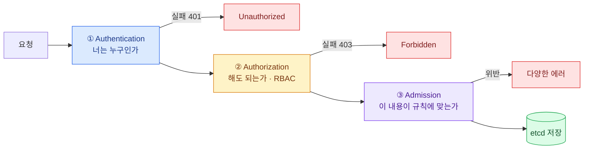

| 단계 | 실패 시 | 뜻 |
|---|---|---|
| TLS | `x509`·인증서 검증 오류 | API 서버 신원·CA·SAN 또는 유효기간이 맞지 않는다 |
| 인증 | **401 Unauthorized** | 신원을 확인할 수 없다 |
| 인가 | **403 Forbidden** | 신원은 확인됐지만 권한이 없다 |
| admission | 다양한 에러 | 정책·검증에 걸렸다 |

:::tip[시험]
**403 메시지는 원인을 그대로 알려준다.**\
`User "dev" cannot list resource "pods" in API group "" in the namespace "prod"`\
→ 필요한 **주체 / 동사 / 리소스 / 네임스페이스**가 전부 문장 안에 있다.
:::

에러 문장을 RBAC 필드로 옮기면 그대로 답이 된다.

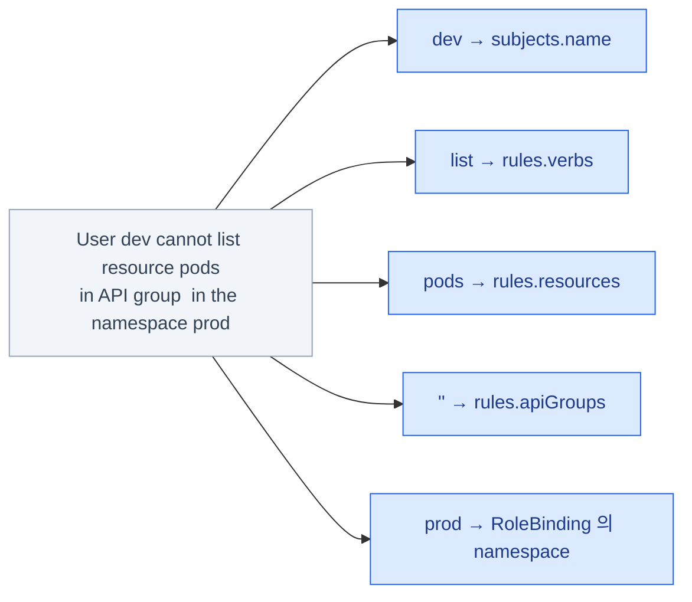

## 인증 — 사용자와 ServiceAccount

API 서버를 부르는 쪽은 **두 부류**다 — 노트북 앞의 사람과, 클러스터 안에서 도는 워크로드다.
사람은 수가 적고 조직의 계정 체계가 이미 있는 반면, Pod은 수시로 생겼다 사라지고 자격증명을
자동으로 받아야 한다. 그래서 Kubernetes는 **사람은 클러스터 밖의 신원(인증서·OIDC)에 맡기고,
Pod은 클러스터 안의 오브젝트(ServiceAccount)로** 관리한다.

### 인증 방식들

<CardGrid>
<Card title="클라이언트 인증서" icon="padlock">
사람(관리자)용.
kubeadm의 `admin.conf`가 이것이다.
</Card>
<Card title="ServiceAccount 토큰" icon="document">
Pod 안의 워크로드용. JWT(JSON Web Token).
</Card>
<Card title="OIDC" icon="external">
OIDC(OpenID Connect).
사람 · 조직 SSO(Single Sign-On·통합 로그인). 실무 표준.
</Card>
<Card title="Webhook" icon="link">
외부 시스템에 위임.
EKS의 IAM 연동 등.
</Card>
</CardGrid>

뒤의 둘은 **실무의 표준이지만 시험에서 직접 설정할 일은 거의 없다** — 어떤 문제를 푸는 방식인지만 알아두면 된다.
OIDC는 사내 IdP(Identity Provider·신원 공급자)가 발급한 토큰을 API 서버가 검증하게 하는 방식으로,
사람마다 인증서를 발급·폐기하는 수고를 없앤다. Webhook은 그 판정 자체를 외부 서비스에 물어보는 방식이고,
EKS가 AWS IAM 계정을 클러스터 사용자로 인식시키는 것이 이 경우다.

Bootstrap 토큰은 노드 조인 전용이다 (`kubeadm join` 때).
새 노드는 아직 아무 자격증명이 없으니 CSR을 제출할 신원조차 없다 —
**"CSR을 낼 수 있을 만큼만" 권한이 있는 임시 토큰**이 이 자리를 메운다.
`kubeadm token create`로 만들고 기본 24시간이면 만료된다 (15장).

**중요: Kubernetes에는 "User" 오브젝트가 없다.**

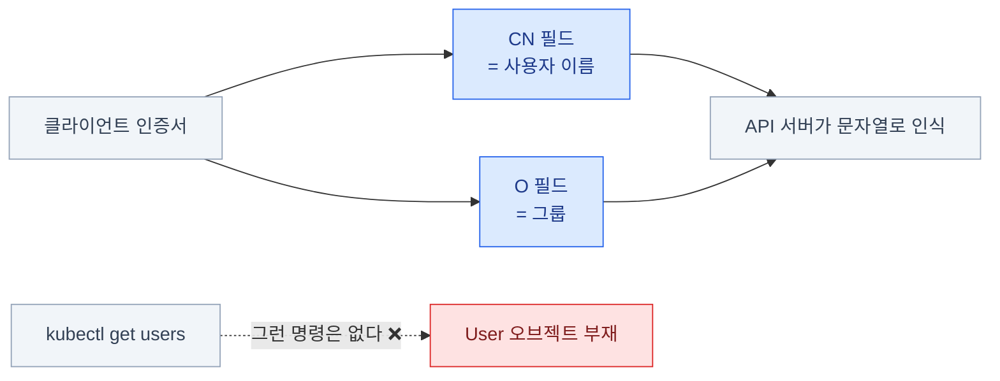

- `kubectl get users` 같은 것은 존재하지 않는다
- 사용자는 **인증서의 CN 필드**나 **OIDC 토큰의 클레임**에서 문자열로 나온다
- 그룹은 인증서의 **O(Organization)** 필드에서 나온다

그래서 "**사용자를 만든다"는 곧 "인증서를 발급한다**"는 뜻이다.

### 사용자 인증서 만들기 (CSR API)

사용자를 만드는 일이 곧 인증서 발급이라면, 누군가는 그 인증서에 **클러스터 CA(Certificate Authority·인증 기관)의
키로 서명**해야 한다. 그 키는 컨트롤 플레인 노드의 `/etc/kubernetes/pki/`에 있고, 아무나 만질 수 없다.
CSR(CertificateSigningRequest) API는 **"서명해 달라"는 요청을 API 오브젝트로 만들어**,
권한 있는 사람이 `approve`하면 클러스터가 대신 서명해 주는 창구다 — CA 키를 넘겨줄 필요가 없어진다.

CSR 오브젝트의 YAML은 외우지 말고, 시험 중에는 공식
[Certificate Signing Requests](https://kubernetes.io/docs/reference/access-authn-authz/certificate-signing-requests/)
페이지를 열어 뼈대를 복사한 뒤 `request` 필드만 채우는 게 정석이다.

<Steps>

1. **키와 CSR 생성** — `CN`이 사용자, `O`가 그룹이다

   ```bash
   openssl genrsa -out dev.key 2048
   openssl req -new -key dev.key -out dev.csr -subj "/CN=dev/O=developers"
   #                                                  ^사용자    ^그룹
   ```

2. **Kubernetes CSR 오브젝트로 제출**

   ```bash
   cat <<EOF | kubectl apply -f -
   apiVersion: certificates.k8s.io/v1
   kind: CertificateSigningRequest
   metadata:
     name: dev
   spec:
     request: $(cat dev.csr | base64 | tr -d '\n')
     signerName: kubernetes.io/kube-apiserver-client
     expirationSeconds: 86400
     usages: ["client auth"]
   EOF
   ```

3. **승인**

   ```bash
   kubectl get csr
   kubectl certificate approve dev
   kubectl certificate deny dev            # 거부할 때
   ```

4. **서명된 인증서 꺼내기**

   ```bash
   kubectl get csr dev -o jsonpath='{.status.certificate}' | base64 -d > dev.crt
   ```

</Steps>

`signerName`은 **어느 CA로 서명할지**를 고르는 필드다. 사람·앱이 API 서버에 접속할 인증서는
`kubernetes.io/kube-apiserver-client`가 정답이고, kubelet용(`...kubelet-serving`,
`...kube-apiserver-client-kubelet`)은 노드 자동 갱신에 쓰인다 — 이름을 틀리면 아무도 서명하지 않아
CSR이 `Pending`에서 멈춘다. `expirationSeconds`는 발급될 인증서의 수명 요청이다(위 예는 24시간).

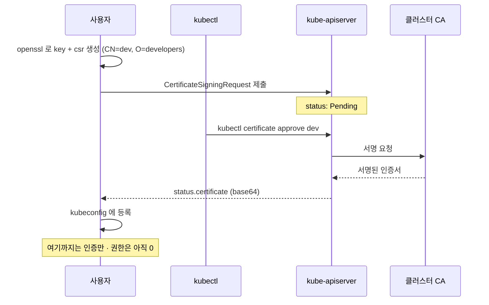

### kubeconfig에 등록하기

```bash
kubectl config set-credentials dev \
  --client-certificate=dev.crt \
  --client-key=dev.key \
  --embed-certs=true

kubectl config set-context dev-ctx \
  --cluster=kubernetes \
  --user=dev \
  --namespace=dev

kubectl config use-context dev-ctx
kubectl auth whoami            # 내가 누구로 인식되는지
```

:::tip[시험]
CSR 생성·승인은 **출제 빈도가 높다.**
`kubectl get csr` → `kubectl certificate approve` 흐름과
**CN이 사용자 이름, O가 그룹**이라는 것만 확실히 하면 된다.
:::

:::caution[함정]
인증서를 발급받아도 **권한은 하나도 없다.**
인증(누구인가)과 인가(무엇을 할 수 있는가)는 별개다. RoleBinding을 따로 만들어야 한다.
:::

### ServiceAccount — Pod의 신원

Pod도 API 서버를 부른다 — Ingress 컨트롤러는 Ingress를 읽고, CI 봇은 Deployment를 고친다.
그런데 Pod은 수시로 생겼다 사라지므로 사람처럼 인증서를 손으로 발급해 줄 수 없다.
**ServiceAccount(SA)는 클러스터 안의 신원 오브젝트**이고, Pod에 붙이면 kubelet이
토큰을 자동으로 넣고 갈아 끼워 준다. 사람 = 클러스터 밖 신원, 워크로드 = SA — 이 대비가 핵심이다.

```bash
kubectl create sa deploy-bot
kubectl get sa
kubectl describe sa deploy-bot
```

```yaml
spec:
  serviceAccountName: deploy-bot
  automountServiceAccountToken: false     # 토큰을 안 넣는다
```

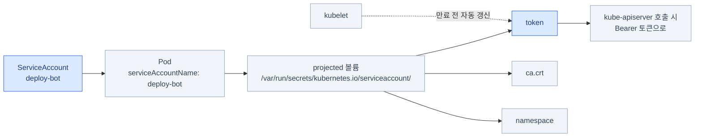

- **모든 네임스페이스에 `default` SA가 자동으로** 만들어진다
- Pod에 SA를 지정하지 않으면 `default`가 붙는다
- 토큰은 `/var/run/secrets/kubernetes.io/serviceaccount/` 에 마운트된다

```bash
kubectl exec -it web -- ls /var/run/secrets/kubernetes.io/serviceaccount/
# ca.crt  namespace  token
```

API를 호출하지 않는 앱이라면 `automountServiceAccountToken: false`가 안전하다.
토큰이 파일로 들어 있으면 컨테이너가 뚫렸을 때 그대로 API 서버를 부르는 데 쓰일 수 있기 때문이다.
`default` SA에는 권한이 거의 없지만, "권한 0인 신원"과 "신원 없음"은 다르다.

### SA 토큰의 현재 방식

예전 방식의 문제는 **토큰에 만료가 없었다는 것**이다. Secret에 담긴 문자열 하나가 새어 나가면
그 SA의 권한이 영원히 남의 것이 된다. 지금은 **TokenRequest API로 수명이 붙은 토큰**을 발급하고
kubelet이 만료 전에 갈아 끼운다 — 새어도 시간이 지나면 죽는다.

<Tabs>
<TabItem label="지금 — TokenRequest">

- **TokenRequest API**로 **수명이 있는 토큰**이 projected 볼륨으로 주입된다
- kubelet이 만료 전에 **자동으로 갱신**한다

```bash
# 수동으로 토큰 발급 (기본 1시간)
kubectl create token deploy-bot
kubectl create token deploy-bot --duration=24h
```

</TabItem>
<TabItem label="예전 — 만료 없는 Secret">

예전에는 SA를 만들면 만료 없는 토큰 Secret이 자동으로 생겼다.
지금도 꼭 필요하면 직접 만들 수 있다.

```yaml
apiVersion: v1
kind: Secret
metadata:
  name: deploy-bot-token
  annotations:
    kubernetes.io/service-account.name: deploy-bot
type: kubernetes.io/service-account-token
```

CI/CD 등 클러스터 밖에서 쓸 토큰이 이 경우다.
다만 **수명 없는 자격증명**이라 관리가 필요하다.

</TabItem>
</Tabs>

:::caution[옛 정보 주의]
"SA를 만들면 토큰 Secret이 같이 생긴다"는 설명은 **오래된 자료다.**
지금은 자동으로 만들어지지 않으며, `kubectl describe sa`의 `Tokens:` 가 비어 있는 것이 정상이다.
토큰이 필요하면 `kubectl create token deploy-bot` 으로 그때그때 발급한다 — 이 명령을 손에 익혀 둘 것.
:::

## RBAC의 네 리소스

인가를 "이 사람에게 이 권한"으로 하나씩 붙이면, 사람이 늘 때마다 권한 목록을 통째로 복사해야 하고
정책이 바뀌면 전부를 찾아 고쳐야 한다. RBAC은
**역할에 권한을 정의해 두고, 주체를 그 역할에 묶는** 방식이다.
권한 정의는 한 곳에 모이고, 사람이 늘어나는 일은 **묶기 하나를 더하는 일**이 된다.

**핵심 구조는 하나다 — 주체 → 바인딩 → 역할 → 리소스.**

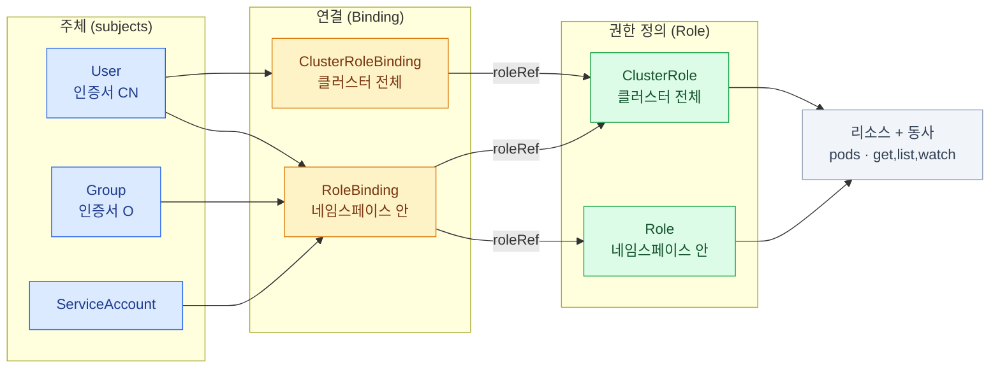

**권한을 정의한다** — `Role`(네임스페이스 안) · `ClusterRole`(클러스터 전체)\
**권한을 부여한다** — `RoleBinding`(네임스페이스 안) · `ClusterRoleBinding`(클러스터 전체)

- RBAC은 **누적(additive)** 이다. **거부 규칙이 없다**
- 어느 규칙에도 안 걸리면 **기본 거부**

NetworkPolicy와 같은 철학이다 — **"막는다"가 아니라 "허용하지 않는다"**.

### Role

```yaml
apiVersion: rbac.authorization.k8s.io/v1
kind: Role
metadata:
  name: pod-reader
  namespace: dev
rules:
  - apiGroups: [""]                 # "" = core 그룹 (Pod, Service, ConfigMap …)
    resources: ["pods", "pods/log"]
    verbs: ["get", "list", "watch"]
  - apiGroups: ["apps"]
    resources: ["deployments"]
    verbs: ["get", "list", "update", "patch"]
  - apiGroups: [""]
    resources: ["secrets"]
    resourceNames: ["db-secret"]    # 특정 이름만
    verbs: ["get"]
```

```bash
kubectl create role pod-reader --verb=get,list,watch --resource=pods -n dev
kubectl create role pod-reader --verb=get --resource=pods --resource-name=web -n dev
```

`resourceNames`는 **이름이 정해진 오브젝트 하나로 권한을 좁힌다** — 위 예는 `dev` 네임스페이스의
Secret 중 `db-secret`만 읽게 한다. 함정이 하나 있다: **`list`·`watch`에는 통하지 않는다.**
목록 조회는 요청 시점에 대상 이름이 없어서 필터링할 수 없기 때문이다.
`resourceNames`를 걸면 `get`은 되지만 `kubectl get secrets`는 여전히 403이다.

Role·RoleBinding YAML 뼈대는 공식 [Using RBAC Authorization](https://kubernetes.io/docs/reference/access-authn-authz/rbac/)
페이지에 그대로 있다 — 시험 중 `kubectl create role`로 부족한 복잡한 rules는 여기서 복사해 고친다.

### verbs와 apiGroups

**주요 verb**

| verb | HTTP |
|---|---|
| `get` | GET (단일) |
| `list` | GET (목록) |
| `watch` | GET (스트림) |
| `create` | POST |
| `update` | PUT |
| `patch` | PATCH |
| `delete` | DELETE |
| `deletecollection` | DELETE (다수) |
| `*` | 전부 |

**apiGroups**

| 값 | 리소스 |
|---|---|
| `""` | Pod, Service, ConfigMap, Secret, Node, PV… |
| `"apps"` | Deployment, ReplicaSet, StatefulSet, DaemonSet |
| `"batch"` | Job, CronJob |
| `"networking.k8s.io"` | Ingress, NetworkPolicy |
| `"rbac.authorization.k8s.io"` | Role, RoleBinding |
| `"storage.k8s.io"` | StorageClass, CSIDriver |

```bash
kubectl api-resources                    # APIVERSION 열에서 그룹을 확인
kubectl api-resources --api-group=apps
```

### 하위 리소스를 잊지 말 것

일부 동작은 **별도의 하위 리소스**로 취급된다.

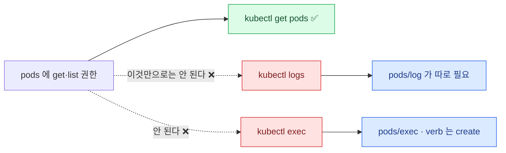

| 하고 싶은 것 | 필요한 리소스 |
|---|---|
| `kubectl logs` | **`pods/log`** |
| `kubectl exec` | **`pods/exec`** (verb는 `create`) |
| `kubectl port-forward` | `pods/portforward` |
| `kubectl scale deploy` | `deployments/scale` |
| Pod 상태 갱신 | `pods/status` |

:::caution[함정]
**`pods`에 `get` 권한이 있어도 `kubectl logs`는 403이다.**
`pods/log`가 따로 필요하다. 실무·시험 모두에서 자주 걸린다.
:::

```yaml
- apiGroups: [""]
  resources: ["pods/exec"]
  verbs: ["create"]           # exec은 create 동사다
```

### RoleBinding

```yaml
apiVersion: rbac.authorization.k8s.io/v1
kind: RoleBinding
metadata:
  name: dev-can-read-pods
  namespace: dev
subjects:
  - kind: User                             # 인증서의 CN
    name: dev
    apiGroup: rbac.authorization.k8s.io
  - kind: Group                            # 인증서의 O
    name: developers
    apiGroup: rbac.authorization.k8s.io
  - kind: ServiceAccount                   # SA는 apiGroup을 쓰지 않는다
    name: deploy-bot
    namespace: dev
roleRef:
  kind: Role                               # Role 또는 ClusterRole
  name: pod-reader
  apiGroup: rbac.authorization.k8s.io
```

```bash
kubectl create rolebinding dev-can-read-pods --role=pod-reader --user=dev -n dev
kubectl create rolebinding sa-binding --role=pod-reader --serviceaccount=dev:deploy-bot -n dev
```

:::caution[함정]
**`roleRef`는 생성 후 변경할 수 없다.**
바꾸려면 바인딩을 지우고 다시 만들어야 한다.
:::

### ClusterRole과 ClusterRoleBinding

Role은 네임스페이스 안의 리소스만 가리킬 수 있다. 그런데 Node·PV·StorageClass처럼
**네임스페이스가 아예 없는 리소스**가 있고, "모든 네임스페이스에서 Pod을 볼 수 있는 사람"도 필요하다.
Role로는 표현할 수 없는 이 범위를 맡는 것이 ClusterRole이다.

```bash
kubectl create clusterrole node-reader --verb=get,list,watch --resource=nodes
kubectl create clusterrolebinding ops-nodes --clusterrole=node-reader --user=ops
```

**ClusterRole이 필요한 경우**

<CardGrid>
<Card title="클러스터 스코프 리소스" icon="server">
Node, PersistentVolume, StorageClass,
Namespace, ClusterRole — 네임스페이스가 없는 것들.
</Card>
<Card title="여러 네임스페이스 재사용" icon="random">
같은 권한 정의를 여러 곳에서
RoleBinding으로 붙여 쓴다.
</Card>
<Card title="비(非)리소스 URL" icon="link">
`/healthz`, `/metrics` 같은
리소스가 아닌 경로.
</Card>
</CardGrid>

```yaml
rules:
  - nonResourceURLs: ["/healthz", "/metrics"]
    verbs: ["get"]
```

`nonResourceURLs`는 **API 오브젝트가 아닌 경로**를 다룬다. `/healthz`·`/metrics`·`/version`처럼
API 서버가 그냥 응답하는 엔드포인트에는 apiGroup도 resource도 없어서, 보통의 `rules`로는
가리킬 수 없기 때문이다. 모니터링 시스템에 권한을 줄 때 쓰이며,
**깊게 팔 필요는 없다 — ClusterRole에서만 쓸 수 있다는 것만 기억한다.**

### 조합 — 이 그림이 전부다

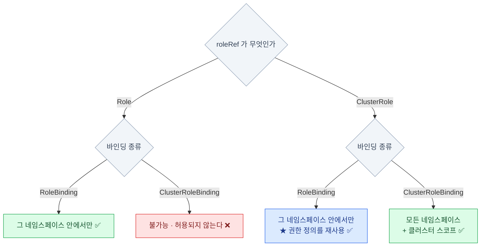

| roleRef | 바인딩 종류 | 결과 |
|---|---|---|
| `Role` | `RoleBinding` | **그 네임스페이스 안에서만** |
| `ClusterRole` | `RoleBinding` | **그 네임스페이스 안에서만** (권한 정의를 재사용) |
| `ClusterRole` | `ClusterRoleBinding` | **모든 네임스페이스 + 클러스터 스코프** |
| `Role` | `ClusterRoleBinding` | **불가능** — 허용되지 않는다 |

**세 번째 줄(파란 칸)이 핵심이다.** ClusterRole을 RoleBinding으로 묶으면
**권한 범위는 그 네임스페이스로 좁혀진다.**

:::tip[시험]
"여러 네임스페이스에서 같은 권한"은
ClusterRole 하나 + 각 네임스페이스에 RoleBinding으로 푼다.
Role을 네임스페이스마다 복사하는 것보다 빠르고 정확하다.
:::

### 내장 ClusterRole

"읽기 전용 권한"이나 "네임스페이스 안에서 다 할 수 있는 권한"은 어느 클러스터에나 필요하다.
그래서 Kubernetes가 **미리 만들어 둔 ClusterRole**이 있다 — 시험에서도 Role을 새로 쓰는 것보다
이걸 RoleBinding으로 붙이는 쪽이 빠를 때가 많다.

```bash
kubectl get clusterroles
kubectl describe clusterrole view
```

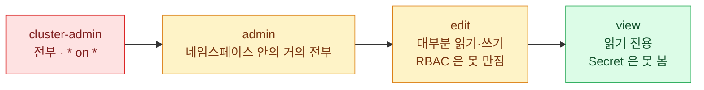

| 이름 | 권한 |
|---|---|
| **`cluster-admin`** | 전부. `*` on `*` |
| **`admin`** | 네임스페이스 안의 거의 전부 (ResourceQuota·Namespace 자체는 제외) |
| **`edit`** | 대부분의 리소스 읽기·쓰기. **RBAC은 못 만진다** |
| **`view`** | 읽기 전용. **Secret은 못 본다** |

```bash
kubectl create clusterrolebinding me-admin --clusterrole=cluster-admin --user=alice
kubectl create rolebinding dev-edit --clusterrole=edit --user=bob -n dev
```

`system:` 접두사가 붙은 것들은 컴포넌트용이다 (`system:node`, `system:kube-scheduler` …).
**수정하지 말 것.** kubelet·스케줄러·컨트롤러 매니저가 이 역할로 API 서버를 부르므로,
잘못 건드리면 클러스터 자체가 멈춘다.
게다가 API 서버는 기동할 때 기본 역할에서 **빠진 권한을 도로 채워 넣는다** —
지운 규칙은 살아 돌아오고 더한 규칙은 그대로 남아, 의도와 다른 상태가 되기 쉽다.

### 집계 ClusterRole<Badge text="시험 비중 낮음" variant="note" />

CRD(CustomResourceDefinition)로 새 리소스를 들여오면, `view` 권한을 가진 사람들은 그것을 못 본다 —
`view`의 규칙에 그 리소스가 없기 때문이다. 그렇다고 내장 역할을 직접 고치는 것은 위험하다(바로 위).
**집계(aggregation)가 그 사이를 메운다.** 라벨이 붙은 ClusterRole을 만들어 두면
API 서버가 그 규칙을 내장 역할 안으로 **자동으로 합쳐 준다.**

```yaml
apiVersion: rbac.authorization.k8s.io/v1
kind: ClusterRole
metadata:
  name: monitoring
  labels:
    rbac.authorization.k8s.io/aggregate-to-view: "true"    # view에 자동 합쳐진다
rules:
  - apiGroups: ["monitoring.coreos.com"]
    resources: ["prometheuses"]
    verbs: ["get", "list", "watch"]
```

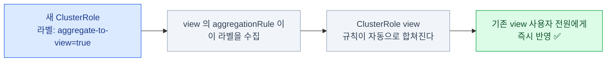

- 라벨을 붙이면 **기존 `view`/`edit`/`admin`에 규칙이 자동으로 합쳐진다**
- CRD를 설치할 때 기본 역할에 권한을 얹는 표준 방법이다
- `admin`/`edit`/`view`의 `aggregationRule`이 이 라벨을 수집한다

```bash
kubectl get clusterrole view -o yaml | grep -A5 aggregationRule
```

`aggregationRule`이 있는 ClusterRole의 `rules`는 **컨트롤러가 채우는 자리**다 — 손으로 적어도 덮어써진다.
직접 만들 일은 드물지만, `view`의 `rules`가 왜 저절로 늘어나는지를 설명해 주는 장치라
**이름과 동작 방향만 알아두면 된다.**

## 권한 확인하기

RBAC은 **여러 바인딩의 합**이라, YAML을 눈으로 읽어서는 "그래서 이 사람이 지금 무엇을 할 수 있는가"가
잘 안 보인다. `kubectl auth can-i`는 그 계산을 **API 서버에게 직접 물어보는** 명령이다 —
실제 인가 판정과 같은 코드가 답하므로, 내 해석이 아니라 클러스터의 결론이 나온다.
impersonation(가장·`--as`)까지 쓰면 로그인하지 않고도 남의 관점에서 확인할 수 있다.

```bash
kubectl auth can-i create deployments -n dev
kubectl auth can-i delete pods --all-namespaces
kubectl auth can-i '*' '*'                         # 클러스터 관리자인가

# 남의 권한을 대신 확인 (impersonation)
kubectl auth can-i list secrets -n dev --as=dev
kubectl auth can-i get pods --as=system:serviceaccount:dev:deploy-bot -n dev

# 내가 가진 권한 전부
kubectl auth can-i --list -n dev
kubectl auth whoami
```

:::tip[시험]
RBAC 문제의 **검산은 반드시 `auth can-i --as`** 로 한다.
"만들었다"와 "동작한다"는 다르다. SA 표기는
**`system:serviceaccount:네임스페이스:이름`** 형식이다 — 이 문자열을 외워둘 것.
:::

## 실제로 실행해보기

```bash
# impersonation으로 테스트 (kubeconfig 전환 없이)
kubectl --as=dev get pods -n dev
kubectl --as=dev --as-group=developers get pods -n dev

# SA 토큰으로 Pod 안에서
kubectl run tmp --image=curlimages/curl --rm -it --restart=Never \
  --overrides='{"spec":{"serviceAccountName":"deploy-bot"}}' -- sh
  TOKEN=$(cat /var/run/secrets/kubernetes.io/serviceaccount/token)
  curl -s --cacert /var/run/secrets/kubernetes.io/serviceaccount/ca.crt \
    -H "Authorization: Bearer $TOKEN" \
    https://kubernetes.default.svc/api/v1/namespaces/dev/pods
```

:::caution[함정]
`--as` 로 남을 흉내내려면
**본인에게 impersonate 권한이 있어야** 한다.
`cluster-admin`이면 문제없지만, 제한된 계정으로는 안 된다.
:::

## admission 컨트롤러

인가를 통과한 뒤 **내용을 검사하거나 고치는** 단계다.

왜 따로 있는가 — **인가(RBAC)는 요청의 내용을 보지 않기 때문**이다.
RBAC의 관할은 "누가 · 어떤 동사를 · 어떤 리소스에"까지다. dev에게 Pod 생성 권한이
있으면 `latest` 태그든, 미승인 레지스트리 이미지든, limit 없는 Pod든 **전부 통과**한다.
"생성은 허용하되, **이런 내용이면 고치거나 거부한다**"는 규칙을 걸 자리가 admission이다.

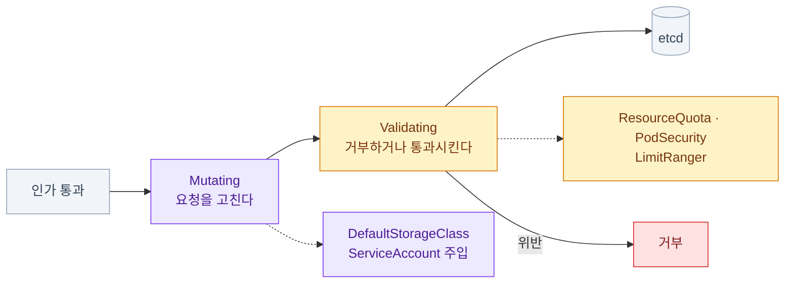

| 종류 | 하는 일 | 예 |
|---|---|---|
| **Mutating** | 요청을 **고친다** | `DefaultStorageClass`, `ServiceAccount` 주입 |
| **Validating** | **거부하거나 통과**시킨다 | `ResourceQuota`, `PodSecurity`, `LimitRanger` |

Mutating이 먼저 돌고 Validating이 고쳐진 결과를 검사한다.
**스케줄링과는 무관하다** — admission은 etcd 저장 **전**의 관문이라,
여기서 거부된 Pod는 스케줄러가 본 적도 없다.

### 켜고 끄기 — kube-apiserver 플래그

admission 컨트롤러는 별도 설치물이 아니라 **API 서버 안에 내장**돼 있고,
플래그로 켜고 끈다. kubeadm 클러스터라면 static Pod 매니페스트를 고친다.

```bash
# 활성 목록 확인
sudo grep admission-plugins /etc/kubernetes/manifests/kube-apiserver.yaml

# command에 추가 — 기본 셋에 더하거나 뺀다
- --enable-admission-plugins=NodeRestriction,ImagePolicyWebhook
- --disable-admission-plugins=DefaultStorageClass
```

**중요한 내장 플러그인**

- `NamespaceLifecycle` — 없는 네임스페이스로의 생성을 거부하고, `kube-system` 같은
  시스템 네임스페이스의 삭제를 막는다 (옛 `NamespaceExists`·`NamespaceAutoProvision`을 대체)
- `LimitRanger` / `ResourceQuota` — 6장
- `PodSecurity` — 7장
- `DefaultStorageClass` — PVC에 기본 클래스를 채운다 (mutating의 대표 예)
- `NodeRestriction` — kubelet이 **자기 노드의 리소스만** 만지게 제한한다
- `MutatingAdmissionWebhook` / `ValidatingAdmissionWebhook` — 외부 정책 엔진 연동 (아래)

### 세부 설정 — AdmissionConfiguration 파일

일부 플러그인은 켜는 것만으로 끝나지 않고 **세부 설정 파일이 따로** 필요하다.
대표가 `ImagePolicyWebhook` — Pod 생성·수정 요청에서 **컨테이너 이미지 이름을 뽑아
외부 webhook 서버에 물어보고**, 응답대로 통과시키거나 거부한다.
"미승인 레지스트리 이미지를 클러스터에 아예 못 들어오게" 하는 관문의 구현이다.

```yaml
# 예: /etc/kubernetes/admission/admission-config.yaml
apiVersion: apiserver.config.k8s.io/v1
kind: AdmissionConfiguration
plugins:
  - name: ImagePolicyWebhook
    configuration:
      imagePolicy:
        kubeConfigFile: /etc/kubernetes/admission/imagepolicy.kubeconfig  # webhook 서버 주소·인증서
        defaultAllow: false   # webhook이 응답 없을 때 — false면 전부 거부
```

이 파일을 API 서버 플래그 `--admission-control-config-file=<경로>`로 넘긴다.

:::caution[함정 — kubectl로는 안 보인다]
`kubectl api-resources`에 `AdmissionConfiguration`이 **없는 게 정상**이다.
이것은 etcd에 저장되는 API 오브젝트가 아니라 **API 서버가 기동할 때 디스크에서 읽는
설정 파일의 형식**이고, `apiVersion`은 파일 파싱용 스키마 표시일 뿐이다 —
6장의 `EncryptionConfiguration`, kubelet의 `KubeletConfiguration`과 같은 부류다.
따라서 `kubectl explain`도 안 되고, 스키마는 kubernetes.io에서
**ImagePolicyWebhook을 검색**해 찾는다. 그리고 API 서버는 static Pod라서
설정 파일 경로를 **hostPath 볼륨으로 마운트까지** 해 줘야 읽는다 — 빼먹기 쉽다.
:::

### 외부 webhook — 직접 만드는 admission

내장 플러그인에 없는 규칙은 webhook 리소스 두 종으로 건다. 이쪽은 설정 파일이 아니라
**진짜 API 리소스**라(`admissionregistration.k8s.io` 그룹) kubectl로 만들고 조회한다.

<Badge text="시험 비중 낮음" variant="note" /> webhook 서버를 직접 구현하는 데까지 갈 필요는 없다.
이런 리소스가 있다는 것, **정책 엔진이 여기에 붙는다**는 것, 그리고 아래 함정이
"갑자기 아무것도 안 만들어진다" 유형의 트러블슈팅에서 쓸모 있다는 점을 챙긴다.
표에 나오는 OPA는 Open Policy Agent — Kyverno와 함께 **정책을 코드로 쓰게 해 주는** 도구다.

| 리소스 | 시점 | 쓰임 |
|---|---|---|
| `MutatingWebhookConfiguration` | validating보다 먼저 | 사이드카 주입, 라벨·기본값 추가 |
| `ValidatingWebhookConfiguration` | 저장 직전 마지막 검사 | 정책 위반 거부 (OPA Gatekeeper, Kyverno) |

API 서버는 등록된 `rules`에 걸리는 요청마다 **AdmissionReview** JSON을
webhook 서버(대개 클러스터 안의 Service)로 보내고,
응답의 `allowed: true/false`대로 통과 여부를 정한다.

:::caution[함정]
외부 webhook이 응답하지 않으면
`failurePolicy: Fail`일 때 **해당 리소스 생성이 전부 막힌다.**
"갑자기 아무것도 안 만들어진다"의 원인이 될 수 있다.
`ImagePolicyWebhook`의 `defaultAllow: false`도 같은 성격이다 —
**정책 서버의 장애가 클러스터 전체의 생성 장애**가 된다.
:::

## RBAC 진단 순서

<Steps>

1. **에러 메시지를 정확히 읽는다** — 필요한 정보가 다 있다

   ```
   Error from server (Forbidden): pods is forbidden:
     User "dev" cannot list resource "pods" in API group "" in the namespace "prod"
   ```

2. **실제로 안 되는지 확인**

   ```bash
   kubectl auth can-i list pods -n prod --as=dev
   ```

3. **바인딩이 있는지**

   ```bash
   kubectl get rolebinding,clusterrolebinding -A -o wide | grep dev
   ```

4. **역할의 내용 확인**

   ```bash
   kubectl describe role pod-reader -n prod
   kubectl describe clusterrole view
   ```

</Steps>

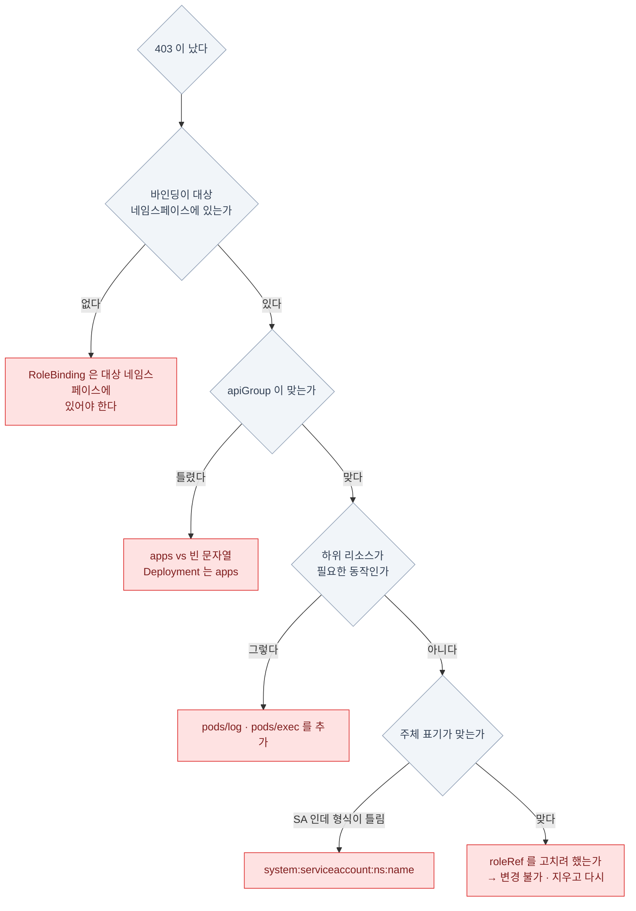

| 흔한 원인 | 확인 |
|---|---|
| 바인딩의 **네임스페이스가 다르다** | RoleBinding은 대상 네임스페이스에 있어야 한다 |
| **apiGroup 오타** | `apps` vs `""` — Deployment는 `apps` |
| **하위 리소스 누락** | `pods/log`, `pods/exec` |
| **SA 이름 형식** | `system:serviceaccount:ns:name` |
| `roleRef`를 고치려 했다 | 변경 불가 — 지우고 다시 |

## 14장 요약

- **401은 인증, 403은 인가.** 403 메시지에 주체·동사·리소스·네임스페이스가 다 있다
- **User 오브젝트는 없다.** 사용자 = 인증서의 **CN**, 그룹 = **O**
- 사용자 생성은 **CSR 제출 → `certificate approve` → 인증서 추출 → kubeconfig**
- **인증서만으로는 아무 권한도 없다.** 바인딩이 따로 필요하다
- SA 토큰은 이제 **수명 있는 projected 토큰**이 기본. `kubectl create token`
  — "SA를 만들면 토큰 Secret이 생긴다"는 **옛 정보다**
- **Role은 권한 정의, Binding은 연결.** 거부 규칙은 없고 **기본 거부**
- **ClusterRole + RoleBinding = 그 네임스페이스로 범위가 좁혀진다** ← 가장 유용한 조합
- **`pods` 권한이 있어도 `logs`는 `pods/log`가 따로** 필요하다
- `resourceNames`로 좁힌 권한은 **`get`에만 통한다** — `list`·`watch`는 이름으로 못 좁힌다
- 검산은 **`kubectl auth can-i --as=...`**
- **admission은 인가가 못 보는 "내용"의 관문** — mutating(고침) → validating(거부) 순.
  `AdmissionConfiguration`은 API 리소스가 아니라 **API 서버의 설정 파일**이다

:::note[손 연습]
이 장 범위의 KodeKloud 실습 풀이 — [CKA 실습 8장 · 인증서·kubeconfig·RBAC](/cka-udemy/08-security/)
:::
