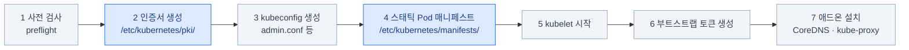
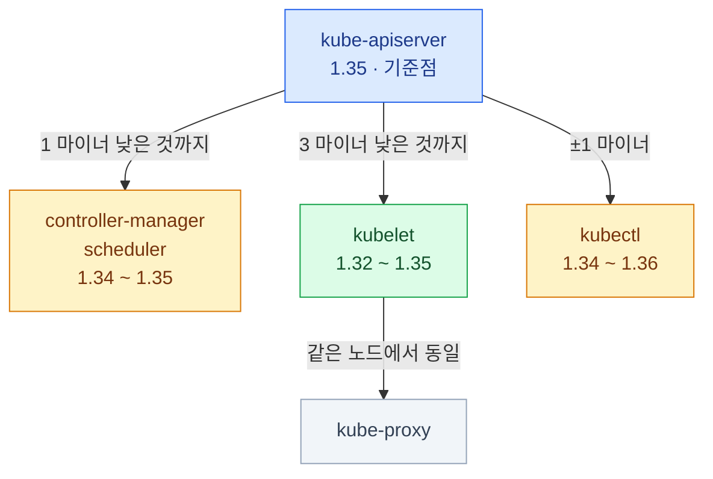
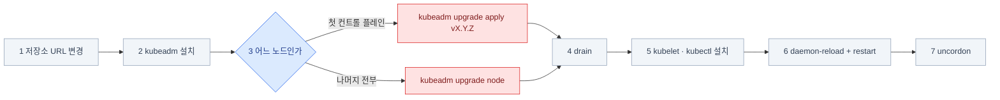
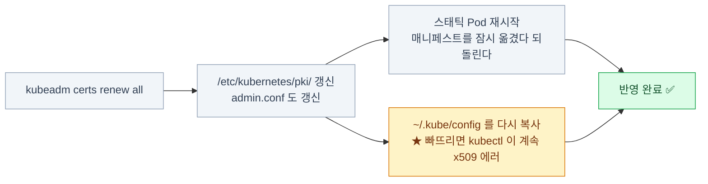
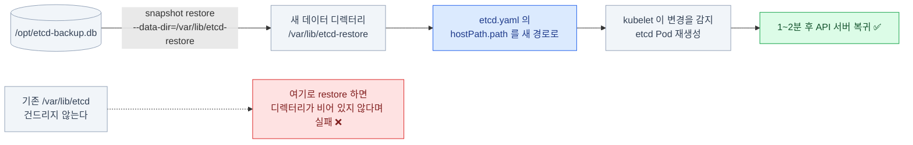
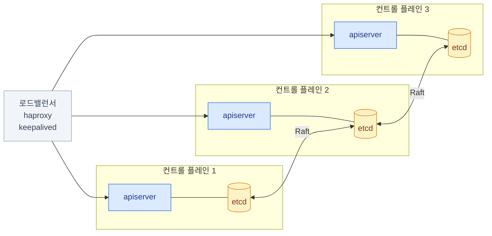
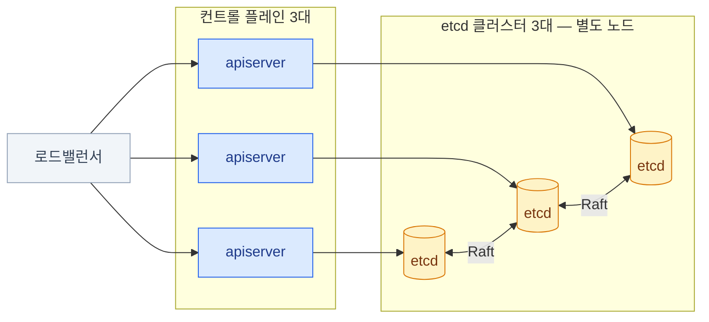
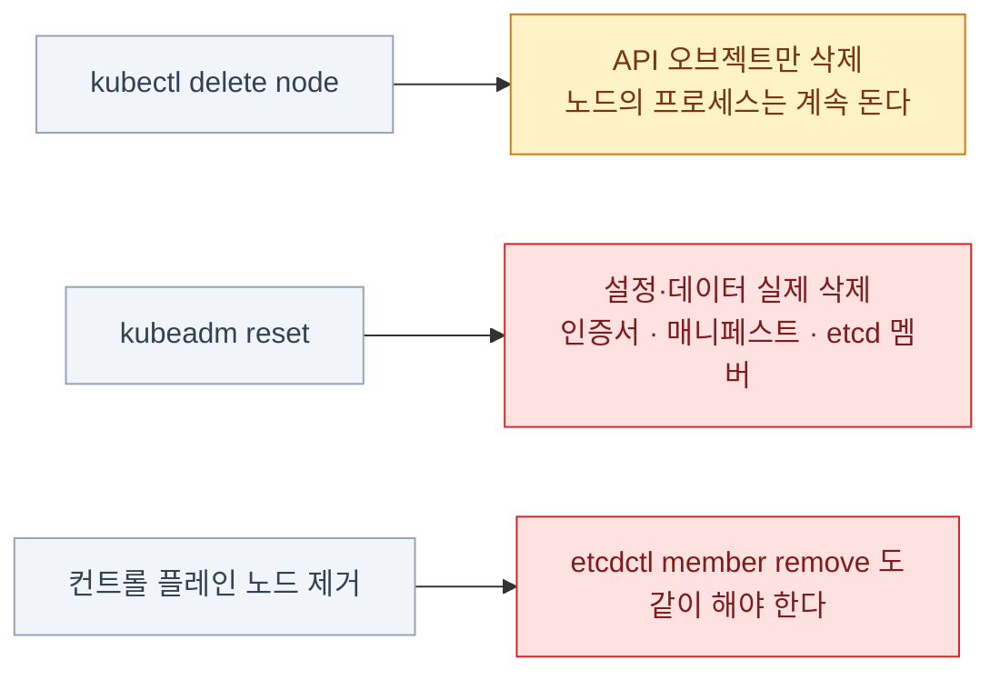

import { Steps, Card, CardGrid, Tabs, TabItem, FileTree } from '@astrojs/starlight/components';

> 설치 · 업그레이드 · 백업 · 복구

## 이 장이 시험의 승부처다

- **커리큘럼의 25%가** 이 영역이다 (Cluster Architecture, Installation and Configuration)
- 그리고 **평소에 할 일이 없는 작업**들이다 — EKS/GKE를 쓰면 아예 못 만진다
- 문제 하나가 **10~15분**을 먹는다. 손에 안 붙어 있으면 시간에 진다

**반복 말고는 방법이 없다.** killercoda에서
**업그레이드와 etcd 백업·복구를 각각 10회 이상** 돌리는 것을 권한다.

:::tip[시험]
이 장의 명령들은 **공식 문서에 그대로 있다.**
`kubernetes.io/docs`에서 `upgrade kubeadm clusters`, `operating etcd`를
**찾아가는 경로 자체를 연습**해두면 시험장에서 그대로 쓸 수 있다.
:::

## 클러스터 설치

설치의 주인공은 **kubeadm** — 공식 클러스터 부트스트랩 도구다.
인증서·kubeconfig·컨트롤 플레인 스태틱 Pod을 순서대로 만들어 준다.

### 클러스터가 만들어지는 전체 흐름

한 장으로 보면 어디서 무엇이 걸리는지가 보인다.

```mermaid
flowchart LR
    A["노드 준비<br/>swap off · 커널 모듈 · sysctl"] --> B["런타임 설치<br/>containerd · SystemdCgroup"]
    B --> C["패키지 설치<br/>kubelet · kubeadm · kubectl"]
    C --> D["kubeadm init<br/>컨트롤 플레인 생성"]
    D --> E["kubeconfig 복사<br/>admin.conf → ~/.kube/config"]
    E --> F["CNI 설치<br/>이걸 안 하면 NotReady"]
    F --> G["워커 join<br/>kubeadm join"]
    G --> H["kubectl get nodes<br/>전부 Ready ✅"]

    classDef prep fill:#f1f5f9,stroke:#94a3b8,color:#334155
    classDef core fill:#dbeafe,stroke:#2563eb,color:#1e3a8a
    classDef gate fill:#fef3c7,stroke:#d97706,color:#78350f
    classDef ok fill:#dcfce7,stroke:#16a34a,color:#14532d
    class A,B,C prep
    class D,E,G core
    class F gate
    class H ok
```



**노란 칸(CNI)이 가장 자주 빠뜨리는 단계**다. 여기가 비면 노드가 영원히 `NotReady`다.

### 노드 준비 — kubeadm 이전에 해야 할 것

<Steps>

1. **스왑 끄기** — kubelet의 기본 요구사항

   ```bash
   sudo swapoff -a
   sudo sed -i '/ swap / s/^/#/' /etc/fstab       # 재부팅 후에도 유지
   ```

2. **커널 모듈**

   ```bash
   cat <<EOF | sudo tee /etc/modules-load.d/k8s.conf
   overlay
   br_netfilter
   EOF
   sudo modprobe overlay && sudo modprobe br_netfilter
   ```

3. **sysctl** — 브리지 트래픽이 iptables를 타게 하고 포워딩을 켠다

   ```bash
   cat <<EOF | sudo tee /etc/sysctl.d/k8s.conf
   net.bridge.bridge-nf-call-iptables  = 1
   net.bridge.bridge-nf-call-ip6tables = 1
   net.ipv4.ip_forward                 = 1
   EOF
   sudo sysctl --system
   ```

</Steps>

:::caution[함정]
**스왑이 켜져 있으면 kubelet이 시작을 거부한다.**
`journalctl -u kubelet`에 그대로 찍힌다. 노드 트러블슈팅에서 자주 나온다.
:::

### 컨테이너 런타임과 kubeadm 설치

```bash
# containerd 설치 후 — SystemdCgroup을 켜야 한다
sudo containerd config default | sudo tee /etc/containerd/config.toml
sudo sed -i 's/SystemdCgroup = false/SystemdCgroup = true/' /etc/containerd/config.toml
sudo systemctl restart containerd
```

```bash
# 패키지 저장소 — 마이너 버전마다 URL이 다르다  ★★
sudo mkdir -p /etc/apt/keyrings
curl -fsSL https://pkgs.k8s.io/core:/stable:/v1.35/deb/Release.key \
  | sudo gpg --dearmor -o /etc/apt/keyrings/kubernetes-apt-keyring.gpg
echo "deb [signed-by=/etc/apt/keyrings/kubernetes-apt-keyring.gpg] \
https://pkgs.k8s.io/core:/stable:/v1.35/deb/ /" \
  | sudo tee /etc/apt/sources.list.d/kubernetes.list

sudo apt-get update
sudo apt-get install -y kubelet kubeadm kubectl
sudo apt-mark hold kubelet kubeadm kubectl      # 자동 업그레이드 방지
```

:::caution[함정]
**cgroup 드라이버가 안 맞으면** Pod이 이상하게 죽는다.
containerd의 `SystemdCgroup = true`와 kubelet 설정이 **둘 다 systemd**여야 한다.
:::

### kubeadm init

```bash
sudo kubeadm init \
  --pod-network-cidr=10.244.0.0/16 \
  --apiserver-advertise-address=192.168.1.10 \
  --control-plane-endpoint=k8s-api.example.com:6443   # HA를 계획한다면 지금 넣어야 한다

# 출력 마지막의 안내대로
mkdir -p $HOME/.kube
sudo cp -i /etc/kubernetes/admin.conf $HOME/.kube/config
sudo chown $(id -u):$(id -g) $HOME/.kube/config
```

`init`이 하는 일 —



**파란 두 칸이 트러블슈팅에서 계속 돌아오는 곳**이다 — 인증서와 스태틱 Pod 매니페스트.

:::caution[함정]
**`--control-plane-endpoint`는 나중에 추가하기 어렵다.**
HA(High Availability·고가용성 — 컨트롤 플레인을 여러 대로)로 갈 가능성이
조금이라도 있으면 처음부터 넣어야 한다.
:::

### init이 만들어놓는 것 — 파일의 지도

<FileTree>

- etc/kubernetes/
  - **manifests/** 컨트롤 플레인 스태틱 Pod. 고치면 kubelet이 즉시 반영한다
    - etcd.yaml
    - kube-apiserver.yaml
    - kube-controller-manager.yaml
    - kube-scheduler.yaml
  - **pki/** 인증서와 키
    - ca.crt
    - ca.key
    - apiserver.crt
    - apiserver.key
    - etcd/
      - ca.crt
      - server.crt
      - server.key
  - **admin.conf** 관리자 kubeconfig. `~/.kube/config`로 복사한다
  - kubelet.conf
  - controller-manager.conf
  - scheduler.conf
- var/lib/
  - kubelet/
    - **config.yaml** kubelet 설정 (staticPodPath, cgroupDriver …)
  - **etcd/** etcd 데이터 디렉터리
- var/log/
  - pods/
  - containers/

</FileTree>

:::tip[시험]
이 트리를 외워두면 컨트롤 플레인이 죽어 `kubectl`이 안 될 때
**어디를 열어야 하는지 헤매지 않는다.** (18장)
:::

### CNI 설치 — 이걸 안 하면 노드가 NotReady

CNI(Container Network Interface)는 **Pod 간 네트워크를 만드는 플러그인**이다.
kubeadm은 이걸 설치해 주지 않는다 — 없으면 kubelet이 `NetworkReady=false`로 남는다.

```bash
kubectl get nodes
# NAME           STATUS     ROLES           AGE   VERSION
# controlplane   NotReady   control-plane   1m    v1.35.0

kubectl describe node controlplane | grep -A5 Conditions
# Ready  False  ... container runtime network not ready:
#                   NetworkReady=false ... cni plugin not initialized
```

```bash
# 예: Calico
kubectl apply -f https://raw.githubusercontent.com/projectcalico/calico/v3.28.0/manifests/calico.yaml

# 잠시 후
kubectl get nodes            # Ready
kubectl get pods -n kube-system
```

:::caution[함정]
`--pod-network-cidr`과 **CNI 매니페스트의 CIDR(Classless Inter-Domain Routing — IP 대역 표기법)이 일치**해야 한다.
Calico 기본은 `192.168.0.0/16`, Flannel은 `10.244.0.0/16`이다.
안 맞으면 Pod은 뜨는데 **통신이 안 된다** — 진단하기 까다로운 유형이다.
:::

### 워커 노드 조인

```bash
# init 출력에 있던 명령을 워커에서 실행
sudo kubeadm join 192.168.1.10:6443 \
  --token abcdef.0123456789abcdef \
  --discovery-token-ca-cert-hash sha256:1234...
```

토큰은 **24시간 뒤 만료**된다. 잃어버렸다면 —

```bash
# 조인 명령을 통째로 다시 만든다  ★ 이게 제일 편하다
kubeadm token create --print-join-command

# 개별로 만들 때
kubeadm token list
kubeadm token create
openssl x509 -pubkey -in /etc/kubernetes/pki/ca.crt \
  | openssl rsa -pubin -outform der 2>/dev/null \
  | openssl dgst -sha256 -hex | sed 's/^.* //'
```

:::tip[시험]
**`kubeadm token create --print-join-command`** 하나만 외우면 된다.
해시를 손으로 계산하는 명령은 외울 필요 없다.
:::

## 업그레이드와 인증서

### 버전 스큐 규칙 — 업그레이드 순서의 근거

**apiserver가 기준점**이고, 나머지는 그보다 낮을 수만 있다.



| 컴포넌트 | 허용 범위 |
|---|---|
| **kube-apiserver** | 기준점 |
| controller-manager, scheduler | apiserver보다 **1 마이너 낮은 것까지** |
| **kubelet** | apiserver보다 **3 마이너 낮은 것까지** |
| kube-proxy | 같은 노드의 kubelet과 동일 |
| **kubectl** | apiserver ±1 마이너 |

**여기서 두 가지 규칙이 나온다.**

1. **컨트롤 플레인을 먼저, 워커를 나중에** 올린다
   — apiserver가 뒤처지면 kubelet이 허용 범위를 벗어난다
2. **마이너 버전을 건너뛸 수 없다.** 1.33 → 1.35 는 불가. 1.33 → 1.34 → 1.35

:::caution[함정]
`kubeadm upgrade apply`는
**두 단계 이상 점프를 거부**한다. 시험에서 "1.34에서 1.35로" 처럼
**한 단계만** 요구하는 이유다.
:::

### 업그레이드 — 노드 유형별 절차

시험 중에는 공식 [Upgrading kubeadm clusters](https://kubernetes.io/docs/tasks/administer-cluster/kubeadm/kubeadm-upgrade/)
페이지를 열어 놓고 그대로 따라가는 게 정석이다 — 저장소 URL 변경부터 uncordon까지 명령이 순서대로 다 있다.

**7단계가 똑같고, 3번만 다르다.**

<Tabs>
<TabItem label="첫 컨트롤 플레인 노드">

<Steps>

1. **저장소 URL의 마이너 버전을 바꾼다** — ★ 가장 많이 빠뜨리는 단계

   ```bash
   sudo sed -i 's/v1.34/v1.35/' /etc/apt/sources.list.d/kubernetes.list
   sudo apt-get update
   sudo apt-cache madison kubeadm | head          # 설치 가능한 버전 확인
   ```

2. **kubeadm 먼저 업그레이드**

   ```bash
   sudo apt-mark unhold kubeadm
   sudo apt-get install -y kubeadm=1.35.1-1.1
   sudo apt-mark hold kubeadm
   kubeadm version
   ```

3. **`kubeadm upgrade apply`** — 컨트롤 플레인 컴포넌트를 교체한다

   ```bash
   sudo kubeadm upgrade plan          # 무엇이 어떻게 바뀌는지 먼저 본다
   sudo kubeadm upgrade apply v1.35.1
   ```

4. **노드를 비운다**

   ```bash
   kubectl drain controlplane --ignore-daemonsets
   ```

5. **kubelet, kubectl 업그레이드**

   ```bash
   sudo apt-mark unhold kubelet kubectl
   sudo apt-get install -y kubelet=1.35.1-1.1 kubectl=1.35.1-1.1
   sudo apt-mark hold kubelet kubectl
   ```

6. **kubelet 재시작**

   ```bash
   sudo systemctl daemon-reload
   sudo systemctl restart kubelet
   ```

7. **다시 스케줄 가능하게**

   ```bash
   kubectl uncordon controlplane
   kubectl get nodes
   ```

</Steps>

</TabItem>
<TabItem label="나머지 노드 (컨트롤 플레인 · 워커 공통)">

<Steps>

1. **저장소 URL의 마이너 버전을 바꾼다**

   ```bash
   sudo sed -i 's/v1.34/v1.35/' /etc/apt/sources.list.d/kubernetes.list
   sudo apt-get update
   ```

2. **kubeadm 먼저 업그레이드**

   ```bash
   sudo apt-mark unhold kubeadm
   sudo apt-get install -y kubeadm=1.35.1-1.1
   sudo apt-mark hold kubeadm
   ```

3. **`kubeadm upgrade node`** — ★ `apply`가 아니다. 워커에서는 kubelet 설정만 갱신한다

   ```bash
   sudo kubeadm upgrade node
   ```

4. **노드를 비운다** — kubectl이 있는 곳(컨트롤 플레인)에서

   ```bash
   kubectl drain node01 --ignore-daemonsets
   ```

5. **kubelet, kubectl 업그레이드** — 대상 노드에 ssh해서

   ```bash
   sudo apt-mark unhold kubelet kubectl
   sudo apt-get install -y kubelet=1.35.1-1.1 kubectl=1.35.1-1.1
   sudo apt-mark hold kubelet kubectl
   ```

6. **kubelet 재시작**

   ```bash
   sudo systemctl daemon-reload
   sudo systemctl restart kubelet
   ```

7. **다시 스케줄 가능하게** — 컨트롤 플레인 노드에서

   ```bash
   kubectl uncordon node01
   ```

</Steps>

</TabItem>
</Tabs>

- **`kubeadm upgrade apply`는 kubelet을 올려주지 않는다.** 별도 단계다
- `systemctl daemon-reload`를 빠뜨리면 새 설정이 반영되지 않는다

:::caution[함정]
**1번을 안 하면 `apt-get install kubeadm=1.35.x`가
"버전을 찾을 수 없다"고 실패한다.** 저장소가 여전히 1.34만 보고 있기 때문이다.
:::

:::tip[시험]
`drain`/`uncordon`은 **kubectl이 있는 곳에서**,
패키지 설치는 **대상 노드에 ssh해서** 한다. 어디서 무엇을 치는지 헷갈리기 쉽다.
:::

### 업그레이드 순서 요약 — 이것만 외우면 된다



**차이는 3번 하나뿐이다.** 첫 노드만 `apply`, 나머지는 전부 `node`.

```bash
kubectl get nodes          # 전부 새 VERSION 인지 확인 — 이게 채점 기준이다
```

### 인증서 관리

```bash
sudo kubeadm certs check-expiration
# CERTIFICATE              EXPIRES                RESIDUAL TIME
# admin.conf               Aug 04, 2027           364d
# apiserver                Aug 04, 2027           364d
# apiserver-etcd-client    Aug 04, 2027           364d
# ...
# CERTIFICATE AUTHORITY    EXPIRES                RESIDUAL TIME
# ca                       Aug 02, 2035           9y
```

```bash
sudo kubeadm certs renew all                    # 전부 갱신
sudo kubeadm certs renew apiserver              # 하나만
```

- 클라이언트 인증서는 **1년**, CA(Certificate Authority·인증 기관 — 다른 인증서에 서명하는 루트)는 **10년** 유효하다
- **`kubeadm upgrade`를 하면 인증서가 자동 갱신된다** — 매년 업그레이드하면 신경 쓸 일이 없다
- 갱신 후 컨트롤 플레인 스태틱 Pod을 **재시작**해야 반영된다



:::caution[함정]
인증서가 만료되면 `kubectl`이
`x509: certificate has expired` 로 전부 죽는다.
**`$HOME/.kube/config`도 다시 복사**해야 한다 (`admin.conf`가 갱신되므로).
:::

## etcd 백업과 복구

### etcd 접근 준비

```bash
kubectl get pods -n kube-system -l component=etcd
sudo cat /etc/kubernetes/manifests/etcd.yaml | grep -E 'listen-client-urls|cert-file|key-file|trusted-ca-file|data-dir'
```

```bash
# 인증서 경로를 확인했으면 이렇게 쓴다
export ETCDCTL_API=3
sudo etcdctl \
  --endpoints=https://127.0.0.1:2379 \
  --cacert=/etc/kubernetes/pki/etcd/ca.crt \
  --cert=/etc/kubernetes/pki/etcd/server.crt \
  --key=/etc/kubernetes/pki/etcd/server.key \
  member list
```

:::tip[시험]
인증서 경로를 **추측하지 말고
`/etc/kubernetes/manifests/etcd.yaml`에서 읽어라.**
문제마다 경로가 다를 수 있다. `grep` 한 번이면 된다.
:::

### etcd 백업

인증서 3종을 붙인 긴 `etcdctl` 명령은 손으로 치다 틀리기 쉽다 — 시험 중에는 공식
[Operating etcd clusters for Kubernetes](https://kubernetes.io/docs/tasks/administer-cluster/configure-upgrade-etcd/)
페이지의 백업·복구 절에서 명령을 복사해 경로만 바꾸는 게 정석이다.

<Steps>

1. **경로를 매니페스트에서 읽는다** — 추측하지 않는다

   ```bash
   sudo grep -E 'cert-file|key-file|trusted-ca-file|data-dir' \
     /etc/kubernetes/manifests/etcd.yaml
   ```

2. **`snapshot save`** — 살아 있는 etcd에 접속하므로 **인증서가 필요하다**

   ```bash
   sudo ETCDCTL_API=3 etcdctl \
     --endpoints=https://127.0.0.1:2379 \
     --cacert=/etc/kubernetes/pki/etcd/ca.crt \
     --cert=/etc/kubernetes/pki/etcd/server.crt \
     --key=/etc/kubernetes/pki/etcd/server.key \
     snapshot save /opt/etcd-backup.db
   ```

3. **확인** — `snapshot status`는 파일만 읽으므로 **인증서가 필요 없다**

   ```bash
   sudo ETCDCTL_API=3 etcdctl --write-out=table snapshot status /opt/etcd-backup.db
   # 또는 최신 etcd에서는
   sudo etcdutl --write-out=table snapshot status /opt/etcd-backup.db
   ```

</Steps>

- **`snapshot save`에는 인증서가 필요**하다 (살아 있는 etcd에 접속하므로)
- **`snapshot status`에는 필요 없다** (파일만 읽는다)
- 최신 etcd에서는 파일 조작용 명령이 **`etcdutl`** 로 분리되었다

:::caution[함정]
`etcdctl`이 없다는 에러가 나면
`apt install etcd-client` 하거나, etcd Pod 안에서 `kubectl exec`로 실행한다.
:::

### etcd 복구

복구는 **파일을 푸는 일과, etcd Pod이 그 파일을 보게 하는 일** 둘로 나뉜다.



<Steps>

1. **스냅샷을 새 디렉터리로 복원** — 기존 데이터 디렉터리를 덮지 않는다

   ```bash
   sudo ETCDCTL_API=3 etcdctl snapshot restore /opt/etcd-backup.db \
     --data-dir=/var/lib/etcd-restore
   # 최신 etcd:
   sudo etcdutl snapshot restore /opt/etcd-backup.db --data-dir=/var/lib/etcd-restore
   ```

2. **etcd 스태틱 Pod이 새 디렉터리를 보게 한다**

   ```bash
   sudo vim /etc/kubernetes/manifests/etcd.yaml
   ```

   ```yaml
       volumes:
         - name: etcd-data
           hostPath:
             path: /var/lib/etcd-restore     # ← 여기를 바꾼다
             type: DirectoryOrCreate
   ```

3. **기다렸다가 확인** — kubelet이 파일 변경을 감지해 etcd Pod을 자동으로 다시 만든다.
   API 서버도 잠시 끊겼다가 돌아온다. 1~2분 기다린다

   ```bash
   kubectl get pods -n kube-system      # 돌아왔는지 확인
   kubectl get nodes
   ```

</Steps>

### 복구에서 자주 틀리는 지점

:::caution[함정 1]
`--data-dir`을 **기존 `/var/lib/etcd`로 지정**하면
"디렉터리가 비어 있지 않다"며 실패한다. **새 디렉터리**로 복원하는 것이 정석이다.
:::

:::caution[함정 2]
`hostPath.path`만 바꾸고
**`volumeMounts`의 `mountPath`는 그대로 둬야** 한다.
컨테이너 안 경로(`/var/lib/etcd`)는 `--data-dir` 인자와 맞아야 하기 때문이다.
:::

:::caution[함정 3]
복원한 디렉터리의 **소유권**이 맞아야 한다.
안 뜨면 `crictl logs`로 permission 에러를 확인하고 `chown` 한다.
:::

:::tip[시험]
복구 후 **`kubectl get pods -A`가 백업 시점의 상태를 보여주면 성공**이다.
바로 안 뜨면 `sudo crictl ps -a | grep etcd` 로 컨테이너 상태를 본다.
:::

## HA와 클러스터 운영

### HA 컨트롤 플레인 — 두 가지 토폴로지

<Tabs>
<TabItem label="Stacked etcd (kubeadm 기본)">

etcd가 컨트롤 플레인 노드 **안에** 있다.



- 노드 3대면 끝. 구성이 단순
- **kubeadm의 기본**
- 노드 하나를 잃으면 **API 서버와 etcd 멤버를 함께** 잃는다

</TabItem>
<TabItem label="External etcd">

etcd가 **별도 클러스터**로 분리된다.



- 노드 6대 이상 필요
- 장애 영향이 분리된다
- 운영 복잡도가 높다

</TabItem>
</Tabs>

**공통 요구사항**

- **컨트롤 플레인 노드는 홀수(3, 5)** — etcd의 Raft 합의 때문
- 앞단에 **로드밸런서**가 필요하다 (haproxy + keepalived 등)
- `kubeadm init --control-plane-endpoint=<LB주소>:6443` 으로 시작해야 한다

```bash
kubeadm token create --print-join-command --certificate-key $(kubeadm init phase upload-certs --upload-certs | tail -1)
# → 여기에 --control-plane 을 붙이면 컨트롤 플레인으로 조인한다
```

### etcd 멤버 관리

```bash
sudo ETCDCTL_API=3 etcdctl --endpoints=https://127.0.0.1:2379 \
  --cacert=/etc/kubernetes/pki/etcd/ca.crt \
  --cert=/etc/kubernetes/pki/etcd/server.crt \
  --key=/etc/kubernetes/pki/etcd/server.key \
  member list -w table

# 상태 확인 (누가 리더인가)
... endpoint status --cluster -w table
... endpoint health --cluster
```

| 멤버 수 | 과반 | 견딜 수 있는 장애 |
|---|---|---|
| 1 | 1 | 0 |
| **3** | 2 | **1** |
| 4 | 3 | 1 (4대는 3대보다 낫지 않다) |
| **5** | 3 | **2** |

**짝수는 의미가 없다.** 4대는 3대와 내결함성이 같으면서 쓰기 지연만 늘어난다.
그래서 항상 **3 또는 5**다.

### 노드 추가와 제거

```bash
# 추가
kubeadm token create --print-join-command       # 컨트롤 플레인에서
sudo kubeadm join ...                           # 새 노드에서

# 제거
kubectl drain node02 --ignore-daemonsets --delete-emptydir-data
kubectl delete node node02                      # 클러스터에서 뺀다

# 해당 노드에서 (재사용하려면)
sudo kubeadm reset -f
sudo rm -rf /etc/cni/net.d /var/lib/cni
sudo iptables -F && sudo iptables -t nat -F
```

**두 명령이 하는 일이 다르다.**



- `kubectl delete node`는 **오브젝트만 지운다.** 노드의 프로세스는 계속 돈다
- **`kubeadm reset`** 이 실제로 설정과 데이터를 지운다
- 컨트롤 플레인 노드를 뺄 때는 **etcd 멤버에서도 제거**해야 한다 (`etcdctl member remove`)

### kubelet 설정 바꾸기

```bash
# kubelet 설정 파일
sudo vim /var/lib/kubelet/config.yaml
sudo systemctl daemon-reload
sudo systemctl restart kubelet
sudo systemctl status kubelet
sudo journalctl -u kubelet -f --no-pager
```

자주 만지는 항목 —

| 필드 | 의미 |
|---|---|
| `staticPodPath` | 스태틱 Pod 디렉터리 |
| `cgroupDriver` | `systemd` (런타임과 일치해야) |
| `maxPods` | 노드당 Pod 상한 (기본 110) |
| `evictionHard` | 축출 임계값 (`memory.available`, `nodefs.available`) |
| `clusterDNS` / `clusterDomain` | Pod에 넣을 DNS 설정 |
| `authentication` / `authorization` | kubelet API 접근 제어 |

kubeadm 클러스터에서는 이 설정이 `kube-system`의
`kubelet-config` ConfigMap에도 있다. 노드 파일이 실제로 쓰이는 것이다.

## 클러스터 건강 점검 루틴

<Steps>

1. **노드**

   ```bash
   kubectl get nodes -o wide
   kubectl describe node <노드> | grep -A10 Conditions
   ```

2. **컨트롤 플레인 컴포넌트**

   ```bash
   kubectl get pods -n kube-system
   kubectl get componentstatuses           # deprecated지만 시험에 나올 수 있다
   ```

3. **시스템 서비스** — 노드에서

   ```bash
   sudo systemctl status kubelet containerd
   sudo crictl ps -a | grep -E 'apiserver|etcd|scheduler|controller'
   ```

4. **인증서와 etcd**

   ```bash
   sudo kubeadm certs check-expiration
   sudo etcdctl endpoint health --cluster ...
   ```

5. **이벤트**

   ```bash
   kubectl get events -A --sort-by=.lastTimestamp | tail -30
   ```

</Steps>

:::tip[시험]
트러블슈팅 문제를 만나면 이 순서로 훑는 것이 가장 빠르다.
**"어느 층에서 끊겼는지"** 를 먼저 확정한 뒤 그 층을 파고든다. (18장)
:::

## 15장 요약

- 노드 준비: **swap off · br_netfilter · ip_forward · SystemdCgroup**
- **저장소 URL에 마이너 버전이 박혀 있다.** 업그레이드 시 **가장 많이 빠뜨리는 단계**
- 버전 스큐 → **컨트롤 플레인 먼저, 마이너 건너뛰기 불가**
- 업그레이드: **첫 노드는 `upgrade apply`, 나머지는 `upgrade node`.** 나머지 단계는 동일
- **`kubeadm upgrade`는 kubelet을 안 올린다** — 별도 설치 + `daemon-reload` + `restart`
- 조인 토큰은 **`kubeadm token create --print-join-command`**
- etcd 백업은 **인증서 3종 + `snapshot save`**, 경로는 `etcd.yaml`에서 읽는다
- 복구는 **새 디렉터리로 restore → `etcd.yaml`의 `hostPath` 변경**
- **etcd 멤버는 홀수(3, 5).** 짝수는 이득이 없다
- 인증서는 1년. **`kubeadm certs check-expiration` / `renew all`**

:::note[손 연습]
이 장 범위의 KodeKloud 실습 풀이 — [CKA 실습 9장 · 클러스터 라이프사이클](/cka-udemy/09-cluster-lifecycle/)
:::
