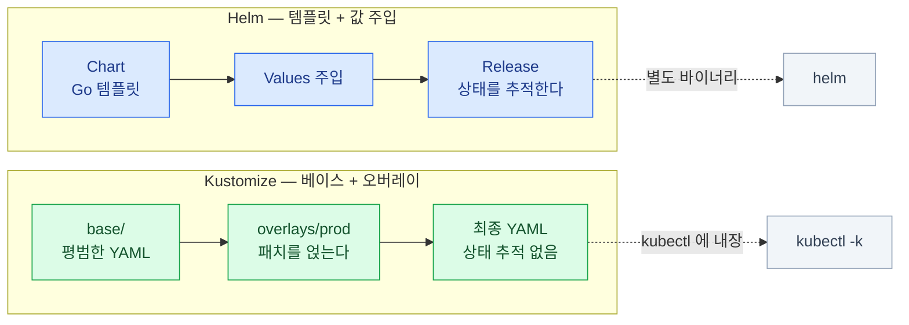
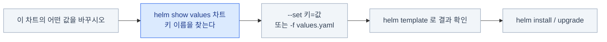
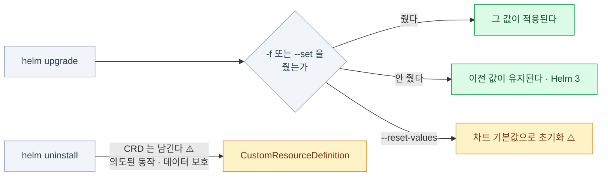
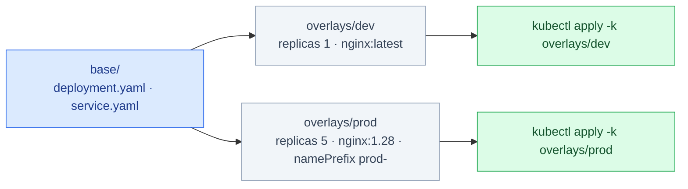
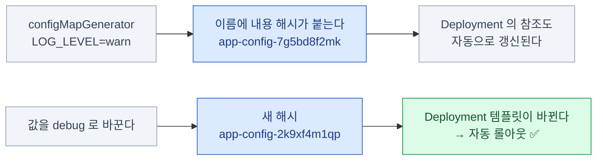
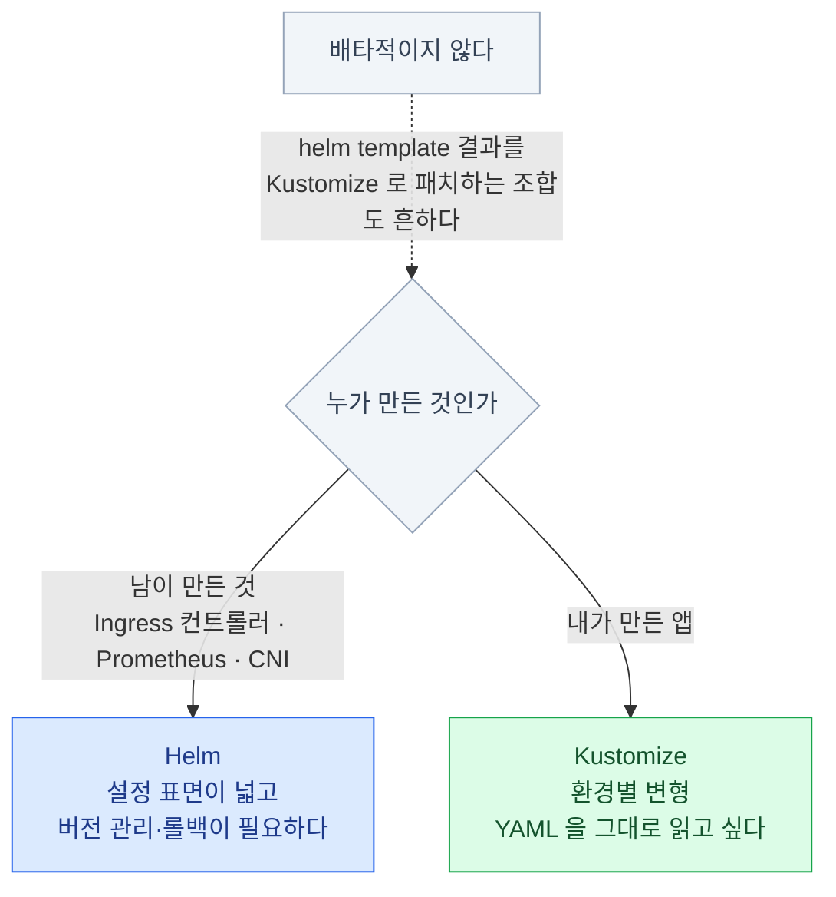

import { Steps, Card, CardGrid, Tabs, TabItem, FileTree } from '@astrojs/starlight/components';

> 클러스터 컴포넌트를 설치하는 두 방법

## 왜 커리큘럼에 있나

커리큘럼 항목은 **"Use Helm and Kustomize to install cluster components"** 다.

- 차트를 **만드는** 게 아니라 **설치하고 값을 바꾸는** 쪽이다
- 실제로 CNI·Ingress 컨트롤러·모니터링은 전부 이 둘 중 하나로 설치한다



| | Helm | Kustomize |
|---|---|---|
| 방식 | **템플릿 + 값 주입** | **베이스 YAML + 오버레이 패치** |
| 배포 형태 | 패키지(차트) 저장소 | 그냥 디렉터리 |
| 상태 관리 | **릴리스**를 추적한다 | 없음 (kubectl apply와 동일) |
| 설치 | 별도 바이너리 | **kubectl에 내장** (`-k`) |

:::tip[시험]
`helm.sh/docs`는 **열 수 있는 사이트**다.
명령을 다 외울 필요는 없고 **어디를 찾을지**만 알면 된다.
:::

## Helm의 구성 요소

<CardGrid>
<Card title="Chart" icon="puzzle">
패키지. 템플릿 + 기본값의 묶음.
</Card>
<Card title="Values" icon="setting">
차트에 주입하는 설정값.
</Card>
<Card title="Release" icon="rocket">
클러스터에 설치된 차트의 **인스턴스**.
이름이 있고, 같은 차트를 여러 번 설치할 수 있다.
</Card>
<Card title="Repository" icon="cloud-download">
차트를 배포하는 곳.
</Card>
</CardGrid>

<FileTree>

- mychart/
  - **Chart.yaml** 이름, 버전, 의존성
  - **values.yaml** 기본값
  - templates/ Go 템플릿이 섞인 매니페스트
    - deployment.yaml
    - service.yaml
    - _helpers.tpl
  - charts/ 서브차트

</FileTree>

같은 차트를 **다른 이름의 릴리스로 여러 번** 설치할 수 있다.
릴리스 정보는 **네임스페이스의 Secret**에 저장된다 (Helm 3부터. Tiller는 없어졌다).

## Helm 기본 명령

<Steps>

1. **저장소 등록**

   ```bash
   helm repo add ingress-nginx https://kubernetes.github.io/ingress-nginx
   helm repo update
   helm repo list
   helm search repo ingress
   helm search hub prometheus
   ```

2. **차트 살펴보기** — ★ 무엇을 바꿀 수 있는지 여기서 찾는다

   ```bash
   helm show values ingress-nginx/ingress-nginx        # 설정 가능한 값 전부
   helm show chart ingress-nginx/ingress-nginx
   helm pull ingress-nginx/ingress-nginx --untar       # 로컬로 받아서 뜯어보기
   ```

3. **설치**

   ```bash
   helm install my-ingress ingress-nginx/ingress-nginx \
     --namespace ingress-nginx --create-namespace
   ```

4. **확인**

   ```bash
   helm list -A
   helm status my-ingress -n ingress-nginx
   helm get values my-ingress -n ingress-nginx
   helm get manifest my-ingress -n ingress-nginx       # 실제로 적용된 YAML
   ```

</Steps>

## 값 오버라이드 — 실무의 핵심

<Tabs>
<TabItem label="--set — 개별 값">

```bash
helm install my-ingress ingress-nginx/ingress-nginx \
  --set controller.replicaCount=3 \
  --set controller.service.type=NodePort \
  --set-string controller.config.use-forwarded-headers="true"
```

값 한두 개만 바꿀 때. **시험에서 가장 자주 쓰는 형태.**

</TabItem>
<TabItem label="-f — values 파일 (권장)">

```bash
helm install my-ingress ingress-nginx/ingress-nginx -f my-values.yaml

# 여러 파일 — 뒤가 앞을 덮는다
helm install my-ingress ingress-nginx/ingress-nginx -f base.yaml -f prod.yaml
```

값이 많을 때. 파일로 남으니 재현 가능하다.

</TabItem>
</Tabs>

```bash
# 적용 전에 결과 확인 — 시험·실무 모두 유용하다
helm template my-ingress ingress-nginx/ingress-nginx -f my-values.yaml
helm install my-ingress ingress-nginx/ingress-nginx --dry-run --debug
```



:::tip[시험]
"이 차트의 어떤 값을 바꾸시오"류는
**`helm show values`로 키 이름을 찾고 `--set`** 으로 끝낸다.
:::

## 업그레이드와 롤백

```bash
helm upgrade my-ingress ingress-nginx/ingress-nginx --set controller.replicaCount=5
helm upgrade --install my-ingress ingress-nginx/ingress-nginx     # 없으면 설치, 있으면 업그레이드

helm history my-ingress -n ingress-nginx
# REVISION  UPDATED       STATUS      CHART                 DESCRIPTION
# 1         2026-08-01    superseded  ingress-nginx-4.11.0  Install complete
# 2         2026-08-05    deployed    ingress-nginx-4.11.0  Upgrade complete

helm rollback my-ingress 1 -n ingress-nginx
helm uninstall my-ingress -n ingress-nginx
```



:::caution[함정 1]
`helm upgrade`에서 `-f`나 `--set`을 안 주면
**이전 값이 유지된다**(Helm 3 기준). 하지만 `--reset-values`를 쓰면 초기화된다.
헷갈리면 `helm get values`로 현재 값을 먼저 확인하자.
:::

:::caution[함정 2]
**`helm uninstall`은 CRD를 지우지 않는다.**
차트가 만든 CRD는 남는다. 의도된 동작이다(데이터 보호).
:::

## Kustomize — 템플릿 없는 커스터마이징

<FileTree>

- base/
  - kustomization.yaml
  - deployment.yaml
  - service.yaml
- overlays/
  - dev/
    - kustomization.yaml
    - replica-patch.yaml
  - **prod/**
    - kustomization.yaml
    - replica-patch.yaml

</FileTree>

```yaml
# base/kustomization.yaml
apiVersion: kustomize.config.k8s.io/v1beta1
kind: Kustomization
resources:
  - deployment.yaml
  - service.yaml
commonLabels:
  app: web
```

- **템플릿 언어가 없다.** 전부 유효한 YAML이다
- 베이스는 그대로 두고 **오버레이가 패치를 얹는다**
- `kubectl`에 내장되어 있다 — 별도 설치가 필요 없다



## 오버레이 — 이름·네임스페이스·이미지 바꾸기

```yaml
# overlays/prod/kustomization.yaml
apiVersion: kustomize.config.k8s.io/v1beta1
kind: Kustomization

resources:
  - ../../base                            # 베이스를 가져온다

namespace: prod                           # 전부 이 네임스페이스로
namePrefix: prod-                         # 모든 이름 앞에 붙인다
commonAnnotations: { owner: platform-team }

images:
  - { name: nginx, newTag: "1.28" }       # 이미지 태그만 교체
replicas:
  - { name: web, count: 5 }               # 레플리카 수만 교체
```

- `images` / `replicas` 는 **패치 파일 없이** 가장 자주 바꾸는 값을 직접 지정하는 단축이다
- `namePrefix`를 쓰면 **참조하는 Service·볼륨 이름도 함께** 갱신된다

## 오버레이 — generator와 patch

```yaml
configMapGenerator:
  - name: app-config
    literals: ["LOG_LEVEL=warn"]
secretGenerator:
  - name: db-secret
    literals: ["password=prodsecret"]

patches:
  - path: resource-patch.yaml             # 파일로 패치
    target: { kind: Deployment, name: web }
```

- **generator**는 ConfigMap/Secret을 **오버레이에서 새로 만든다** (베이스에 둘 필요가 없다)
- **`patches`** 는 베이스의 임의 필드를 고친다. `target`으로 대상을 고른다

## Kustomize 실행

```bash
kubectl kustomize overlays/prod              # 결과를 출력만 (미리보기)
kubectl apply -k overlays/prod               # 적용 (delete -k 로 제거)
kustomize build overlays/prod | kubectl apply -f -   # 독립 바이너리를 쓸 때
```

**패치 두 가지 방식**

<Tabs>
<TabItem label="전략적 병합 패치">

바꿀 부분만 **같은 구조로** 쓴다. 읽기 쉽다.

```yaml
# resource-patch.yaml
apiVersion: apps/v1
kind: Deployment
metadata: { name: web }
spec:
  template:
    spec:
      containers:
        - name: nginx
          resources: { limits: { memory: 512Mi } }
```

</TabItem>
<TabItem label="JSON 6902 패치">

경로를 직접 지정한다. 리스트 항목 교체·삭제에 정확하다.

```yaml
# kustomization.yaml 안에 인라인
patches:
  - target: { kind: Deployment, name: web }
    patch: |
      - op: replace
        path: /spec/replicas
        value: 5
```

</TabItem>
</Tabs>

## generator의 해시 접미사

```bash
kubectl kustomize overlays/prod | grep -A2 'kind: ConfigMap'
# name: prod-app-config-7g5bd8f2mk
```

**이것이 6장의 "ConfigMap을 바꿔도 Pod이 안 바뀐다" 문제를 구조적으로 푼다.**



- `configMapGenerator`/`secretGenerator`가 만든 이름에는 **내용 해시**가 붙는다
- 그리고 **참조하는 Deployment의 이름도 자동으로 갱신**된다
- 결과: **ConfigMap이 바뀌면 Deployment가 자동으로 롤아웃된다**

```yaml
generatorOptions:
  disableNameSuffixHash: true      # 해시를 끄고 싶다면
```

## 언제 무엇을 쓰나



```bash
helm template prom prometheus/kube-prometheus-stack > base/all.yaml
# → 이후 Kustomize 오버레이로 환경별 변형
```

## 16장 요약

- 커리큘럼의 초점은 **"설치하고 값을 바꾸기"** — 차트 작성이 아니다
- Helm: **Chart(패키지) + Values(설정) + Release(인스턴스)**
- **`helm show values`로 키를 찾고 `--set` 또는 `-f`로 덮어쓴다**
- 적용 전 확인은 **`helm template`** 또는 **`--dry-run --debug`**
- **`helm uninstall`은 CRD를 남긴다**
- Kustomize: **템플릿 없음.** 베이스 + 오버레이 패치. **`kubectl -k`에 내장**
- **generator의 해시 접미사가 ConfigMap 변경 시 자동 롤아웃**을 만든다
- **남의 것은 Helm, 내 것은 Kustomize** — 실무의 대략적 경계
