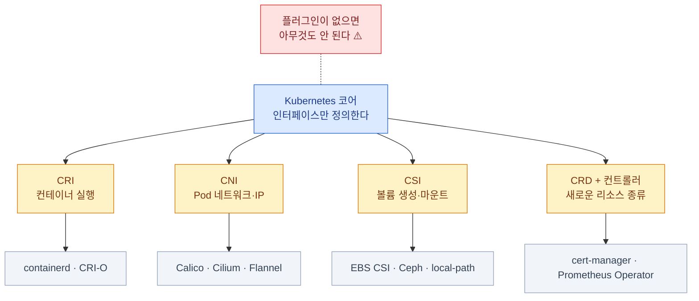
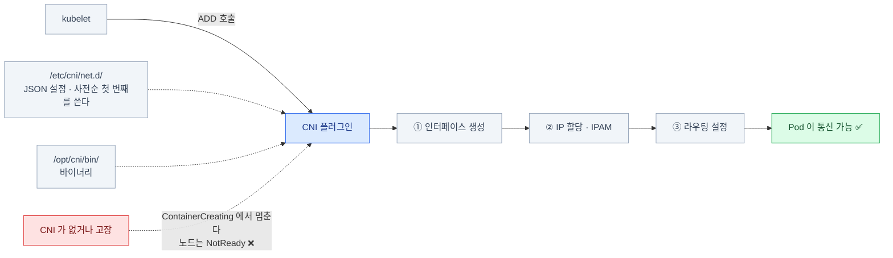
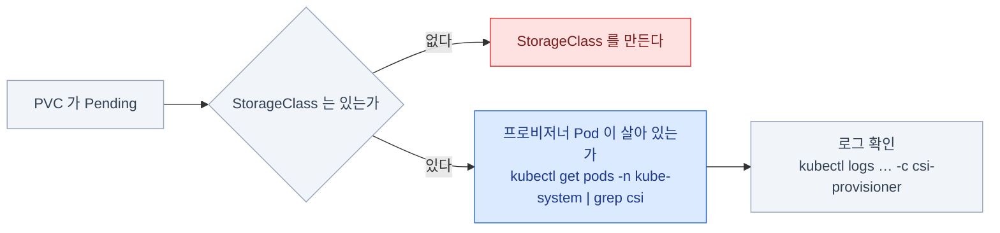
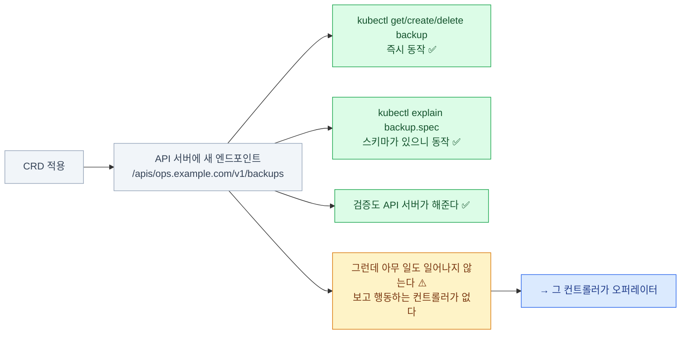
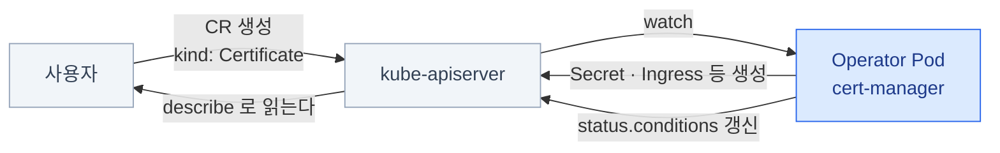
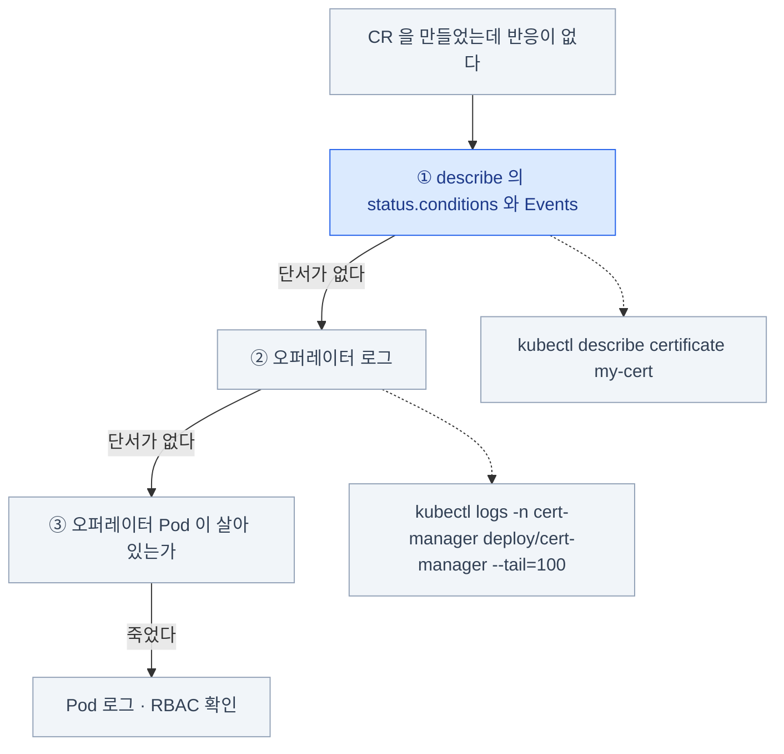
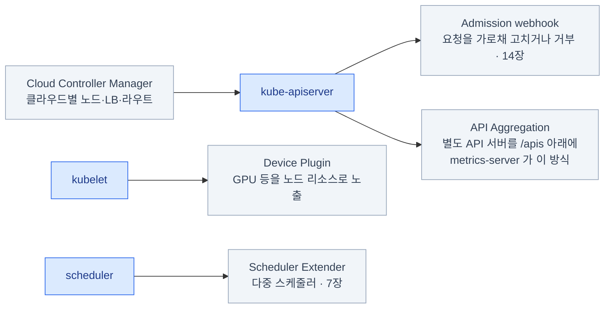

import { Steps, Card, CardGrid, Tabs, TabItem } from '@astrojs/starlight/components';

> CRI · CNI · CSI · CRD

## Kubernetes는 껍데기다

핵심 기능 중 상당수가 **인터페이스만 정의되어 있고 구현은 밖에 있다.**



| 인터페이스 | 무엇을 위임하나 | 구현체 예 |
|---|---|---|
| **CRI** (Container Runtime Interface) | 컨테이너 실행 | containerd, CRI-O |
| **CNI** (Container Network Interface) | Pod 네트워크·IP | Calico, Cilium, Flannel |
| **CSI** (Container Storage Interface) | 볼륨 생성·마운트 | EBS CSI, Ceph, local-path |
| **CRD** + 컨트롤러 | 새로운 리소스 종류 | cert-manager, Prometheus Operator |

이 구조 덕분에 **같은 API로 온프렘과 클라우드가 모두 동작**한다.
그리고 "**플러그인이 없으면 아무것도 안 된다**"는 트러블슈팅 포인트가 생긴다.

## 세 가지 플러그인 인터페이스

### CRI — 컨테이너 런타임

- kubelet ↔ 런타임 사이의 **gRPC 규약**이다
- 소켓 경로: `unix:///run/containerd/containerd.sock`
- **Docker는 v1.24에서 제거**되었다 (dockershim 삭제). 지금은 containerd가 표준

```bash
# crictl 설정
sudo crictl config --set runtime-endpoint=unix:///run/containerd/containerd.sock
cat /etc/crictl.yaml

sudo crictl ps -a                    # 컨테이너
sudo crictl pods                     # Pod 샌드박스
sudo crictl images                   # 이미지
sudo crictl logs <container-id>
sudo crictl inspect <container-id>
sudo crictl rmi --prune              # 안 쓰는 이미지 정리
```

:::tip[시험]
**`crictl`은 API 서버가 죽었을 때의 유일한 창구**다.
컨트롤 플레인 트러블슈팅에서 반드시 쓴다. `docker` 명령은 없다고 생각할 것.
:::

### CNI — Pod 네트워크

kubelet이 Pod 샌드박스를 만들 때 **CNI 플러그인을 실행**한다.



② 의 IP 할당은 IPAM(IP Address Management — 주소 할당 관리) 플러그인의 몫이다.

**모든 CNI가 지켜야 하는 규칙**

- 모든 Pod은 **NAT 없이** 서로 통신할 수 있다
- 노드의 에이전트는 그 노드의 모든 Pod과 통신할 수 있다
- Pod이 보는 자기 IP = 남이 보는 그 Pod의 IP

:::caution[함정]
`/etc/cni/net.d/` 에 **설정 파일이 여러 개** 있으면
사전순으로 첫 번째가 이긴다. CNI를 갈아끼울 때 옛 파일을 안 지워서
**엉뚱한 플러그인이 동작**하는 사고가 있다.
:::

### CSI — 스토리지

```bash
kubectl get csidrivers
kubectl get csinodes
kubectl get storageclass
kubectl get volumeattachments
```

CSI 드라이버는 보통 **두 부분**으로 배포된다.

<CardGrid>
<Card title="Controller 플러그인 — Deployment" icon="setting">
볼륨 생성·삭제·확장·스냅샷.
클러스터에 하나.
</Card>
<Card title="Node 플러그인 — DaemonSet" icon="server">
노드에서 attach·mount.
노드마다 하나.
</Card>
</CardGrid>

주변에 **sidecar 컨테이너**들이 붙는다 —
`external-provisioner`, `external-attacher`, `external-resizer`, `external-snapshotter`, `node-driver-registrar`



PVC가 `Pending`인데 StorageClass는 있다면
**프로비저너 Pod이 살아 있는지**부터 확인한다.

```bash
kubectl get pods -n kube-system | grep csi
kubectl logs -n kube-system <csi-controller-pod> -c csi-provisioner
```

## CRD와 오퍼레이터

### CRD — 새로운 리소스 만들기

"매일 새벽 3시에 백업" 같은 도메인 개념을 `kubectl get backup`으로 다루고 싶어도,
내장 kind에는 그런 종류가 없다. CRD(CustomResourceDefinition)는
API에 **리소스 종류 자체를 등록**하는 리소스다 — 등록하는 순간
kubectl·검증·etcd 저장까지 내장 리소스와 똑같이 동작한다.

```yaml
apiVersion: apiextensions.k8s.io/v1
kind: CustomResourceDefinition
metadata: { name: backups.ops.example.com }   # 반드시 <복수형>.<그룹> 형식
spec:
  group: ops.example.com
  scope: Namespaced                      # Namespaced | Cluster
  names:
    { plural: backups, singular: backup, kind: Backup, shortNames: ["bk"] }
  versions:
    - name: v1
      served: true
      storage: true
      schema:
        openAPIV3Schema:
          type: object
          properties:
            spec:
              type: object
              required: ["schedule"]
              properties:
                schedule: { type: string }
                retention: { type: integer, default: 7 }
      subresources: { status: {} }
      additionalPrinterColumns:          # kubectl get 의 출력 열을 정한다
        - { name: Schedule, type: string, jsonPath: .spec.schedule }
```

### CRD를 만들면 무슨 일이 생기나



```bash
kubectl apply -f backup-crd.yaml
kubectl get crd
kubectl api-resources | grep backups
kubectl explain backup.spec              # ★ 스키마가 있으니 explain도 동작한다
```

```yaml
apiVersion: ops.example.com/v1
kind: Backup
metadata:
  name: nightly
spec:
  schedule: "0 3 * * *"
```

:::caution[함정]
**CRD만 만들면 아무 일도 일어나지 않는다.**
오브젝트는 etcd에 저장되지만, 그걸 보고 행동하는 **컨트롤러가 없다.**
그 컨트롤러가 곧 **오퍼레이터**다.
:::

### 오퍼레이터 — CRD + 컨트롤러

**운영자의 지식을 코드로 옮긴 컨트롤러.**\
"이 상태여야 한다"를 CR(Custom Resource — CRD가 정의한 종류의 실제 오브젝트)로 선언하면,
오퍼레이터가 그 상태를 만들고 유지한다. CRD가 클래스라면 CR은 인스턴스다.



| 오퍼레이터 | CR 예 |
|---|---|
| cert-manager | `Certificate`, `Issuer` |
| Prometheus Operator | `Prometheus`, `ServiceMonitor`, `PrometheusRule` |
| CloudNativePG | `Cluster` (Postgres 클러스터) |
| Istio | `VirtualService`, `Gateway` |

### 오퍼레이터 설치와 확인

```bash
# 대개 Helm 또는 매니페스트 하나로 설치된다
helm install cert-manager jetstack/cert-manager \
  --namespace cert-manager --create-namespace --set crds.enabled=true
```

**설치 확인은 3단계다.**

<Steps>

1. **CRD가 등록됐는가**

   ```bash
   kubectl get crd | grep cert-manager
   ```

2. **컨트롤러가 도는가**

   ```bash
   kubectl get pods -n cert-manager
   ```

3. **권한이 있는가**

   ```bash
   kubectl get clusterrole,clusterrolebinding | grep cert-manager
   ```

</Steps>

**CR을 만들었는데 아무 일도 안 일어날 때**



```bash
kubectl describe certificate my-cert          # ★ status.conditions 와 Events
kubectl logs -n cert-manager deploy/cert-manager --tail=100
kubectl get events -n <ns> --sort-by=.lastTimestamp
```

:::tip[시험]
커리큘럼은 "CRD 이해, 오퍼레이터 설치·구성"이다.
**만드는 게 아니라 설치하고 상태를 읽는 것**이 대상이다.
`kubectl get crd` · `kubectl explain` · `describe`로 접근하는 습관이면 충분하다.
:::

### CRD 다룰 때 주의점

:::caution[함정 1]
**CRD를 지우면 그 종류의 CR이 전부 삭제된다.**
데이터베이스 오퍼레이터라면 실제 데이터가 날아갈 수 있다.
:::

:::caution[함정 2]
CR에 **finalizer**(삭제 전 정리 작업을 보장하는 표식)가 걸려 있고 오퍼레이터가 죽어 있으면
**삭제가 영원히 끝나지 않는다.** 오브젝트가 `Terminating`에 머문다.

```bash
kubectl patch backup nightly -p '{"metadata":{"finalizers":null}}' --type=merge
```
:::

:::caution[함정 3]
CRD의 **버전을 올릴 때** conversion webhook이 없으면
저장된 옛 버전 오브젝트를 읽지 못할 수 있다.
:::

## 그 밖의 확장 지점



| 확장 | 무엇 |
|---|---|
| **Admission webhook** | 요청을 가로채 고치거나 거부 (14장) |
| **API Aggregation** | 별도 API 서버를 `/apis` 아래에 붙인다 (metrics-server가 이 방식) |
| **CRI/CNI/CSI** | 이 장에서 본 것들 |
| **Device Plugin** | GPU 등 특수 하드웨어를 노드 리소스로 노출 |
| **Scheduler Extender / 다중 스케줄러** | 배치 로직 교체 (7장) |
| **Cloud Controller Manager** | 클라우드별 노드·LB·라우트 관리 |

```bash
kubectl get apiservices | grep -v Local        # 집계된 외부 API 서버들
# v1beta1.metrics.k8s.io   kube-system/metrics-server   True
```

`APIService`가 `False`면 그 API 전체가 죽는다 —
`kubectl top`이 안 되는 원인 중 하나다 (8장).

## 17장 요약

- Kubernetes의 핵심 기능은 **인터페이스만 있고 구현은 플러그인**이다
- **CRI** — kubelet ↔ 런타임. Docker는 제거됨. 진단은 **`crictl`**
- **CNI** — `/etc/cni/net.d/` + `/opt/cni/bin/`. 없으면 노드가 **NotReady**
- **CSI** — Controller(Deployment) + Node(DaemonSet). PVC Pending 시 프로비저너를 확인
- **CRD를 만들면 API가 즉시 생기지만, 행동하는 주체는 없다**
- **오퍼레이터 = CRD + 컨트롤러.** 설치 확인은 **CRD / Pod / RBAC** 3단계
- CR이 반응이 없으면 **`describe`의 conditions**와 **오퍼레이터 로그**
- **finalizer + 죽은 오퍼레이터 = 삭제가 끝나지 않는다**
