import { Steps, Card, CardGrid, Tabs, TabItem } from '@astrojs/starlight/components';

> 배점 30% — 앞의 모든 장이 재료다

## 진단의 원칙

**고치려 하지 말고, 먼저 "어느 층에서 끊겼는지"를 확정하라.**

층은 넷이다.

<CardGrid>
<Card title="1 · 애플리케이션" icon="document">
Pod 자체의 문제.
`describe` → `logs` → `-o yaml`
</Card>
<Card title="2 · 노드" icon="laptop">
kubelet, 런타임, 자원.
`journalctl -u kubelet`, `df -h`
</Card>
<Card title="3 · 컨트롤 플레인" icon="setting">
API 서버, 스케줄러, 컨트롤러, etcd.
`crictl ps -a`, 매니페스트
</Card>
<Card title="4 · 네트워크" icon="random">
Service, DNS, CNI, 정책.
`get endpoints`, `nslookup`
</Card>
</CardGrid>

각 층은 **확인 명령이 다르다.** 층을 잘못 짚으면 엉뚱한 곳을 파게 된다.
시험에서는 이 판별이 곧 시간이다.

### 층을 가르는 세 가지 질문

층을 정하는 질문은 셋, 치는 명령은 두 줄이다.

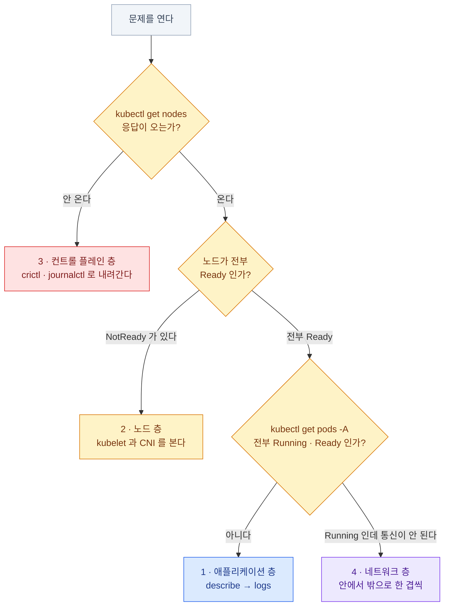

```bash
kubectl get nodes                                     # Q1 · Q2
kubectl get pods -A | grep -vE 'Running|Completed'    # Q3
```

:::tip[시험]
문제를 열면 **무조건 이 두 줄부터** 친다. 질문 셋에 20초면 층이 확정된다.
:::

### 도구 지도

| 상황 | 도구 |
|---|---|
| 왜 안 뜨는가 | **`kubectl describe`** → Events |
| 앱이 무슨 말을 하는가 | **`kubectl logs`**, `logs --previous` |
| 시간순으로 무슨 일이 있었나 | **`kubectl get events --sort-by=.lastTimestamp`** |
| 정확한 값이 뭔가 | `kubectl get ... -o yaml` |
| 자원을 얼마나 쓰나 | **`kubectl top`**, `describe node` |
| 안에서 확인하고 싶다 | `kubectl exec`, `kubectl debug`, 임시 Pod |
| kubectl이 안 될 때 | **`crictl`**(컨테이너 런타임 직접 조회 CLI), **`journalctl -u kubelet`**(kubelet의 systemd 서비스 로그) |
| 노드 자체 | `systemctl status`, `df -h`, `free -m`, `dmesg` |

**순서가 중요하다.**

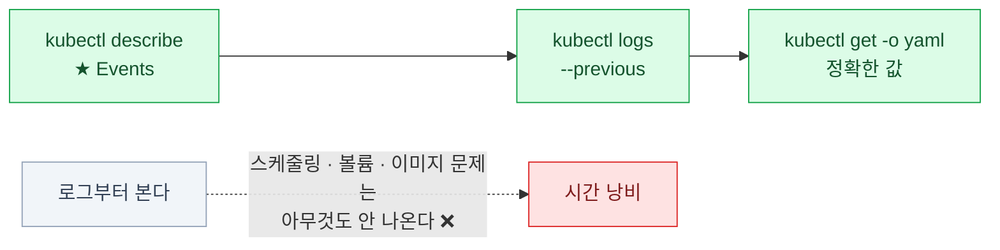

`describe`(Events) → `logs` → `-o yaml`.
로그부터 보면 스케줄링·볼륨·이미지 문제는 **아무것도 안 나온다.**
막혔을 때 시험 중에 열어 볼 곳도 정해져 있다 — 공식
[Monitoring, Logging, and Debugging 문서](https://kubernetes.io/docs/tasks/debug/)가
애플리케이션/클러스터 갈래로 이 장과 같은 층 구분을 쓴다.

## 애플리케이션 층

### Pod 상태별 진단 — 전체 지도

STATUS를 보는 순간 다음 명령이 정해져야 한다.

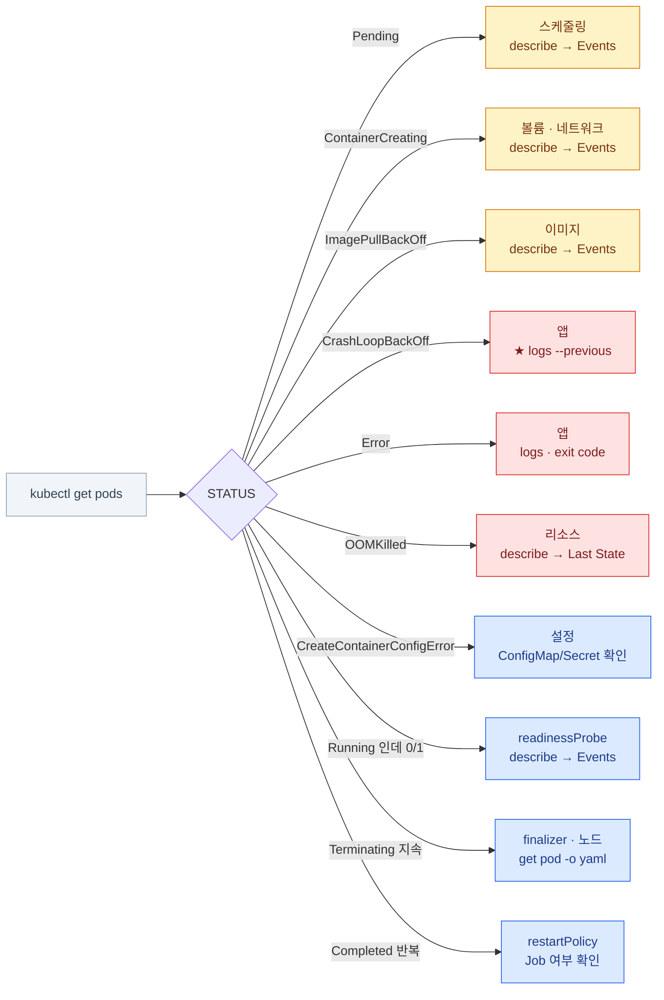

| STATUS | 층 | 첫 명령 |
|---|---|---|
| `Pending` | 스케줄링 | `describe pod` → Events |
| `ContainerCreating` | 볼륨/네트워크 | `describe pod` → Events |
| `ImagePullBackOff` | 이미지 | `describe pod` → Events |
| `CrashLoopBackOff` | 앱 | **`logs --previous`** |
| `Error` | 앱 | `logs`, exit code |
| `OOMKilled` | 리소스 | `describe pod` → Last State |
| `CreateContainerConfigError` | 설정 | `describe pod` → ConfigMap/Secret |
| `Running` 인데 `0/1` | readinessProbe | `describe pod` → Events |
| `Terminating` 지속 | finalizer / 노드 | `get pod -o yaml` |
| `Completed` 반복 | restartPolicy | Job 여부 확인 |

:::tip[시험]
이 표가 애플리케이션 층 문제의 **거의 전체**다.
STATUS를 보는 순간 다음 명령이 정해져야 한다.
`kubectl debug`의 ephemeral 컨테이너 문법처럼 손에 안 붙는 명령은 공식
[Debug Running Pods 문서](https://kubernetes.io/docs/tasks/debug/debug-application/debug-running-pod/)에서
복사해 온다.
:::

### Pending

```bash
kubectl describe pod web | grep -A20 Events
```

Events 메시지 하나가 원인을 그대로 지목한다.

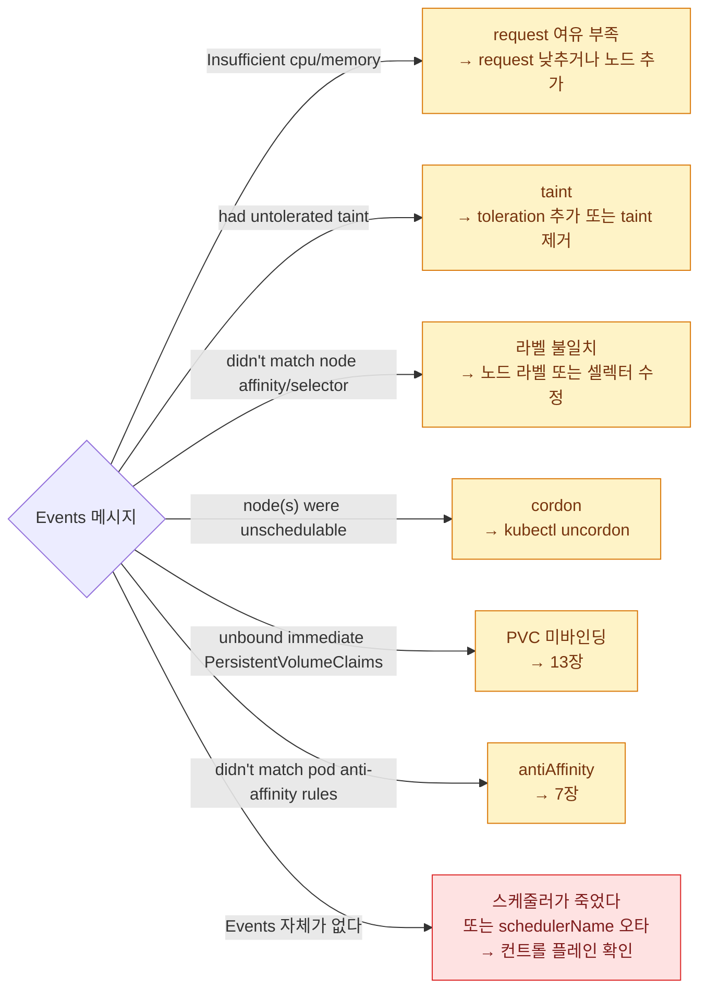

| 메시지 | 원인 | 조치 |
|---|---|---|
| `Insufficient cpu/memory` | request 여유 부족 | request 낮추거나 노드 추가 |
| `had untolerated taint` | taint | toleration 추가 또는 taint 제거 |
| `didn't match node affinity/selector` | 라벨 불일치 | 노드에 라벨 추가 또는 셀렉터 수정 |
| `node(s) were unschedulable` | cordon | `kubectl uncordon` |
| `unbound immediate PersistentVolumeClaims` | PVC 미바인딩 | 13장 |
| `didn't match pod anti-affinity rules` | antiAffinity | 7장 |
| **Events 자체가 없다** | **스케줄러가 죽었다** 또는 `schedulerName` 오타 | 컨트롤 플레인 확인 |

```bash
kubectl describe node node01 | grep -A8 'Allocated resources'
kubectl get nodes                    # SchedulingDisabled 표시
```

### ImagePullBackOff

```bash
kubectl describe pod web | grep -A5 Events
# Failed to pull image "nginx:1.99": rpc error: ... not found
```

| Events 내용 | 원인 |
|---|---|
| `not found` / `manifest unknown` | **이미지 이름·태그 오타** |
| `unauthorized` / `authentication required` | **`imagePullSecrets` 없음** |
| `dial tcp: i/o timeout` | 네트워크·레지스트리 접근 불가 |
| `no such host` | 레지스트리 도메인 해석 실패 |

```bash
# 이미지 이름이 맞는지 확인
kubectl get pod web -o jsonpath='{.spec.containers[*].image}'

# 노드에서 직접 받아보기
sudo crictl pull nginx:1.27

# 고치기
kubectl set image deploy/web nginx=nginx:1.27
```

:::caution[함정]
`imagePullPolicy: Always`인데 레지스트리에 못 붙으면
**노드에 이미지가 이미 있어도 실패**한다.
로컬 이미지를 쓰려면 `IfNotPresent` 또는 `Never`가 필요하다.
:::

### CrashLoopBackOff

```bash
kubectl logs web --previous                    # ★ 죽기 직전 로그
kubectl describe pod web | grep -A15 'Last State'
# Last State:  Terminated
#   Reason:    Error
#   Exit Code: 1
```

**exit code 하나로 절반이 좁혀진다.**

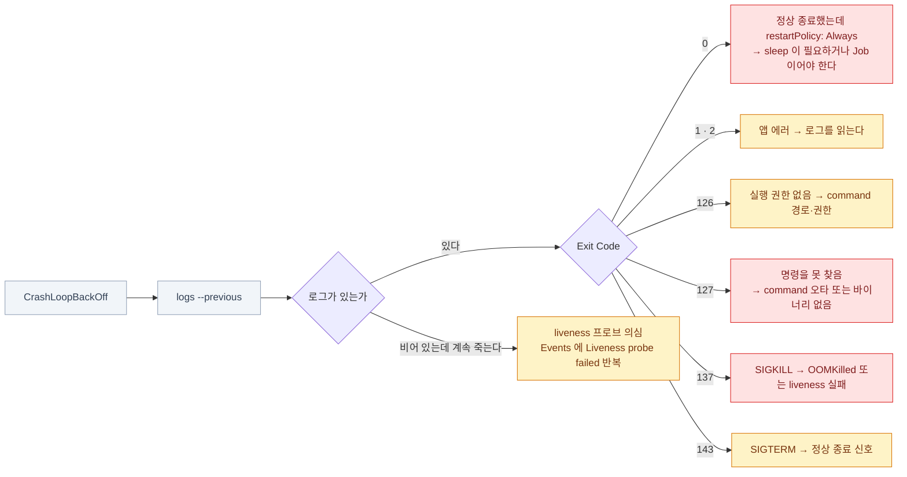

| Exit Code | 의미 | 다음 행동 |
|---|---|---|
| `0` | 정상 종료했는데 `restartPolicy: Always` | 명령이 즉시 끝난다 — `sleep`이 필요하거나 Job이어야 한다 |
| `1`, `2` | 앱 에러 | 로그를 읽는다 |
| `126` | 실행 권한 없음 | command 경로·권한 |
| `127` | 명령을 못 찾음 | **`command` 오타** 또는 이미지에 그 바이너리가 없다 |
| `137` | SIGKILL | **OOMKilled** 또는 liveness 실패로 강제 종료 |
| `143` | SIGTERM | 정상 종료 신호 |

:::caution[함정]
로그가 **비어 있는데** 계속 죽는다면
liveness 프로브를 의심한다. `describe`의 Events에
`Liveness probe failed` 가 반복되고 있을 것이다 (4장).
:::

### OOMKilled

OOM(Out of Memory — 메모리 한도 초과)으로 커널이 컨테이너를 강제 종료한 상태다.

```bash
kubectl describe pod web | grep -A8 'Last State'
# Last State:  Terminated
#   Reason:    OOMKilled
#   Exit Code: 137
```

```bash
kubectl top pod web --containers               # 실제 사용량
kubectl get pod web -o jsonpath='{.spec.containers[0].resources}'
```

**조치 순서**

<Steps>

1. `kubectl top`으로 **실제 사용량**을 본다

2. `limits.memory`를 실사용의 **1.5~2배**로 올린다

3. 그래도 계속 오르면 **앱의 메모리 누수**다 — 인프라 문제가 아니다

</Steps>

**둘은 다른 사건이다.**

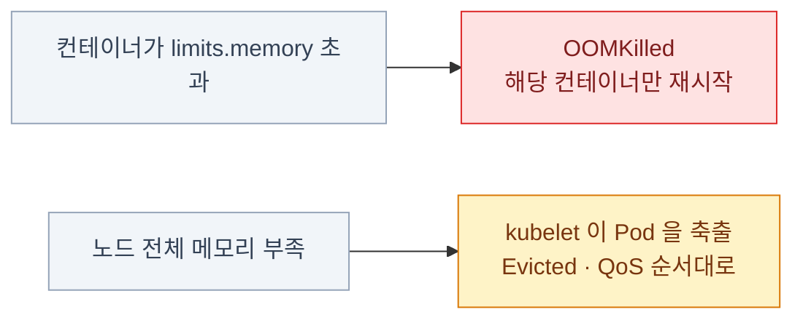

:::caution[함정]
**노드 전체 메모리 부족과 컨테이너 limit 초과는 다르다.**\
컨테이너 limit 초과 → `OOMKilled`, 해당 컨테이너만 재시작\
노드 메모리 부족 → **kubelet이 Pod을 축출(Evicted)**, QoS(Quality of Service) 등급 순서대로 (6장)
:::

### ContainerCreating에서 멈춤

```bash
kubectl describe pod web | grep -A20 Events
```

| 메시지 | 원인 |
|---|---|
| `MountVolume.SetUp failed ... not found` | **ConfigMap/Secret이 없다** |
| `Unable to attach or mount volumes` | PV/CSI 문제 (13장) |
| `Multi-Attach error` | **RWO 볼륨을 두 노드에서** |
| `failed to create pod sandbox ... cni` | **CNI 문제** |
| `network plugin is not ready` | CNI Pod이 안 떴다 |

```bash
# 볼륨 관련
kubectl get cm,secret -n <ns>
kubectl get pvc,pv

# CNI 관련
kubectl get pods -n kube-system | grep -Ei 'calico|cilium|flannel'
ls /etc/cni/net.d/
sudo journalctl -u kubelet | grep -i cni | tail -20
```

### Running인데 Ready가 아니다 (0/1)

```bash
kubectl get pods
# NAME   READY   STATUS    RESTARTS   AGE
# web    0/1     Running   0          3m

kubectl describe pod web | grep -A10 Events
# Warning  Unhealthy  Readiness probe failed: HTTP probe failed with statuscode: 404
```

**컨테이너는 살아 있는데 Service에서 빠진다.** 그래서 "연결이 안 된다"로 보인다.

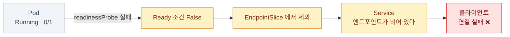

- **readinessProbe가 실패하고 있다** — 컨테이너는 살아 있다
- 결과: **Service 엔드포인트에서 빠진다** → 트래픽이 안 온다

```bash
# 프로브 설정 확인
kubectl get pod web -o jsonpath='{.spec.containers[0].readinessProbe}'

# 안에서 직접 호출해본다
kubectl exec -it web -- wget -qO- http://localhost:8080/healthz
```

:::tip[시험]
"Service에 연결이 안 된다"인데 엔드포인트가 비어 있고
Pod은 Running이면 **거의 항상 readinessProbe**다.
경로나 포트 오타를 `kubectl edit`으로 고치면 된다.
:::

### Terminating이 끝나지 않는다

```bash
kubectl get pod web -o yaml | grep -A5 finalizers
kubectl get ns stuck -o yaml | grep -A5 finalizers
```

| 원인 | 조치 |
|---|---|
| **finalizer**가 남아 있고 처리할 컨트롤러가 없다 | finalizer 제거 |
| 노드가 **unreachable** | 노드 복구 또는 강제 삭제 |
| `preStop` 훅이 안 끝난다 | grace period 확인 |

```bash
# Pod 강제 삭제
kubectl delete pod web --force --grace-period=0

# finalizer 제거
kubectl patch pod web -p '{"metadata":{"finalizers":null}}' --type=merge

# 네임스페이스가 Terminating에서 안 끝날 때
kubectl get ns stuck -o json \
  | jq '.spec.finalizers = []' \
  | kubectl replace --raw "/api/v1/namespaces/stuck/finalize" -f -
```

:::caution[함정]
네임스페이스가 `Terminating`에 걸리는 흔한 원인은
**죽은 APIService**다. `kubectl get apiservices | grep False` 로 확인하고,
안 쓰는 것이면 지운다.
:::

## 로그와 리소스 관찰

### 로그 다루기 — 커리큘럼의 "컨테이너 출력 스트림"

```bash
kubectl logs web
kubectl logs web -c sidecar                    # 멀티 컨테이너
kubectl logs web --previous                    # 이전 컨테이너
kubectl logs web -f --tail=100
kubectl logs web --since=15m --timestamps
kubectl logs -l app=web --all-containers --prefix --max-log-requests=10
kubectl logs deploy/web                        # 컨트롤러 지정
kubectl logs job/import
```

로그가 어디를 거쳐 오는지 알면 `kubectl`이 죽었을 때 어디를 봐야 하는지도 안다.

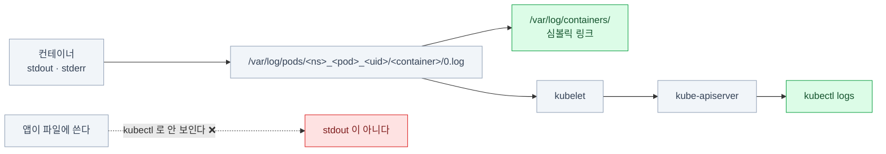

- 컨테이너는 **stdout / stderr**로 로그를 낸다. 파일에 쓰면 kubectl로 안 보인다
- 실체: 노드의 **`/var/log/pods/<ns>_<pod>_<uid>/<container>/0.log`**
- `/var/log/containers/` 는 거기로 향하는 심볼릭 링크다

```bash
# kubectl이 안 될 때 노드에서 직접
sudo ls /var/log/containers/
sudo tail -f /var/log/containers/kube-apiserver-*.log
sudo crictl logs <container-id>
```

### 리소스 사용량 모니터링

```bash
kubectl top nodes
kubectl top pods -A --sort-by=memory
kubectl top pod web --containers

kubectl describe node node01 | grep -A10 'Allocated resources'
kubectl get pods -A -o wide --field-selector spec.nodeName=node01
```

:::caution[함정]
**`describe node`의 "Allocated resources"는 request의 합이고,
`kubectl top`은 실제 사용량이다.** 두 숫자가 크게 다른 것이 정상이다.\
"자원이 남았는데 Pending" → **request 합**을 보라\
"Pod이 자꾸 죽는다" → **실제 사용량**을 보라
:::

```bash
# 노드에서 직접
df -h                        # 디스크
free -m                      # 메모리
top                          # CPU
sudo journalctl -u kubelet | grep -i evict
```

## 노드 층

### 노드가 NotReady

```bash
kubectl get nodes
kubectl describe node node01 | grep -A15 Conditions
```

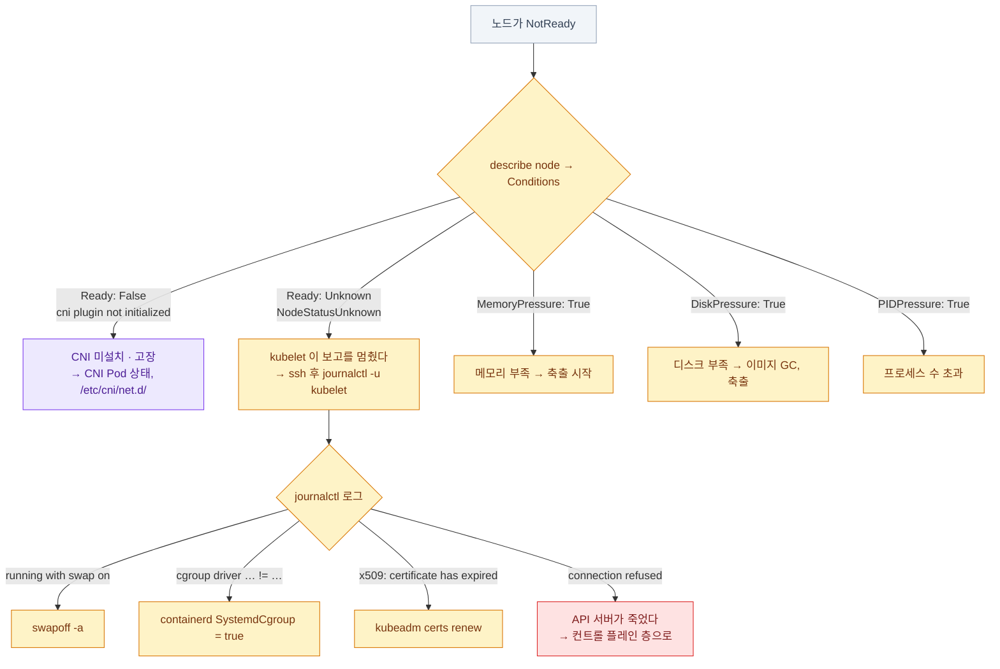

| Condition | 원인 |
|---|---|
| `Ready: False`, `KubeletNotReady`, `cni plugin not initialized` | **CNI 미설치/고장** |
| `Ready: Unknown`, `NodeStatusUnknown` | **kubelet이 보고를 멈췄다** |
| `MemoryPressure: True` | 메모리 부족 → 축출 시작 |
| `DiskPressure: True` | 디스크 부족 → 이미지 GC, 축출 |
| `PIDPressure: True` | 프로세스 수 초과 |

```bash
# 노드에 들어가서
ssh node01
sudo systemctl status kubelet
sudo journalctl -u kubelet -n 100 --no-pager      # ★ 여기에 이유가 있다
sudo systemctl status containerd
df -h /var/lib/kubelet /var/lib/containerd
free -m
sudo swapon --show                                 # 스왑이 켜졌나
```

### kubelet이 안 뜬다 — 체크리스트

```bash
sudo systemctl status kubelet
sudo journalctl -u kubelet -n 50 --no-pager
```

| 로그 메시지 | 원인 | 조치 |
|---|---|---|
| `failed to run Kubelet: running with swap on` | 스왑 | `swapoff -a` |
| `misconfiguration: kubelet cgroup driver ... != ...` | cgroup 드라이버 불일치 | containerd `SystemdCgroup = true` |
| `x509: certificate has expired` | 인증서 만료 | `kubeadm certs renew` |
| `Unable to register node ... connection refused` | **API 서버가 죽었다** | 컨트롤 플레인을 본다 |
| `open /var/lib/kubelet/config.yaml: no such file` | 설정 파일 없음 | `kubeadm` 재초기화 필요 |
| `failed to load kubelet config file` | **YAML 문법 오류** | 파일을 되돌린다 |

```bash
sudo systemctl restart kubelet
sudo systemctl enable kubelet                    # 부팅 시 자동 시작
sudo systemctl daemon-reload                     # 설정 파일을 바꿨다면
```

## 컨트롤 플레인 층

### kubectl이 아예 안 된다

```bash
kubectl get nodes
# The connection to the server 192.168.1.10:6443 was refused
```

**순서대로 확인한다.**

<Steps>

1. **kubeconfig가 맞는가**

   ```bash
   kubectl config current-context
   ls -l ~/.kube/config
   kubectl cluster-info
   ```

2. **API 서버 컨테이너가 도는가** — ★ 컨트롤 플레인 노드에서

   ```bash
   sudo crictl ps -a | grep kube-apiserver
   ```

3. **죽었다면 왜 죽었는가**

   ```bash
   sudo crictl logs $(sudo crictl ps -a --name kube-apiserver -q | head -1)
   ```

4. **kubelet이 매니페스트를 읽고 있는가**

   ```bash
   sudo journalctl -u kubelet -n 50 --no-pager | grep -i apiserver
   ```

5. **매니페스트 자체 확인**

   ```bash
   sudo cat /etc/kubernetes/manifests/kube-apiserver.yaml
   ```

</Steps>

### 컨트롤 플레인의 의존 사슬

**아래가 죽으면 위가 전부 죽는다.** 그래서 고치는 순서가 정해진다.

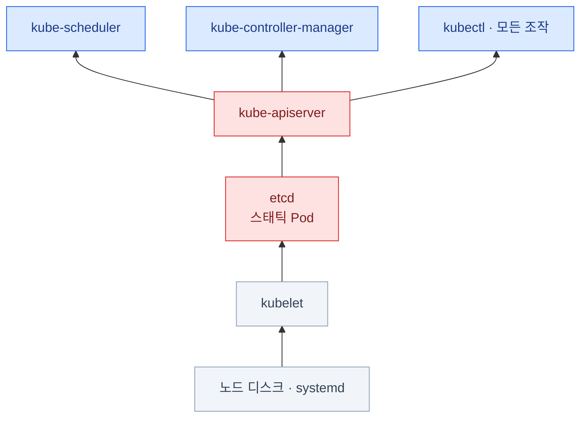

**etcd가 죽으면 API 서버도 못 뜬다.** API 서버 로그에 etcd 관련 에러가 있으면
**etcd부터** 고쳐야 한다. 위에서부터 고치려 들면 시간만 버린다.

### API 서버가 안 뜨는 전형적 원인

| 원인 | 증상 | 조치 |
|---|---|---|
| **매니페스트 YAML 문법 오류** | 컨테이너가 아예 안 생긴다 | `journalctl -u kubelet`에 파싱 에러 |
| **잘못된 플래그** | 컨테이너가 즉시 죽는다 | `crictl logs`에 `unknown flag` |
| **etcd에 못 붙는다** | `connection refused` 반복 | etcd 컨테이너 확인 |
| **인증서 만료/경로 오류** | `x509` 에러 | `kubeadm certs check-expiration` |
| **포트 충돌** | `bind: address already in use` | 6443을 쓰는 프로세스 확인 |

:::tip[시험]
"고장난 컨트롤 플레인을 고치시오"는 **거의 항상
`/etc/kubernetes/manifests/*.yaml`이 손상된 것**이다.\
포트 번호, 인증서 경로, `--etcd-servers` 주소 같은 값이 한 글자 틀려 있다.
**고치고 저장하면 kubelet이 자동으로 다시 만든다.**
:::

```bash
sudo cp /etc/kubernetes/manifests/kube-apiserver.yaml /tmp/backup.yaml   # 먼저 백업
sudo vim /etc/kubernetes/manifests/kube-apiserver.yaml
watch sudo crictl ps                              # 다시 뜨는지 지켜본다
```

### 스케줄러 · 컨트롤러 매니저가 죽었을 때

**증상이 다르다.** 이 비대칭이 판별의 실마리다.

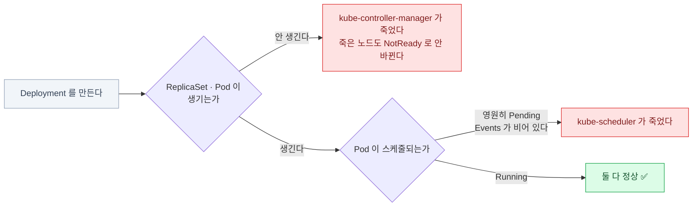

| 죽은 것 | 증상 |
|---|---|
| **kube-scheduler** | 새 Pod이 **영원히 Pending**. Events가 비어 있다 |
| **kube-controller-manager** | Deployment를 만들어도 **ReplicaSet/Pod이 안 생긴다**. kubelet이 죽은 노드가 `NotReady`/`Unknown`으로 전환되지 않는다 (노드 status 자체는 kubelet이 갱신한다) |

```bash
kubectl get pods -n kube-system | grep -E 'scheduler|controller'
kubectl logs -n kube-system kube-scheduler-controlplane
sudo crictl ps -a | grep -E 'scheduler|controller'
sudo cat /etc/kubernetes/manifests/kube-scheduler.yaml
```

```bash
# 스케줄러가 죽은 상태에서 Pod을 띄워야 한다면
kubectl run web --image=nginx --dry-run=client -o yaml > pod.yaml
# spec.nodeName: node01 을 추가한 뒤
kubectl apply -f pod.yaml
```

컨트롤 플레인 컴포넌트의 로그는 `kubectl logs -n kube-system`으로 볼 수 있다
— **API 서버가 살아 있을 때만**. 아니면 `crictl logs`.

### etcd 문제

```bash
sudo crictl ps -a | grep etcd
sudo crictl logs $(sudo crictl ps -a --name etcd -q | head -1) 2>&1 | tail -30

sudo ETCDCTL_API=3 etcdctl --endpoints=https://127.0.0.1:2379 \
  --cacert=/etc/kubernetes/pki/etcd/ca.crt \
  --cert=/etc/kubernetes/pki/etcd/server.crt \
  --key=/etc/kubernetes/pki/etcd/server.key \
  endpoint health --cluster
```

| 증상 | 원인 |
|---|---|
| `database space exceeded` | 쿼터 초과 → compact + defrag 필요 |
| `no leader` / `context deadline exceeded` | **과반이 안 산다** — 멤버를 확인 |
| API 서버 로그의 `etcdserver: request timed out` | etcd가 느리다 (디스크 I/O) |
| 데이터 디렉터리 권한 오류 | 복구 후 `chown` 누락 (15장) |

## 네트워크 층

### 네트워킹 진단 — 안에서 밖으로

**한 겹씩 벗긴다.** 처음 실패하는 겹이 곧 원인이다.

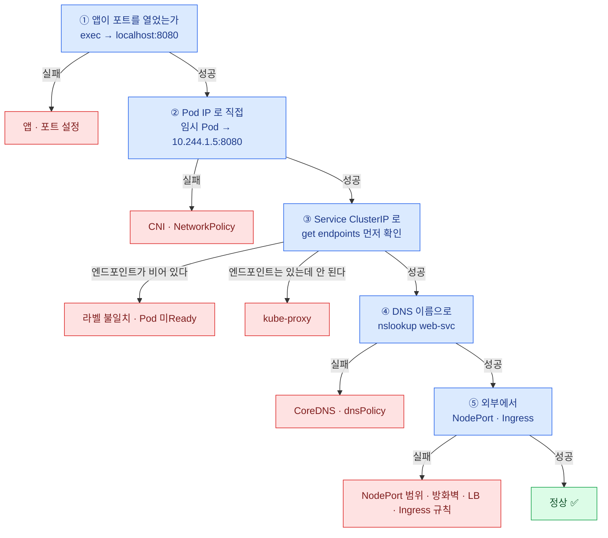

```bash
# ① 앱이 포트를 열었는가
kubectl exec -it web -- wget -qO- http://localhost:8080

# ② Pod IP로 직접
kubectl get pod web -o wide
kubectl run tmp --image=busybox:1.36 --rm -it --restart=Never -- wget -qO- http://10.244.1.5:8080

# ③ Service(ClusterIP)로 — 실소스는 EndpointSlice, get endpoints 는 요약 조회다 (v1.33+ 에선 deprecated 경고)
kubectl get endpoints web-svc                  # ★ 비어 있으면 여기가 문제
kubectl run tmp --image=busybox:1.36 --rm -it --restart=Never -- wget -qO- http://web-svc:80

# ④ DNS로
kubectl run tmp --image=busybox:1.36 --rm -it --restart=Never -- nslookup web-svc

# ⑤ 외부에서
curl http://<노드IP>:30080
kubectl describe ingress web
```

:::tip[시험]
이 다섯 단계를 순서대로 하면
**어느 계층에서 끊겼는지가 자동으로 나온다.** 추측하지 말고 한 겹씩 벗길 것.
:::

### 네트워킹 증상 → 원인 표

| 증상 | 원인 후보 | 확인 |
|---|---|---|
| 엔드포인트가 비어 있다 | 라벨 불일치 / Pod 미Ready | `describe svc`, `get pods --show-labels` |
| ClusterIP만 안 된다 | kube-proxy 문제 | `kubectl get ds kube-proxy -n kube-system` |
| 이름만 안 된다 | CoreDNS | `nslookup kubernetes.default` |
| 특정 Pod끼리만 안 된다 | **NetworkPolicy** | `kubectl get netpol -A` |
| 노드 간 Pod 통신이 안 된다 | **CNI** | CNI Pod 상태, `/etc/cni/net.d/` |
| 외부에서만 안 된다 | NodePort 범위 / 방화벽 / LB | `describe svc` |
| Ingress에서 404 / 503 | 규칙·백엔드 Service | `describe ingress`, 컨트롤러 로그 |
| egress가 전부 안 된다 | **NetworkPolicy의 DNS 미허용** | 12장 |

kube-proxy가 죽으면 **Pod-to-Pod 직접 통신은 정상이고 ClusterIP만 죽는다.**
이 비대칭이 판별의 실마리다.

## 층을 가로지르는 문제

### 인증서 문제

```bash
sudo kubeadm certs check-expiration

# 개별 인증서 확인
sudo openssl x509 -in /etc/kubernetes/pki/apiserver.crt -noout -text | grep -A2 Validity
sudo openssl x509 -in /etc/kubernetes/pki/apiserver.crt -noout -text | grep -A3 'Subject Alternative Name'
```

| 에러 | 원인 |
|---|---|
| `x509: certificate has expired` | 만료 → `kubeadm certs renew all` |
| `x509: certificate signed by unknown authority` | CA 불일치 — kubeconfig의 CA 확인 |
| `x509: cannot validate certificate for <IP>` | SAN에 그 IP가 없다 |
| `Unauthorized` (401) | 토큰/인증서가 유효하지 않다 |

```bash
sudo kubeadm certs renew all
# 컨트롤 플레인 Pod 재시작 (매니페스트를 잠시 옮겼다 되돌린다)
sudo mv /etc/kubernetes/manifests /tmp/m && sleep 20 && sudo mv /tmp/m /etc/kubernetes/manifests

# admin.conf도 갱신되었으므로 다시 복사
sudo cp /etc/kubernetes/admin.conf ~/.kube/config
sudo chown $(id -u):$(id -g) ~/.kube/config
```

### 노드 압박(pressure)과 축출

```bash
kubectl get pods -A --field-selector status.phase=Failed
kubectl get events -A --field-selector reason=Evicted
kubectl describe node node01 | grep -A5 Conditions
```

- **DiskPressure** → kubelet이 **이미지 GC**를 하고, 그래도 부족하면 Pod을 축출한다
- **MemoryPressure** → **QoS 순서**로 축출 (BestEffort → Burstable → Guaranteed)
- 축출된 Pod은 `Failed` 상태로 남는다. 상위 컨트롤러가 새로 만든다

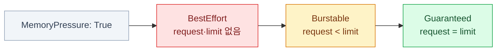

**왼쪽부터 축출된다.** `Guaranteed`가 가장 오래 버틴다.

```bash
# 노드에서 공간 확보
sudo crictl rmi --prune                       # 안 쓰는 이미지 삭제
sudo journalctl --vacuum-size=200M            # 저널 정리
df -h /var/lib/containerd /var/log

# 축출된 Pod 정리
kubectl delete pods --field-selector status.phase=Failed -A
```

## 종합

### 종합 시나리오 — 자주 나오는 유형

| 문제 | 진단 경로 | 조치 |
|---|---|---|
| 노드 하나가 NotReady | `journalctl -u kubelet` | 스왑/cgroup/서비스 재시작 |
| 앱이 계속 재시작 | `logs --previous` + exit code | limit 상향 또는 command 수정 |
| Service 연결 실패 | `get endpoints` | 라벨 수정 / probe 수정 |
| 이름 해석 실패 | `nslookup kubernetes.default` | CoreDNS 확인 |
| Pod이 계속 Pending | `describe pod` Events | taint/affinity/자원/PVC |
| `kubectl`이 죽었다 | `crictl ps -a` | 매니페스트 복구 |
| 클러스터를 되돌려야 한다 | etcd 스냅샷 | restore + `etcd.yaml` 수정 |
| 특정 사용자만 403 | 에러 메시지 | RoleBinding 추가 |

:::tip[시험]
트러블슈팅 문제는 **원인이 하나**다.
여러 개를 동시에 고치려 하지 말고, **층을 좁혀 하나를 찾아** 고친 뒤 검증한다.
:::

### 고치고 나서 반드시 확인할 것

```bash
# 층별 검증
kubectl get nodes                              # 전부 Ready
kubectl get pods -A | grep -vE 'Running|Completed'   # 비정상 Pod 없음
kubectl get events -A --sort-by=.lastTimestamp | tail -20

# 대상 리소스 직접 확인
kubectl rollout status deploy/web
kubectl get endpoints web-svc
kubectl wait --for=condition=ready pod -l app=web --timeout=60s

# 실제로 동작하는지
kubectl run tmp --image=busybox:1.36 --rm -it --restart=Never -- wget -qO- http://web-svc
```

:::caution[함정]
**"YAML을 고쳤다"는 완료가 아니다.**
스태틱 Pod은 다시 뜨는 데 20~60초가 걸리고, 롤아웃은 더 걸린다.
**반드시 최종 상태를 눈으로 확인**하고 다음 문제로 넘어갈 것.
:::

## 18장 요약

- 고치기 전에 **층을 확정한다** — 질문 셋(`get nodes` 응답 · 전부 Ready · `get pods -A` 정상), 명령은 두 줄
- 순서는 **`describe`(Events) → `logs` → `-o yaml`**. 로그부터 보면 안 되는 문제가 많다
- **`logs --previous`** 와 **`get events --sort-by`** 가 두 기둥
- exit code로 좁힌다: **`0`=명령이 끝남, `127`=명령 없음, `137`=OOM/강제종료**
- `Running 0/1` = **readinessProbe 실패** → 엔드포인트에서 빠진다
- **kubectl이 죽으면 `crictl` + `journalctl -u kubelet`**
- 컨트롤 플레인 고장은 **거의 항상 `/etc/kubernetes/manifests/`의 값 하나**
- **kube-proxy가 죽으면 ClusterIP만 죽는다** (Pod 직접 통신은 정상)
- **etcd가 죽으면 API 서버도 못 뜬다** — 순서대로 고친다
- 고친 뒤에는 **반드시 최종 상태를 확인**한다

:::note[손 연습]
이 장 범위의 KodeKloud 실습 풀이 — [CKA 실습 10장 · 모니터링과 트러블슈팅](/cka-udemy/10-troubleshooting/)
:::
