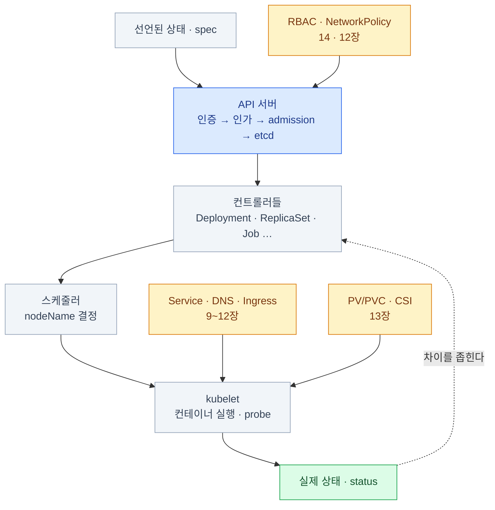
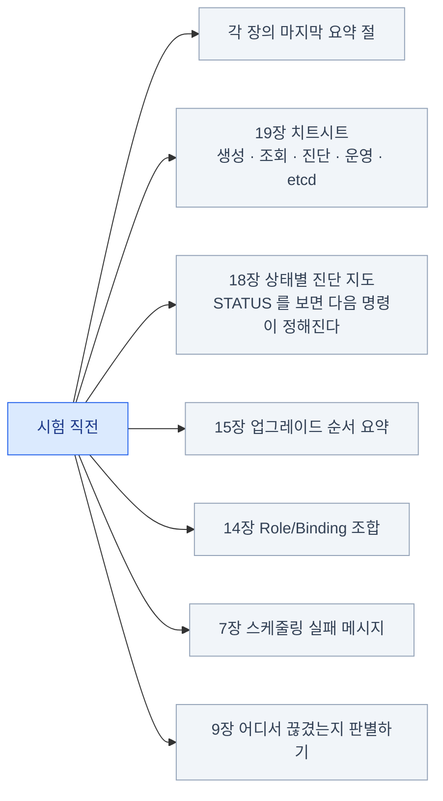
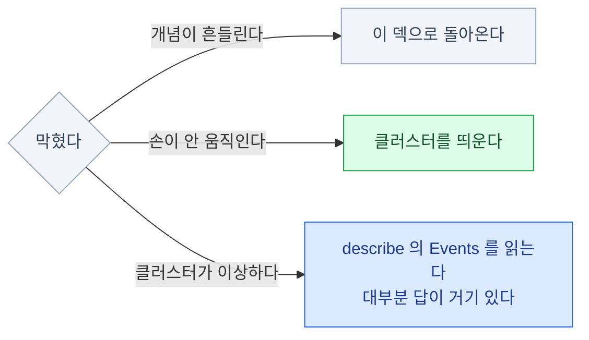

import { Steps, Card, CardGrid, Tabs, TabItem, LinkCard } from '@astrojs/starlight/components';

> 지금까지 본 것을 하나로

## 전체 지도

**0장에서 말한 한 문장으로 돌아온다** — 모든 것은 **spec과 status의 차이를 줄이는 루프**다.

## 장별로 남길 한 줄

| 장 | 한 줄 |
|---|---|
| 2 아키텍처 | 모든 화살표는 **API 서버**를 향한다. 컨트롤 플레인은 **스태틱 Pod** |
| 3 kubectl | **명령형으로 만들고 `$do`로 뽑아 고친다** |
| 4 Pod | **liveness는 죽이고 readiness는 트래픽만 끊는다** |
| 5 워크로드 | Deployment → ReplicaSet → Pod. **옛 RS가 롤백의 재료** |
| 6 설정 | **requests는 스케줄링, limits는 런타임 강제** |
| 7 스케줄링 | **affinity는 Pod이 고르고, taint는 노드가 밀어낸다** |
| 8 오토스케일링 | **metrics-server + requests**가 없으면 HPA는 아무것도 못 한다 |
| 9 Service | 진단의 1번은 **`get endpoints`** |
| 10 DNS | **`nslookup kubernetes.default`** 가 기준점 |
| 11 Ingress/Gateway | 규칙은 리소스, 일은 **컨트롤러**가 한다 |
| 12 NetworkPolicy | **정책이 붙는 순간 기본 거부.** egress면 **DNS를 열어라** |
| 13 스토리지 | **RWO는 노드 하나.** `Multi-Attach`는 여기서 온다 |
| 14 RBAC | **401은 인증, 403은 인가.** 검산은 `auth can-i --as` |
| 15 라이프사이클 | **첫 노드는 `apply`, 나머지는 `node`** |
| 16 Helm/Kustomize | 남의 것은 **Helm**, 내 것은 **Kustomize** |
| 17 확장 | **CRD를 만들어도 행동하는 주체는 없다** |
| 18 트러블슈팅 | **고치기 전에 층을 확정하라** |

## 반복해야 하는 것 — 딱 다섯 가지

이해로 끝나지 않고 **손이 기억해야** 하는 것들이다.

<CardGrid>
<Card title="1 · 클러스터 업그레이드" icon="rocket">
저장소 URL → `apply`/`node` → kubelet → `uncordon`.
**killercoda**에서 5회 이상.
</Card>
<Card title="2 · etcd 백업·복구" icon="database">
인증서 3종, 새 data-dir, `etcd.yaml` 수정.
**killercoda**에서 5회 이상.
</Card>
<Card title="3 · 고장난 컨트롤 플레인 복구" icon="warning">
`crictl` → 로그 → 매니페스트 수정.
**killercoda**에서 5회 이상.
</Card>
<Card title="4 · RBAC 만들고 검산" icon="padlock">
Role → Binding → `auth can-i --as`.
**kind**에서 연습 가능.
</Card>
<Card title="5 · 네트워크 진단 5단계" icon="random">
localhost → Pod IP → ClusterIP → DNS → 외부.
**kind**에서 연습 가능.
</Card>
</CardGrid>

각각 **5회 이상** 반복하면 시험장에서 생각하지 않고 손이 움직인다.

## 자주 되돌아올 페이지

시험 직전에는 이 페이지들만 훑어도 충분하다.

사이드바에서 각 장으로 바로 갈 수 있고, 상단 검색(⌘K)으로 키워드를 찾아도 된다.

## 시험 이후 — 실무로 가는 길

CKA는 **관리자 관점**의 기초다. 그 다음은 관심사에 따라 갈린다.

| 방향 | 다음 |
|---|---|
| **보안** | CKS — PSA, admission webhook, 런타임 보안, 이미지 스캔 |
| **개발** | CKAD — 워크로드 설계 관점 (범위가 겹치니 비교적 쉽다) |
| **플랫폼** | GitOps(ArgoCD), Helm 차트 작성, 오퍼레이터 개발 |
| **관측성** | Prometheus, Grafana, OpenTelemetry, 로그 파이프라인 |
| **클라우드** | EKS/GKE 운영 — IRSA, 노드그룹, Karpenter, VPC CNI |

**다만 순서를 잘못 잡지 말 것.** 이 덱의 15·18장이 흔들리면
어떤 방향으로 가도 결국 같은 자리로 돌아오게 된다.

## 마지막으로

CKA는 **암기 시험이 아니라 손 시험**이다.\
이 덱을 세 번 읽는 것보다\
**업그레이드를 세 번 직접 하는 것**이 낫다.

합격을 빈다. 🎉

<LinkCard
  title="19. 시험 전략과 치트시트"
  description="시험 직전에 다시 볼 곳. 생성·조회·진단·운영·etcd 치트시트가 모여 있다."
  href="/cka/19-exam-strategy/"
/>
