import { Card, CardGrid, LinkCard } from '@astrojs/starlight/components';

> Certified Kubernetes Administrator — 개념부터 트러블슈팅까지

kubectl은 써봤지만 "안에서 무슨 일이 벌어지는지"가 흐릿한 사람을 위한 자료다.
**CKA 커리큘럼 v1.35 · 시험 환경 Kubernetes v1.35** 기준으로 쓰였다.

## 구성

배점 순서와 학습 순서는 다르다. 트러블슈팅(30%)이 마지막에 있는 이유는,
앞의 전부를 알아야 진단이 되기 때문이다.

```mermaid
flowchart LR
    I["0~1장<br/>읽는 법 · 시험 해부"] --> B["2~3장<br/>아키텍처 · kubectl"]
    B --> W["4~8장<br/>Workloads and Scheduling<br/>15%"]
    W --> N["9~12장<br/>Servicing and Networking<br/>20%"]
    N --> S["13장<br/>Storage<br/>10%"]
    S --> C["14~17장<br/>Cluster Architecture<br/>25%"]
    C --> T["18장<br/>Troubleshooting<br/>30%"]
    T --> E["19~20장<br/>시험 전략 · 마무리"]

    classDef big fill:#fee2e2,stroke:#dc2626,color:#7f1d1d
    classDef mid fill:#fef3c7,stroke:#d97706,color:#78350f
    classDef base fill:#dbeafe,stroke:#2563eb,color:#1e3a8a
    classDef mute fill:#f1f5f9,stroke:#94a3b8,color:#334155
    class T,C big
    class N,W mid
    class B base
    class I,S,E mute
```

| 장 | 주제 | CKA 도메인 |
|---|---|---|
| [0](/cka/00-intro/)–[1](/cka/01-exam/) | 읽는 법 · 시험 자체의 해부 | — |
| [2](/cka/02-architecture/)–[3](/cka/03-kubectl/) | 클러스터 아키텍처 · kubectl | 기초 |
| [4](/cka/04-pods/)–[8](/cka/08-autoscaling/) | Pod · 워크로드 · 설정 · 스케줄링 · 오토스케일링 | Workloads and Scheduling (15%) |
| [9](/cka/09-services/)–[12](/cka/12-networkpolicy/) | Service · DNS · Ingress/Gateway · NetworkPolicy | Servicing and Networking (20%) |
| [13](/cka/13-storage/) | 스토리지 | Storage (10%) |
| [14](/cka/14-rbac/)–[17](/cka/17-extensions/) | RBAC · 클러스터 라이프사이클 · Helm/Kustomize · 확장 | Cluster Architecture (25%) |
| [18](/cka/18-troubleshooting/) | 트러블슈팅 | Troubleshooting (30%) |
| [19](/cka/19-exam-strategy/)–[20](/cka/20-wrapup/) | 시험 전략 · 치트시트 · 마무리 | — |

## 전체를 관통하는 한 문장

Kubernetes의 모든 것은 **"선언된 상태(spec)와 실제 상태(status)의 차이를 줄이는 루프"**다.
문제가 생겼다는 것은 그 루프가 어딘가에서 막혔다는 뜻이고,
트러블슈팅 30%는 결국 "어느 루프가 어디서 멈췄나"를 찾는 일이다.

## 읽는 법

<CardGrid>
<Card title="표시 약속" icon="information">
본문 중 `:::tip` 박스는 **시험 포인트**,
`:::caution` 박스는 **자주 틀리는 함정**이다.
</Card>
<Card title="명령 표기" icon="laptop">
`k` = `kubectl` (시험 환경에 alias가 걸려 있다).
`-n <ns>`는 대부분 생략했지만 **실제 시험에서는 거의 항상 필요하다.**
</Card>
<Card title="손을 움직일 것" icon="rocket">
읽기만 하면 안 된다.
**kind + killercoda**를 옆에 띄워두고 볼 것.
</Card>
<Card title="시험 직전에는" icon="clock">
[19장 치트시트](/cka/19-exam-strategy/)와
[20장 요약](/cka/20-wrapup/)만 다시 본다.
</Card>
</CardGrid>

:::tip[시험]
시험 접수 직전에 [cncf/curriculum](https://github.com/cncf/curriculum)과
Linux Foundation의 CKA program changes 페이지를 반드시 다시 확인할 것.
커리큘럼은 분기마다, 시험 환경 버전은 k8s 릴리스 후 4~8주 안에 바뀐다.
:::

<LinkCard
  title="0. 시작하기 전에"
  description="이 덱을 어떻게 읽을 것인가 — 대상 독자, 표기 약속, 실습 환경 준비."
  href="/cka/00-intro/"
/>
