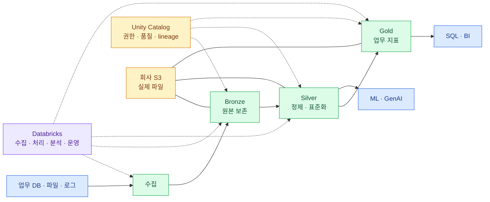

import { LinkCard } from '@astrojs/starlight/components';
import TermIntro from '../../../components/docs/TermIntro.astro';

> Databricks는 데이터를 넣는 새 창고라기보다 **S3의 데이터를 신뢰할 수 있는 table로 만들고 함께
> 분석하게 하는 작업장**이다

<TermIntro
  terms={[
    ['lakehouse', 'Lakehouse', 'data lake의 저렴하고 열린 저장과 data warehouse의 table·SQL·거버넌스를 한 기반에 결합하는 방식이다.'],
    ['Delta Lake', 'Delta Lake', 'S3의 파일 묶음에 transaction log를 더해 table처럼 안전하게 읽고 쓰게 하는 저장 계층이다.'],
    ['compute', 'Compute', 'Spark·SQL·Python 작업을 실제로 실행하는 CPU·memory 자원이다. 저장소와 분리해 필요할 때 켜고 끈다.'],
  ]}
/>

## 전체 중 이 장의 자리

이 장을 읽고 나면 "AWS 서비스만으로도 가능한데 Databricks는 왜 넣는가"와 "데이터를 어디에
보관하는가"를 구분할 수 있다.

## AWS와 Databricks의 분업

| 자리 | 대표 구성 | 맡는 일 |
|---|---|---|
| network | VPC, subnet, route, TGW, DX, PrivateLink | 누가 어디까지 통신할 수 있는지 결정 |
| storage | S3 | 원본 파일과 Delta table의 실제 data file 저장 |
| cloud security | IAM, KMS, CloudTrail, security group | AWS resource 접근·암호화·network 통제 |
| data platform | Databricks compute, SQL, workflows | 데이터를 읽고 변환·집계·분석 |
| data governance | Unity Catalog | catalog 이름, table·column 권한, audit, lineage |
| consumption | BI, notebook, API, model serving | 사람과 application이 결과 사용 |

Databricks가 AWS의 모든 서비스를 대체하지 않는다. S3·IAM·KMS·VPC를 바닥으로 사용하면서 Spark,
SQL, workflow, ML과 governance를 한 운영 모델로 묶는다.

## 왜 파일만 S3에 두는 것으로 끝나지 않는가

S3에 CSV와 Parquet 파일을 쌓는 것은 쉽다. 시간이 지나면 schema가 달라지고, 같은 고객을 다른 팀이
다른 key로 부르며, 어느 dashboard가 어느 원본을 썼는지 알 수 없어진다. 실패한 batch가 반쪽 파일을
남기면 독자는 "어느 버전이 맞는가"도 판단하기 어렵다.

Delta Lake는 file 위에 transaction log를 두어 동시 read/write와 version을 관리한다. Unity Catalog는
그 table을 조직의 이름 체계와 권한에 넣는다. Databricks compute는 이 기반에서 정제와 분석을 실행한다.

## 도입 가치가 큰 경우

- 여러 source를 batch와 stream으로 모아 공통 table을 만들어야 한다.
- 데이터 엔지니어, SQL 분석가, data scientist가 같은 기반을 써야 한다.
- table·column별 권한, 감사, lineage가 필요하다.
- S3 data lake는 있지만 품질·운영·discoverability가 부족하다.
- BI뿐 아니라 ML·AI까지 같은 데이터와 배포 흐름을 사용하려 한다.

반대로 source가 하나이고 하루 한 번 작은 집계만 필요하다면 RDS·Athena·Glue 같은 기존 AWS 구성만으로
충분할 수 있다. PoC는 제품 기능을 많이 켜는 것이 아니라 이 복잡성을 실제로 줄이는지 확인해야 한다.

## 참고 자료

- [Databricks high-level architecture](https://docs.databricks.com/aws/en/getting-started/high-level-architecture) — account, workspace, Unity Catalog와 compute plane의 공식 경계.
- [Databricks architecture](https://docs.databricks.com/aws/en/getting-started/architecture) — lakehouse와 medallion architecture로 이어지는 공식 진입점.

<LinkCard
  title="1. 세 plane과 두 compute"
  description="control plane, classic compute, serverless compute와 S3가 실제로 어느 계정에 있는지 나눈다."
  href="/databricks/01-architecture/"
/>

