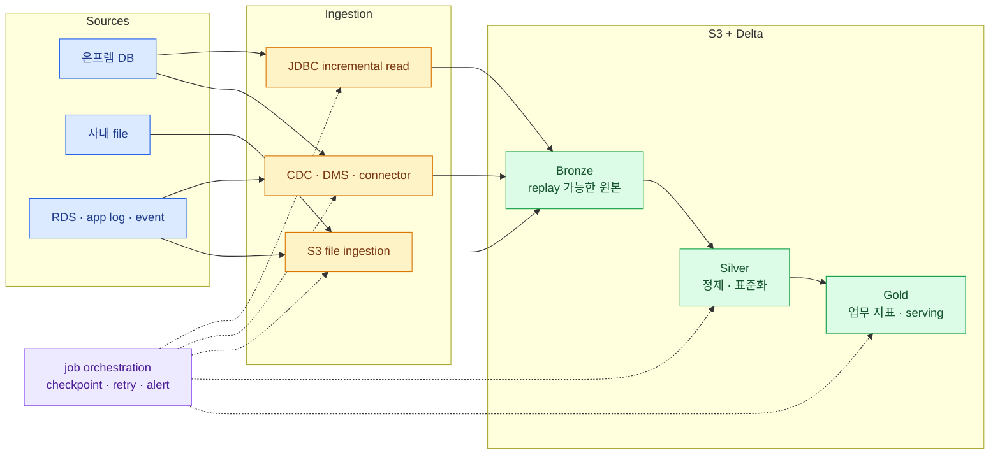
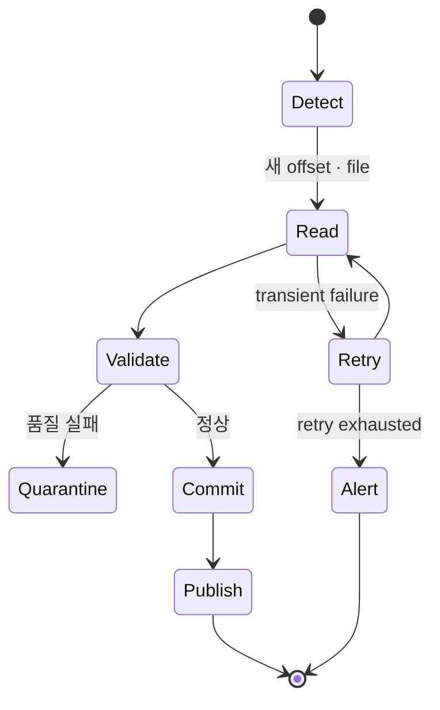

import { LinkCard } from '@astrojs/starlight/components';
import TermIntro from '../../../components/docs/TermIntro.astro';

> 운영 DB를 분석 engine처럼 계속 읽지 말고 **한 번 증분 수집한 뒤 S3의 table을 여러 소비자가
> 재사용하게 만든다**

<TermIntro
  terms={[
    ['CDC', 'Change Data Capture', 'source에서 insert·update·delete 변화만 잡아 full copy 없이 downstream에 전달하는 방식이다.'],
    ['Bronze', 'Bronze layer', 'source 형태와 수집 시각을 최대한 보존한 재처리 가능한 원본 계층이다.'],
    ['Silver', 'Silver layer', '중복·오류를 정리하고 공통 key·schema·품질 규칙을 적용한 계층이다.'],
    ['Gold', 'Gold layer', '매출·고객·운영 KPI처럼 특정 업무 질문에 맞춰 제공하는 소비 계층이다.'],
  ]}
/>

## 전체 흐름

이 장의 질문은 "CX/DX로 source에 연결한 다음 무엇을 해야 하는가"다. 연결 자체보다 재실행,
중복, schema 변화, source 부하를 처리하는 pipeline contract가 중요하다.

## source별 첫 패턴

| Source | 시작하기 좋은 방식 | 반드시 정할 것 |
|---|---|---|
| 작은 온프렘 RDBMS table | classic job의 JDBC + watermark 증분 read | index, read replica, 추출 시간대, delete 처리 |
| 변화량이 큰 운영 DB | log 기반 CDC → S3/Kinesis → Bronze | initial load, ordering, schema change, lag |
| 사내 file drop | transfer 영역의 S3 landing → incremental file ingestion | 완료 marker, 중복 file, quarantine |
| RDS·DynamoDB 등 AWS source | AWS native export/DMS 또는 connector | source 부하, IAM, region, incremental key |
| application event | Kafka/Kinesis stream → streaming table | event time, late data, retention, replay |

Databricks가 source DB에 직접 JDBC로 연결할 수 있다는 사실과 그것이 운영에 좋은 ingestion 방식이라는
판단은 다르다. 초기 PoC에는 직접 read가 빠르지만, production에서는 source owner가 허용한 replica,
incremental window와 concurrency를 contract로 둔다.

## Bronze에서 원본을 버리지 않는다

Bronze는 지저분한 데이터를 방치하는 곳이 아니라 **실패를 고쳐 다시 처리할 수 있는 증거**다.
source primary key, ingestion timestamp, source file·offset, operation type을 남긴다. 잘못된 record는
조용히 drop하지 않고 quarantine table과 품질 지표로 보낸다.

Silver에서는 다음을 결정한다.

- business key와 중복 제거 기준
- timezone·단위·code 표준화
- 개인정보 masking·tokenization 적용 시점
- delete와 late-arriving update 처리
- schema evolution을 자동 허용할 범위와 중단할 범위
- quality failure가 pipeline을 막는지 별도 격리되는지

Gold는 source table을 그대로 복사한 것이 아니라 소비자의 질문과 SLA를 가진 product다. owner,
refresh time, quality threshold, semantic definition과 downstream consumer를 함께 관리한다.

## pipeline은 재실행 가능해야 한다

checkpoint와 Delta transaction을 사용해 같은 input을 다시 받아도 결과가 중복되지 않도록 설계한다.
job 성공 여부만 보지 말고 input count, rejected count, freshness, CDC lag와 target count를 관측한다.

## 참고 자료

- [Databricks medallion architecture](https://docs.databricks.com/aws/en/lakehouse/medallion) — Bronze, Silver, Gold 계층의 공식 설계 원칙.
- [Databricks Lakeflow Connect](https://docs.databricks.com/aws/en/ingestion/lakeflow-connect/) — managed connector와 ingestion 선택지의 현재 범위.
- [AWS DMS documentation](https://docs.aws.amazon.com/dms/latest/userguide/Welcome.html) — AWS에서 full load와 CDC를 구성할 때의 공식 진입점.

<LinkCard
  title="5. 분석가와 AI가 쓰는 길"
  description="Gold·Silver table이 SQL, BI, notebook, ML과 application으로 나가는 소비 경로를 정리한다."
  href="/databricks/05-consumption/"
/>

