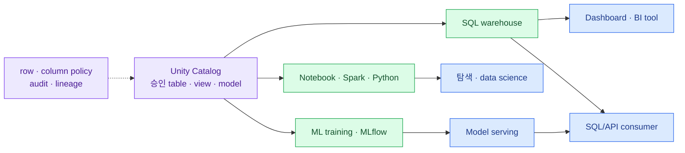

import { LinkCard } from '@astrojs/starlight/components';
import TermIntro from '../../../components/docs/TermIntro.astro';

> lakehouse의 목적은 table을 많이 만드는 것이 아니라 **승인된 정의 하나를 SQL·BI·ML이 반복해서
> 사용하게 하는 것**이다

<TermIntro
  terms={[
    ['SQL warehouse', 'SQL warehouse', 'SQL query와 BI connection을 실행하는 Databricks compute endpoint다.'],
    ['MLflow', 'MLflow', 'experiment, model artifact와 model lifecycle을 추적하는 ML 운영 기반이다.'],
    ['serving', 'Model serving', '학습된 model이나 AI workload를 online API로 제공하는 실행 경계다.'],
    ['semantic layer', 'Semantic layer', '매출·활성 고객 같은 업무 metric의 계산 정의를 소비 도구가 공유하게 하는 계층이다.'],
  ]}
/>

## 한 data product, 여러 소비 경로



이 장을 읽고 나면 workload마다 compute를 어떻게 분리하고, 같은 data를 사용하면서도 권한과 SLA를
어떻게 다르게 줄지 설명할 수 있다.

## 사람별 출발점

| 사용자 | 기본 도구 | 주로 읽는 계층 | 운영 원칙 |
|---|---|---|---|
| SQL 분석가 | SQL editor, SQL warehouse | Gold와 승인된 Silver view | ad-hoc와 dashboard warehouse를 필요하면 분리 |
| BI tool | JDBC/ODBC connection | semantic·Gold model | service principal, query timeout, refresh SLA |
| data engineer | notebook, job, pipeline | Bronze부터 Gold | interactive와 production job compute 분리 |
| data scientist | notebook, feature·training table, MLflow | 승인된 Silver·feature | experiment와 production artifact 추적 |
| application | SQL API 또는 serving endpoint | 좁은 view·model endpoint | end-user identity, rate, latency와 failure contract |

모든 사람에게 하나의 큰 shared cluster를 주면 cost attribution과 장애 경계가 흐려진다. interactive
exploration, scheduled ETL, BI serving과 model serving의 compute를 목적별로 나누고 Unity Catalog에서
data access를 공유한다.

## dashboard가 source DB를 직접 보지 않게 한다

Gold table의 refresh가 10분마다라면 dashboard SLA도 이를 기준으로 정한다. 실시간처럼 보이게 하려고
온프렘 DB를 직접 query하면 dashboard traffic이 운영 system에 전파된다. 정말 sub-second fresh data가
필요한 use case만 streaming·serving store를 별도 설계한다.

```text
업무 DB transaction
  → CDC lag 1~3분
  → Silver quality check
  → Gold refresh
  → BI cache refresh
```

이 chain의 각 시각을 기록해야 사용자가 "왜 숫자가 아직 안 바뀌었나"를 설명할 수 있다.

## AI도 같은 governance 안에서 시작한다

ML training data와 model을 Unity Catalog에 연결하면 어느 table version으로 어떤 model이 만들어졌는지
추적하기 쉽다. 사내 문서 기반 RAG를 만들 때도 document 원본, chunk, embedding, vector index와 serving
endpoint의 owner·권한·개인정보 정책을 data product처럼 다룬다.

:::caution[AI가 권한을 우회하지 않게]
model이나 agent가 table을 읽을 때도 별도 service principal과 최소 권한을 사용한다. 사용자 대신
모든 catalog를 읽는 하나의 고권한 token을 backend에 넣으면 UI의 권한 통제가 의미를 잃는다.
:::

## 제공 전에 정할 contract

- data owner와 technical owner
- schema와 metric 정의
- refresh SLA와 허용 stale time
- row·column 보안과 export 허용 범위
- consumer별 concurrency·latency·비용 예산
- schema 변경 공지와 downstream 영향 분석
- 장애 시 마지막 정상 data 시각 표시

## 참고 자료

- [Databricks high-level architecture](https://docs.databricks.com/aws/en/getting-started/high-level-architecture) — workspace와 Unity Catalog를 여러 workload가 공유하는 구조.
- [Unity Catalog lineage](https://docs.databricks.com/aws/en/data-governance/unity-catalog/data-lineage) — query, job, notebook와 dashboard의 table·column lineage.

<LinkCard
  title="6. 보안은 네 겹으로"
  description="identity, network, data permission, audit를 한 겹으로 뭉치지 않고 독립 통제로 설계한다."
  href="/databricks/06-security/"
/>

