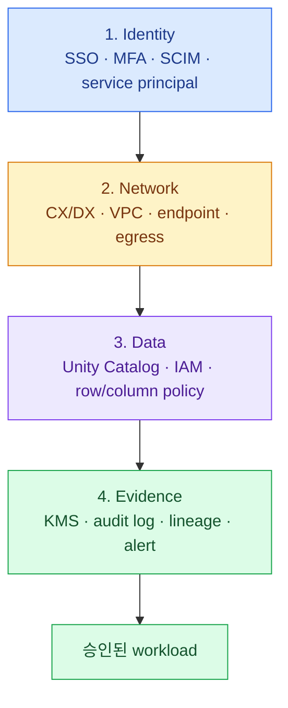

import { LinkCard } from '@astrojs/starlight/components';
import TermIntro from '../../../components/docs/TermIntro.astro';

> private network 하나로 안전해지는 것이 아니라 **identity, network, data 권한, audit가 각각 실패를
> 막아야 한다**

<TermIntro
  terms={[
    ['SSO', 'Single Sign-On', '사내 identity provider의 인증과 MFA 정책으로 Databricks login을 통합한다.'],
    ['SCIM', 'System for Cross-domain Identity Management', '사용자와 group의 생성·변경·퇴사를 identity provider에서 자동 동기화한다.'],
    ['CMK', 'Customer-Managed Key', '회사가 AWS KMS에서 rotation과 key policy를 통제하는 encryption key다.'],
    ['lineage', 'Data lineage', 'table·column이 어느 source에서 와서 어떤 job·dashboard로 흘렀는지 나타내는 관계다.'],
  ]}
/>

## 네 겹의 통제

이 장의 질문은 "CX/DX와 PrivateLink를 구성하면 보안 검토가 끝나는가"다. 답은 아니다. private IP로
도달하는 user가 누구인지, 어떤 table을 읽는지, 무엇을 export했는지를 이어서 통제해야 한다.

## 1. Identity

- 사내 identity provider와 account-level SSO·MFA를 연결한다.
- SCIM으로 user보다 group을 동기화하고 권한은 group에 부여한다.
- 퇴사·이동 시 group과 token이 정해진 시간 안에 회수되는지 시험한다.
- job, CI/CD, BI connection에는 사람 token이 아닌 service principal을 사용한다.
- account admin, workspace admin, metastore admin을 한 사람에게 상시 집중시키지 않는다.

## 2. Network

- workspace UI/API public access를 허용할지 inbound PrivateLink만 허용할지 정한다.
- classic compute의 control plane 연결을 back-end PrivateLink로 사설화할지 정한다.
- S3·STS·Kinesis 등 필요한 AWS service endpoint와 DNS를 inventory로 관리한다.
- compute egress를 domain/firewall policy로 제한하고 승인되지 않은 upload destination을 막는다.
- serverless는 별도 network policy와 NCC가 필요하다. classic VPC rule이 자동 적용된다고 가정하지 않는다.

## 3. Data

- `catalog.schema.object` ownership과 grant 책임자를 정한다.
- raw 개인정보에 대한 direct access를 제한하고 masking view·row filter를 제공한다.
- storage credential의 IAM role은 external location prefix와 KMS key에 최소 권한만 가진다.
- dev service principal이 prod bucket에 write하지 못하게 account·role·workspace binding을 둔다.
- export와 external sharing은 별도 승인 경로로 통제한다.

## 4. Encryption과 evidence

at-rest encryption은 S3·workspace storage·managed service별 적용 범위와 key owner를 표로 관리한다.
in-transit는 application TLS를 기본으로 하고 DX 구간의 암호화 요구는 network team과 별도로 확인한다.

audit는 저장만 하지 말고 질문과 alert로 연결한다.

| 질문 | 필요한 evidence 예 |
|---|---|
| 누가 민감 table을 읽었나 | identity, query/table audit, source IP·workspace |
| 권한이 누가 바꿨나 | catalog grant·IAM change event |
| data가 어디로 흘렀나 | table·column lineage와 downstream dashboard·job |
| 비정상 비용은 무엇인가 | system billing usage, job·warehouse tag |
| 외부로 나간 흔적이 있는가 | egress firewall, VPC flow log, audit event |

:::tip[검증 방법]
설정 화면을 캡처하는 것으로 끝내지 말고 권한 없는 user, 잘못된 source network, 승인되지 않은 S3 path,
퇴사 처리된 계정을 사용한 **negative test**가 실제로 실패하는지 기록한다.
:::

## 최소 보안 승인표

- data classification별 허용 compute와 network path가 정해졌다.
- SSO·MFA·SCIM과 break-glass account 절차가 시험됐다.
- user·service principal·admin 권한이 분리됐다.
- public ingress/egress 허용 항목과 owner가 문서화됐다.
- S3 direct access로 Unity Catalog를 우회할 수 없다.
- KMS key, log retention, audit query와 incident owner가 정해졌다.
- secret을 notebook·Git·cluster environment에 평문으로 넣지 않는다.

## 참고 자료

- [Databricks security and compliance](https://docs.databricks.com/aws/en/security) — network, encryption, identity 보안의 공식 진입점.
- [Databricks PrivateLink concepts](https://docs.databricks.com/aws/en/security/network/concepts/privatelink-concepts) — 세 private connectivity 방향과 complete isolation 고려사항.
- [Unity Catalog lineage](https://docs.databricks.com/aws/en/data-governance/unity-catalog/data-lineage) — table·column lineage와 downstream 추적.
- [Databricks system tables](https://docs.databricks.com/aws/en/admin/system-tables) — audit, billing, lineage 등 account 운영 data.

<LinkCard
  title="7. 운영과 비용"
  description="compute가 꺼지고 켜지는 platform에서 성능·비용·장애를 어떤 지표와 policy로 관리하는지 본다."
  href="/databricks/07-operations/"
/>

