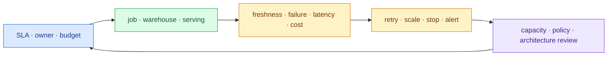

import { LinkCard } from '@astrojs/starlight/components';
import TermIntro from '../../../components/docs/TermIntro.astro';

> 비용을 줄이는 첫 방법은 instance type을 미세 조정하는 것이 아니라 **idle compute를 끄고 workload의
> owner와 SLA를 드러내는 것**이다

<TermIntro
  terms={[
    ['DBU', 'Databricks Unit', 'Databricks workload 사용량을 나타내는 과금 단위다. AWS infrastructure 비용과 함께 봐야 한다.'],
    ['compute policy', 'Compute policy', '허용 instance, autoscaling, tag, runtime과 user 선택 범위를 중앙에서 제한하는 규칙이다.'],
    ['RTO', 'Recovery Time Objective', '장애 후 service를 복구해야 하는 목표 시간이다.'],
    ['RPO', 'Recovery Point Objective', '장애 시 허용할 수 있는 최대 data loss 시간 범위다.'],
  ]}
/>

## 운영의 큰 고리



이 장의 질문은 "platform이 열리고 난 뒤 누가 비용과 장애를 책임지는가"다. cluster가 살아 있다는
지표보다 data가 제시간에 정확히 도착했고 소비 SLA를 지키는지를 먼저 본다.

## 비용은 두 장의 청구서를 합쳐 본다

Classic compute는 Databricks 사용량과 회사 AWS account의 EC2, EBS, S3, NAT·PrivateLink·DX data
transfer 비용이 함께 발생한다. serverless도 Databricks 사용량과 별도 networking·data transfer 영향을
workload별로 확인해야 한다.

| 비용 driver | 흔한 낭비 | 첫 통제 |
|---|---|---|
| interactive compute | 퇴근 후 idle | auto termination, 최대 크기 policy |
| scheduled job | 항상 켜 둔 shared cluster | job compute와 schedule consolidation |
| SQL warehouse | dashboard별 과도한 endpoint | auto stop, size·concurrency 관측 |
| storage | 중복 copy, 무기한 raw·checkpoint | lifecycle은 정하되 Delta file을 임의 삭제하지 않음 |
| network | cross-region read, NAT 경유, 온프렘 full scan | 같은 region, endpoint, incremental ingestion |
| query | full scan, 작은 file, 불필요한 refresh | partition·clustering은 실제 query profile로 결정 |

tag에는 최소한 `owner`, `cost_center`, `environment`, `workload`를 강제하고 billing system table과 AWS
Cost and Usage Report에서 같은 관점으로 맞춘다.

## workload마다 장애 경계를 나눈다

- production ETL을 analyst의 interactive compute와 분리한다.
- dashboard warehouse를 대규모 ad-hoc query와 분리한다.
- dev·stage·prod workspace 또는 catalog 경계를 배포와 권한 모델에 맞춰 정한다.
- retry는 transient failure에만 제한하고 data quality failure를 무한 재시도하지 않는다.
- job dependency, timeout, idempotency와 마지막 정상 output을 기록한다.

## network 운영 지표도 data SLA에 포함한다

CX/DX 상태가 green이어도 BGP route, DNS, security group, endpoint 또는 source firewall 때문에 job이
실패할 수 있다. 다음 synthetic check를 source별로 둔다.

```text
DNS resolve
  → TCP/TLS connect
  → 최소 권한 authentication
  → 작은 read query
  → S3 test prefix write/read
  → audit event 확인
```

회선 failover 시험은 단순 ping이 아니라 실제 ingest job이 secondary path에서 목표 시간 안에 복구되는지
확인한다.

## backup과 DR의 대상을 구분한다

S3 data, Delta log, source offset, notebook·job code, workspace configuration, Unity Catalog metadata와
secret은 복구 방식이 다르다. "S3 versioning을 켰다"가 platform 전체 backup을 뜻하지 않는다.

- table data의 RPO와 cross-region copy 필요 여부
- source에서 replay 가능한 기간과 checkpoint 복구
- job·policy·permission의 infrastructure-as-code·version control
- metastore와 workspace의 region 장애 시 전환 전략
- KMS key와 secret recovery
- 복구 후 data quality와 permission을 검증하는 runbook

## 처음부터 볼 dashboard

- pipeline success rate, duration, retry와 failure category
- source freshness, CDC lag, input/output/rejected row 수
- SQL latency, queue, concurrency와 cache hit
- compute start latency, utilization, auto-stop 실패
- owner·workspace·job·warehouse별 DBU와 AWS 비용
- audit anomaly, denied access, public egress와 data export

## 참고 자료

- [Databricks system tables](https://docs.databricks.com/aws/en/admin/system-tables) — billing, audit, lineage와 compute 운영 data의 공식 목록.
- [Databricks networking](https://docs.databricks.com/aws/en/security/network) — private connectivity와 networking cost 고려사항.

<LinkCard
  title="8. PoC에서 운영으로"
  description="현재 환경에서 먼저 결정할 질문과 6주 안팎의 검증 순서를 하나의 checklist로 묶는다."
  href="/databricks/08-adoption/"
/>

