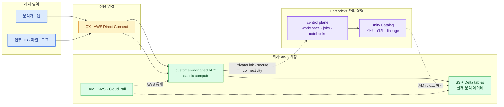

import { LinkCard, LinkButton } from '@astrojs/starlight/components';
import DeckMap from '../../../components/docs/DeckMap.astro';

> 결론부터 말하면, **CX/DX로 우리 VPC에 닿게 하는 것만으로는 부족하고 그 안의 compute가 실제
> 저장소까지 가는 network path와 Unity Catalog 권한을 함께 만들어야 한다**

이 덱은 AWS에서 Databricks를 도입할 때 사내 데이터가 어디에 있고, 누가 처리하며, 어떤 선을 넘어
이동하는지를 큰 그림부터 설명한다. 기준안은 민감한 데이터와 온프렘 source를 고려한
**classic compute + customer-managed VPC + S3 + Unity Catalog**다.

여기서 `CX망`은 Cloud Exchange를 거쳐 AWS Direct Connect(DX)에 접속하는 전용망으로 가정한다.
회사 내부에서 다른 뜻으로 쓰는 약어라면 네트워크팀의 회선 구성도로 2장의 `CX → DX` 구간만
치환하면 된다.

**2026년 8월 18일 기준**으로 Databricks와 AWS 공식 문서를 확인했다. serverless private networking은
지원 범위가 빠르게 변하므로 실제 구축 시점에 다시 검증한다.

<LinkButton href="/databricks/00-position/" icon="right-arrow">첫 장부터 읽기</LinkButton>

## 구성

<DeckMap
  steps={[
    { label: '0장', href: '/databricks/00-position/', title: '자리를 먼저 잡기', tone: 'key',
      desc: 'AWS 서비스와 Databricks가 각각 맡는 일 · lakehouse의 큰 그림',
      note: '데이터를 어디에 두고 무엇을 Databricks라고 부르는가' },
    { label: '1장', href: '/databricks/01-architecture/', title: '세 plane과 두 compute', tone: 'zone',
      desc: 'control plane · classic compute · serverless compute · S3의 경계',
      note: '우리 AWS 계정에서 실제로 도는 것은 무엇인가' },
    { label: '2장', href: '/databricks/02-cx-vpc/', title: 'CX/DX와 VPC', tone: 'warn',
      desc: '사내망 → DX → TGW → VPC · user path와 data path · PrivateLink',
      note: '“우리 VPC에 있으면 되는가”에 정확히 답한다' },
    { label: '3~4장', href: '/databricks/03-data-foundation/', title: '데이터를 담고 흐르게 하기', tone: 'ok',
      desc: 'S3 · Delta · Unity Catalog · bronze/silver/gold · batch/stream',
      note: '원본에서 분석 가능한 table까지 어떻게 이동하는가' },
    { label: '5장', href: '/databricks/05-consumption/', title: '분석과 AI', tone: 'key',
      desc: 'SQL · notebook · BI · MLflow · model serving의 소비 경로',
      note: '정제된 데이터를 누가 어떤 도구로 쓰는가' },
    { label: '6~7장', href: '/databricks/06-security/', title: '통제하고 운영하기', tone: 'bad',
      desc: 'identity · catalog 권한 · 암호화 · 감사 · compute 정책 · 비용',
      note: '연결된 플랫폼을 안전하고 감당 가능하게 유지하는가' },
    { label: '8장', href: '/databricks/08-adoption/', title: 'PoC에서 운영으로', tone: 'mute',
      desc: '결정 질문 · 단계별 도입 · 합격 기준 · 최종 체크리스트' },
  ]}
/>

## 이 덱의 기준 그림

그림에서 가장 중요한 선은 `VPC → S3`다. VPC가 데이터를 담는 것이 아니라 VPC 안의 compute가
회사 S3 또는 사내 source에 접근해 처리한다. Unity Catalog는 그 접근을 이름·권한·감사 관점에서
통제하고, IAM과 KMS는 AWS 자원 관점에서 통제한다.

## 먼저 기억할 다섯 문장

- Databricks는 저장소 하나가 아니라 **데이터 처리·분석·거버넌스 플랫폼**이다.
- AWS에서는 실제 분석 데이터를 대개 회사 계정의 S3에 둔다.
- classic compute는 회사 AWS 계정의 VPC에서, serverless compute는 Databricks 관리 compute plane에서 돈다.
- CX/DX는 사내망과 AWS 사이의 길이지 데이터 저장 위치가 아니다.
- route·security group이 허용되어도 IAM과 Unity Catalog 권한이 없으면 읽을 수 없어야 한다.

<LinkCard
  title="0. Databricks의 자리"
  description="S3, Spark, SQL, BI와 Databricks의 역할을 한 장의 흐름에 놓는다."
  href="/databricks/00-position/"
/>

