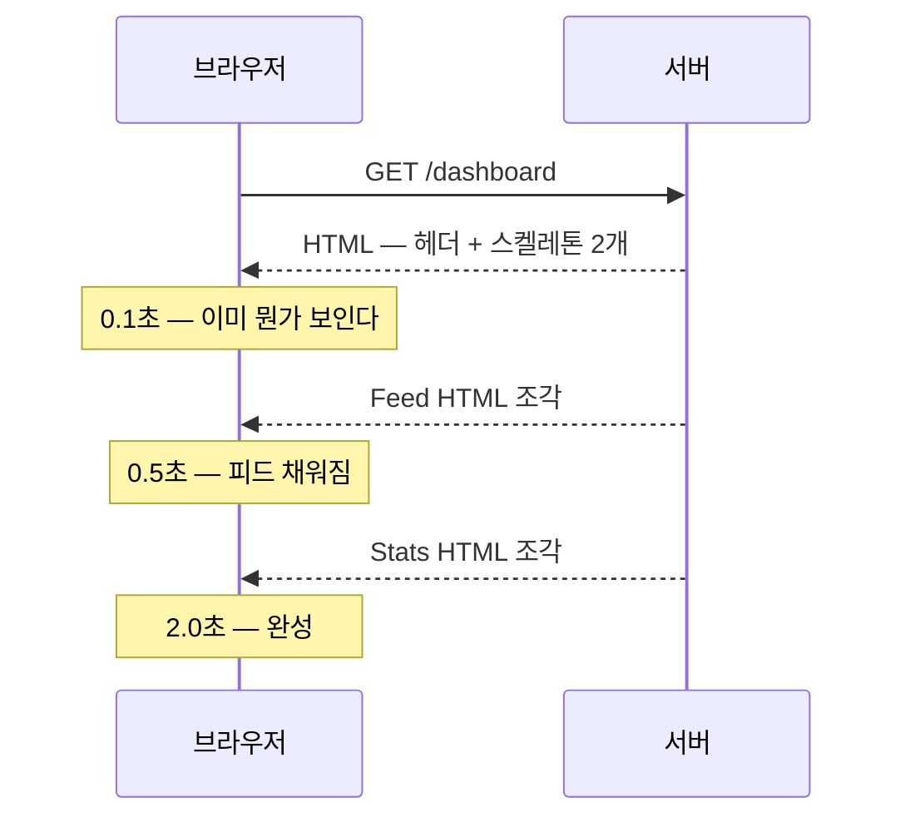

import { Tabs, TabItem, Card, CardGrid, LinkCard } from '@astrojs/starlight/components';

> 데이터를 가져오는 코드가 그 데이터를 쓰는 컴포넌트 옆에 있다

## 가장 단순한 형태

```tsx
// app/posts/page.tsx
export default async function PostsPage() {
  const posts = await db.post.findMany()
  return <PostList posts={posts} />
}
```

`useEffect`도, 로딩 상태도, 에러 상태도 없다.
이 컴포넌트는 **서버에서 한 번 실행되고 끝**이다. 실패는 `try/catch`나 `error.tsx`로 처리한다.

데이터 조회 코드가 **그 데이터를 쓰는 컴포넌트 옆에** 있다는 것 —
이것이 App Router가 되찾은 가장 큰 것이다.

## 어디서 조회할 것인가

여기서 App Router의 가장 흔한 성능 실수가 나온다.

<Tabs>
<TabItem label="❌ 위에서 다 가져와 내려주기">

```tsx
export default async function Page() {
  const user = await getUser()
  const posts = await getPosts()
  const stats = await getStats()
  return <Dashboard user={user} posts={posts} stats={stats} />
}
```

세 쿼리가 **순차 실행**된다 — 각 200ms면 합쳐서 600ms.
그리고 props가 계속 늘어난다.

</TabItem>
<TabItem label="✅ 필요한 컴포넌트가 직접">

```tsx
export default function Page() {
  return (
    <>
      <UserCard />
      <PostList />
      <StatsPanel />
    </>
  )
}

async function PostList() {
  const posts = await getPosts()
  return <ul>{/* ... */}</ul>
}
```

각자 조회하고 **병렬로 실행**된다 — 가장 느린 것 하나의 시간만 든다.

</TabItem>
</Tabs>

한 컴포넌트 안에서 여러 개가 필요하다면 `Promise.all`을 쓴다.

```tsx
const [user, posts, stats] = await Promise.all([
  getUser(), getPosts(), getStats(),
])
```

:::caution[함정]
**서로 의존하지 않는 쿼리를 `await`로 줄줄이 늘어놓는 것**이 가장 흔한 성능 실수다.
`await A; await B;`는 A가 끝나야 B가 시작한다.
B가 A의 결과를 안 쓴다면 그 대기는 순수한 낭비다.
:::

## 중복 조회는 자동으로 제거된다

"각자 조회하게 두라"는 조언이 성립하려면 중복이 해결돼야 한다. 두 가지 장치가 있다.

### `React.cache()` — ORM·DB 클라이언트용

```ts
// lib/user.ts
import { cache } from 'react'

export const getUser = cache(async (id: string) => {
  console.log('DB 조회 실행')     // 한 요청당 한 번만 찍힌다
  return db.user.findUnique({ where: { id } })
})
```

```ts
// 이제 어디서 몇 번을 불러도 DB는 한 번만 간다
async function Header()  { const u = await getUser('1') /* ... */ }
async function Sidebar() { const u = await getUser('1') /* ... */ }
async function Profile() { const u = await getUser('1') /* ... */ }
```

**요청 단위 메모이제이션**이다. 요청이 끝나면 사라진다.
"props로 내려줄까 각자 부를까"를 고민할 필요가 없어진다 — **각자 부르면 된다.**

### `fetch`는 감싸지 않아도 된다

```tsx
// 같은 URL + 같은 옵션 = 한 번만 나간다
async function A() { const r = await fetch('https://api.x/user/1') }
async function B() { const r = await fetch('https://api.x/user/1') }
```

- React가 `fetch`를 감싸 **같은 렌더 패스 안에서** 중복을 제거한다
- ORM이나 DB 클라이언트는 이 대상이 아니다 → `React.cache()`를 직접 쓴다
- `POST`처럼 부수효과가 있는 요청은 제외된다

## Suspense로 스트리밍

느린 데이터가 빠른 데이터를 막지 않게 한다.

```tsx
import { Suspense } from 'react'

export default function Page() {
  return (
    <>
      <Header />                          {/* 즉시 */}
      <Suspense fallback={<StatsSkeleton />}>
        <SlowStats />                     {/* 2초 걸림 */}
      </Suspense>
      <Suspense fallback={<FeedSkeleton />}>
        <Feed />                          {/* 500ms */}
      </Suspense>
    </>
  )
}
```

Header가 먼저 보이고, Feed가 500ms에, Stats가 2초에 각각 **도착하는 대로** 채워진다.
전체가 2초를 기다리지 않는다.



- 하나의 HTTP 응답이 **끊기지 않고 계속 흘러온다** (chunked transfer)
- JS가 없어도 동작한다. `<template>`과 인라인 스크립트로 채워 넣는 방식이다
- `loading.tsx`는 이 Suspense를 **페이지 전체에 자동으로 걸어주는 것**이다

### 어디에 경계를 걸 것인가

<Tabs>
<TabItem label="너무 넓게">

```tsx
<Suspense fallback={<PageSkeleton />}>
  <EntireDashboard />
</Suspense>
```

가장 느린 것 하나 때문에 **전부가 스켈레톤**이 된다.
`loading.tsx`만 두고 끝내면 사실상 이 상태다.

</TabItem>
<TabItem label="적당하게">

```tsx
<Header />
<Suspense fallback={<CardSkeleton />}>
  <Revenue />
</Suspense>
<Suspense fallback={<TableSkeleton />}>
  <RecentOrders />
</Suspense>
```

느린 영역만 개별적으로 감싼다.

</TabItem>
</Tabs>

:::tip[핵심]
기준은 하나다 — **"이 영역이 늦게 와도 나머지를 쓸 수 있는가?"**
그렇다면 별도 경계를 만든다.
:::

### 스켈레톤은 실제 레이아웃을 흉내내야 한다

```tsx
// ❌ 크기가 다르다 — 콘텐츠가 도착하는 순간 화면이 튄다
<Suspense fallback={<p>Loading…</p>}>

// ✅ 실제와 같은 크기로 자리를 예약한다
<Suspense fallback={
  <div className="space-y-2">
    <Skeleton className="h-5 w-2/5" />
    <Skeleton className="h-4 w-4/5" />
    <Skeleton className="h-9 w-24" />
  </div>
}>
```

크기가 다르면 콘텐츠가 도착할 때 **레이아웃 시프트(CLS)**가 발생한다. (8장)
shadcn/ui의 `Skeleton` 컴포넌트가 정확히 이 용도다.

## 외부 API를 쓸 때

```tsx
// 서버 컴포넌트에서 직접 호출 — 키가 노출되지 않는다
async function Weather({ city }: { city: string }) {
  const res = await fetch(`https://api.weather.com/v1/${city}`, {
    headers: { 'X-Api-Key': process.env.WEATHER_KEY! },
  })
  if (!res.ok) throw new Error('날씨 조회 실패')
  const data = await res.json()
  return <div>{data.temp}°C</div>
}
```

```tsx
// 응답 형태는 반드시 검증한다 — 외부 API는 언제든 바뀐다
import { z } from 'zod'

const WeatherSchema = z.object({ temp: z.number(), desc: z.string() })
const data = WeatherSchema.parse(await res.json())
```

:::caution[함정]
외부 응답을 그대로 믿고 `data.temp`를 쓰면 **런타임에 조용히 깨진다.**
`undefined`가 화면에 `NaN°C`로 뜨거나, 더 나쁘게는 아무 표시 없이 빈칸이 된다.
**경계에서 파싱한다** — 이 원칙은 7장의 Server Function에서도 그대로 반복된다.
:::

## 클라이언트 조회가 맞는 경우

서버 컴포넌트가 만능은 아니다.

<CardGrid>
<Card title="실시간 갱신" icon="seti:clock">
채팅, 알림, 라이브 대시보드.
폴링이나 웹소켓이 필요하다.
</Card>
<Card title="무한 스크롤" icon="down-caret">
사용자 스크롤에 반응해 더 가져오기.
</Card>
<Card title="낙관적 UI 목록" icon="approve-check">
좋아요, 투표처럼 즉시 반영이 중요한 것.
</Card>
<Card title="오프라인·캐시 우선" icon="laptop">
PWA. 네트워크가 없어도 동작해야 한다.
</Card>
</CardGrid>

이럴 땐 **TanStack Query**나 **SWR**을 쓴다.
서버 컴포넌트로 첫 데이터를 주고, 이후 갱신만 클라이언트가 맡는 조합이 가장 흔하다. (19장)

## 5장 요약

- 데이터 조회는 **그것을 쓰는 컴포넌트 안에서** 한다
- 위에서 다 가져와 내려주면 **순차 실행**된다 — 각자 조회하게 두면 병렬이 된다
- 중복은 **`React.cache()`**(ORM)와 **fetch 자동 중복 제거**로 해결된다
- **Suspense는 "늦게 와도 되는 영역"에 건다**
- 스켈레톤은 **실제 레이아웃과 같은 크기**여야 한다 (CLS 방지)
- 외부 API 응답은 **경계에서 스키마로 파싱**한다
- 실시간·무한스크롤은 여전히 **클라이언트 조회**가 맞다

<LinkCard
  title="6. 캐싱"
  description="Cache Components — 기본은 캐시 안 함, 캐시하려면 명시한다."
  href="/frontend/06-cache/"
/>
