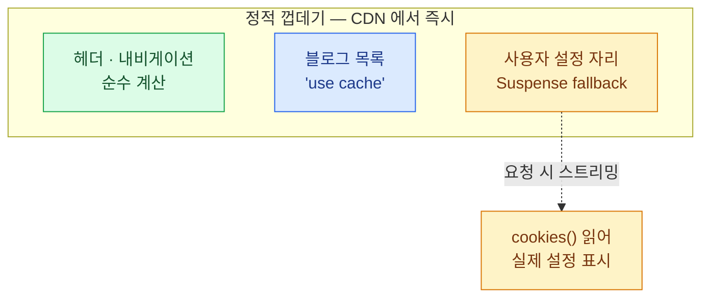

import { Tabs, TabItem, Card, CardGrid, LinkCard } from '@astrojs/starlight/components';

> Next.js에서 가장 오해가 많았던 부분이 다시 설계됐다

## 왜 이 장이 필요한가

Next.js 13~14의 캐싱은 **악명이 높았다.** "왜 데이터가 안 바뀌지"가 가장 흔한 질문이었고,
원인은 캐시가 **암묵적으로 켜져 있었고** 계층이 네 개나 됐다는 것이다.

Next.js 16은 이걸 **Cache Components**라는 모델로 다시 설계했다.
핵심 변화는 한 줄로 요약된다 — **기본은 캐시 안 함. 캐시하려면 명시한다.**

```ts
// next.config.ts
import type { NextConfig } from 'next'

const nextConfig: NextConfig = {
  cacheComponents: true,
}

export default nextConfig
```

- 이걸 켜면 **부분 프리렌더링(PPR)이 기본 동작**이 된다
- 캐시되지 않은 데이터 접근은 **반드시 Suspense 안에** 있어야 한다 (아니면 개발 중 경고)
- 강제성이 있는 대신, 모든 라우트가 **즉시 뜨는 정적 껍데기**를 갖게 된다

:::caution[함정]
검색으로 찾은 `export const revalidate = 60`,
`fetch(url, { next: { revalidate } })`, `export const dynamic = 'force-dynamic'` 같은 코드는
**이전 모델**이다. 여전히 동작하지만 새로 배울 것은 이쪽이 아니다.
:::

## `use cache` — 캐시를 명시한다

<Tabs>
<TabItem label="데이터 레벨">

```tsx
import { cacheLife } from 'next/cache'

export async function getUsers() {
  'use cache'
  cacheLife('hours')
  return db.query('SELECT * FROM users')
}
```

여러 컴포넌트가 같은 데이터를 쓸 때. 조회 결과만 캐시한다.

</TabItem>
<TabItem label="UI 레벨">

```tsx
export default async function Page() {
  'use cache'
  cacheLife('hours')

  const users = await db.query('...')
  return <UserList users={users} />
}
```

**렌더 결과까지 통째로** 캐시한다. 렌더 비용이 큰 화면에 유리하다.

</TabItem>
</Tabs>

**인자와 클로저로 잡힌 값이 자동으로 캐시 키가 된다.**
`getUser(1)`과 `getUser(2)`는 별개 엔트리다.

### `cacheLife` — 수명을 정한다

```tsx
async function BlogPosts() {
  'use cache'
  cacheLife('hours')      // 프로파일 이름으로 지정
  // ...
}
```

| 프로파일 | 대략의 성격 |
|---|---|
| `seconds` | 거의 실시간에 가까운 데이터 |
| `minutes` | 자주 바뀌는 목록 |
| `hours` | 블로그 글, 상품 정보 |
| `days` | 카테고리, 설정값 |
| `max` | 사실상 안 바뀌는 것 |

:::tip[핵심]
문서는 **모든 캐시 지시자에 `cacheLife`를 짝지어 쓰기를 권장**한다.
안 쓰면 암묵적 `default` 프로파일이 적용된다 — **예전 모델의 실수를 반복하지 않으려는 장치**다.
:::

### `cacheTag` + `revalidateTag` — 사건 기반 무효화

시간이 아니라 **사건**을 기준으로 갱신한다.

```tsx
// 읽는 쪽: 태그를 붙인다
import { cacheLife, cacheTag } from 'next/cache'

async function BlogPosts() {
  'use cache'
  cacheLife('hours')
  cacheTag('posts')
  const res = await fetch('https://api.example.com/posts')
  return <List items={await res.json()} />
}
```

```tsx
// 쓰는 쪽: 글을 발행하면 태그를 무효화한다
'use server'
import { revalidateTag } from 'next/cache'

export async function publishPost(data: FormData) {
  await db.post.create({ /* ... */ })
  revalidateTag('posts')      // 이 태그를 쓰는 모든 캐시가 갱신 대상
}
```

CMS 웹훅을 Route Handler로 받아 `revalidateTag`를 호출하는 것이 전형적인 패턴이다.

## 캐시하지 않는 것은 Suspense로

매 요청 새로 읽어야 하는 데이터에는 **`use cache`를 쓰지 않는다.** 대신 Suspense로 감싼다.

```tsx
import { Suspense } from 'react'

async function LatestPosts() {
  const data = await fetch('https://api.example.com/posts')
  return <List items={await data.json()} />
}

export default function Page() {
  return (
    <>
      <h1>My Blog</h1>
      <Suspense fallback={<p>불러오는 중…</p>}>
        <LatestPosts />
      </Suspense>
    </>
  )
}
```

fallback이 **정적 껍데기에 포함되어 즉시 전송**되고, 실제 내용은 요청 시점에 흘러온다.

### 런타임 API도 마찬가지다

`cookies()`, `headers()`, `searchParams`, `params` — 요청이 있어야 알 수 있는 것들.

```tsx
import { cookies } from 'next/headers'
import { Suspense } from 'react'

async function UserGreeting() {
  const cookieStore = await cookies()
  const theme = cookieStore.get('theme')?.value || 'light'
  return <p>테마: {theme}</p>
}

export default function Page() {
  return (
    <>
      <h1>대시보드</h1>
      <Suspense fallback={<p>불러오는 중…</p>}>
        <UserGreeting />
      </Suspense>
    </>
  )
}
```

:::tip[핵심]
**중요한 변화:** 예전 모델에서는 `cookies()`를 한 번만 읽어도 **라우트 전체가 동적**이 됐다.
이제는 그 **Suspense 경계 안쪽만** 동적이다. 나머지는 정적 껍데기로 남는다.
:::

## 세 가지가 한 페이지에 공존한다



- **초록** — 빌드 타임에 확정. 순수 계산, 모듈 import
- **파랑** — `use cache`. 모두에게 같은 내용, 캐시에서
- **노랑** — 요청 시. 사용자마다 다른 내용, 스트리밍

### 정적 껍데기를 최대한 키우기

```tsx
// ❌ 레이아웃 최상단에서 params를 await — 껍데기를 만들 수 없다
export default async function Layout({ children, params }: LayoutProps<'/shop/[slug]'>) {
  const { slug } = await params
  return <div><Sidebar /><h1>{slug}</h1>{children}</div>
}
```

```tsx
// ✅ await를 경계 안쪽으로 밀어 넣는다
export default function Layout({ children, params }: LayoutProps<'/shop/[slug]'>) {
  return (
    <div>
      <Sidebar />
      <Suspense fallback={<h1>불러오는 중…</h1>}>
        {params.then(({ slug }) => <SlugHeading slug={slug} />)}
      </Suspense>
      {children}
    </div>
  )
}
```

**비동기 작업이 트리 깊은 곳에 있을수록 프리렌더할 수 있는 영역이 넓어진다.**
3장에서 `params`가 Promise가 된 이유가 정확히 이것이다.

## 캐시의 종류와 저장 위치

기본 `use cache` 말고도 두 가지 변종이 있다.

### `use cache: private` — 사용자별 캐시

쿠키·헤더를 **직접 읽으면서도** 수명을 가질 수 있다.

```tsx
async function UserSidebar() {
  'use cache: private'
  cacheLife('minutes')
  const session = (await cookies()).get('session')?.value
  return <Nav items={await getNavFor(session)} />
}
```

- 결과가 **브라우저에만** 저장된다. 서버 공유 캐시에 들어가지 않는다
- 프리페치에 포함될 수 있어 클릭 시 이미 준비돼 있다
- 사용자별로 다른 내용을 캐시해야 할 때의 정답

### `use cache: remote` — 인스턴스 간 공유

```tsx
async function ExpensiveReport(params: { month: string }) {
  'use cache: remote'
  cacheLife('hours')
  return renderReport(await runHeavyQuery(params.month))
}
```

- 기본 `use cache`의 런타임 저장소는 **인스턴스 메모리**다. 서버리스에서는 요청마다 날아갈 수 있다
- `remote`는 **cache handler**를 통해 durable 스토리지에 저장한다 — 인스턴스가 바뀌어도 유지된다
- 대신 **네트워크 왕복 비용**이 든다. 문서 표현대로 **적중률이 높을 때만 이득**이다

빌드 ID가 캐시 키에 포함되므로 **새로 배포하면 remote 캐시도 초기화**된다.

### 저장 위치 정리

| 저장소 | 무엇이 들어가나 | 수명 제어 |
|---|---|---|
| **프리렌더 HTML** | 정적 껍데기, ISR로 승격된 페이지 | `revalidate` / `expire` |
| **인스턴스 메모리** | 기본 `use cache` 런타임 결과 | 프로세스 수명 |
| **remote 스토어** | `use cache: remote` | cache handler 설정 |
| **브라우저** | 프리페치된 RSC 페이로드, `use cache: private` | `stale` |

전부 **배포 단위로 스코프**된다. 새 배포는 새 캐시에서 시작한다.

## 알아둘 함정 세 가지

### 무작위 값과 현재 시각

캐시 모델에서 `Math.random()`, `Date.now()`는 애매한 존재다. Next.js는 **명시하라고 요구**한다.

<Tabs>
<TabItem label="요청마다 달라야 한다">

```tsx
import { connection } from 'next/server'

async function UniqueContent() {
  await connection()      // 요청 시점으로 미룬다
  const uuid = crypto.randomUUID()
  return <p>요청 ID: {uuid}</p>
}
// + Suspense로 감싼다
```

</TabItem>
<TabItem label="모두 같아도 된다">

```tsx
export default async function Page() {
  'use cache'
  const buildId = crypto.randomUUID()
  return <p>빌드 ID: {buildId}</p>
}
```

</TabItem>
</Tabs>

외우지 않아도 된다. 개발 중 오버레이가 `blocking-prerender-random` 같은 진단을 띄우고
고치는 방법을 알려준다.

### 봇과 크롤러는 다르게 처리된다

- 사람의 브라우저 → 정적 껍데기를 즉시 받고 나머지는 스트리밍
- **봇·크롤러 → 껍데기를 건너뛰고 전체를 요청 시점에 렌더**해서 완성된 HTML을 준다

:::caution[함정]
SEO를 위한 배려지만 함정이 하나 있다.
껍데기가 **빌드 타임에만 존재하는 데이터**에 의존하고 있으면,
사람에게는 잘 뜨는 페이지가 **크롤러에게는 실패**할 수 있다.
껍데기가 쓰는 데이터는 요청 시점에도 접근 가능해야 한다.
:::

### 런타임 프리페칭의 비용

`use cache`가 만든 결과는 **링크를 프리페치할 때 미리 준비**될 수 있다.
클릭 시 기다릴 것이 없어지지만, 비용은 **프리페치 대상 링크마다 서버 호출 한 번**이다.
`partialPrefetching` 설정과 `<Link prefetch>`로 조절한다.

## 예전 모델과의 대응표

| 하려던 일 | 예전 (13~15) | 지금 (Cache Components) |
|---|---|---|
| 페이지 정적 생성 | 기본값 (암묵적) | `use cache` 명시 |
| 60초마다 갱신 | `export const revalidate = 60` | `cacheLife('minutes')` |
| fetch 결과 캐시 | `fetch(url, { next: { revalidate: 60 } })` | 함수에 `use cache` + `cacheLife` |
| 캐시 안 함 | `cache: 'no-store'` | 아무것도 안 붙임 (기본) |
| 동적 렌더 강제 | `export const dynamic = 'force-dynamic'` | Suspense + 런타임 API |
| 태그 무효화 | `revalidateTag` | `revalidateTag` (동일) |
| 부분 프리렌더 | `experimental.ppr` | 기본 동작 |

## 6장 요약

- Cache Components는 "**기본은 캐시 안 함, 캐시는 명시**"로 뒤집은 모델이다
- `use cache`는 **데이터 함수와 컴포넌트 양쪽**에 붙일 수 있다
- **`cacheLife`를 항상 짝지어** 쓴다. `cacheTag` + `revalidateTag`로 사건 기반 무효화
- 캐시 안 하는 것·런타임 API는 **Suspense로 감싼다** → 나머지는 정적 껍데기로 남는다
- `private`는 사용자별(브라우저), `remote`는 인스턴스 공유(durable)
- **`await`를 트리 아래로 밀수록 껍데기가 커진다**

<LinkCard
  title="7. 데이터 바꾸기"
  description="Server Functions와 폼 — 그리고 그것이 공개 엔드포인트라는 사실."
  href="/frontend/07-mutation/"
/>
