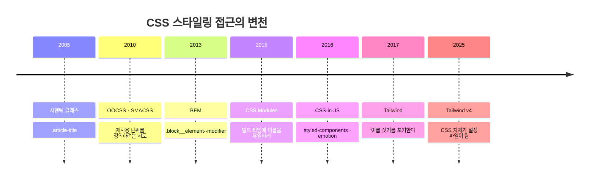
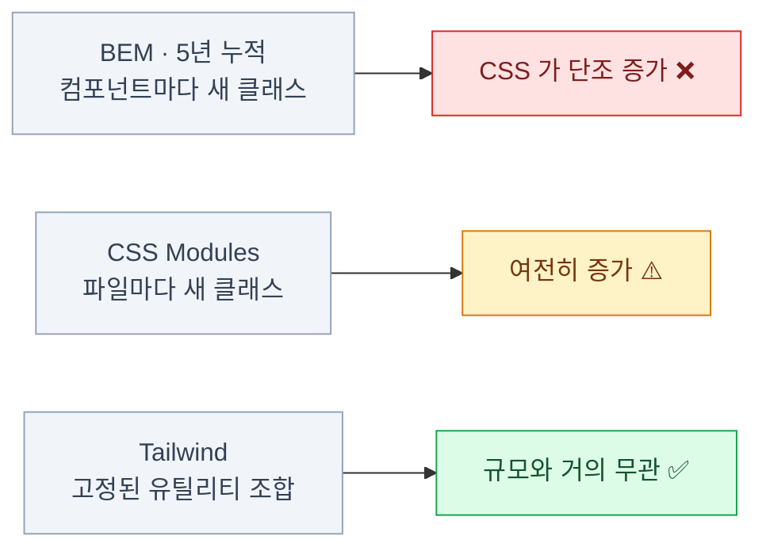

import { Tabs, TabItem, Card, CardGrid, LinkCard } from '@astrojs/starlight/components';

> "클래스가 길어서 못 봐주겠다"는 첫인상은 정당하다. 그 대가로 무엇을 얻는지가 문제다

이 장은 Tailwind 문법을 다루지 않는다.
**CSS가 왜 어려웠는지**를 먼저 정리한다. 그래야 긴 클래스가 비용인지 대가인지 판단할 수 있다.

## CSS의 근본 문제 세 가지

### 1. 전역 네임스페이스

`.title`은 온 세상에 하나다. 다른 파일의 `.title`과 충돌한다.
어떤 파일이 어떤 클래스를 정의했는지 코드만 봐서는 알 수 없다.

### 2. 특이도(specificity) 전쟁

`.card .title`이 `.title`을 이긴다. 이기려고 `.page .card .title`을 쓴다.
그것도 안 되면 `!important`. 한 번 시작되면 되돌릴 수 없다.

### 3. 죽은 코드를 못 지운다

이 클래스를 쓰는 곳이 정말 없는지 확인할 방법이 없다. **그래서 아무도 안 지운다.**

세 문제의 결과는 하나다 — **CSS 파일은 단조 증가한다.**
이것이 모든 CSS 방법론이 풀려던 문제다.

## 해결 시도의 역사



### BEM — 규율로 해결하기

```css
.card { }
.card__header { }
.card__header--highlighted { }
.card__body { }
.card__body__list { }        /* 규칙 위반이지만 현실에서 나온다 */
```

<CardGrid>
<Card title="얻은 것" icon="approve-check">
충돌 없음.
구조가 이름에 드러남.
특이도가 평평해짐.
</Card>
<Card title="남은 문제" icon="close">
이름 짓는 데 시간이 든다.
컴포넌트 이름이 바뀌면 클래스도 전부 바뀐다.
**여전히 아무것도 못 지운다.**
팀원마다 규칙 해석이 다르다.
</Card>
</CardGrid>

### CSS-in-JS — 코로케이션으로 해결하기

```tsx
const Title = styled.h2`
  font-size: 1.25rem;
  color: ${(p) => (p.highlighted ? 'red' : 'black')};
`
```

<CardGrid>
<Card title="얻은 것" icon="approve-check">
컴포넌트와 스타일이 같은 파일에.
**컴포넌트를 지우면 스타일도 지워진다.**
props로 동적 스타일.
</Card>
<Card title="남은 문제" icon="close">
**런타임 비용** — 렌더마다 CSS를 만든다.
**서버 컴포넌트와 상극** — Context와 런타임이 필요해 `use client`가 강제된다.
번들에 CSS 엔진이 포함된다.
</Card>
</CardGrid>

:::caution[함정]
RSC 시대에 styled-components 계열의 입지가 급격히 줄어든 결정적 이유가 두 번째다.
**스타일링 방식 하나 때문에 앱 전체가 클라이언트 컴포넌트가 된다.**
20장에서 다시 짚지만, 이 전환만은 미루기 어렵다.
:::

## Tailwind의 제안

이름을 잘 짓는 방법을 찾는 대신, **이름 짓기를 그만두자.**

- CSS 속성 하나에 대응하는 **작고 고정된 클래스**를 미리 만들어 둔다
- 컴포넌트는 그걸 **조합**해서 쓴다
- 새 클래스를 만들 일이 없으니 **CSS 파일이 자라지 않는다**

### 같은 것을 세 가지 방식으로

<Tabs>
<TabItem label="BEM">

```html
<div class="alert alert--warn">
  <p class="alert__text">주의</p>
</div>
```

```css
.alert {
  display: flex;
  gap: .75rem;
  padding: .75rem 1rem;
  border-radius: .5rem;
  border: 1px solid #e4e4e7;
}
.alert--warn {
  border-color: #f59e0b;
}
```

파일 둘, 컨텍스트 전환 있음.

</TabItem>
<TabItem label="CSS-in-JS">

```tsx
const Alert = styled.div`
  display: flex;
  gap: .75rem;
  padding: .75rem 1rem;
  border-radius: .5rem;
  border: 1px solid
    ${p => p.warn ? '#f59e0b' : '#e4e4e7'};
`
```

파일 하나. 대신 런타임 비용.

</TabItem>
<TabItem label="Tailwind">

```html
<div class="flex gap-3 px-4 py-3 rounded-lg border border-amber-500">
  <p>주의</p>
</div>
```

파일 하나. 컨텍스트 전환 없음. 런타임 없음.

</TabItem>
</Tabs>

**세 방식 모두 결과 CSS는 사실상 같다.** 차이는 "어디에 무엇을 쓰느냐"뿐이다.

## "관심사의 분리"라는 반론

가장 흔한 비판이다. "HTML에 스타일을 쓰면 관심사 분리 원칙 위반 아닌가?"

- 그 원칙은 **HTML과 CSS가 별개 파일로 배포되던 시대**의 것이다
- 지금은 마크업과 스타일이 **같은 컴포넌트 안에서 함께 바뀐다**
- 카드 디자인을 고칠 때 CSS만 고치고 끝나는 경우가 얼마나 되나?

:::tip[핵심]
재사용의 단위가 **CSS 클래스에서 컴포넌트로** 옮겨간 것이 전제의 변화다.
같은 스타일을 다시 쓰고 싶으면 **컴포넌트를 재사용**하면 된다.
:::

## 유틸리티가 실제로 만드는 CSS

```html
<div class="p-4 text-sm rounded-lg">
```

```css
/* 빌드 결과 — 딱 이만큼만 생성된다 */
.p-4 { padding: 1rem }
.text-sm { font-size: .875rem; line-height: 1.25rem }
.rounded-lg { border-radius: .5rem }
```

- 프로젝트 전체에서 `p-4`를 100번 써도 **CSS에는 한 번만** 나온다
- 안 쓴 클래스는 **생성되지 않는다**
- 그래서 CSS 파일 크기가 **프로젝트 규모와 거의 무관**하게 유지된다



Tailwind 쪽이 작은 이유는 압축을 잘해서가 아니라
**중복이 구조적으로 발생하지 않기 때문**이다. 같은 스타일이 100군데 쓰여도 정의는 한 번뿐이다.

## 남는 진짜 문제 — 반복

```html
<!-- 이 조합을 20군데서 반복한다면? -->
<button class="inline-flex items-center justify-center rounded-md text-sm
  font-medium bg-zinc-900 text-white h-9 px-4 hover:bg-zinc-800">
```

Tailwind의 답은 **"`@apply`를 쓰지 말고 컴포넌트를 만들어라"**다.
`<Button>` 컴포넌트 하나를 만들면 조합은 한 곳에만 존재한다.

그리고 그 `<Button>`을 처음부터 잘 만들어 주는 것이 **shadcn/ui**다.

:::tip[핵심]
이것이 Tailwind와 shadcn/ui가 **한 세트로 다뤄지는 이유**다.
Tailwind만으로는 반복 문제가 남고, shadcn/ui가 정확히 그 자리를 채운다.
:::

## Tailwind가 안 맞는 경우

- **디자이너가 CSS를 직접 수정**하는 워크플로가 있다 → 유틸리티는 진입 장벽이 된다
- **마크업을 우리가 소유하지 않는다** (CMS가 뱉는 HTML, 서드파티 위젯)
- **이메일 템플릿** — 인라인 스타일이 필요하다
- **디자인 토큰이 런타임에 서버에서 내려온다** — 빌드 타임 스캔과 안 맞는다

마지막 항목은 우회 가능하다.
**CSS 변수를 쓰면 런타임에 바꿀 수 있다** — 12장·17장의 핵심 기법이 정확히 이것이다.

## 9장 요약

- CSS의 근본 문제는 **전역 네임스페이스 · 특이도 · 못 지우는 코드** 세 가지
- BEM은 규율로, CSS Modules는 빌드로, CSS-in-JS는 코로케이션으로 풀려 했다
- CSS-in-JS는 **런타임 비용과 RSC 비호환**으로 입지가 줄었다
- Tailwind는 **이름 짓기 자체를 없애서** 문제를 우회한다
- "관심사의 분리"는 **재사용 단위가 컴포넌트로 옮겨가면서** 전제가 바뀌었다
- 남는 문제(반복)는 **컴포넌트로** 푼다 → 그게 shadcn/ui의 자리다

<LinkCard
  title="10. Tailwind CSS v4"
  description="CSS 자체가 설정 파일이 되었다 — @theme, 변형, 그리고 정적 클래스 제약."
  href="/frontend/10-tailwind/"
/>
