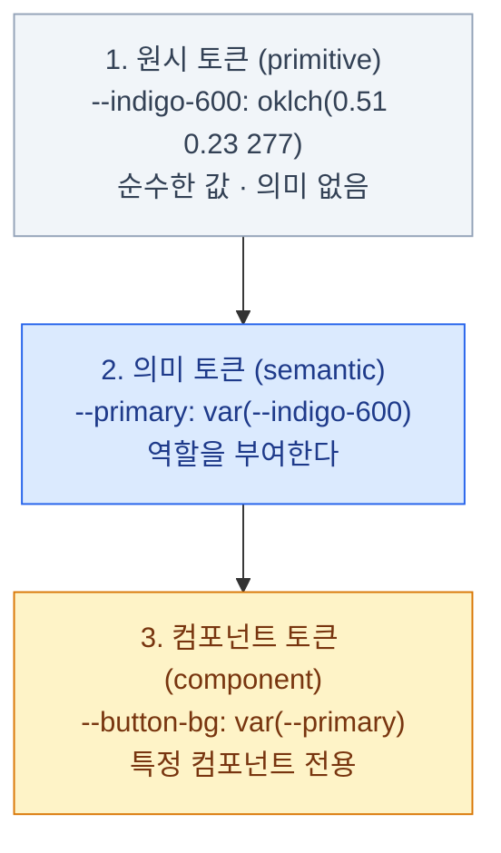
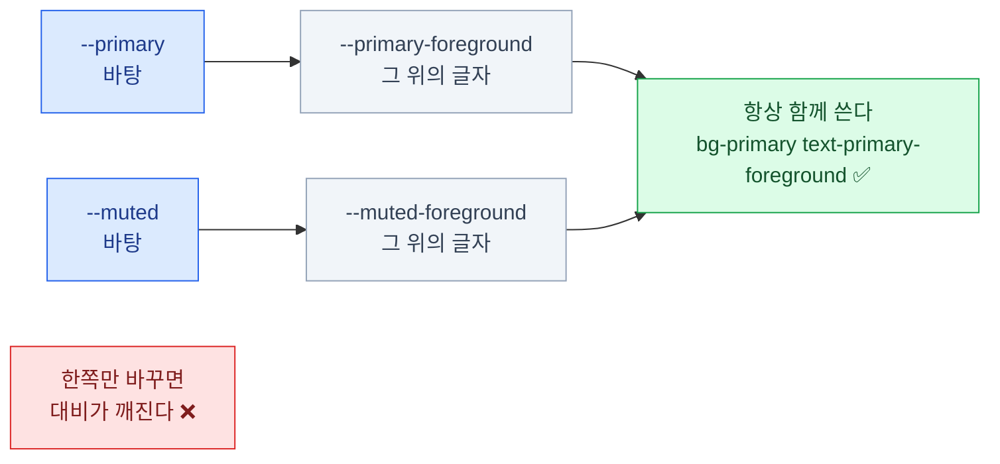
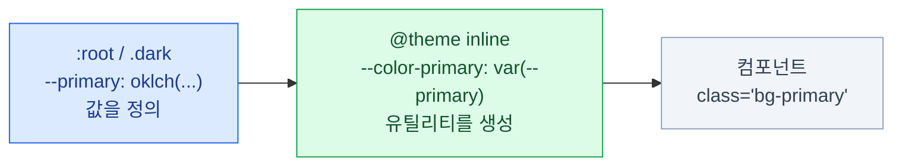

import { Tabs, TabItem, Steps, Card, CardGrid, LinkCard } from '@astrojs/starlight/components';

> "디자인 시스템을 도입한다"는 말의 90%는 토큰 이야기다

이 장은 **[4장(경계)](/frontend/04-boundary/)·[16장(자산화)](/frontend/16-asset/)과 함께
이 덱의 중심**이다.

- 토큰을 제대로 설계하면 → 테마 교체가 **CSS 변수 몇 줄**이 된다
- 토큰 없이 만들면 → 디자인 변경이 **전 파일 찾아 바꾸기**가 된다
- 17장에서 실제 디자인 시스템을 얹을 때 이 장의 구조를 그대로 쓴다

## 토큰이란 무엇인가

**디자인 결정에 이름을 붙여 저장한 값**이다.

```css
/* 결정: 우리 브랜드의 주 색상은 이 색이다 */
--primary: oklch(0.55 0.22 264);

/* 결정: 기본 모서리 둥글기는 이 정도다 */
--radius: 0.5rem;
```

값이 아니라 **결정**을 저장한다는 게 핵심이다.
`#4f46e5`는 값이고, `--primary`는 결정이다. 결정이 바뀌면 **한 곳만** 고친다.

### 3단 구조

토큰을 한 층으로 만들면 금방 무너진다. 실무에서는 **세 층**으로 나눈다.



**대부분의 프로젝트는 1·2단만 있으면 충분하다.**
3단은 컴포넌트가 아주 많고 팀이 나뉘어 있을 때 필요해진다.

### 왜 의미 층이 필요한가

<Tabs>
<TabItem label="원시 토큰만 쓸 때">

```html
<button class="bg-zinc-900 text-zinc-50">
<div class="bg-zinc-900 text-zinc-50">
<span class="bg-zinc-900 text-zinc-50">
```

브랜드 색을 파랑으로 바꾸려면? → **전부 찾아서 바꿔야 한다.**

그리고 이 중 어떤 게 "주요 버튼"이고 어떤 게 "그냥 어두운 배경"인지 **구분이 안 된다.**
찾아 바꾸기가 위험한 이유가 이것이다.

</TabItem>
<TabItem label="의미 토큰을 쓸 때">

```html
<button class="bg-primary text-primary-foreground">
<div class="bg-card text-card-foreground">
<span class="bg-muted text-muted-foreground">
```

브랜드 색을 바꾸려면? → **`--primary` 한 줄.**

의도가 이름에 드러나므로 무엇을 바꾸는 것인지도 명확하다.

</TabItem>
</Tabs>

:::tip[핵심]
**규칙: 컴포넌트 안에서는 원시 색을 직접 쓰지 않는다.**
15장에서 보게 되지만, shadcn/ui의 `button.tsx`에는 `bg-zinc-900`이 **단 한 번도 안 나온다.**
그게 17장의 테마 교체를 가능하게 하는 유일한 이유다.
:::

## shadcn/ui의 토큰 목록

`background` / `foreground` **짝**으로 이루어진 것이 핵심 규칙이다.

| 토큰 쌍 | 용도 |
|---|---|
| `background` / `foreground` | 앱 바탕, 기본 텍스트 |
| `card` / `card-foreground` | 카드처럼 떠 있는 표면 |
| `popover` / `popover-foreground` | 드롭다운, 툴팁 등 오버레이 |
| `primary` / `primary-foreground` | 주요 액션 |
| `secondary` / `secondary-foreground` | 보조 액션 |
| `muted` / `muted-foreground` | 흐린 배경, 설명 텍스트 |
| `accent` / `accent-foreground` | 호버·포커스 강조 |
| `destructive` | 삭제·오류 |
| `border` / `input` / `ring` | 테두리 / 입력 테두리 / 포커스 링 |
| `chart-1` ~ `chart-5` | 차트 팔레트 |
| `sidebar-*` | 사이드바 전용 세트 |

### `-foreground` 규칙이 하는 일

**바탕색을 정하면 그 위의 글자색이 따라온다.** 이 짝이 대비를 보장한다.



컴포넌트는 `bg-primary text-primary-foreground`를 **항상 함께** 쓴다.

## 두 층으로 나눠 쓰기

여기가 실무에서 가장 자주 틀리는 지점이다. **값 정의**와 **유틸리티 생성**은 다른 일이다.

### 1단계 — `:root` / `.dark`에 값을 정의한다

```css
/* app/globals.css */
:root {
  --radius: 0.625rem;
  --background: oklch(1 0 0);
  --foreground: oklch(0.145 0 0);
  --card: oklch(1 0 0);
  --card-foreground: oklch(0.145 0 0);
  --primary: oklch(0.205 0 0);
  --primary-foreground: oklch(0.985 0 0);
  --muted: oklch(0.97 0 0);
  --muted-foreground: oklch(0.556 0 0);
  --border: oklch(0.922 0 0);
  --ring: oklch(0.708 0 0);
}

.dark {
  --background: oklch(0.145 0 0);
  --foreground: oklch(0.985 0 0);
  --primary: oklch(0.922 0 0);
  --primary-foreground: oklch(0.205 0 0);
  /* … 같은 이름, 다른 값 */
}
```

### 2단계 — `@theme inline`으로 Tailwind에 연결한다

CSS 변수를 정의하는 것만으로는 `bg-primary` 유틸리티가 생기지 않는다.

```css
@import "tailwindcss";

@theme inline {
  --color-background: var(--background);
  --color-foreground: var(--foreground);
  --color-primary: var(--primary);
  --color-primary-foreground: var(--primary-foreground);
  --color-muted: var(--muted);
  --color-muted-foreground: var(--muted-foreground);
  --color-border: var(--border);
  --color-ring: var(--ring);
  /* … 나머지 토큰 전부 */
}
```



- **왼쪽** — 무슨 값인가. 테마마다 다르다
- **가운데** — 어떤 유틸리티를 만들 것인가. 한 번만 쓴다
- **오른쪽** — 어떻게 쓰는가. 이름만 안다

:::caution[함정]
`inline`이 붙는 이유는 값이 **다른 변수를 참조**하기 때문이다.
`inline` 없이 쓰면 Tailwind가 값을 한 번 복사해 버려서
`.dark`의 재정의가 제대로 반영되지 않을 수 있다.
:::

## 다크 모드가 공짜인 이유

- 컴포넌트는 `bg-background text-foreground`만 쓴다
- `.dark` 클래스가 붙으면 **같은 이름의 변수 값만 바뀐다**
- 컴포넌트 코드에 `dark:` 변형이 **거의 등장하지 않는다**

라이트와 다크에서 **마크업과 클래스는 완전히 동일**하다. 바뀌는 것은 변수 값뿐이다.

:::tip[핵심]
이것이 14장에서 `cssVariables: true`를 반드시 켜라고 하는 이유다.
`false`로 두면 모든 컴포넌트에 `dark:` 변형이 붙고,
그 순간 "토큰만 바꿔서 테마 교체"가 불가능해진다.
:::

## 색 이외의 토큰

### radius는 파생 스케일로

색만 토큰이 아니다. 모서리 둥글기도 **하나에서 파생**시킨다.

```css
@theme inline {
  --radius-sm: calc(var(--radius) * 0.6);
  --radius-md: calc(var(--radius) * 0.8);
  --radius-lg: var(--radius);
  --radius-xl: calc(var(--radius) * 1.4);   /* … 2xl까지 이어진다 */
}
```

`--radius` 하나를 `0.125rem`으로 바꾸면 **앱 전체가 각져지고**,
`1.25rem`으로 바꾸면 Material 스타일이 된다.
**변수 한 줄로 앱의 인상이 바뀐다.**

### 그 밖의 토큰 종류

| 종류 | 예 | 비고 |
|---|---|---|
| 간격 | `--spacing` | v4는 이 하나에서 전체 스케일이 파생된다 |
| 타이포 | `--font-sans`, `--text-*` | 폰트 패밀리와 크기 스케일 |
| 모서리 | `--radius` | 파생 스케일 |
| 그림자 | `--shadow-*` | 고도(elevation) 표현 |
| 애니메이션 | `--animate-*`, `--ease-*` | 지속시간·이징 |
| z-index | 토큰화 권장 | `z-50`, `z-9999` 난립 방지 |

z-index는 Tailwind 기본 스케일이 있지만, 모달·토스트·드롭다운의 층위는
프로젝트마다 정해야 한다. `--z-modal: 50` 식으로 명시해 두면 싸움이 줄어든다.

## 토큰 추가하기 — `warning`을 예로

기본 토큰에 `warning`이 없다. 직접 추가해 보자.

<Steps>

1. **light 값을 정의한다**

   ```css
   :root {
     --warning: oklch(0.84 0.16 84);
     --warning-foreground: oklch(0.28 0.07 46);
   }
   ```

2. **dark 값을 정의한다** — 명도를 뒤집는다

   ```css
   .dark {
     --warning: oklch(0.41 0.11 46);
     --warning-foreground: oklch(0.99 0.02 95);
   }
   ```

3. **`@theme inline`에 연결한다** — 이게 있어야 유틸리티가 생긴다

   ```css
   @theme inline {
     --color-warning: var(--warning);
     --color-warning-foreground: var(--warning-foreground);
   }
   ```

4. **쓴다**

   ```html
   <div class="bg-warning text-warning-foreground">주의</div>
   ```

</Steps>

:::caution[함정]
**세 곳을 모두 건드려야 한다.** 하나라도 빠지면 —

- light 누락 → 라이트 모드에서 색이 없다
- dark 누락 → **다크 모드에서 라이트 값이 그대로 남아 대비가 깨진다** (가장 놓치기 쉽다)
- `@theme inline` 누락 → 변수는 있는데 `bg-warning` 유틸리티가 안 생긴다
:::

## 토큰 안티패턴

- **의미 없는 이름** — `--color-1`, `--blue-2`. 나중에 아무도 못 쓴다
- **의미 층을 건너뜀** — 컴포넌트에서 `bg-zinc-900` 직접 사용
- **너무 이른 3단 구조** — 컴포넌트 토큰을 처음부터 다 만들면 관리가 안 된다
- **`-foreground` 짝을 안 지킴** — 다크 모드에서 대비가 깨진다
- **`@theme inline` 연결 누락** — 변수는 있는데 유틸리티가 없다
- **디자인 툴과 이름 불일치** — Figma는 `Brand/Primary`, 코드는 `--accent`

### Figma와 이름 맞추기

- Figma Variables와 CSS 변수의 **이름을 같게** 만든다
- 디자이너가 "primary를 바꿨어요"라고 하면 개발자가 바로 어디를 고칠지 안다
- 자동화도 가능하다 — Figma API → Style Dictionary → CSS 변수 생성

자동화까지 안 가더라도 **이름만 맞춰도** 커뮤니케이션 비용이 크게 준다.
"그 회색"이 아니라 "muted-foreground"라고 말하게 된다.

## 12장 요약

- 토큰은 **값이 아니라 결정**에 이름을 붙인 것
- **원시 → 의미** 두 층이면 대부분 충분하다. 컴포넌트 토큰은 필요해질 때
- shadcn/ui는 **`background`/`foreground` 짝**으로 대비를 보장한다
- **`:root`/`.dark`에서 값 정의 → `@theme inline`에서 유틸리티 생성** 두 단계
- 다크 모드가 공짜인 이유: **이름은 그대로, 값만 바뀌기 때문**
- `--radius` 하나로 앱 전체 인상이 바뀐다
- 토큰 추가는 **light / dark / `@theme inline`** 세 곳을 모두 건드린다

<LinkCard
  title="13. shadcn/ui"
  description="라이브러리가 아니다 — 소유권 모델과 코드 배송 시스템."
  href="/frontend/13-shadcn/"
/>
