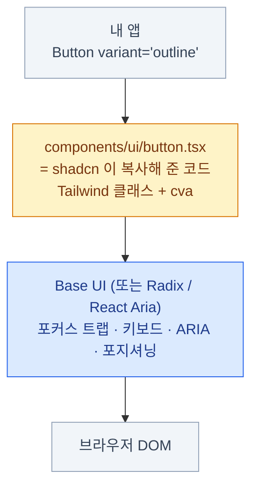

import { Tabs, TabItem, Card, CardGrid, LinkCard } from '@astrojs/starlight/components';
import BtnMatrix from '../../../components/BtnMatrix.astro';
import GalleryDemo from '../../../components/GalleryDemo.astro';

> "This is not a component library. It's how you build your component library."

공식 문서의 첫 문장이다. 마케팅 카피가 아니라 **기술적 사실의 서술**이다.

- `npm install shadcn-ui` 같은 건 없다. **설치할 패키지가 없다**
- CLI가 컴포넌트 **소스코드를 내 레포에 복사**해 넣는다

## 무슨 일이 일어나는지 직접 보기

```bash
pnpm dlx shadcn@latest add button
```

```text
✔ Checking registry.
✔ Installing dependencies.
✔ Created 1 file:
  - components/ui/button.tsx      ← 내 레포에 생긴 파일
```

- `node_modules`에는 프리미티브 패키지만 들어간다
- `components/ui/button.tsx`는 **내 코드**다. git에 커밋된다
- 마음대로 고쳐도 된다. 아무것도 깨지지 않는다

그렇게 복사돼 온 `button.tsx` 하나가 렌더하는 것 —
variant와 size 축이 독립적으로 조합된다. (해부는 [15장](/frontend/15-component-anatomy/))

<BtnMatrix />

### 전통적 라이브러리와의 비교

| | 전통적 라이브러리 | shadcn/ui |
|---|---|---|
| 설치 위치 | `node_modules` | **내 레포** |
| 수정 방법 | props, theme override, `!important` | **파일을 연다** |
| 버전 업 | `npm update` → 전부 바뀜 | 내가 원할 때 파일 단위로 |
| 스타일 커스터마이징 | 라이브러리가 허락한 범위 | **제한 없음** |
| 번들 크기 | 안 쓰는 것도 포함될 수 있음 | 쓰는 것만 |
| 초기 속도 | 빠름 | 빠름 |
| **장기 유지보수** | 라이브러리에 종속 | **내 책임** |

마지막 줄이 트레이드오프의 핵심이다. **자유를 얻고 책임을 진다.**

## "복붙이랑 뭐가 다른가?"

정당한 질문이다. 실제로 초기엔 복붙과 비슷했다. 지금은 다르다.

- **레지스트리** — 컴포넌트가 JSON 스키마로 정의된 배포 단위다
- **의존성 해결** — `add dialog`를 하면 필요한 `button`도 함께 들어온다
- **토큰 주입** — 컴포넌트가 필요로 하는 CSS 변수를 `globals.css`에 자동 추가
- **경로 매핑** — `components.json`의 alias에 따라 import 경로가 조정된다
- **자체 레지스트리** — 우리 팀 컴포넌트도 같은 방식으로 배포할 수 있다 (16장)

:::tip[핵심]
복붙은 **한 번** 일어나는 일이고, 레지스트리는 **지속되는 파이프라인**이다.
16장에서 이 파이프라인 위에 팀의 자산을 쌓는 방법을 다룬다.
:::

## 무엇 위에 서 있는가

shadcn/ui 컴포넌트는 스타일만 있는 게 아니다. **동작과 접근성은 프리미티브가 담당**한다.



**shadcn/ui가 소유권을 주는 건 위쪽 두 층뿐이다.**
프리미티브는 여전히 npm 패키지고, 그건 오히려 다행이다 —
포커스 트랩과 ARIA를 직접 유지보수하고 싶은 사람은 없다. (18장)

### 2026년 7월 — 기본 베이스가 Base UI로 바뀌었다

오래된 자료는 전부 **Radix UI**를 전제한다. 지금 `init`하면 **Base UI**가 기본이다.

- Radix는 **폐기된 게 아니다.** 계속 지원되고 새 컴포넌트도 양쪽으로 나온다
- `shadcn/create`로 만든 프로젝트에서 Base UI 선택이 Radix의 **2배**였던 것이 배경
- **React Aria**도 1급 베이스로 추가되어 현재 세 가지 중 선택할 수 있다

```bash
pnpm dlx shadcn@latest init            # Base UI (기본)
pnpm dlx shadcn@latest init -b radix   # Radix로 고정
```

### Radix → Base UI 주요 차이

| | Radix | Base UI |
|---|---|---|
| 합성 프롭 | `asChild` | **`render`** |
| 위치 계산 | `Content`가 직접 | **`Positioner`로 분리** |
| 패키지 | 통합 `radix-ui` | `@base-ui-components/react` |

<Tabs>
<TabItem label="Radix — asChild">

```tsx
<Tooltip.Trigger asChild>
  <button>도움말</button>
</Tooltip.Trigger>
```

내부적으로 Slot 컴포넌트가 props를 병합한다.
그래서 "왜 내 `onClick`이 안 먹지" 같은 디버깅이 어려웠다.

</TabItem>
<TabItem label="Base UI — render">

```tsx
<Tooltip.Trigger render={<button>도움말</button>} />
```

병합 지점이 눈에 보인다. 더 명시적이다.

</TabItem>
</Tabs>

## 어떤 컴포넌트들이 있나

<CardGrid>
<Card title="입력" icon="pencil">
Button, Input, Textarea, Select, Checkbox, Radio Group, Switch, Slider,
Toggle, Combobox, Date Picker, Input OTP, Form
</Card>
<Card title="표시" icon="document">
Card, Badge, Avatar, Table, Data Table, Separator, Skeleton, Progress, Chart, Typeset
</Card>
<Card title="오버레이" icon="open-book">
Dialog, Sheet, Drawer, Popover, Tooltip, Dropdown Menu, Context Menu,
Command, Alert Dialog, Hover Card
</Card>
<Card title="구조 · 피드백" icon="puzzle">
Tabs, Accordion, Collapsible, Sidebar, Navigation Menu, Breadcrumb,
Pagination, Resizable, Scroll Area, Carousel · Alert, Toast, Sonner
</Card>
</CardGrid>

70개가 넘는다. 그 밖에 **Blocks**(로그인 화면, 대시보드 등 완성된 조합)와
**Charts**(Recharts 래퍼)도 제공된다.

Tabs·Input·Button·Table·Avatar·Badge·Separator·Alert를 조합하면 이런 화면이 된다 —

<GalleryDemo />

## 트레이드오프를 정직하게

<CardGrid>
<Card title="얻는 것" icon="approve-check">
디자인 변경에 **제약이 없다**.
코드를 읽고 이해할 수 있다.
필요 없는 코드는 지운다.
라이브러리 업그레이드 지옥이 없다.
팀 컴포넌트로 자연스럽게 확장.
</Card>
<Card title="지는 책임" icon="warning">
**버그 수정이 자동으로 안 온다**.
접근성 개선도 자동이 아니다.
팀원이 제각각 고치면 일관성이 무너진다.
어떤 파일을 수정했는지 추적해야 한다.
신규 입사자에게 "우리 규칙"을 알려줘야 한다.
</Card>
</CardGrid>

:::caution[함정]
오른쪽은 "쓰다 보면 알아서 해결되는" 문제가 아니다.
**의도적으로 관리 구조를 만들어야** 한다 — 그게 [16장](/frontend/16-asset/)의 주제다.
관리하지 않으면 1년 뒤 `components/ui/`는 아무도 손대지 못하는 영역이 된다.
:::

## 언제 shadcn/ui가 답이 아닌가

- **완성된 복합 위젯이 당장 필요**하다 — 엑셀 같은 데이터 그리드, 간트 차트
- **디자인 커스터마이징을 할 일이 없다** — 사내 관리도구, 프로토타입
- **팀에 프론트엔드 인력이 거의 없다** — 소유권은 곧 유지보수 인력이다
- **Tailwind를 쓰지 않는다** — 이점의 절반이 사라진다

반대로 **디자이너가 있고 디자인이 계속 진화하는 제품**이라면 이 모델이 압도적으로 유리하다.

## 13장 요약

- shadcn/ui는 라이브러리가 아니라 **코드 배송 시스템**이다
- 컴포넌트 소스가 **내 레포에** 들어온다. `node_modules`가 아니다
- 복붙과 다른 점: **레지스트리 · 의존성 해결 · 토큰 주입 · 경로 매핑**
- 동작과 접근성은 **프리미티브**(Base UI / Radix / React Aria)가 담당한다
- **2026년 7월부터 기본 베이스는 Base UI.** `asChild` → `render`
- 자유를 얻는 대신 **버그 수정이 자동으로 오지 않는 책임**을 진다

<LinkCard
  title="14. 설치와 구조"
  description="components.json이 모든 것을 결정한다 — 되돌릴 수 없는 세 가지 선택."
  href="/frontend/14-shadcn-setup/"
/>
