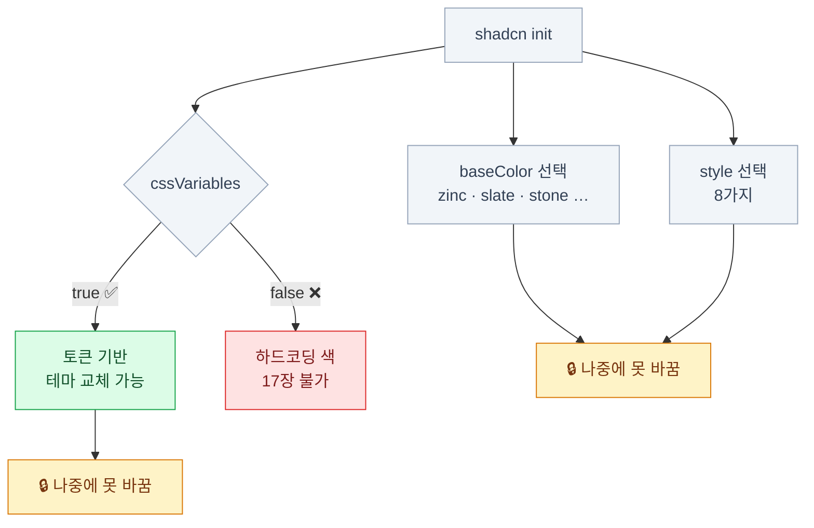

import { Steps, Tabs, TabItem, FileTree, LinkCard } from '@astrojs/starlight/components';
import ColorScale from '../../../components/demos/ColorScale.astro';

> `init`에서 고르는 것 중 셋은 나중에 못 바꾼다

:::tip[더 자세히 — shadcn/ui 덱]
설치와 `components.json`을 더 천천히 다룬 [**shadcn/ui 덱 3장**](/shadcn/03-setup/)이 있다.
:::

## 처음부터 끝까지

<Steps>

1. **Next.js 프로젝트**

   ```bash
   pnpm create next-app@latest my-app
   cd my-app
   ```

2. **shadcn/ui 초기화**

   ```bash
   pnpm dlx shadcn@latest init
   ```

3. **첫 컴포넌트**

   ```bash
   pnpm dlx shadcn@latest add button
   ```

4. **쓴다**

   ```tsx
   // app/page.tsx
   import { Button } from '@/components/ui/button'

   export default function Home() {
     return <Button>클릭</Button>
   }
   ```

</Steps>

전제 조건 두 가지: **Tailwind가 설치돼 있을 것**,
**`tsconfig.json`에 `@/*` alias가 있을 것.** `create-next-app`이 둘 다 해준다.

### `init`이 하는 일

1. **`components.json` 생성** — 이후 모든 CLI 동작의 기준이 된다
2. **`lib/utils.ts` 생성** — `cn()` 함수 (11장)
3. **`globals.css` 수정** — 토큰(`:root`, `.dark`)과 `@theme inline` 블록 추가
4. **의존성 설치** — `clsx`, `tailwind-merge`, `class-variance-authority`, 프리미티브
5. **아이콘 라이브러리 설치** — 기본은 lucide

**3번이 12장에서 본 그 토큰 블록이다.**
init 직후 `globals.css`를 열어보면 학습 효과가 크다.

## `components.json`

```json
{
  "$schema": "https://ui.shadcn.com/schema.json",
  "style": "new-york",
  "rsc": true,
  "tsx": true,
  "tailwind": {
    "config": "",
    "css": "app/globals.css",
    "baseColor": "zinc",
    "cssVariables": true,
    "prefix": ""
  },
  "aliases": {
    "components": "@/components",
    "ui": "@/components/ui",
    "utils": "@/lib/utils",
    "lib": "@/lib",
    "hooks": "@/hooks"
  },
  "registries": {}
}
```

| 필드 | 의미 | 나중에 바꿀 수 있나 |
|---|---|---|
| `style` | 컴포넌트의 시각적 성격 | **불가** |
| `rsc` | true면 필요한 파일에 `use client` 자동 추가 | 가능 |
| `tsx` | false면 `.jsx`로 생성 | 가능 |
| `tailwind.config` | v4에서는 **빈 문자열** | — |
| `tailwind.css` | 토큰을 주입할 CSS 파일 경로 | 가능 |
| `tailwind.baseColor` | 중립색 계열 | **불가** |
| `tailwind.cssVariables` | true면 의미 토큰, false면 유틸리티 직접 | **불가** |
| `tailwind.prefix` | 유틸리티 접두사 (`tw-` 등) | 가능 |
| `aliases.*` | 파일이 놓일 위치 | 가능 |
| `registries` | 외부 레지스트리 등록 | 가능 |

## 되돌릴 수 없는 세 가지

### `cssVariables`를 반드시 true로

이 선택이 이 덱 전체에서 가장 중요한 설정 하나다.

<Tabs>
<TabItem label="cssVariables: true (권장)">

```tsx
<div className="bg-background text-foreground">
```

- 다크 모드가 공짜 (12장)
- 테마 교체가 변수 몇 줄 (17장)
- 컴포넌트에 원시 색이 없다

</TabItem>
<TabItem label="cssVariables: false">

```tsx
<div className="bg-white text-zinc-950 dark:bg-zinc-950 dark:text-zinc-50">
```

- 모든 컴포넌트에 `dark:` 변형이 붙는다
- 테마 교체 = **전 파일 수정**
- **17장의 작업이 사실상 불가능해진다**

</TabItem>
</Tabs>

:::caution[함정]
그리고 이건 **나중에 못 바꾼다.**
이미 설치한 컴포넌트들이 전부 하드코딩된 색을 들고 있기 때문에,
바꾸려면 모든 파일을 다시 받아 수정 내역을 재적용해야 한다.
:::

### `baseColor` — 중립색 고르기

앱의 90%를 차지하는 회색 계열이다. 미묘하지만 인상 차이가 크다.

| 계열 | 성격 |
|---|---|
| `zinc` | 완전 중립. 가장 무난하다 |
| `slate` | 푸른 기. 차분하고 테크틱 |
| `stone` | 따뜻한 기. 부드러움 |
| `neutral` | 순수 무채색 |
| `mauve` / `olive` / `mist` / `taupe` | 미세한 색조가 섞인 중립색 |

<ColorScale name="zinc — 완전 중립 · 가장 무난" colors={['#fafafa','#f4f4f5','#e4e4e7','#d4d4d8','#a1a1aa','#71717a','#52525b','#3f3f46','#27272a','#18181b','#09090b']} />
<ColorScale name="slate — 푸른 기 · 차분하고 테크틱" colors={['#f8fafc','#f1f5f9','#e2e8f0','#cbd5e1','#94a3b8','#64748b','#475569','#334155','#1e293b','#0f172a','#020617']} />
<ColorScale name="stone — 따뜻한 기 · 부드러움" colors={['#fafaf9','#f5f5f4','#e7e5e4','#d6d3d1','#a8a29e','#78716c','#57534e','#44403c','#292524','#1c1917','#0c0a09']} />

브랜드 색이 따뜻하면 `stone`/`taupe`, 차가우면 `zinc`/`mist` 쪽이 어울린다.

### `style` — 여덟 가지 시각적 성격

예전에는 `default`와 `new-york` 둘뿐이었다. 지금은 여덟 가지다.

| 스타일 | 성격 |
|---|---|
| `vega` / `nova` | 예전 new-york 계열. 조밀하고 그림자 위주 |
| `maia` / `lyra` / `mira` | 코어 라인업 |
| `luma` | 2026년 3월 추가 |
| `rhea` | luma를 더 조밀하게. 밀도 높은 제품 화면용 |
| `sera` | 타이포 중심. 세리프 제목 + 각진 모서리 + 밑줄 컨트롤 |

`--style` 플래그나 `shadcn/create`에서 고른다.
**나중에 못 바꾸므로** 프로젝트 시작 전에 웹사이트에서 실물을 비교해 보는 게 좋다.



## CLI 다루기

| 명령 | 하는 일 |
|---|---|
| `init` / `create` | 프로젝트 설정 · 새 프로젝트 생성 |
| `add [name…]` | 컴포넌트 추가 |
| `view [name…]` | **설치 전에** 소스를 미리 본다 |
| `search` / `list` | 레지스트리에서 검색·목록 |
| `docs [name]` | 컴포넌트 문서·API 조회 |
| `info` | 현재 프로젝트 설정 확인 |
| `build` | `registry.json` → 배포용 JSON 생성 (16장) |
| `migrate` | 아이콘 교체, RTL, radix 통합 패키지 전환 |
| `apply` / `preset` | 프리셋(테마 등) 적용 (17장) |
| `eject` | shadcn 유틸을 인라인화하고 의존성 제거 (**되돌릴 수 없음**) |

### 알아두면 좋은 플래그

```bash
# 설치 전에 소스 확인
pnpm dlx shadcn@latest view button

# 무엇이 바뀔지만 보고 실행 안 함
pnpm dlx shadcn@latest add dialog --dry-run

# 내가 수정한 파일과 최신 버전의 차이
pnpm dlx shadcn@latest add button --diff

# 수정본을 덮어쓰기 (주의)
pnpm dlx shadcn@latest add button --overwrite

# 전부 설치
pnpm dlx shadcn@latest add --all

# 특정 경로에
pnpm dlx shadcn@latest add card --path components/shared
```

:::tip[핵심]
**`--diff`가 16장의 핵심 도구다.**
내가 고친 파일에 업스트림 수정(접근성 개선, 보안 패치)이 있었는지 확인하는 유일한 방법이다.
:::

### 의존성이 자동으로 따라온다

```bash
pnpm dlx shadcn@latest add dialog
```

```text
✔ Created 3 files:
  - components/ui/dialog.tsx
  - components/ui/button.tsx      ← dialog가 필요로 해서
  - hooks/use-media-query.ts      ← 함께
✔ Installed 1 package:
  - @base-ui-components/react
```

- `registryDependencies`가 다른 레지스트리 항목을 가리킨다
- `dependencies`는 npm 패키지를 가리킨다
- 이미 있는 파일은 **덮어쓰지 않는다** (`--overwrite` 없이는)

## 설치 후 파일 지도

<FileTree>

- components.json CLI의 기준. **git에 커밋한다**
- app/
  - globals.css 토큰. **여기가 디자인 시스템의 뿌리**
- lib/
  - utils.ts `cn()`
- components/
  - ui/ shadcn이 관리하는 영역
    - button.tsx
    - card.tsx
    - dialog.tsx

</FileTree>

**이 네 가지가 앞으로 계속 나온다.**
특히 `globals.css`와 `components/ui/`가 이 스택의 자산이 쌓이는 곳이다.

### 모노레포에서

```bash
pnpm dlx shadcn@latest init --monorepo
```

<FileTree>

- apps/
  - web/
    - components.json → `"ui": "@workspace/ui/components"`
  - admin/
    - components.json
- packages/
  - ui/
    - components.json **컴포넌트가 실제로 사는 곳**
    - src/components/
    - src/styles/globals.css **토큰도 여기**

</FileTree>

- 컴포넌트와 토큰은 **`packages/ui` 한 곳**에만 둔다
- 각 앱은 그걸 import만 한다
- `add`를 앱에서 실행해도 파일은 `packages/ui`에 생긴다

## 14장 요약

- `init`은 **components.json · lib/utils.ts · globals.css 토큰 · 의존성**을 만든다
- **`cssVariables: true`는 반드시 켠다.** 나중에 못 바꾸고, 테마 교체가 불가능해진다
- `style`과 `baseColor`도 **나중에 못 바꾼다** — 시작 전에 실물을 비교한다
- **기본 베이스는 Base UI**, `-b radix`로 Radix 선택 가능
- `view`(미리보기), `--dry-run`, **`--diff`**(수정 추적)를 기억한다
- 모노레포는 `packages/ui`에 컴포넌트와 토큰을 모은다

<LinkCard
  title="15. 컴포넌트 해부"
  description="button.tsx를 한 줄씩 — 소유한다는 것은 읽을 수 있다는 뜻이다."
  href="/frontend/15-component-anatomy/"
/>
