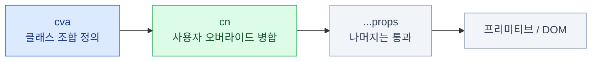

import { Tabs, TabItem, Card, CardGrid, LinkCard } from '@astrojs/starlight/components';
import ClassAnatomy from '../../../components/demos/ClassAnatomy.astro';
import BtnMatrix from '../../../components/demos/BtnMatrix.astro';
import InputStatesDemo from '../../../components/demos/InputStatesDemo.astro';

> "내 코드"라고 하는데 읽을 수 없으면 소유한 게 아니다

:::tip[더 자세히 — shadcn/ui 덱]
`cva`·`cn`·상태 클래스를 용어부터 풀어 설명한
[**shadcn/ui 덱 7장**](/shadcn/07-component/)이 있다.
:::

`button.tsx`는 60줄 남짓이다. 전부 이해할 수 있는 분량이고,
여기 쓰인 패턴이 **나머지 70개 컴포넌트에도 똑같이** 나온다.
한 번 읽어두면 어떤 컴포넌트든 열어서 고칠 수 있다.

## 전체 골격

```tsx
import * as React from 'react'
import { cva, type VariantProps } from 'class-variance-authority'
import { cn } from '@/lib/utils'

const buttonVariants = cva(base, { variants: { variant, size }, defaultVariants })

function Button({ className, variant, size, render, ...props }) {
  return <Component className={cn(buttonVariants({ variant, size, className }))} {...props} />
}

export { Button, buttonVariants }
```

세 줄짜리 구조다. 나머지는 클래스 문자열의 길이일 뿐이다.



`buttonVariants`를 **함께 export**하는 것이 중요하다. 이유는 뒤에서 본다.

## 베이스 클래스

```ts
const buttonVariants = cva(
  "inline-flex items-center justify-center gap-2 whitespace-nowrap " +
  "rounded-md text-sm font-medium transition-all shrink-0 outline-none " +
  "disabled:pointer-events-none disabled:opacity-50 " +
  "focus-visible:border-ring focus-visible:ring-ring/50 focus-visible:ring-[3px] " +
  "aria-invalid:ring-destructive/20 aria-invalid:border-destructive " +
  "[&_svg]:pointer-events-none [&_svg]:shrink-0",
  { /* … */ }
)
```

11장에서 본 그룹으로 읽으면 이렇게 나뉜다 —

<ClassAnatomy groups={[['레이아웃','inline-flex items-center justify-center gap-2 shrink-0'],['타이포','whitespace-nowrap text-sm font-medium'],['테두리','rounded-md outline-none'],['상태','disabled:pointer-events-none disabled:opacity-50 focus-visible:ring-[3px] aria-invalid:border-destructive'],['애니메이션','transition-all']]} />

**상태 그룹이 가장 두껍다** — 베이스 클래스의 본체는 사실 상태 처리다.

### 눈여겨볼 세 가지

**1. `focus-visible:` 이지 `focus:` 가 아니다**

마우스 클릭에는 링이 안 나오고 **키보드 탭 이동에만** 나온다.
접근성과 미관을 둘 다 잡는 표준 해법이다. (18장)

**2. `aria-invalid:` 변형**

`aria-invalid="true"`만 붙이면 테두리가 자동으로 destructive가 된다.
**스타일을 위해 별도 prop을 만들 필요가 없다.**

<InputStatesDemo />

:::tip[핵심]
**접근성 속성이 곧 스타일 훅이다.**
스크린리더가 읽는 속성과 시각적 표시가 **같은 소스에서 나오므로 둘이 어긋날 수 없다.**
`isError` 같은 prop을 따로 만들면 "빨갛게는 보이는데 스크린리더는 모르는" 상태가 생긴다.
:::

**3. `[&_svg]:pointer-events-none`**

자식 SVG에 적용되는 임의 셀렉터. 아이콘이 클릭을 가로채는 문제를 원천 차단한다.
아이콘 버튼에서 "가끔 클릭이 안 먹는" 버그의 정체가 대개 이것이다.

## variant 정의

```ts
variants: {
  variant: {
    default: 'bg-primary text-primary-foreground shadow-xs hover:bg-primary/90',
    destructive: 'bg-destructive text-white shadow-xs hover:bg-destructive/90',
    outline: 'border bg-background shadow-xs hover:bg-accent hover:text-accent-foreground',
    secondary: 'bg-secondary text-secondary-foreground hover:bg-secondary/80',
    ghost: 'hover:bg-accent hover:text-accent-foreground',
    link: 'text-primary underline-offset-4 hover:underline',
  },
  size: {
    default: 'h-9 px-4 py-2',
    xs: 'h-7 rounded-sm px-2 text-xs',
    sm: 'h-8 rounded-md px-3',
    lg: 'h-10 rounded-md px-6',
    icon: 'size-9',
    'icon-sm': 'size-8',
    'icon-lg': 'size-10',
  },
},
defaultVariants: { variant: 'default', size: 'default' },
```

이 정의가 렌더하는 전부 —

<BtnMatrix />

### 여기서 원시 색이 하나도 없다

`bg-primary`, `text-primary-foreground`, `border`, `bg-accent`…
**`bg-zinc-900`이 단 한 번도 안 나온다.**

그래서 17장에서 토큰만 갈아끼우면 전부 따라 바뀐다.
12장에서 세운 "컴포넌트 안에서는 원시 색을 쓰지 않는다"는 규칙이
**실제로 지켜진 결과물**이 이 파일이다.

증명 — 위와 **완전히 같은 variant 정의**에 토큰만 Material 3로 바꾸면:

<BtnMatrix theme="material" sizes={false} />

### `/90`은 무엇인가

```css
hover:bg-primary/90
```

- **투명도 수식어**다. `--primary` 색을 90% 불투명도로 쓴다
- `hover:bg-primary-600` 같은 **별도 토큰을 만들 필요가 없다**
- 어떤 테마를 넣어도 "조금 연해진 primary"가 자동으로 나온다

단점도 있다. 배경이 어두우면 투명도로 밝아지고, 밝으면 어두워진다.
정밀한 호버 색이 필요한 디자인 시스템에서는 `--primary-hover` 토큰을 따로 두기도 한다.

## 함수 본문

```tsx
function Button({
  className,
  variant,
  size,
  render,
  ...props
}: React.ComponentProps<'button'> &
   VariantProps<typeof buttonVariants> &
   { render?: React.ReactElement }) {
  return (
    <BaseButton
      data-slot="button"
      render={render}
      className={cn(buttonVariants({ variant, size, className }))}
      {...props}
    />
  )
}
```

- `React.ComponentProps<'button'>` — **`<button>`이 받는 모든 속성**을 그대로 받는다
- `VariantProps<typeof buttonVariants>` — cva에서 **타입을 자동 추출**한다
- `...props` 통과 — `onClick`, `type`, `aria-label`, `form` 전부 그냥 동작한다

### `forwardRef`가 사라졌다

<Tabs>
<TabItem label="React 18 시절">

```tsx
const Button = React.forwardRef<HTMLButtonElement, Props>(
  ({ className, ...props }, ref) => <button ref={ref} {...props} />
)
Button.displayName = 'Button'
```

</TabItem>
<TabItem label="React 19 — 지금">

```tsx
function Button({ className, ref, ...props }: Props) {
  return <button ref={ref} {...props} />
}
```

`ref`가 그냥 prop이다.

</TabItem>
</Tabs>

:::caution[함정]
오래된 shadcn 자료에는 `forwardRef`가 잔뜩 나온다.
지금 CLI가 주는 코드는 이 형태가 아니다.
**둘을 섞어 쓰면** 어떤 컴포넌트는 `ref`를 받고 어떤 건 안 받는 상태가 되어 혼란스러워진다.
:::

## 바깥에서 손대는 두 가지 훅

### `data-slot` — 수정하지 않고 예외 만들기

```tsx
<BaseButton data-slot="button" ... />
```

모든 shadcn 컴포넌트가 `data-slot` 속성을 갖는다.
부모에서 **자식의 특정 부분만** 겨냥할 수 있다.

```tsx
// 이 카드 안의 버튼만 전부 작게
<Card className="[&_[data-slot=button]]:h-8">
  <Button>저장</Button>
  <Button>취소</Button>
</Card>
```

남용하면 읽기 어려워지지만, **컴포넌트를 수정하지 않고 예외를 만드는** 탈출구로 유용하다.
16장의 "`ui/`는 되도록 손대지 않는다" 규칙을 지키는 데 도움이 된다.

### `buttonVariants` export — 버튼이 아닌 것을 버튼처럼

버튼처럼 보여야 하지만 **`<button>`이 아니어야 할 때**가 있다.

```tsx
import Link from 'next/link'
import { buttonVariants } from '@/components/ui/button'

// 링크를 버튼처럼
<Link href="/pricing" className={buttonVariants({ variant: 'outline' })}>
  요금제 보기
</Link>
```

`<Button render={<Link />}>`로 하는 것보다 이쪽이 권장된다.
클래스만 필요한 경우에 **컴포넌트 합성 오버헤드를 만들 이유가 없기** 때문이다.

## 합성 컴포넌트

단일 컴포넌트가 아니라 **여러 조각의 묶음**으로 제공되는 것들이 있다.

```tsx
<Card>
  <CardHeader>
    <CardTitle>월간 리포트</CardTitle>
    <CardDescription>2026년 7월</CardDescription>
    <CardAction><Button variant="ghost" size="icon">⋯</Button></CardAction>
  </CardHeader>
  <CardContent>
    <Chart data={data} />
  </CardContent>
  <CardFooter>
    <Button>내보내기</Button>
  </CardFooter>
</Card>
```

props로 `title`, `description`, `footer`를 받는 대신 **구조를 열어둔다.**

:::tip[핵심]
"제목 옆에 배지를 넣고 싶다" 같은 요구가 왔을 때 **컴포넌트를 안 고쳐도 된다.**

props 방식이었다면 `titleBadge` prop을 추가해야 하고,
다음엔 `titleBadgeVariant`가 필요해지고, 결국 props가 20개가 된다.
구조를 열어두면 그 요구를 **호출부가 흡수**한다.
:::

### `render` 프롭 — 태그를 바꾸기

```tsx
// Base UI 방식 — 렌더할 엘리먼트를 직접 넘긴다
<Tabs.Trigger render={<a href="/settings" />}>설정</Tabs.Trigger>

// Radix 방식 (구버전 자료) — 자식으로 넘긴다
<Tabs.Trigger asChild>
  <a href="/settings">설정</a>
</Tabs.Trigger>
```

- 용도: **동작은 그대로 두고 렌더되는 태그만 바꾸고 싶을 때**
- 예: 탭 트리거를 실제 링크로, 버튼을 `<label>`로
- `render`는 병합 지점이 명시적이라 디버깅이 쉽다

:::caution[함정]
`render`/`asChild`로 태그를 바꾸다 **의미를 잃는 사고**가 흔하다.
버튼을 `<div>`로 렌더하면 키보드로 접근할 수 없게 된다. (18장)
:::

## 15장 요약

- 구조는 세 줄이다: **cva 정의 → cn 병합 → props 통과**
- **원시 색이 한 번도 안 나온다.** 전부 의미 토큰이다 → 테마 교체가 가능한 이유
- `focus-visible:`, `aria-invalid:`, `[&_svg]:` — **접근성 속성이 스타일 훅**이다
- React 19에서 **`forwardRef`는 필요 없다**. `ref`가 그냥 prop
- `data-slot`으로 **컴포넌트를 수정하지 않고** 예외를 만들 수 있다
- `buttonVariants` export → **링크를 버튼처럼** 보이게 할 때
- 합성 컴포넌트는 **구조를 열어둬서** 변형 요구를 흡수한다

<LinkCard
  title="16. 컴포넌트 자산화"
  description="복사된 코드에서 팀의 자산으로 — 세 개의 층과 자체 레지스트리."
  href="/frontend/16-asset/"
/>
