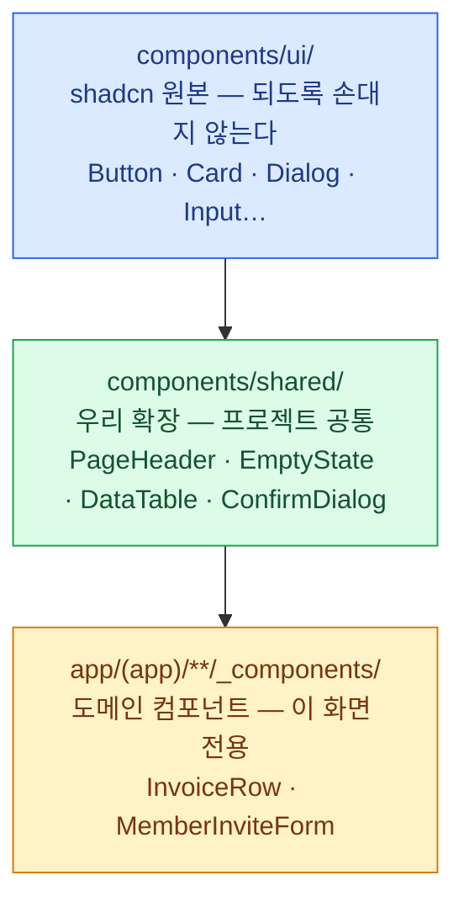
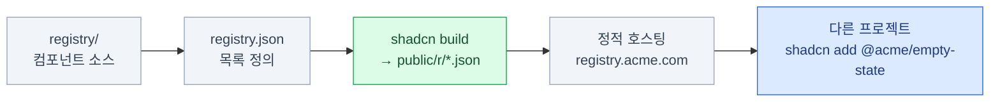

import { Steps, Tabs, TabItem, Card, CardGrid, FileTree, LinkCard } from '@astrojs/starlight/components';

> 파일이 늘어나는 것은 자산이 아니라 재고다

:::tip[더 자세히 — shadcn/ui 덱]
레지스트리와 `--diff` 운영을 따로 다룬
[**shadcn/ui 덱 11장**](/shadcn/11-registry/)이 있다.
:::

이 장은 **[4장(경계)](/frontend/04-boundary/)·[12장(토큰)](/frontend/12-tokens/)과 함께
이 덱의 중심**이다.

자산의 조건은 셋이다 —

1. **찾을 수 있다** — 있는 줄 몰라서 다시 만드는 일이 없다
2. **일관되다** — 같은 것은 같게 동작한다
3. **축적된다** — 새 프로젝트가 0에서 시작하지 않는다

shadcn/ui는 **가능성**을 줄 뿐이다. 위 세 가지는 팀이 만들어야 한다.

## 세 개의 층으로 나눈다



- **위층은 아래층을 모른다.** `ui/`는 도메인을 절대 모른다
- **아래층은 위층을 조합한다.** 새로 만들지 않는다
- 자산은 주로 **가운데 층에 쌓인다**

| 층 | 누가 만드나 | 도메인 지식 | 수정 빈도 |
|---|---|---|---|
| `ui/` | shadcn CLI | **없음** | 거의 없음 |
| `shared/` | 우리 팀 | **없음** | 가끔 |
| `_components/` | 기능 담당자 | **있음** | 자주 |

:::tip[핵심]
판별 질문은 하나다 — **"이 컴포넌트가 `Invoice`나 `Member`를 아는가?"**
안다면 도메인 층이다. `shared/`에 올리면 안 된다.

반대 방향의 실수도 흔하다 — 도메인 컴포넌트를 "재사용할 것 같아서" `shared/`에 올려두고
결국 아무도 안 쓰는 경우. **두 번째 사용처가 실제로 생겼을 때 올린다.**
:::

## `ui/`를 언제 고치는가

<CardGrid>
<Card title="고쳐도 되는 것" icon="approve-check">
우리 디자인 시스템에 맞는 **variant 추가**.
기본 size 값 조정.
우리 프로젝트 관례에 맞춘 prop 이름.
접근성 개선.
</Card>
<Card title="고치면 안 되는 것" icon="close">
도메인 로직 삽입.
특정 화면 전용 분기.
`useSession()` 같은 앱 훅 호출.
API 호출.
</Card>
</CardGrid>

```tsx
// ✅ variant 추가 — 정당한 수정
variant: {
  default: '...',
  outline: '...',
  brand: 'bg-brand text-brand-foreground hover:bg-brand/90',  // 우리 것
}
```

```tsx
// ❌ 도메인 침투 — ui/ 밖으로 빼야 한다
function Button({ requiresAdmin, ...props }) {
  const { user } = useSession()
  if (requiresAdmin && !user.isAdmin) return null
}
```

### 수정을 추적 가능하게 만들기

`ui/` 파일을 고치면 **업스트림 수정을 자동으로 못 받는다.** 이걸 관리하는 세 가지 방법.

<Steps>

1. **수정한 파일에 표시를 남긴다**

   ```tsx
   // components/ui/button.tsx
   // [MODIFIED] brand variant 추가 (2026-07-12, @sshim)
   // [MODIFIED] size에 xl 추가 (2026-08-01, @sshim)
   ```

2. **커밋을 분리한다**

   `shadcn add`로 받은 그대로를 먼저 커밋 → 수정을 별도 커밋으로.
   나중에 diff를 볼 때 **"원본이 무엇이었는지"가 git에 남는다.**

3. **정기적으로 `--diff`를 돌린다**

   ```bash
   pnpm dlx shadcn@latest add button --diff
   ```

   ```diff
   components/ui/button.tsx

   + // 업스트림에 추가된 부분
   + "aria-invalid:ring-destructive/20 aria-invalid:border-destructive"

     // 내가 추가한 부분 — 그대로 유지된다
     brand: "bg-brand text-brand-foreground hover:bg-brand/90",
   ```

</Steps>

- 자동 병합은 **하지 않는다.** 무엇이 달라졌는지만 알려준다
- 접근성 개선이나 보안 수정이 있었는지 확인하는 용도
- **분기마다 한 번씩** 돌려보는 것을 팀 루틴으로 만든다

2026년부터는 `pnpm dlx skills add shadcn/ui`로 설치하는 스킬을 통해
코딩 에이전트에게 마이그레이션을 맡기는 경로도 공식적으로 제공된다.
수정한 파일까지 감안해 컴포넌트 단위로 커밋과 리포트를 만들어 준다.

## 가운데 층에 무엇이 쌓이는가

실제 프로젝트에서 `shared/`에 자주 생기는 것들.

| 컴포넌트 | 하는 일 |
|---|---|
| **PageHeader** | 제목 + 설명 + 액션 버튼 |
| **EmptyState** | 아이콘 + 문구 + CTA |
| **DataTable** | 정렬·필터·페이지네이션 묶음 |
| **ConfirmDialog** | "정말 삭제할까요?" |
| **FormField** | label + input + error 세트 |
| **StatusBadge** | 상태값 → 배지 매핑 |
| **DateText** | 상대 시간 + 툴팁에 절대 시간 |
| **CopyButton** | 클릭하면 복사 + 체크 표시 |
| **Money** | 통화 포맷 통일 |
| **LoadingBoundary** | Suspense + ErrorBoundary 묶음 |

공통점은 **도메인을 모르지만 우리 팀의 결정이 담겨 있다**는 것이다.
"빈 상태는 이렇게 생겼다", "날짜는 이렇게 보여준다" 같은 것들.

```tsx
// components/shared/empty-state.tsx
export function EmptyState({
  icon, title, description, action,
}: {
  icon?: React.ReactNode
  title: string
  description?: string
  action?: React.ReactNode
}) {
  return (
    <div className="flex flex-col items-center justify-center gap-3
                    rounded-lg border border-dashed p-10 text-center">
      {icon}
      <h3 className="font-semibold">{title}</h3>
      {description && (
        <p className="text-sm text-muted-foreground">{description}</p>
      )}
      {action}
    </div>
  )
}
```

이걸 한 번 만들어 두면 앱의 **모든 빈 화면이 같은 모양**이 된다.

## 다음 프로젝트로 넘기기

여기까지가 한 프로젝트의 이야기다. 그런데 **다음 프로젝트**는?

- 복사해 온다 → 두 레포가 서서히 갈라진다
- 사내 npm 패키지로 만든다 → shadcn의 소유권 모델을 잃는다
- **자체 레지스트리를 만든다** → shadcn과 같은 방식으로 배포한다

세 번째가 이 스택이 제공하는 답이다.
**우리 컴포넌트도 `shadcn add`로 설치되게 만든다.**



**서버가 필요 없다.** 정적 JSON 파일을 서빙하면 끝이다 —
Vercel, S3, 사내 nginx, GitHub 레포까지 전부 가능하다.

### `registry.json`

```json
{
  "$schema": "https://ui.shadcn.com/schema/registry.json",
  "name": "acme",
  "homepage": "https://registry.acme.com",
  "items": [
    {
      "name": "empty-state",
      "type": "registry:component",
      "title": "Empty State",
      "description": "목록이 비었을 때 보여주는 표준 화면.",
      "registryDependencies": ["button"],
      "files": [
        { "path": "registry/empty-state.tsx", "type": "registry:component" }
      ]
    }
  ]
}
```

항목 하나의 전체 필드는 이렇게 생겼다.

```json
{
  "$schema": "https://ui.shadcn.com/schema/registry-item.json",
  "name": "brand-button",
  "type": "registry:ui",
  "title": "Brand Button",
  "description": "브랜드 variant가 추가된 버튼.",
  "author": "ACME Design Systems",
  "dependencies": ["class-variance-authority"],
  "registryDependencies": ["button", "@acme/tokens"],
  "files": [
    { "path": "registry/brand-button.tsx", "type": "registry:ui",
      "target": "@ui/brand-button.tsx" }
  ],
  "cssVars": {
    "theme": { "font-heading": "Pretendard, sans-serif" },
    "light": { "brand": "oklch(0.55 0.22 264)" },
    "dark":  { "brand": "oklch(0.70 0.18 264)" }
  },
  "css": { "@layer components": { ".brand-ring": { "outline-color": "var(--brand)" } } },
  "envVars": { "NEXT_PUBLIC_BRAND_MODE": "acme" },
  "docs": "설치 후 globals.css에 brand 토큰이 추가됩니다.",
  "categories": ["buttons", "brand"]
}
```

`cssVars`에 주목한다 — **컴포넌트가 필요로 하는 토큰이 함께 배송된다.**

### `type`의 종류

| type | 용도 |
|---|---|
| `registry:ui` | UI 컴포넌트·프리미티브 |
| `registry:component` | 단순 컴포넌트 |
| `registry:block` | 여러 파일로 된 복합 블록 |
| `registry:lib` | 유틸리티·라이브러리 |
| `registry:hook` | 커스텀 훅 |
| `registry:page` | 페이지 / 파일 기반 라우트 |
| `registry:file` | 기타 파일 (설정, 규칙 등) |
| `registry:theme` | **테마 (토큰만)** |
| `registry:style` | 레지스트리 스타일 |
| `registry:base` | **디자인 시스템 전체** |
| `registry:font` | 폰트 |

:::tip[핵심]
**`registry:theme`과 `registry:base`가 17장의 열쇠다.**
컴포넌트 없이 **토큰만** 배포할 수 있다는 뜻이다 —
새 프로젝트가 명령 한 줄로 사내 디자인 시스템을 입는다.
:::

### 빌드하고 호스팅하기

```bash
pnpm dlx shadcn@latest build --output ./public/r
```

<FileTree>

- public/
  - r/
    - empty-state.json
    - brand-button.json
    - acme-theme.json

</FileTree>

```json
// 소비하는 프로젝트의 components.json
{
  "registries": {
    "@acme": "https://registry.acme.com/r/{name}.json",
    "@acme-blocks": "https://registry.acme.com/blocks/{name}.json",
    "@v0": "https://v0.dev/chat/b/{name}"
  }
}
```

```bash
pnpm dlx shadcn@latest add @acme/empty-state
pnpm dlx shadcn@latest add @acme/brand-button @acme-blocks/dashboard
pnpm dlx shadcn@latest list @acme          # 우리 레지스트리 목록
pnpm dlx shadcn@latest search @acme -q "table"
```

`{name}` 자리에 컴포넌트 이름이 치환된다.
**여러 레지스트리를 동시에** 쓸 수 있고 이름이 충돌하지 않는다.

### 사내 레지스트리에 인증 붙이기

```json
{
  "registries": {
    "@acme": {
      "url": "https://registry.acme.internal/r/{name}.json",
      "headers": {
        "Authorization": "Bearer ${REGISTRY_TOKEN}"
      }
    }
  }
}
```

```bash
# .env.local
REGISTRY_TOKEN=xxxxx
```

- `${VAR}` 형태로 **환경변수가 확장**된다. 토큰을 레포에 커밋하지 않는다
- Bearer 토큰, API 키 헤더, Basic 인증, 쿼리 파라미터 모두 지원
- 사내 GitLab/Artifactory 뒤에 두고 사내망에서만 접근하게 할 수 있다

## 성숙도 단계

| 단계 | 상태 | 다음으로 가는 신호 |
|---|---|---|
| **0** | shadcn 컴포넌트를 그때그때 add | 같은 조합을 세 번째 복사할 때 |
| **1** | `shared/` 층이 생김 | 다른 프로젝트에서 "그거 가져다 쓰고 싶다" |
| **2** | 자체 레지스트리 구축 | 프로젝트가 3개를 넘어갈 때 |
| **3** | 토큰도 `registry:theme`으로 배포 | 브랜드가 여러 개가 될 때 |
| **4** | 문서·플레이그라운드·시각 회귀 테스트 | 디자인 시스템 전담 인원이 생길 때 |

:::caution[함정]
**대부분의 팀은 1단계에서 충분하다.**
2단계 이상은 실제로 여러 프로젝트가 있을 때만 이득이다.
성급하게 올라가면 관리 비용만 늘어난다 —
레지스트리를 만들어 놓고 소비자가 하나뿐이면 순수한 오버헤드다.
:::

## 자산화를 방해하는 것들

- **`ui/`를 각자 마음대로 고침** — 코드 리뷰에서 `ui/` 변경은 별도로 본다
- **`shared/`에 도메인이 섞임** — import에 `@/lib/api`가 들어오면 경고 신호
- **문서가 없음** — Storybook까지 안 가더라도 `/dev/components` 페이지 하나는 만든다 (20장)
- **네이밍이 제각각** — `ConfirmModal`, `ConfirmDialog`, `AreYouSureDialog`가 공존
- **탐색 불가** — 있는 줄 몰라서 다시 만든다

마지막이 가장 흔하고 가장 비싸다. 컴포넌트가 50개를 넘으면
**"찾을 수 있는가"가 "잘 만들었는가"보다 중요해진다.**

## 16장 요약

- 자산의 조건: **찾을 수 있고 · 일관되고 · 축적된다**
- **세 층**으로 나눈다 — `ui/`(원본) · `shared/`(우리 확장) · `_components/`(도메인)
- `ui/` 수정은 **variant 추가까지.** 도메인 로직이 들어가면 안 된다
- 수정은 **표시 · 커밋 분리 · 정기 `--diff`**로 추적 가능하게 만든다
- 다음 프로젝트로 넘기려면 **자체 레지스트리** — 정적 JSON이면 충분하다
- `registry:theme` / `registry:base`로 **토큰만도 배포**할 수 있다
- 성숙도는 단계적으로. **1단계에서 충분한 팀이 대부분이다**

<LinkCard
  title="17. 디자인 시스템 적용"
  description="이미 있는 시스템을 어떻게 얹는가 — 세 가지 시나리오와 매핑 절차."
  href="/frontend/17-design-system/"
/>
