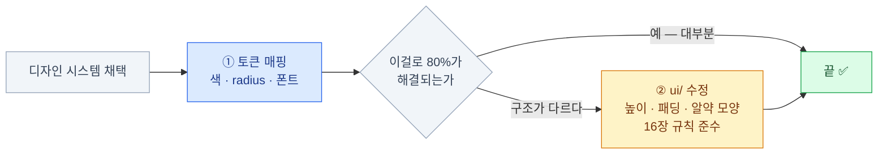

import { Steps, Tabs, TabItem, Card, CardGrid, LinkCard } from '@astrojs/starlight/components';
import ThemeSwitcher from '../../../components/demos/ThemeSwitcher.astro';

> 디자인 시스템 적용은 대부분 토큰 매핑이다

## 디자인 시스템의 네 구성요소

1. **토큰** — 색·타이포·간격·모션
2. **컴포넌트** — 그 토큰을 쓰는 UI 조각
3. **패턴** — "폼은 이렇게 배치한다" 같은 규칙
4. **문서** — 언제 무엇을 쓰는지

이 중 **코드로 옮겨야 하는 것은 1과 2**다.
그리고 **1을 제대로 하면 2는 거의 따라온다** —
15장에서 봤듯 shadcn 컴포넌트에는 원시 색이 하나도 없기 때문이다.

:::tip[핵심]
그래서 이 장의 작업량은 **대부분 토큰 매핑**이다.
컴포넌트 수정은 보통 20% 남짓이고, 그마저도 12장·16장의 규칙 안에서 이뤄진다.
:::

## 세 가지 시나리오

| 시나리오 | 상황 | 난이도 |
|---|---|---|
| **A. 브랜드 색만 입힌다** | 디자인 시스템은 없고 브랜드 컬러만 있다 | 30분 |
| **B. 유명 디자인 시스템 채택** | Material 3, Radix Colors 등을 따른다 | 반나절 |
| **C. 사내 디자인 시스템 매핑** | Figma에 정의된 사내 토큰이 있다 | 1~2주 |

셋 다 **같은 파일 하나**(`globals.css`)를 고치는 일이다. 차이는 매핑해야 할 토큰 개수뿐이다.

이 장이 하려는 일을 먼저 눈으로 —
아래 데모에서 테마를 바꿔도 **UI의 마크업은 한 줄도 바뀌지 않는다.** 바뀌는 것은 토큰 값뿐이다.

<ThemeSwitcher />

### A. 브랜드 색만 입히기

```css
/* app/globals.css */
:root {
  --primary: oklch(0.55 0.22 264);          /* 브랜드 컬러 */
  --primary-foreground: oklch(0.99 0 0);    /* 그 위의 글자 */
  --ring: oklch(0.55 0.22 264);             /* 포커스 링도 맞춘다 */
  --radius: 0.5rem;
}

.dark {
  --primary: oklch(0.70 0.18 264);          /* 다크에선 밝게 */
  --primary-foreground: oklch(0.20 0.02 264);
  --ring: oklch(0.70 0.18 264);
}
```

- **`--primary` · `--primary-foreground` · `--ring` 세 개**면 앱의 인상이 바뀐다
- 다크 모드에서는 **명도를 뒤집는다.** 같은 색을 그대로 쓰면 눈이 아프다
- `--radius`까지 만지면 성격이 확 달라진다

## B. 유명 디자인 시스템 채택

### Material Design 3

Material 3의 색 역할과 shadcn 토큰을 매핑한다.

| Material 3 | shadcn/ui | 비고 |
|---|---|---|
| `primary` | `--primary` | 그대로 |
| `onPrimary` | `--primary-foreground` | `on*`이 곧 `*-foreground` |
| `surface` | `--background` | |
| `onSurface` | `--foreground` | |
| `surfaceContainer` | `--card` | 고도 단계가 여럿이라 하나를 고른다 |
| `secondaryContainer` | `--secondary` | |
| `onSecondaryContainer` | `--secondary-foreground` | |
| `outline` | `--border` | |
| `outlineVariant` | `--input` | |
| `error` | `--destructive` | |

Material의 `on*` 접두사와 shadcn의 `*-foreground` 접미사는 **같은 개념**이다 —
"이 표면 위에 올라가는 것". 이 대응만 알면 절반은 끝난다.

```css
:root {
  --background: oklch(0.98 0.01 320);   /* surface */
  --foreground: oklch(0.22 0.01 300);   /* onSurface */
  --primary: oklch(0.47 0.10 295);      /* #6750A4 */
  --primary-foreground: oklch(1 0 0);   /* onPrimary */
  --secondary: oklch(0.90 0.04 305);    /* secondaryContainer */
  --border: oklch(0.82 0.02 300);       /* outline */
  --radius: 1.25rem;                    /* Material은 라운드가 크다 */
}
```

### 토큰만으로 안 되는 것

Material 3에는 **shadcn 기본 컴포넌트에 없는 구조적 특징**이 있다.

- **버튼이 알약 모양** — `--radius`로는 안 된다. `rounded-full`이 필요하다
- **elevation(고도)** — 테두리 대신 그림자 단계로 표면을 구분한다
- **state layer** — 호버 시 반투명 오버레이가 덮이는 방식
- **ripple** — 클릭 위치에서 퍼지는 애니메이션

이럴 때 **16장의 "variant 추가"가 정당한 수정**이 된다.
`ui/button.tsx`의 베이스 클래스를 `rounded-full`로 바꾸는 것이다.



### Radix Colors

색 팔레트만 제공하는 시스템이다. **12단계 스케일에 의미가 정해져 있다.**

| 단계 | 용도 |
|---|---|
| 1–2 | 앱 배경, 미묘한 배경 |
| 3–5 | 컴포넌트 배경 (기본 / 호버 / 눌림) |
| 6–8 | 테두리 (미묘 / 기본 / 강조) |
| 9–10 | 채도 높은 솔리드 배경 (기본 / 호버) |
| 11 | 저대비 텍스트 |
| 12 | 고대비 텍스트 |

```css
:root {
  --background: var(--gray-1);
  --card: var(--gray-2);
  --muted: var(--gray-3);
  --border: var(--gray-6);
  --primary: var(--indigo-9);        /* 9단계 = 솔리드 배경 */
  --muted-foreground: var(--gray-11);
  --foreground: var(--gray-12);
}
```

- **단계마다 용도가 명시**되어 있어 "이 회색은 몇 번?"을 고민하지 않는다
- 라이트/다크가 **같은 번호로 짝**을 이룬다. `gray-9`는 양쪽에서 같은 역할
- **대비가 보장**되어 있다 — 11번은 항상 저대비 텍스트로 쓸 수 있는 명도다
- 투명 버전(`grayA`)이 함께 제공되어 겹칠 때 자연스럽다

9번이 **브랜드 색으로 쓰라고 만든 단계**다.

## C. 사내 디자인 시스템 매핑

가장 흔하고 가장 까다로운 시나리오다. 절차를 단계로 나눈다.

<Steps>

1. **인벤토리** — 사내 DS의 토큰 목록을 뽑는다

   Figma Variables를 CSV로 내보내면 빠르다.

2. **매핑 표 작성** — 사내 토큰 → shadcn 토큰

   **1:1이 안 되는 것들을 표시**한다. 아래에 예시가 있다.

3. **갭 분석** — 사내에만 있는 것 / shadcn에만 있는 것을 나눈다

4. **토큰 파일 작성** — `globals.css`에 light / dark / `@theme inline` 세 블록

5. **컴포넌트 차이 반영** — 구조가 다른 것만 `ui/`에서 수정 (16장 규칙 준수)

6. **검증** — 대비비, 다크 모드, 포커스 링을 전수 확인

</Steps>

### 2단계 — 매핑 표는 이렇게 생겼다

| 사내 토큰 | shadcn 토큰 | 상태 | 메모 |
|---|---|---|---|
| `color.brand.primary` | `--primary` | ✅ 1:1 | |
| `color.brand.onPrimary` | `--primary-foreground` | ✅ 1:1 | |
| `color.surface.default` | `--background` | ✅ 1:1 | |
| `color.surface.raised` | `--card` | ✅ 1:1 | |
| `color.surface.sunken` | — | ⚠️ 없음 | 토큰 추가 필요 |
| `color.text.tertiary` | — | ⚠️ 없음 | `muted-foreground`로 통합? |
| — | `--accent` | ⚠️ 미정 | 호버 배경. `surface.hover`로? |
| `color.status.warning` | — | ⚠️ 없음 | 12장 방식으로 추가 |
| `radius.card` = 12px | `--radius` | ⚠️ 충돌 | 버튼은 6px인데 카드는 12px |

:::tip[핵심]
**⚠️ 행들이 실제 작업량이다.** ✅ 행은 값만 옮기면 끝난다.
이 표를 **디자이너와 함께 채우는 것**이 이 작업에서 가장 중요한 회의다 —
⚠️ 행의 결정은 개발자가 혼자 내릴 수 없다.
:::

### 3단계 — 갭을 처리하는 세 가지 방법

<Tabs>
<TabItem label="갭 1 — 사내에만 있는 토큰">

`surface.sunken`, `status.warning` 같은 것들.

**토큰을 추가한다.** 12장의 세 곳 수정(light / dark / `@theme inline`)을 그대로 한다.

</TabItem>
<TabItem label="갭 2 — shadcn에만 있는 토큰">

`--accent`, `--popover` 같은 것들.

**적당한 값을 할당한다.** 비워두면 컴포넌트가 깨진다.
디자이너에게 "호버 배경색이 정의돼 있나요?"를 물어 결정한다.

</TabItem>
<TabItem label="갭 3 — 1:N 대응">

`radius`가 컴포넌트마다 다른 경우.

**파생 스케일을 쓰거나** 컴포넌트별로 오버라이드한다.

```css
:root { --radius: 0.375rem; }              /* 버튼 기준 */
@theme inline {
  --radius-lg: 0.75rem;                    /* 카드는 별도로 */
}
```

</TabItem>
</Tabs>

### 4단계 — 최종 파일 형태

```css
@import "tailwindcss";
@custom-variant dark (&:where(.dark, .dark *));

/* ① 값 — 사내 DS에서 옮겨온 것 */
:root {
  --background: oklch(1 0 0);
  --foreground: oklch(0.21 0.01 250);
  --primary: oklch(0.52 0.16 254);
  --primary-foreground: oklch(0.99 0 0);
  --warning: oklch(0.84 0.16 84);            /* 사내 전용 추가 */
  --warning-foreground: oklch(0.28 0.07 46);
  --radius: 0.375rem;
}

.dark { /* ② 같은 이름, 다크 값 */ }

/* ③ 유틸리티 생성 */
@theme inline {
  --color-background: var(--background);
  --color-primary: var(--primary);
  --color-warning: var(--warning);
  --radius-lg: calc(var(--radius) * 2);
}
```

### 5단계 — 컴포넌트 차이는 최소로

**먼저 토큰만으로 얼마나 가는지** 확인한다. 대부분 80%는 토큰으로 해결된다.
남는 20%만 `ui/` 수정 대상이고, 수정할 때는 **16장의 규칙**을 지킨다 —
표시 남기기, 커밋 분리.

| 요구 | 수정 위치 |
|---|---|
| 버튼 높이가 다르다 | `button.tsx`의 `size` variant |
| 그림자 대신 테두리 | `card.tsx` 베이스 클래스 |
| 포커스 링 두께·색 | `button.tsx` 등의 `focus-visible:` |
| 입력 필드 라벨 위치 | `label.tsx` + 폼 패턴 |

### 6단계 — 검증

<CardGrid>
<Card title="대비비 (WCAG AA)" icon="approve-check">
본문 텍스트 **4.5:1**, 큰 텍스트·UI 요소 **3:1** 이상.
`*-foreground` 짝을 전부 확인한다.
</Card>
<Card title="다크 모드 전수 확인" icon="moon">
`.dark`에서 값을 빠뜨린 토큰이 있으면
라이트 값이 그대로 남아 **대비가 깨진다.**
</Card>
<Card title="포커스 링" icon="warning">
`--ring`이 배경과 충분히 대비되는가?
primary와 같은 색으로 뒀다면
**primary 버튼 위에서 안 보인다.**
</Card>
<Card title="다섯 화면 스냅샷" icon="document">
로그인·목록·폼·빈 상태·에러 —
라이트/다크로 캡처해 나란히 본다.
</Card>
</CardGrid>

나란히 놓고 보면 **다크에서만 깨지는 것**이 바로 눈에 띈다.
배지 대비, 테이블 구분선, 흐린 텍스트가 단골이다.

## 도구와 배포

### 도구들

- **tweakcn** — shadcn 토큰을 시각적으로 편집하고 CSS를 뽑아준다. 시작점으로 좋다
- **shadcn 프리셋** — `shadcn apply <code>`로 테마 프리셋을 적용한다
- **Radix Colors** — 팔레트가 필요하면 가장 안전한 선택
- **oklch.com** — 색 변환·비교
- **Style Dictionary** — Figma 토큰 → 여러 플랫폼 포맷 자동 생성

```bash
pnpm dlx shadcn@latest apply a2r6bw --only theme
```

### 테마를 레지스트리로 배포하기

브랜드가 여러 개거나 프로젝트가 여러 개면 **테마 자체를 배포**한다. (16장)

```json
{
  "name": "acme-theme",
  "type": "registry:theme",
  "title": "ACME Design System",
  "cssVars": {
    "light": {
      "primary": "oklch(0.52 0.16 254)",
      "primary-foreground": "oklch(0.99 0 0)",
      "warning": "oklch(0.84 0.16 84)"
    },
    "dark": {
      "primary": "oklch(0.70 0.14 254)",
      "warning": "oklch(0.41 0.11 46)"
    }
  }
}
```

```bash
pnpm dlx shadcn@latest add @acme/acme-theme
```

새 프로젝트가 **명령 한 줄로 사내 디자인 시스템을 입는다.**

### 멀티 브랜드 — 한 앱에서 여러 테마

```css
[data-brand="acme"] {
  --primary: oklch(0.52 0.16 254);
}
[data-brand="globex"] {
  --primary: oklch(0.62 0.19 35);
}
```

```tsx
// 테넌트에 따라 최상위에 붙인다
<html data-brand={tenant.brand}>

// 또는 DB에서 받은 값을 인라인 스타일로 주입
<html style={themeVars}>   {/* { '--primary': tenant.color } */}
```

- 컴포넌트는 여전히 `bg-primary`만 쓴다
- **런타임에 결정**되므로 빌드를 나눌 필요가 없다

9장에서 "Tailwind가 안 맞는 경우"로 꼽았던
"**디자인 토큰이 런타임에 서버에서 내려온다**"가 이렇게 해결된다.

## 안티패턴

- **컴포넌트마다 색을 하드코딩** — 토큰 층을 건너뛰면 이 장의 모든 것이 무의미해진다
- **`!important`로 덮어쓰기** — 토큰을 안 고치고 스타일로 이기려는 시도
- **디자인 시스템을 100% 재현하려다 멈춤** — 80%에서 출시하고 나머지를 채운다
- **다크 모드를 나중으로 미룸** — 나중에 하면 토큰 구조를 다시 짜야 한다
- **`cssVariables: false`로 시작** — 14장에서 경고한 그것. 되돌리기가 매우 어렵다
- **디자이너 없이 매핑** — ⚠️ 행의 결정은 개발자가 혼자 내릴 수 없다

## 17장 요약

- 디자인 시스템 적용 = **대부분 토큰 매핑**이다. 컴포넌트 수정은 20% 남짓
- Material의 `on*`과 shadcn의 `*-foreground`는 **같은 개념**
- Radix Colors는 **단계마다 용도가 정해져 있어** 매핑이 쉽다
- 사내 DS는 **인벤토리 → 매핑 표 → 갭 분석 → 토큰 → 컴포넌트 → 검증** 순서
- **⚠️ 표시된 갭이 실제 작업량**이다. 디자이너와 함께 채운다
- 검증은 **대비비 · 다크 모드 · 포커스 링 · 다섯 화면 스냅샷**
- 여러 프로젝트라면 `registry:theme`으로 **테마를 배포**한다

<LinkCard
  title="18. 접근성"
  description="프리미티브가 대신 해주는 것들 — 목표는 그것을 실수로 깨뜨리지 않는 것."
  href="/frontend/18-a11y/"
/>
