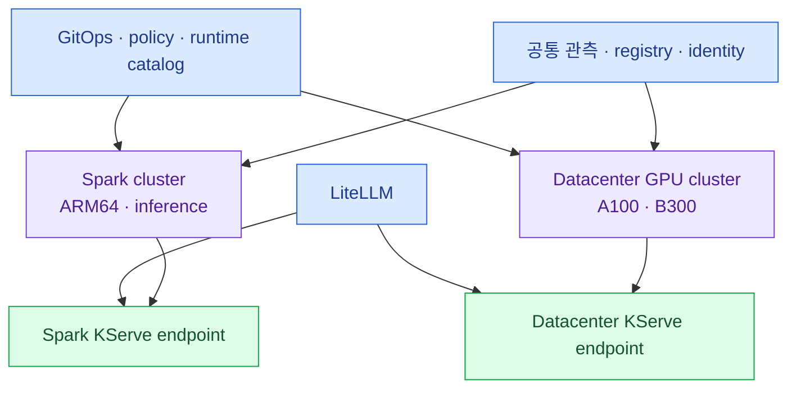

import { LinkCard } from '@astrojs/starlight/components';
import TermIntro from '../../../components/docs/TermIntro.astro';

> `nvidia.com/gpu: 1`은 같은 숫자일 뿐 **같은 성능·메모리·실행 환경이라는 뜻이 아니다**

<TermIntro
  terms={[
    ['resource island', '자원 섬', 'architecture·GPU family·interconnect가 같아 한 workload를 예측 가능하게 배치할 수 있는 자원 묶음이다.'],
    ['topology', '배치 구조', 'GPU가 CPU·다른 GPU·NIC과 어떻게 연결됐는지 나타내는 관계다.'],
    ['NVSwitch', '', '한 서버 안의 여러 GPU를 높은 대역폭으로 연결하는 switch fabric이다.'],
    ['node pool', '노드 풀', '같은 label·taint·driver·운영 정책을 공유하는 Kubernetes node 묶음이다.'],
  ]}
/>

## 세 장비는 서로 다른 문제를 푼다

| 항목 | DGX Spark | A100 8-GPU 서버 | B300 서버 |
|---|---|---|---|
| CPU architecture | ARM64 | 보통 x86_64 | DGX 기준 x86_64 |
| 기본 성격 | 개인형·소형 inference cell | datacenter multi-GPU | 최신 datacenter multi-GPU |
| GPU 배치 | 한 장 전체 | full GPU·MIG·여러 GPU | full GPU·full-node부터 검증 |
| node 내부 연결 | 단일 GPU | NVSwitch 구성 가능 | DGX는 NVSwitch |
| 기본 workload | LLM·embedding serving | 개발·학습·batch·serving | 대형 학습·대형 serving |
| 가장 큰 함정 | ARM64 image·unified memory | MIG와 full GPU 혼용 | 새 driver·CUDA·runtime 성숙도 |

B300의 정확한 GPU 수·NIC·OS는 발주한 시스템 사양으로 다시 고정한다. 이 덱은 `B300 두 대`를
곧바로 하나의 16-GPU cluster라고 가정하지 않는다.

## label은 성능 계약이다

제품 label과 운영 label을 분리한다.

```yaml
# 하드웨어 사실 — 자동 발견 label과 함께 사용
accelerator.platform: dgx-spark
accelerator.arch: arm64
accelerator.gpu-family: gb10

# 운영자가 정한 계약
accelerator.pool: inference
accelerator.partition: full
accelerator.network: ethernet
```

A100·B300도 같은 key에 다른 값을 준다.

| label | Spark | A100 | B300 |
|---|---|---|---|
| `accelerator.arch` | `arm64` | `amd64` | `amd64` |
| `accelerator.gpu-family` | `gb10` | `a100` | `b300` |
| `accelerator.partition` | `full` | `full` 또는 `mig-*` | 검증 후 `full`·지원 profile |
| `accelerator.network` | `ethernet`·`rdma` | `nvlink-rdma` 등 | 실제 fabric 값 |
| `accelerator.pool` | `inference` | `shared`·`training` | `training`·`large-serving` |

runtime catalog와 Kueue `ResourceFlavor`는 이 label을 가리킨다. 사용자가 임의 node 이름을 고르게 하지 않는다.

## taint로 기본 거부한다

GPU node에는 일반 workload가 오지 못하게 한다.

```bash
kubectl taint node spark-01 dedicated=gpu-spark:NoSchedule
kubectl taint node a100-01 dedicated=gpu-a100:NoSchedule
kubectl taint node b300-01 dedicated=gpu-b300:NoSchedule
```

KServe runtime·학습 template가 맞는 toleration을 가진다. 이 장치는 CPU 앱이 실수로 B300의 CPU와
메모리를 차지하거나 ARM64에 amd64 image를 배치하는 사고를 줄인다.

## 하나의 운영 모델, 두 실행 cluster



권장 기본안은 Spark와 datacenter GPU를 별도 실행 cluster로 두는 것이다. KServe controller는 각
cluster 안에서 reconcile하고, Argo CD가 같은 base와 cluster별 overlay를 배포한다. LiteLLM은 두 endpoint를
하나의 공개 model catalog로 합친다.

한 cluster로 시작해야 한다면 적어도 node pool·driver policy·runtime catalog·Kueue flavor를 분리하고,
B300 upgrade가 Spark serving까지 drain하지 않는지 확인한다.

## 배치 단위를 먼저 고정한다

| workload | 기본 배치 단위 | 이유 |
|---|---|---|
| Spark LLM | node 1대 | 단일 GPU와 unified memory가 하나의 장애 단위 |
| Spark 대형 LLM | 고정 pair | 용량 확장이지 HA가 아님 |
| A100 소형 serving | full GPU 또는 고정 MIG profile | isolation 수준을 명시 |
| A100 학습 | 1·2·4·8 GPU preset | NVSwitch topology를 예측 가능하게 유지 |
| B300 대형 학습 | full GPU·full-node 우선 | 초기에는 변수를 줄이고 성능 기준선을 만듦 |

## 참고 자료

- [GPU Operator 지원 플랫폼](https://docs.nvidia.com/datacenter/cloud-native/gpu-operator/latest/platform-support.html) — Spark·A100·B300 지원 범위.
- [DGX B300 User Guide](https://docs.nvidia.com/dgx/dgxb300-user-guide/) — 실제 DGX B300 hardware·network 사양.
- [Kueue ResourceFlavor](https://kueue.sigs.k8s.io/docs/concepts/resource_flavor/) — node label을 quota 가능한 자원 종류로 표현하는 객체.

<LinkCard
  title="2. GPU가 Pod 자원이 되기까지"
  description="driver부터 device plugin·MIG·DCGM까지 GPU Operator가 채우는 층과 node contract를 만든다."
  href="/gpu-platform/02-gpu-foundation/"
/>
