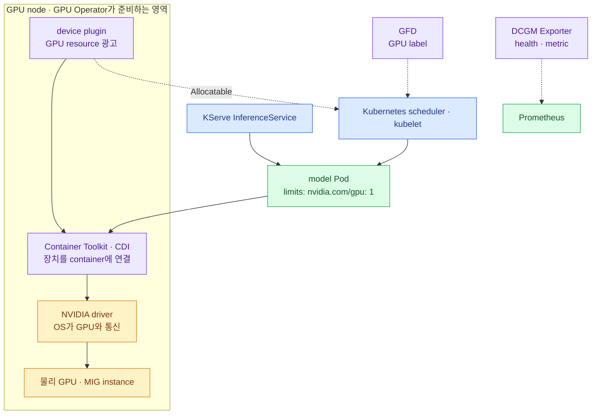
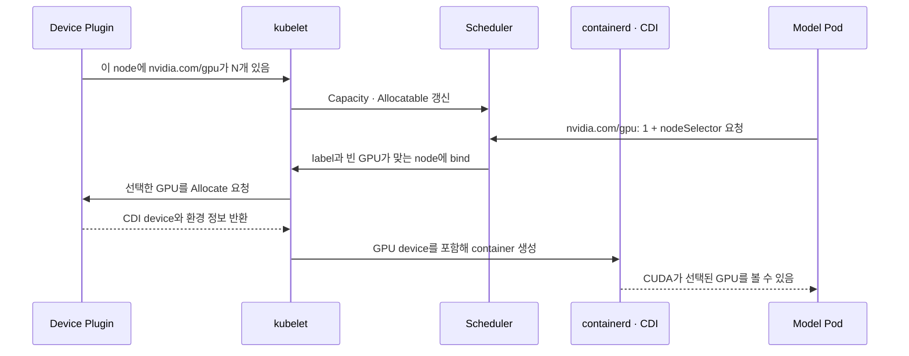

import { Card, CardGrid, Steps, LinkCard } from '@astrojs/starlight/components';
import TermIntro from '../../../components/docs/TermIntro.astro';
import SourceFigure from '../../../components/docs/SourceFigure.astro';

> GPU Operator는 GPU를 나눠 주는 scheduler가 아니라 **GPU node의 software stack을 맞추는 자동화**다

<TermIntro
  terms={[
    ['operand', '피연산 구성요소', 'Operator가 설치하고 상태를 관리하는 driver·toolkit·device plugin 같은 실제 component다.'],
    ['device plugin', '', 'kubelet에 GPU 개수와 health를 알리고 선택된 장치를 Pod에 전달하는 vendor plugin이다.'],
    ['CDI', 'Container Device Interface', 'container runtime이 GPU 같은 복합 장치를 container에 주입하는 표준 명세다.'],
    ['GFD', 'GPU Feature Discovery', 'GPU 제품·memory·MIG capability 같은 정보를 node label로 만드는 component다.'],
    ['MIG', 'Multi-Instance GPU', '한 물리 GPU를 memory와 연산 자원이 격리된 여러 GPU instance로 나누는 기능이다.'],
  ]}
/>

## 전체에서 GPU Operator의 자리



위에서 `InferenceService`가 GPU 한 장을 요구해도 아래 사슬이 준비되지 않으면 Pod는 실행되지 않는다.
GPU Operator는 이 사슬을 node마다 같은 정책으로 설치·검증·업그레이드한다.

<SourceFigure
  src="/images/gpu-platform/nvidia-gpu-operator-components.jpg"
  alt="Linux와 container engine, Kubernetes가 놓인 기반 위에 GPU Operator가 GPU software stack을 관리하는 계층 구조"
  width={1260}
  height={709}
  caption="NVIDIA 공식 그림은 GPU Operator가 Kubernetes 아래를 대체하는 제품이 아니라, 기존 Linux·container engine·Kubernetes 위에서 GPU software stack을 자동화하는 층임을 보여 준다."
  sourceHref="https://docs.nvidia.com/datacenter/cloud-native/gpu-operator/latest/"
  sourceLabel="NVIDIA 공식 문서 — GPU Operator"
/>

## Operator와 실제 component를 구분한다

`gpu-operator` controller Pod 하나가 모든 일을 직접 처리하는 것은 아니다. `ClusterPolicy` 같은 원하는
상태를 읽고, 각 node에 필요한 DaemonSet·Deployment를 만든다.

| component | 어디에서 무엇을 하나 | 없거나 깨지면 보이는 증상 |
|---|---|---|
| NVIDIA driver | host kernel과 GPU 사이 | host `nvidia-smi` 실패, CUDA 초기화 실패 |
| Container Toolkit·CDI | containerd가 GPU device·library를 container에 연결 | Pod는 떠도 GPU가 안 보이거나 runtime 생성 실패 |
| NVIDIA device plugin | GPU를 kubelet의 extended resource로 광고 | `nvidia.com/gpu`가 `Allocatable`에 없음 |
| Node Feature Discovery | CPU architecture·PCI 같은 일반 hardware label 생성 | node 선택 정책의 기반 label 누락 |
| GPU Feature Discovery | GPU 제품·capability·MIG label 생성 | A100·B300·MIG placement 구분 불가 |
| MIG Manager | node의 MIG geometry를 원하는 profile로 맞춤 | MIG resource 이름·개수가 기대와 다름 |
| DCGM Exporter | GPU health·memory·activity metric 노출 | Prometheus에서 GPU 상태를 볼 수 없음 |
| validator | driver·toolkit·device plugin 경로를 시험 | 설치는 Running인데 실제 CUDA가 안 되는 상태를 놓침 |

:::tip[핵심 구분]
GFD의 label은 **이 node가 어떤 GPU인지** 알려 주고, device plugin의 resource는 **Pod가 GPU를 몇 개 요청하고
할당받게** 한다. label만 있어도 GPU를 받을 수 없고, resource만 있어도 A100과 B300을 안전하게 고르기 어렵다.
:::

## Pod가 GPU를 받는 순간



여기서 GPU Operator는 scheduler를 대신하지 않는다. scheduler는 device plugin이 광고한 **개수**와 node
label·taint를 보고 node를 고른다. model의 실제 memory 요구나 tensor parallel 효율은 이해하지 못한다.

## 설치 전에 ownership부터 정한다

DGX 계열은 host image에 driver와 toolkit이 이미 있을 수 있다. 무조건 Operator가 다시 설치하면 kernel·
driver·CRI 설정의 주인이 둘이 된다.

<CardGrid>
<Card title="Host가 driver 소유" icon="server">
`driver.enabled=false`를 사용한다.

DGX OS update와 Kubernetes drain·reboot 순서를 함께 운영한다.
</Card>
<Card title="Operator가 driver 소유" icon="setting">
driver container 또는 `NVIDIADriver` CR을 사용한다.

node pool별 kernel·driver 지원과 upgrade policy를 고정한다.
</Card>
<Card title="Toolkit도 별도 결정" icon="puzzle">
Docker에서 GPU가 보이는 것과 Kubernetes의 containerd·CDI가 준비된 것은 다르다.

CRI 경로를 실제 Pod로 확인한 뒤에만 `toolkit.enabled=false`로 둔다.
</Card>
</CardGrid>

Spark·A100·B300의 driver 주인이 다르면 한 `ClusterPolicy` 값으로 억지로 통일하지 않는다. node selector가
있는 `NVIDIADriver` CR을 쓰거나 실행 cluster를 분리해 한 세대의 upgrade가 다른 세대를 재부팅하지 않게 한다.

## MIG는 설치 기능이 아니라 자원 상품 설계다

A100의 MIG를 켜면 device plugin이 `nvidia.com/gpu` 대신 strategy에 따른 MIG extended resource를 광고한다.
중요한 결정은 “MIG 기능을 켰는가”가 아니라 **사용자에게 어떤 고정 크기의 GPU 상품을 약속하는가**다.

```text
a100-full     → 큰 LLM, 전체 GPU memory와 fault domain
a100-mig-1g   → 작은 embedding·reranker, 고정된 작은 instance
a100-mig-3g   → 중형 model, 더 큰 memory profile
```

MIG geometry를 바꾸면 실행 중 workload와 GPU reset 조건이 얽힌다. 초기에는 node별 geometry를 고정하고
변경을 maintenance로 취급한다. time-slicing은 memory·fault isolation이 없으므로 MIG와 같은 상품으로
설명하지 않는다.

## node contract를 일곱 단계로 검증한다

<Steps>

1. **host** — firmware·OS·kernel·driver version과 host `nvidia-smi` 결과를 기록한다.
2. **runtime** — containerd·CDI로 CUDA sample container가 실행되는지 본다.
3. **resource** — node `Capacity`와 `Allocatable`에 GPU·MIG resource가 정확히 나타나는지 확인한다.
4. **label** — architecture·GPU product·MIG strategy와 `accelerator.*` 운영 label을 비교한다.
5. **positive placement** — 검증된 image가 의도한 pool에서 실제 CUDA 계산을 수행한다.
6. **negative placement** — ARM64 image가 amd64 node로 가는 등 잘못된 조합은 Pending 또는 policy 거부가 된다.
7. **operations** — DCGM metric, cordon·drain, driver update, reboot, uncordon을 한 흐름으로 리허설한다.

</Steps>

## 장애는 위에서 아래가 아니라 사슬로 찾는다

```text
host driver
  → Container Toolkit · CDI
    → device plugin · Allocatable
      → scheduler placement
        → container의 CUDA
          → DCGM health
```

| 증상 | 첫 확인 |
|---|---|
| Pod가 `Pending` | resource request, `Allocatable`, label·taint·affinity |
| container 생성 실패 | containerd event, CDI spec, toolkit validator |
| Pod는 Running인데 CUDA 실패 | 할당된 device, image의 CUDA compatibility, driver |
| GPU 개수·MIG profile이 이상함 | device plugin strategy, MIG Manager state·label |
| 간헐적 오류·restart | DCGM XID·ECC·temperature, kubelet·driver log |

최소 확인 명령은 다음 네 개로 시작한다.

```bash
kubectl get nodes -L kubernetes.io/arch,nvidia.com/gpu.product,nvidia.com/mig.strategy,accelerator.pool
kubectl describe node a100-01
kubectl -n gpu-operator get pods -o wide
kubectl get runtimeclass
```

## 참고 자료

- [GPU Operator 개요](https://docs.nvidia.com/datacenter/cloud-native/gpu-operator/latest/) — 관리하는 software component와 공식 구조도.
- [GPU Operator 설치](https://docs.nvidia.com/datacenter/cloud-native/gpu-operator/latest/getting-started.html) — preinstalled driver·toolkit 구성.
- [NVIDIA Driver CRD](https://docs.nvidia.com/datacenter/cloud-native/gpu-operator/latest/gpu-driver-configuration.html) — node별 driver version·type.
- [GPU Operator MIG](https://docs.nvidia.com/datacenter/cloud-native/gpu-operator/latest/gpu-operator-mig.html) — MIG Manager와 strategy.

<LinkCard
  title="3. KServe 이해하기"
  description="InferenceService 한 줄의 선언이 Deployment·Service·model Pod로 바뀌는 과정을 따라간다."
  href="/gpu-platform/03-kserve/"
/>
